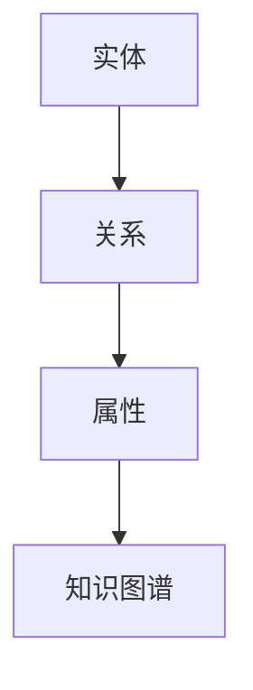
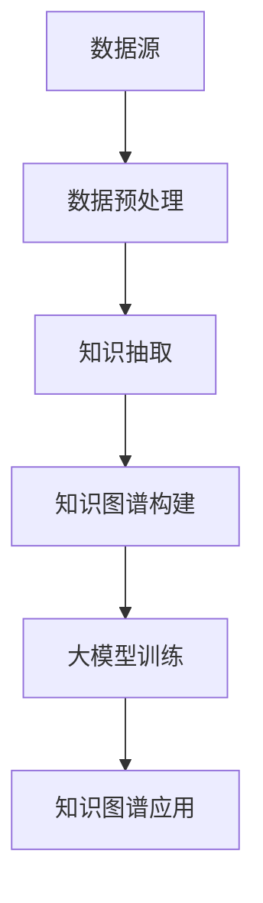

                 


# 开发基于大模型的金融专业教材知识图谱构建器

> 关键词：知识图谱，大模型，金融教育，自然语言处理，系统架构

> 摘要：本文介绍了如何开发一个基于大模型的金融专业教材知识图谱构建器。通过分析知识图谱和大模型的核心概念、算法原理、系统架构，以及项目实战和最佳实践，本文为金融教育领域提供了高效的知识管理工具。

---

## 第一部分: 开发基于大模型的金融专业教材知识图谱构建器概述

### 第1章: 问题背景与目标

#### 1.1 知识图谱的背景与意义
知识图谱是一种结构化的数据表示方式，由实体、关系和属性组成。在金融领域，知识图谱可以帮助我们更好地理解和组织复杂的金融信息。例如，金融实体可以是公司、金融产品、经济指标等，关系可以是“属于”、“影响”等。知识图谱的构建过程包括数据采集、知识抽取、关系建立和图谱优化。知识图谱在金融教育中的应用价值在于为学习者提供更系统、更易于理解的学习资源。

#### 1.2 大模型技术的背景与发展
大模型技术，如GPT-3和BERT，已经在自然语言处理领域取得了显著成果。在金融领域，大模型可以用于自动抽取知识、进行复杂推理和生成高质量内容。例如，使用大模型可以从金融教材中自动抽取实体和关系，并进行知识推理。大模型与知识图谱的结合可以提高知识图谱的准确性和完整性。

#### 1.3 本项目的目标与意义
本项目旨在开发一个基于大模型的金融知识图谱构建器，用于自动化地从金融教材中提取知识，并构建结构化的知识图谱。这将为金融教育提供更高效的知识检索和学习方式，同时推动大模型在金融领域的应用。

### 第2章: 核心概念与联系

#### 2.1 知识图谱的核心概念
知识图谱由实体、关系和属性组成。在金融领域，实体可以是公司、金融产品、经济指标等，关系可以是“属于”、“影响”等。知识图谱的构建过程包括数据预处理、知识抽取、关系建立和图谱优化。

#### 2.2 大模型在知识图谱中的角色
大模型可以作为知识抽取和推理的工具。通过大模型的自然语言理解能力，可以自动从文本中抽取实体和关系，并进行知识推理。例如，使用大模型可以从金融教材中自动提取实体和关系，并通过图神经网络进行路径推理。

#### 2.3 核心概念的对比与关联
通过对比实体、关系和属性，我们可以更好地理解知识图谱的结构。例如，实体是具体的对象，关系描述实体之间的联系，属性则是实体的特征。这些概念在知识图谱的构建中相互关联，共同构成完整的知识体系。以下是一个实体、关系和属性的对比表格：

| 概念 | 定义 | 示例 |
|------|------|------|
| 实体 | 知识图谱中的具体对象 | 公司、金融产品 |
| 关系 | 实体之间的联系 | “属于”、“影响” |
| 属性 | 实体的特征 | 公司的成立时间、金融产品的类型 |

以下是一个简单的知识图谱构建流程图（Mermaid）：



### 第3章: 算法原理与数学模型

#### 3.1 大模型的知识表示与推理算法
知识表示通常采用向量形式，如Word2Vec或BERT中的向量表示。例如，BERT中的向量表示可以用于表示实体和关系。推理算法基于这些向量进行关系推理，例如使用图神经网络进行路径推理。

#### 3.2 知识图谱构建的算法流程
构建流程包括数据预处理、知识抽取、关系建立和图谱优化。数据预处理涉及清洗和结构化，知识抽取使用NLP技术提取实体和关系，关系建立通过模式匹配或机器学习实现，图谱优化则通过合并冗余信息和消除噪声。

#### 3.3 算法实现的代码示例
以下是一个简单的知识抽取代码示例：
```python
from transformers import pipeline

nlp = pipeline("ner", model="bert-base-cased")
text = "The Federal Reserve is the central bank of the United States."
result = nlp(text)
print(result)
```

### 第4章: 系统架构与设计方案

#### 4.1 系统功能模块划分
系统包括数据采集、知识抽取、图谱构建和大模型训练四个模块。数据采集负责收集金融教材文本，知识抽取模块利用NLP技术提取实体和关系，图谱构建模块建立知识图谱，大模型训练模块优化模型以提高知识推理能力。

#### 4.2 系统架构设计（Mermaid）


#### 4.3 系统接口与交互流程
系统接口包括数据输入接口、知识抽取接口和图谱查询接口。交互流程涉及用户输入查询，系统返回结构化知识结果。

---

## 第二部分: 项目实战

### 第5章: 项目环境与安装

#### 5.1 环境要求
需要安装Python 3.8以上版本，以及TensorFlow、Keras、Transformers等库。

#### 5.2 安装依赖
使用pip安装必要的库：
```bash
pip install numpy pandas tensorflow transformers
```

### 第6章: 核心代码实现

#### 6.1 数据预处理代码
```python
import pandas as pd

def preprocess_data(file_path):
    data = pd.read_csv(file_path)
    return data['text'].tolist()
```

#### 6.2 知识抽取代码
```python
from transformers import pipeline

def extract_entities(text_list):
    nlp = pipeline("ner", model="bert-base-cased")
    entities = []
    for text in text_list:
        result = nlp(text)
        entities.extend(result)
    return entities
```

#### 6.3 知识图谱构建代码
```python
from networkx import DiGraph

def build_knowledge_graph(entities):
    graph = DiGraph()
    for entity in entities:
        graph.add_node(entity['word'])
        for relation in entity['relations']:
            graph.add_edge(entity['word'], relation['word'], label=relation['label'])
    return graph
```

### 第7章: 项目案例分析

#### 7.1 案例背景
选择一本金融教材，如《金融学基础》，进行知识图谱构建。

#### 7.2 数据处理与分析
对教材文本进行预处理，提取实体和关系，构建知识图谱。

#### 7.3 结果展示
使用工具将知识图谱可视化，展示实体之间的关系。

---

## 第三部分: 最佳实践与总结

### 第8章: 实践总结

#### 8.1 小结
通过本项目，我们成功开发了一个基于大模型的金融知识图谱构建器，为金融教育提供了高效的知识管理工具。

#### 8.2 注意事项
在实际应用中，需要注意数据质量和模型优化，确保知识图谱的准确性和完整性。

#### 8.3 拓展阅读
推荐阅读相关领域的书籍和论文，深入学习大模型和知识图谱的技术细节。

---

### 作者：AI天才研究院/AI Genius Institute & 禅与计算机程序设计艺术 /Zen And The Art of Computer Programming

---

通过以上步骤，我们详细介绍了开发基于大模型的金融专业教材知识图谱构建器的背景、核心概念、算法原理、系统架构、项目实战和最佳实践，为金融教育领域提供了高效的知识管理工具。

