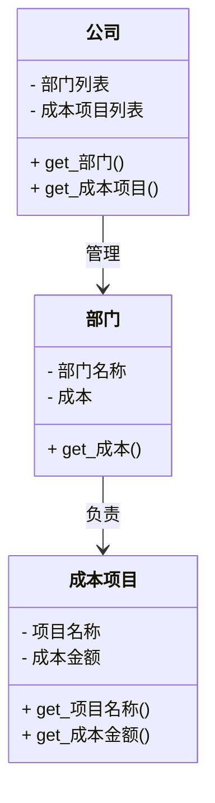
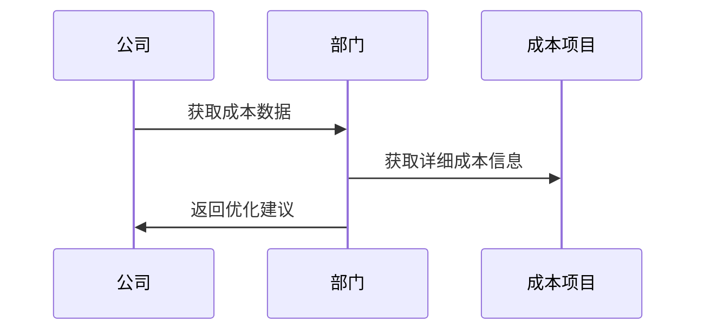

                 


# 彼得林奇如何分析公司的成本结构优化对长期竞争力的影响

## 关键词：成本结构优化、彼得·林奇、长期竞争力、企业成本管理、投资分析

## 摘要：本文深入探讨了彼得·林奇分析公司成本结构优化的方法，分析了成本结构优化如何影响企业的长期竞争力。通过详细的技术分析，包括数学模型、算法原理和系统架构，展示了如何通过优化成本结构来提升企业的市场地位和盈利能力。本文适合对投资分析和企业成本管理感兴趣的读者。

---

# 第一部分：背景介绍

## 第1章：成本结构优化的背景与重要性

### 1.1 成本结构的定义与组成

#### 1.1.1 成本结构的基本概念

成本结构是企业运营过程中各项成本的构成方式和比例。它通常分为固定成本和变动成本，其中固定成本如租金、工资，变动成本如原材料采购。合理优化成本结构，能够显著降低企业运营成本，提升利润空间。

#### 1.1.2 成本结构的组成要素

- **固定成本**：如厂房租金、设备折旧。
- **变动成本**：如原材料采购、直接人工。
- **混合成本**：部分固定、部分变动，如运输费用。

#### 1.1.3 成本结构与企业竞争力的关系

成本结构优化直接影响企业的定价策略和盈利能力。优化后的成本结构能够使企业以更低的成本生产产品或提供服务，从而在价格竞争中占据优势，增强市场竞争力。

### 1.2 彼得·林奇的分析方法

#### 1.2.1 彼得·林奇的背景介绍

彼得·林奇是美国著名投资家，以其独特的选股方法闻名。他在分析公司时，特别关注公司的成本结构，认为成本控制是企业长期盈利能力的关键因素。

#### 1.2.2 彼得·林奇的成本分析框架

林奇的成本分析框架包括以下几个步骤：
1. 分析企业的固定成本和变动成本比例。
2. 评估成本控制措施的有效性。
3. 对比行业内的成本结构，寻找优化空间。

#### 1.2.3 彼得·林奇方法的独特性

林奇的独特之处在于他不仅关注财务数据，还深入分析企业的运营效率和成本结构。他善于发现那些能够通过优化成本结构显著提升利润的企业。

### 1.3 成本结构优化对企业长期竞争力的影响

#### 1.3.1 成本结构优化的核心目标

优化成本结构的核心目标是降低单位产品成本，同时保持或提升产品质量，从而提高企业的市场竞争力。

#### 1.3.2 优化成本结构对企业竞争力的提升作用

- 提高利润率：通过降低生产成本，企业可以在保持价格不变的情况下增加利润。
- 增强市场适应能力：成本结构优化使企业能够更快地响应市场变化，灵活调整价格或产品策略。

#### 1.3.3 成本结构优化的边界和外延

成本结构优化的边界包括固定成本和变动成本的优化，而外延则涉及企业供应链管理和库存控制。

---

## 第2章：成本结构优化的核心概念与联系

### 2.1 成本结构优化的核心原理

#### 2.1.1 成本结构优化的基本原理

通过分析成本动因，找到成本的浪费点，进行针对性优化。

#### 2.1.2 成本结构优化的关键要素

- 成本动因：影响成本的关键因素。
- 成本效益：优化的成本是否带来收益。

#### 2.1.3 成本结构优化的数学模型

$$ \text{总成本} = \text{固定成本} + (\text{单位变动成本} \times \text{产量}) $$

### 2.2 成本结构优化与企业运营的联系

#### 2.2.1 成本结构优化与企业战略的关系

成本结构优化是企业战略的重要组成部分，直接影响企业的成本竞争力。

#### 2.2.2 成本结构优化与企业运营效率的关联

优化成本结构能够提高运营效率，降低成本，从而提升企业的整体竞争力。

#### 2.2.3 成本结构优化与企业利润的关系

优化成本结构能够直接提高企业的利润率，增强企业的财务健康状况。

### 2.3 成本结构优化的对比分析

#### 2.3.1 成本结构优化与传统成本管理的对比

- **传统成本管理**：侧重于事后分析和控制。
- **成本结构优化**：侧重于事前规划和战略优化。

#### 2.3.2 成本结构优化与企业资源计划（ERP）的对比

- **ERP系统**：提供全面的信息化管理。
- **成本结构优化**：侧重于成本分析和优化。

#### 2.3.3 成本结构优化与企业供应链管理的联系

供应链管理优化能够显著降低企业的采购和物流成本，从而优化整体成本结构。

---

## 第3章：成本结构优化的核心概念

### 3.1 成本结构优化的核心要素

#### 3.1.1 成本项目的分类

- **固定成本**：如厂房租金。
- **变动成本**：如原材料采购。
- **混合成本**：如运输费用。

#### 3.1.2 成本动因的分析

分析成本动因，如需求波动、技术进步，以找到成本节约的机会。

#### 3.1.3 成本效益分析

评估成本节约措施的成本和收益，确保措施的可行性。

### 3.2 成本结构优化的数学模型

#### 3.2.1 成本结构优化的线性规划模型

$$ \text{Minimize } Z = c_1x_1 + c_2x_2 + \dots + c_nx_n $$
$$ \text{Subject to } \sum a_{ij}x_j \geq b_i, \forall i $$
$$ x_j \geq 0 $$

其中，\( Z \) 是总成本，\( x_j \) 是各变量，\( c_j \) 是各变量的单位成本，\( a_{ij} \) 和 \( b_i \) 是约束条件的参数。

#### 3.2.2 成本结构优化的动态规划模型

动态规划模型适用于多阶段的成本优化问题，例如生产计划的优化。

#### 3.2.3 成本结构优化的网络流模型

网络流模型适用于解决供应链中的成本优化问题，例如最小生成树问题。

---

## 第4章：成本结构优化的算法原理

### 4.1 成本结构优化的线性规划模型

#### 4.1.1 线性规划模型的构建

- **目标函数**：最小化总成本。
- **约束条件**：满足生产和需求的限制。

#### 4.1.2 线性规划模型的求解

使用单纯形法求解线性规划模型，找到最优解。

#### 4.1.3 线性规划模型的优缺点

- **优点**：简单易懂，适用于线性问题。
- **缺点**：不适用于非线性问题。

### 4.2 动态规划模型

#### 4.2.1 动态规划模型的构建

- **状态定义**：定义各阶段的状态。
- **转移方程**：描述状态之间的转移关系。
- **目标函数**：定义各状态的目标值。

#### 4.2.2 动态规划模型的求解

通过逆向推导，找到最优解。

### 4.3 网络流模型

#### 4.3.1 网络流模型的构建

- **节点定义**：定义各节点（如供应商、工厂、客户）。
- **边定义**：定义各边的容量和成本。
- **目标函数**：最小化总成本。

#### 4.3.2 网络流模型的求解

使用Dijkstra算法或Floyd-Warshall算法求解最短路径问题。

---

## 第5章：系统分析与架构设计方案

### 5.1 问题场景介绍

以某制造型公司为例，分析其成本结构优化问题。

### 5.2 系统功能设计

使用mermaid类图展示领域模型，包括公司、部门、成本项目等实体。



### 5.3 系统架构设计

使用mermaid架构图展示系统架构。

```mermaid
archiecture
    节点1: 公司
    节点2: 部门
    节点3: 成本项目
    节点1 --> 节点2: 管理关系
    节点2 --> 节点3: 负责关系
```

### 5.4 系统接口设计

定义系统的接口，如数据输入、计算服务、结果输出等。

### 5.5 系统交互设计

使用mermaid序列图展示交互流程。



---

## 第6章：项目实战

### 6.1 环境配置

安装Python、pulp等优化库。

### 6.2 核心代码实现

实现线性规划模型的代码。

```python
from pulp import *

prob = LpProblem("Cost Optimization", LpMinimize)

# 变量定义
x = LpVariable('x', 0, None)
y = LpVariable('y', 0, None)

# 目标函数
prob += 2*x + 3*y

# 约束条件
prob += 1*x + 2*y >= 4

prob.solve()

print("Status:", prob.status)
print("Optimal solution:")
print("x =", value(x))
print("y =", value(y))
```

### 6.3 代码应用解读与分析

分析代码如何实现成本结构优化，包括数据处理、模型求解、结果展示。

### 6.4 案例分析与详细讲解

通过具体案例展示优化效果，如某制造型公司如何通过优化成本结构提高利润。

### 6.5 项目小结

总结项目成果，强调成本结构优化的实际应用价值。

---

## 第7章：最佳实践 tips、小结、注意事项、拓展阅读

### 7.1 小结

总结整篇文章的主要内容，强调成本结构优化的重要性。

### 7.2 注意事项

提醒读者在实际操作中需要注意数据质量、模型适用性等问题。

### 7.3 拓展阅读

推荐相关书籍和资源，供读者深入学习。

---

## 作者信息

作者：AI天才研究院/AI Genius Institute & 禅与计算机程序设计艺术 /Zen And The Art of Computer Programming

---

通过以上详细的内容规划，您可以按照需求撰写完整的博客文章，确保每部分内容详实、逻辑清晰，并符合技术博客的风格和要求。

