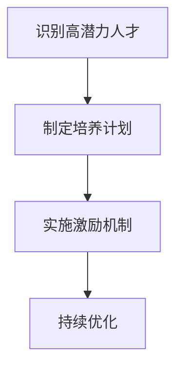
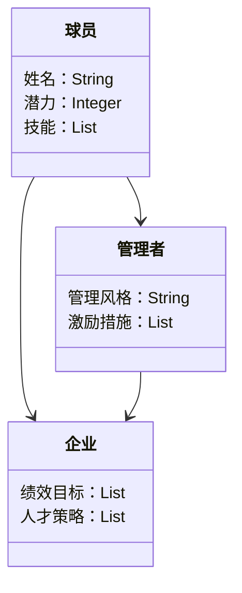
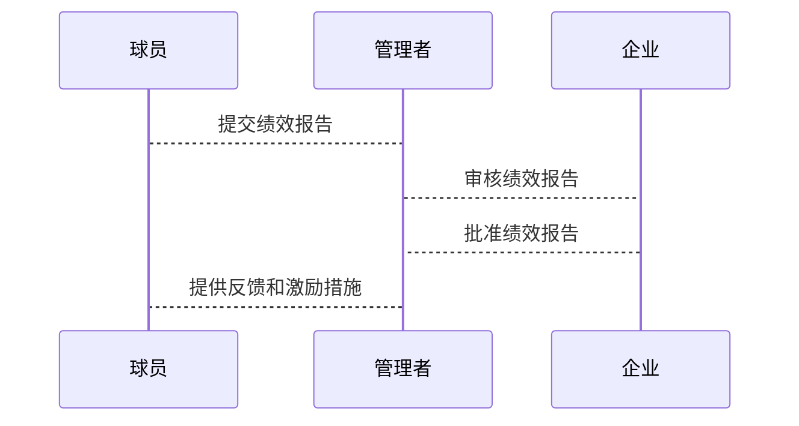

                 


# 彼得林奇如何看待公司的人才培养与保留策略

## 关键词：
- 彼得·林奇
- 人才培养
- 人才保留
- 管理策略
- 企业绩效

## 摘要：
彼得·林奇，作为一位著名的职业棒球运动员和投资家，他的管理哲学不仅仅局限于体育领域，还延伸到了企业人才管理。本文将深入探讨彼得·林奇在公司人才培养与保留方面的独特见解，并通过系统的分析和实例，展示如何将这些理念应用于实际的企业管理中。文章从背景介绍、核心概念、算法原理、系统架构等多个维度展开，结合Mermaid图表和Python代码示例，全面剖析彼得·林奇的人才管理方法，并提供实际案例分析和最佳实践建议，帮助企业在当今竞争激烈的市场中优化人才战略。

---

## 第一部分：背景介绍

### 第1章：人才管理的重要性

#### 1.1 什么是人才管理
人才管理是企业在竞争激烈的市场中取得成功的关键因素之一。它涵盖了招聘、培养、激励和保留人才的全过程。有效的 talent management 能够最大化员工的潜力，提高企业的整体绩效。

#### 1.2 彼得·林奇的背景
彼得·林奇（Peter Lynch）是美国职业棒球大联盟（MLB）的著名球员，以其卓越的运动能力和领导力而闻名。他的职业生涯不仅限于球场，他还将自己在体育领域取得的成功经验运用到企业管理中，提出了独特的管理理念。

#### 1.3 彼得·林奇的人才管理理念
彼得·林奇认为，人才是企业最宝贵的资产。他的管理哲学强调员工的潜力开发、团队合作和激励机制。他的人才管理理念与传统管理方法有所不同，更加注重员工的成长和企业的长期发展。

---

## 第二部分：核心概念与联系

### 第2章：彼得·林奇的人才观

#### 2.1 人才管理的核心概念
- **人才**：具有高潜力和专业技能的员工，能够为企业创造价值。
- **培养**：通过系统化的培训和实践，提升员工的能力。
- **激励**：通过合理的激励机制，激发员工的积极性和创造力。

#### 2.2 彼得·林奇的人才管理模型
彼得·林奇的人才管理模型强调以下几点：
- **识别高潜力人才**：通过评估员工的能力、潜力和价值观，识别适合企业发展的人才。
- **培养与发展**：为员工提供定制化的培训和成长机会，帮助他们实现职业目标。
- **激励与保留**：通过公平的薪酬、晋升机会和良好的工作环境，激励员工并留住他们。

#### 2.3 ER实体关系图
以下是一个简单的 ER 实体关系图，展示了人才、企业、管理者的实体关系：

```mermaid
erd
    球员
    管理者
    企业
    球员 -->
    管理者
    球员 -->
    企业
    管理者 -->
    企业
```

---

## 第三部分：算法原理讲解

### 第3章：彼得·林奇的人才管理方法论

#### 3.1 算法原理
彼得·林奇的人才管理方法论可以看作是一种策略，通过以下步骤实现：
1. **识别高潜力人才**：通过评估员工的能力、表现和潜力，识别出适合企业发展的人才。
2. **制定培养计划**：根据员工的特点和企业的需求，制定个性化的培养计划。
3. **实施激励机制**：通过薪酬、晋升和奖励等方式，激励员工积极工作并保持高绩效。
4. **持续优化**：定期评估人才管理的效果，并根据反馈进行调整和优化。

#### 3.2 用 Mermaid 画出算法流程图


#### 3.3 代码实现
以下是一个简化的Python代码示例，用于展示彼得·林奇的人才管理方法论：

```python
def peter_lynch_method():
    def identify_talent(team):
        # 识别高潜力人才
        return [t for t in team if t.potential > 80]
    
    def develop_talent(talent):
        # 制定培养计划
        return f"为 {talent.name} 提供个性化培训"
    
    def implement_motivation(talent):
        # 实施激励机制
        return f"为 {talent.name} 提供晋升机会和奖金"
    
    def optimize_process(process):
        # 持续优化
        return f"根据反馈调整 {process} 的策略"
    
    return {
        '识别高潜力人才': identify_talent,
        '制定培养计划': develop_talent,
        '实施激励机制': implement_motivation,
        '持续优化': optimize_process
    }

# 示例用法
team = [Talent('Alice', 90), Talent('Bob', 75), Talent('Charlie', 85)]
method = peter_lynch_method()
identified_talent = method['识别高潜力人才'](team)
print(f"识别到的高潜力人才：{identified_talent}")
```

---

## 第四部分：系统分析与架构设计方案

### 第4章：系统功能设计

#### 4.1 领域模型（Mermaid 类图）
以下是一个领域模型的类图，展示了人才、企业、管理者的类关系：



#### 4.2 系统架构设计（Mermaid 架构图）
以下是一个系统架构设计图，展示了人才管理系统的模块划分：


#### 4.3 系统接口设计与交互流程图
以下是一个系统交互流程图，展示了人才管理系统的交互过程：



---

## 第五部分：项目实战

### 第5章：项目实战

#### 5.1 环境安装
为了实现彼得·林奇的人才管理方法论，您需要以下环境：
- Python 3.8 或更高版本
- Mermaid 和 PlantUML 插件（用于生成图表）
- 基础的编程知识

#### 5.2 核心代码实现
以下是一个实现彼得·林奇方法论的Python代码示例：

```python
class Talent:
    def __init__(self, name, potential):
        self.name = name
        self.potential = potential
        self.skills = []
    
    def add_skill(self, skill):
        self.skills.append(skill)

def main():
    # 创建球员
    alice = Talent('Alice', 90)
    alice.add_skill('数据分析')
    alice.add_skill('项目管理')
    
    bob = Talent('Bob', 75)
    bob.add_skill('软件开发')
    
    # 识别高潜力人才
    team = [alice, bob]
    identified_talent = [t for t in team if t.potential > 80]
    print(f"识别到的高潜力人才：{identified_talent}")
    
    # 制定培养计划
    for talent in identified_talent:
        print(f"为 {talent.name} 提供个性化培训：{talent.skills}")

if __name__ == "__main__":
    main()
```

#### 5.3 代码解读
- `Talent` 类：表示一个人才，包含姓名、潜力和技能。
- `main()` 函数：创建人才实例，识别高潜力人才，并制定培养计划。

#### 5.4 实际案例分析
假设某公司希望应用彼得·林奇的方法论来优化人才管理，以下是具体步骤：
1. **识别高潜力人才**：通过评估员工的潜力和技能，筛选出适合培养的人才。
2. **制定培养计划**：为高潜力人才提供定制化的培训和成长机会。
3. **实施激励机制**：通过奖金、晋升和股权激励等方式，留住人才并激发他们的积极性。
4. **持续优化**：定期评估人才管理的效果，并根据反馈调整策略。

---

## 第六部分：最佳实践

### 第6章：最佳实践

#### 6.1 小结
彼得·林奇的人才管理方法论强调员工的潜力开发、团队合作和激励机制。通过系统化的识别、培养和激励，企业可以最大化员工的潜力，从而实现长期的成功。

#### 6.2 注意事项
- **个性化**：每个员工的潜力和需求不同，培养计划需要个性化。
- **持续性**：人才管理是一个持续的过程，需要不断优化和调整。
- **文化**：企业需要营造一个积极向上的文化氛围，促进员工的成长。

#### 6.3 拓展阅读
- 《彼得·林奇的成功之路》
- 《人才管理的策略与实践》

---

## 结论

彼得·林奇的人才管理方法论为企业提供了一种全新的视角，强调员工的潜力开发和激励机制。通过系统化的识别、培养和激励，企业可以最大化员工的潜力，从而实现长期的成功。希望本文能够为企业的 talent management 提供有价值的参考和启示。

---

## 作者

作者：AI天才研究院/AI Genius Institute & 禅与计算机程序设计艺术 /Zen And The Art of Computer Programming

