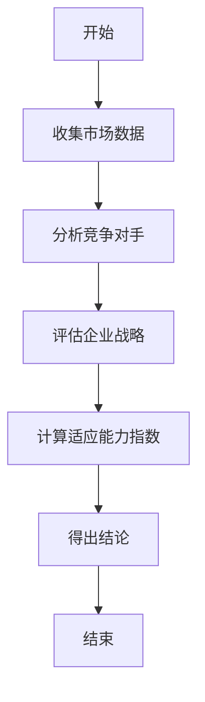
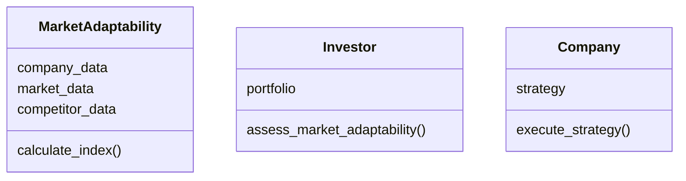
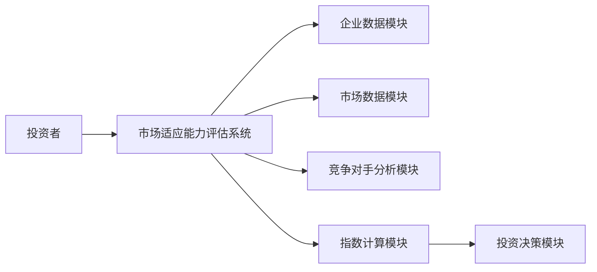

                 


# 彼得林奇如何看待公司的市场适应能力

## 关键词：
- 彼得·林奇
- 市场适应能力
- 投资策略
- 企业竞争力
- 财务分析

## 摘要：
彼得·林奇是全球著名投资专家，他在《彼得林奇如何看待公司的市场适应能力》中，从投资者的角度分析了公司市场适应能力的重要性。文章通过详细讲解市场适应能力的核心概念、分析方法、算法原理、系统架构设计以及项目实战案例，深入剖析了如何通过市场适应能力评估企业价值，优化投资决策。文章还结合了mermaid流程图、latex数学公式和Python代码，从理论到实践，全面阐述了彼得·林奇的投资理念。

---

# 第一部分：市场适应能力的核心概念与背景

## 第1章：市场适应能力的定义与背景

### 1.1 市场适应能力的定义与背景

#### 1.1.1 市场适应能力的定义
市场适应能力是指企业在不断变化的市场环境中，能够灵活调整战略、产品和运营模式，以应对市场波动和竞争压力的能力。这种能力是企业长期生存和发展的关键。

#### 1.1.2 市场适应能力的核心要素
- **战略调整能力**：企业能够根据市场变化及时调整战略方向。
- **产品创新能力**：企业能够快速推出符合市场需求的产品。
- **组织灵活性**：企业内部组织结构能够适应市场变化。
- **风险管理能力**：企业能够有效应对市场风险。

#### 1.1.3 市场适应能力的背景与重要性
在当前全球经济不确定性和市场波动加剧的情况下，市场适应能力成为企业能否在竞争中生存的关键。彼得·林奇认为，具备市场适应能力的企业能够更好地应对市场变化，抓住投资机会。

---

### 1.2 彼得·林奇的投资理念概述

#### 1.2.1 彼得·林奇的生平简介
彼得·林奇是美国著名投资经理人，以其在富达投资管理公司的卓越表现闻名。他强调基本面分析和长期投资，注重企业内在价值的挖掘。

#### 1.2.2 彼得·林奇的投资哲学
林奇认为，成功的投资需要选择那些具有强大市场适应能力的企业，这些企业能够在市场变化中保持竞争力，并为股东创造长期价值。

#### 1.2.3 市场适应能力与投资的关联
林奇认为，市场适应能力是企业抵御市场波动、维持增长的关键因素，也是投资者评估企业投资价值的重要指标。

---

### 1.3 市场适应能力与投资决策的关系

#### 1.3.1 市场适应能力如何影响投资决策
企业具备市场适应能力，投资者可以更放心地投资，因为这些企业能够在市场变化中保持稳定增长。

#### 1.3.2 投资者如何通过市场适应能力评估企业价值
投资者需要通过分析企业的市场适应能力，评估其在不同市场环境下的表现，从而做出更明智的投资决策。

#### 1.3.3 市场适应能力的边界与外延
市场适应能力并非万能，投资者需要结合其他因素，如财务状况和管理团队，全面评估企业价值。

---

## 第2章：市场适应能力的核心概念与联系

### 2.1 市场适应能力的核心概念原理

#### 2.1.1 市场适应能力的构成要素
- **市场洞察力**：企业能够准确识别市场趋势和客户需求。
- **战略灵活性**：企业能够快速调整战略以应对市场变化。
- **执行力**：企业能够高效执行战略调整。

#### 2.1.2 市场适应能力的动态特征
市场适应能力是一个动态过程，企业需要持续关注市场变化，及时调整策略。

#### 2.1.3 市场适应能力的量化指标
- **市场份额变化**：市场份额的变动反映企业的市场适应能力。
- **收入增长率**：收入增长反映企业是否能够适应市场需求。
- **利润率变化**：利润率的变化反映企业成本控制和市场适应能力。

---

### 2.2 核心概念属性特征对比表

| **属性**        | **市场适应能力** | **企业竞争力** |
|------------------|------------------|----------------|
| **核心要素**     | 战略调整能力、产品创新能力、组织灵活性、风险管理能力 | 产品创新、成本控制、品牌影响力、客户关系 |
| **影响因素**     | 市场需求变化、竞争环境、经济波动 | 产品性能、价格优势、市场推广能力、售后服务 |
| **评估指标**     | 市场份额、收入增长率、利润率 | 市场排名、客户满意度、品牌价值 |

---

### 2.3 ER实体关系图

```mermaid
erDiagram
    customer[客户]
    market[市场]
    company[公司]
    product[产品]
    competition[竞争]

    customer --> market: 参与市场
    company --> market: 进入市场
    company --> product: 生产产品
    company --> competition: 参与竞争
```

---

## 第3章：彼得·林奇的市场适应能力分析方法

### 3.1 市场适应能力的算法原理

#### 图3.1：市场适应能力分析的算法流程图



#### 代码3.1：市场适应能力评估算法的Python实现

```python
def market_adaptability_index(company_data):
    # 市场份额变化
    market_share_growth = (company_data.current_market_share - company_data.previous_market_share)
    # 收入增长率
    revenue_growth = (company_data.current_revenue - company_data.previous_revenue) / company_data.previous_revenue
    # 利润率变化
    profit_margin_growth = (company_data.current_profit_margin - company_data.previous_profit_margin) / company_data.previous_profit_margin
    # 竞争优势
    competitive_edge = company_data.competitive_advantages
    # 计算市场适应能力指数
    index = (market_share_growth + revenue_growth + profit_margin_growth) * competitive_edge
    return index

# 示例用法
company_data = {
    current_market_share: 0.25,
    previous_market_share: 0.2,
    current_revenue: 100,
    previous_revenue: 90,
    current_profit_margin: 0.2,
    previous_profit_margin: 0.15,
    competitive_advantages: 0.8
}
print(market_adaptability_index(company_data))
```

---

### 3.2 数学模型与公式

#### 公式3.1：市场适应能力指数计算公式
$$ \text{市场适应能力指数} = \frac{\text{市场份额增长率} + \text{收入增长率} + \text{利润率增长率}}{3} \times \text{竞争优势} $$

#### 公式3.2：市场适应能力与企业价值的关系式
$$ \text{企业价值} = \text{市场适应能力指数} \times \text{行业平均市盈率} $$

---

## 第4章：系统分析与架构设计方案

### 4.1 问题场景介绍

#### 4.1.1 投资者如何通过市场适应能力评估企业价值
投资者需要分析企业的市场适应能力，以确定其投资价值。

#### 4.1.2 企业如何通过市场适应能力优化自身竞争力
企业需要不断提升市场适应能力，以应对市场变化。

---

### 4.2 系统功能设计

#### 图4.1：市场适应能力评估的领域模型类图



---

### 4.3 系统架构设计

#### 图4.2：市场适应能力评估系统的架构图



---

## 第5章：项目实战——彼得·林奇视角下的市场适应能力分析

### 5.1 项目背景与目标

#### 5.1.1 项目背景
分析一家企业的市场适应能力，评估其投资价值。

#### 5.1.2 项目目标
通过实际案例，展示如何运用彼得·林奇的市场适应能力分析方法。

---

### 5.2 项目实施步骤

#### 5.2.1 数据收集
收集企业的市场份额、收入、利润等数据。

#### 5.2.2 数据分析
使用Python代码计算市场适应能力指数。

#### 5.2.3 案例分析
以具体企业为例，分析其市场适应能力。

---

### 5.3 项目总结与启示

#### 5.3.1 项目总结
通过实际案例分析，验证了市场适应能力指数的有效性。

#### 5.3.2 启示与建议
投资者在评估企业时，应综合考虑市场适应能力和其他因素。

---

## 第6章：最佳实践与注意事项

### 6.1 最佳实践 tips

#### 6.1.1 投资者应持续关注企业的市场适应能力。

#### 6.1.2 企业应不断提升自身的市场适应能力。

---

### 6.2 项目小结

#### 6.2.1 项目总结
通过本文的分析，读者可以掌握彼得·林奇的市场适应能力分析方法。

#### 6.2.2 项目展望
未来，随着市场环境的变化，市场适应能力的重要性将更加凸显。

---

## 作者：AI天才研究院/AI Genius Institute & 禅与计算机程序设计艺术/Zen And The Art of Computer Programming

