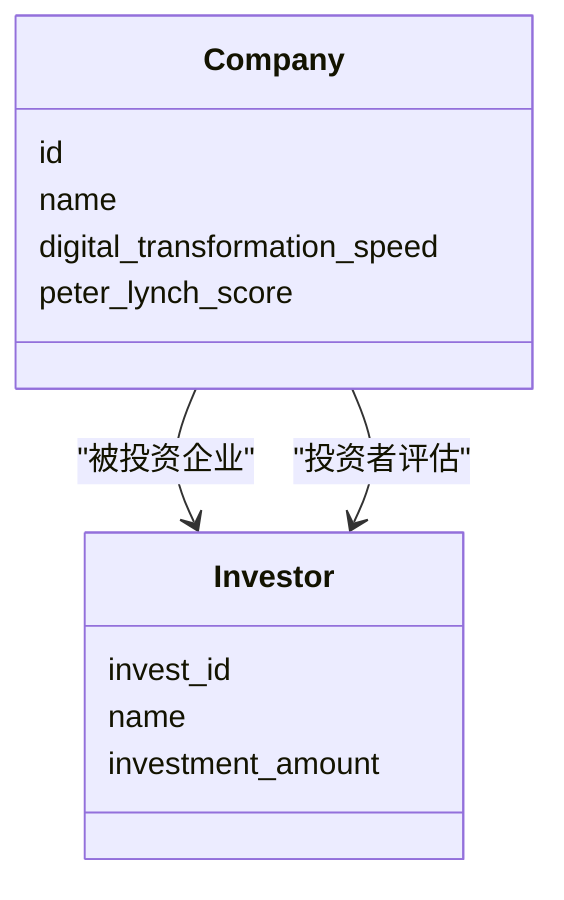

                 


# 彼得林奇如何评估公司的数字化转型速度

## 关键词：彼得林奇，数字化转型，投资评估，企业评估，信息化，智能化

## 摘要：本文将从彼得林奇的投资哲学出发，结合数字化转型的核心概念，系统地分析如何评估公司的数字化转型速度。文章首先介绍了数字化转型的定义与核心概念，然后详细阐述了彼得林奇的评估方法，包括评估指标、模型构建和实施步骤。接着，文章从系统分析与架构设计的角度，探讨了如何将彼得林奇的评估方法应用于实际的企业数字化转型评估中。最后，通过实际案例分析，总结了数字化转型评估的最佳实践和注意事项，为读者提供了全面的指导。

---

# 第一部分: 数字化转型的背景与重要性

## 第1章: 数字化转型的定义与核心概念

### 1.1 数字化转型的定义与核心概念

#### 1.1.1 数字化转型的定义与内涵
数字化转型是指企业利用数字技术（如大数据、人工智能、云计算等）重新设计或优化业务流程、组织架构、文化模式，以实现业务创新和价值提升的过程。数字化转型不仅仅是技术的升级，更是对商业模式、运营方式和管理方法的根本性变革。

数字化转型的内涵包括以下几点：
- **技术驱动**：依赖新兴数字技术，如AI、大数据、物联网等。
- **业务重构**：通过技术手段优化或重构现有的业务流程和模式。
- **文化转变**：数字化转型不仅仅是技术层面的改变，还包括企业文化和员工思维的转变。

#### 1.1.2 数字化转型的核心要素
数字化转型的核心要素包括：
1. **数据驱动**：数据是数字化转型的核心资源，企业需要通过数据的收集、分析和应用来驱动决策。
2. **技术支撑**：数字化转型离不开技术的支持，包括云技术、大数据分析、人工智能等。
3. **组织变革**：数字化转型需要企业组织结构和文化的支持，员工需要具备数字化思维和能力。
4. **业务创新**：通过数字化手段实现业务模式的创新和优化。

#### 1.1.3 数字化转型与企业竞争力的关系
数字化转型是企业在当今竞争激烈的市场环境中提升竞争力的关键手段。通过数字化转型，企业可以实现以下目标：
- 提高运营效率，降低成本。
- 提升客户体验，增强客户忠诚度。
- 开拓新的业务模式和市场机会。
- 增强企业的敏捷性和创新能力。

---

### 1.2 彼得林奇的评估方法

#### 1.2.1 彼得林奇的投资哲学
彼得·林奇（Peter Lynch）是全球著名的职业基金经理人，以其独特的投资哲学闻名。他认为，成功的投资不仅仅依赖于市场分析，更依赖于对企业的深入了解。他强调，投资者应该选择那些具有持续增长潜力的企业进行投资。

彼得林奇的投资哲学可以总结为以下几点：
1. **长期投资**：彼得林奇主张长期持有优质股票，而非频繁交易。
2. **深入研究**：在投资之前，对企业的基本面进行深入研究，包括财务状况、行业地位、管理团队等。
3. **关注成长**：彼得林奇倾向于投资那些具有持续增长潜力的企业，而非仅仅追求短期收益。

#### 1.2.2 彼得林奇评估公司的核心指标
彼得林奇在评估公司时，通常关注以下几个核心指标：
1. **市盈率（P/E Ratio）**：市盈率是衡量股票价值的重要指标，反映了市场的预期和公司的盈利能力。
2. **市净率（P/B Ratio）**：市净率是股价与每股净资产的比率，用于衡量股票的估值是否合理。
3. **ROE（净资产收益率）**：ROE是衡量公司盈利能力的重要指标，反映了公司利用股东资产创造利润的能力。
4. **增长潜力**：彼得林奇非常关注企业的成长潜力，包括行业增长空间、市场份额、技术创新能力等。

#### 1.2.3 数字化转型在投资评估中的重要性
数字化转型是企业在当前经济环境下实现增长的重要手段。对于投资者来说，评估一家公司的数字化转型速度和能力，可以帮助他们更好地判断企业的未来发展前景。数字化转型能力强大的企业通常具有以下优势：
- 更高的运营效率和成本控制能力。
- 更强的市场响应能力和创新能力。
- 更好的客户体验和客户忠诚度。

---

## 第2章: 数字化转型的背景与趋势

### 2.1 数字化转型的背景

#### 2.1.1 信息技术的发展历程
从20世纪中叶开始，信息技术经历了从简单的机械计算到人工智能的飞跃式发展。随着互联网的普及、云计算的兴起和大数据技术的成熟，企业的数字化转型成为可能。

#### 2.1.2 数字化转型的驱动力
数字化转型的驱动力主要包括以下几个方面：
1. **技术进步**：云计算、大数据、人工智能等技术的发展为企业提供了强大的技术支撑。
2. **市场需求**：消费者对个性化、便捷化服务的需求不断增加，推动企业加快数字化转型。
3. **竞争压力**：在数字化转型的大背景下，企业如果不进行数字化转型，将在市场竞争中逐渐被淘汰。

#### 2.1.3 全球数字化转型的趋势
当前，全球范围内数字化转型已经从局部试点进入全面铺开阶段。企业无论规模大小，都在积极探索数字化转型的路径。根据相关研究，到2025年，全球超过60%的企业将数字化转型作为核心战略。

---

### 2.2 数字化转型对企业的影响

#### 2.2.1 数字化转型对企业效率的提升
数字化转型可以通过自动化技术优化企业内部流程，减少人为错误，提高工作效率。例如，通过ERP系统实现企业供应链的全面数字化管理，可以显著提高企业的运营效率。

#### 2.2.2 数字化转型对企业商业模式的改变
数字化转型不仅改变了企业的运营方式，还深刻影响了企业的商业模式。例如，传统零售企业通过电子商务平台实现了线上线下的融合，创造了新的商业模式。

#### 2.2.3 数字化转型对企业竞争优势的影响
在数字化转型的推动下，企业的竞争优势从传统的成本、质量、服务等方面，逐渐向数据能力、技术创新能力、数字化运营能力等转移。数字化转型能力越强的企业，其竞争优势越明显。

---

## 第3章: 数字化转型的核心概念与联系

### 3.1 核心概念原理

#### 3.1.1 数字化转型的核心要素
数字化转型的核心要素包括：
1. **数据**：数据是数字化转型的核心资源，企业需要通过数据的收集、分析和应用来驱动决策。
2. **技术**：包括云计算、大数据、人工智能等技术，这些技术是数字化转型的基石。
3. **组织**：数字化转型需要企业组织结构和文化的变革，员工需要具备数字化思维和能力。
4. **业务**：通过数字化手段实现业务模式的创新和优化。

#### 3.1.2 数字化转型的关键技术
数字化转型的关键技术包括：
1. **大数据技术**：用于数据的收集、存储和分析。
2. **人工智能技术**：用于数据的深度分析和智能决策。
3. **云计算技术**：用于企业的数字化 infrastructure。
4. **物联网技术**：用于实现设备和系统的互联互通。

#### 3.1.3 数字化转型的实施步骤
数字化转型的实施步骤通常包括：
1. **制定战略**：明确数字化转型的目标和路径。
2. **技术选型**：选择适合企业需求的数字化技术。
3. **组织变革**：调整组织结构和文化，适应数字化转型的要求。
4. **实施与优化**：逐步实施数字化转型，并根据实际情况进行优化。

---

### 3.2 核心概念对比表格

#### 3.2.1 数字化转型与信息化的区别
| 特性       | 数字化转型                 | 信息化                     |
|------------|--------------------------|---------------------------|
| 定义       | 利用数字技术重构商业模式   | 利用信息技术提高效率       |
| 核心       | 数据驱动                   | 信息技术驱动               |
| 目标       | 业务创新和价值提升         | 提高企业运营效率           |

---

## 第4章: 数字化转型的评估模型

### 4.1 评估模型的算法原理

#### 4.1.1 评估指标的选择
在数字化转型的评估中，选择合适的评估指标非常重要。常见的评估指标包括：
1. **技术成熟度**：衡量企业的技术应用水平。
2. **业务影响度**：衡量数字化转型对业务的影响程度。
3. **组织适应度**：衡量组织对数字化转型的适应能力。
4. **客户满意度**：衡量客户对数字化服务的满意度。

#### 4.1.2 指标权重的确定
在确定评估指标权重时，可以采用层次分析法（AHP）等方法，根据各指标的重要性进行权重分配。

#### 4.1.3 评估结果的计算
数字化转型速度的评估结果可以通过以下公式计算：
$$
\text{数字化转型速度} = \sum_{i=1}^{n} w_i \times x_i
$$
其中，$w_i$ 是第 $i$ 个指标的权重，$x_i$ 是第 $i$ 个指标的评分。

---

## 第5章: 数字化转型的系统分析与架构设计

### 5.1 系统功能设计

#### 5.1.1 领域模型


---

## 第6章: 数字化转型的项目实战

### 6.1 环境安装

#### 6.1.1 环境要求
- 操作系统：Windows 10 或更高版本，或macOS 10.15 或更高版本。
- 开发工具：IntelliJ IDEA 或 Eclipse。
- 数据库：MySQL 或 PostgreSQL。

#### 6.1.2 依赖安装
```bash
pip install pandas numpy scikit-learn
```

### 6.2 系统核心实现源代码

#### 6.2.1 数字化转型速度评估代码
```python
import pandas as pd
from sklearn.metrics import mean_squared_error

def calculate_digital_transformation_speed(dataframe):
    # 假设 dataframe 包含各个评估指标的得分和权重
    # 计算加权平均
    weighted_scores = dataframe['score'] * dataframe['weight']
    return weighted_scores.sum()

# 示例数据
data = {
    'metric': ['技术成熟度', '业务影响度', '组织适应度', '客户满意度'],
    'score': [0.8, 0.7, 0.6, 0.9],
    'weight': [0.3, 0.3, 0.2, 0.2]
}
df = pd.DataFrame(data)
speed = calculate_digital_transformation_speed(df)
print(f"数字化转型速度：{speed}")
```

---

## 第7章: 数字化转型评估的最佳实践

### 7.1 最佳实践 tips
- **数据驱动**：数字化转型的核心是数据，企业需要建立完善的数据收集和分析机制。
- **技术选型**：选择适合企业需求的数字化技术，避免盲目跟风。
- **组织变革**：数字化转型不仅仅是技术问题，更是组织文化的问题，企业需要进行组织结构调整和文化变革。
- **持续优化**：数字化转型是一个持续的过程，企业需要不断优化和调整策略。

---

## 第8章: 小结与展望

### 8.1 小结
彼得林奇的评估方法为我们提供了一个全新的视角，用于评估公司的数字化转型速度。通过结合数字化转型的核心概念和彼得林奇的投资哲学，我们可以更全面地评估企业的数字化转型能力。

### 8.2 注意事项
在实际应用中，需要注意以下几点：
- **数据的准确性**：评估结果依赖于数据的准确性和完整性。
- **模型的适用性**：评估模型需要根据企业的实际情况进行调整和优化。
- **持续监控**：数字化转型是一个动态过程，需要持续监控和评估。

### 8.3 拓展阅读
- 彼得林奇的其他投资哲学
- 数字化转型的国际案例分析
- 人工智能在数字化转型中的应用

---

## 作者信息

作者：AI天才研究院 & 禅与计算机程序设计艺术

---

本文从彼得林奇的投资哲学出发，结合数字化转型的核心概念，系统地分析了如何评估公司的数字化转型速度。文章内容涵盖了数字化转型的背景、核心概念、评估方法、系统架构设计和实际案例分析，为读者提供了全面的指导。

