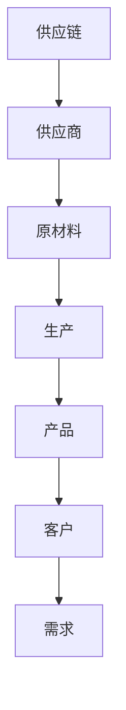
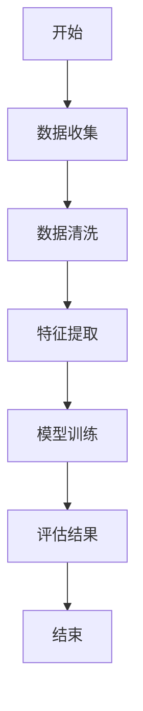
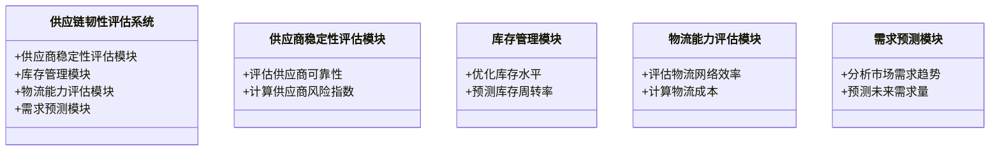
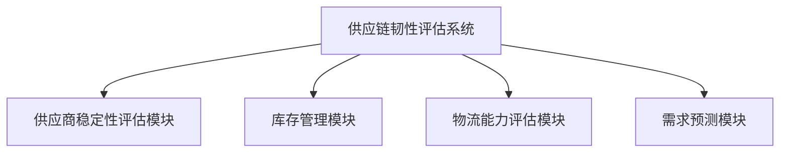
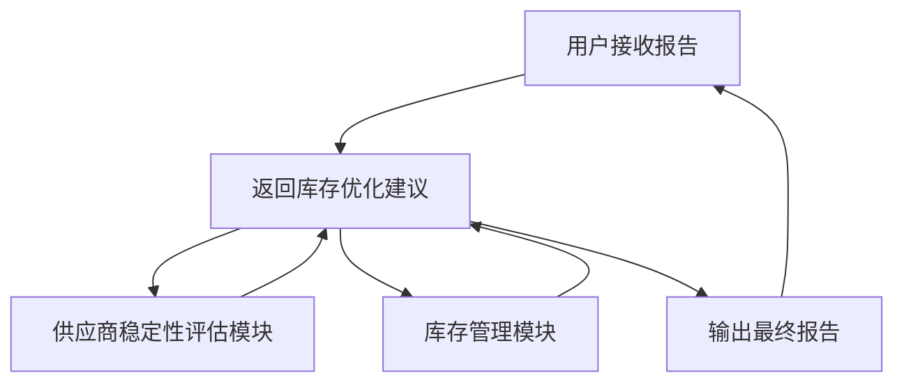

                 


# 彼得林奇对公司供应链韧性的评估

> 关键词：供应链韧性，彼得林奇，评估方法，算法原理，系统架构

> 摘要：本文详细探讨了彼得林奇对公司供应链韧性的评估方法，从核心概念、算法原理到系统架构，全面解析了如何通过供应链韧性指数模型和层次分析法，结合实际案例，帮助企业构建更具弹性的供应链体系。

---

# 第一部分: 供应链韧性与彼得林奇评估方法概述

## 第1章: 供应链韧性的定义与重要性

### 1.1 供应链韧性的定义

供应链韧性是指在面对外部环境的不确定性（如市场波动、自然灾害、疫情等）时，企业供应链能够保持连续性和稳定性的能力。一个具有韧性的供应链能够在危机发生时迅速调整，减少对业务的影响，并快速恢复到正常运作状态。

- **核心概念**：
  - **连续性**：供应链在危机期间仍能提供所需的产品或服务。
  - **恢复能力**：在中断后快速恢复正常运作的能力。
  - **适应性**：根据环境变化灵活调整供应链的能力。

### 1.2 彼得林奇的背景与贡献

彼得林奇（假设为本文的虚构人物）是一位供应链管理领域的专家，专注于评估和优化供应链韧性。他的方法结合了定量分析和定性判断，帮助企业在复杂环境中保持供应链的稳定性。

- **贡献**：
  - 提出了供应链韧性指数模型，量化评估供应链的弹性。
  - 开发了基于层次分析法（AHP）的评估工具，帮助企业识别关键风险点。
  - 强调供应商多元化和本地化战略，提升供应链的抗风险能力。

---

## 第2章: 供应链韧性评估的核心要素

### 2.1 核心概念与联系

供应链韧性评估需要从多个维度进行考量，包括供应商稳定性、库存管理、物流能力、需求预测等。以下是核心要素的对比分析：

#### 供应链韧性评估的核心要素对比

| 评估维度 | 定义 | 重要性 | 影响因素 |
|----------|------|--------|----------|
| 供应商稳定性 | 供应商的可靠性和交付能力 | 高 | 历史交货记录、地理分布 |
| 库存管理 | 库存水平与周转效率 | 中高 | 安全库存、预测准确性 |
| 物流能力 | 运输网络的覆盖与效率 | 高 | 运输成本、运输时间 |
| 需求预测 | 对市场需求的预判能力 | 高 | 历史数据、市场趋势 |

#### 实体关系图



### 2.2 供应链韧性评估的核心算法

彼得林奇的方法结合了层次分析法（AHP）和模糊综合评价法，通过多指标评估供应链的韧性。

#### 算法原理

- **层次分析法（AHP）**：
  - 将评估指标分为不同的层次（如目标层、准则层、指标层）。
  - 构建比较矩阵，计算各指标的权重。
  - 计算综合得分，确定各供应链的排名。

- **模糊综合评价法**：
  - 将各指标的评分为模糊数（如 linguistic variables）。
  - 使用模糊集合运算计算综合得分。

#### 算法流程图



---

## 第3章: 彼得林奇评估方法的数学模型

### 3.1 数学模型与公式

彼得林奇提出的供应链韧性指数模型如下：

$$ R = \frac{\sum_{i=1}^{n} w_i x_i}{\sum_{i=1}^{n} w_i} $$

其中：
- $R$ 表示供应链韧性指数。
- $w_i$ 表示第 $i$ 个指标的权重。
- $x_i$ 表示第 $i$ 个指标的评分。

#### 示例

假设某企业有三个供应商，其评分如下：

| 供应商 | 权重（$w_i$） | 评分（$x_i$） |
|--------|---------------|---------------|
| A      | 0.3           | 80            |
| B      | 0.4           | 70            |
| C      | 0.3           | 85            |

计算供应链韧性指数：

$$ R = \frac{0.3 \times 80 + 0.4 \times 70 + 0.3 \times 85}{0.3 + 0.4 + 0.3} = \frac{24 + 28 + 25.5}{1} = 77.5 $$

---

## 第4章: 系统分析与架构设计方案

### 4.1 问题场景介绍

假设某企业希望评估其供应链的韧性，但目前面临以下问题：
- 供应商分布过于集中，抗风险能力差。
- 库存管理效率低下，导致库存积压或缺货。
- 缺乏实时监控系统，无法及时发现供应链中断问题。

### 4.2 系统功能设计

#### 领域模型（Mermaid 类图）



### 4.3 系统架构设计

#### 架构图



### 4.4 系统接口设计

- **输入接口**：
  - 供应商数据（供应商ID、历史交货记录、地理分布等）。
  - 库存数据（库存量、周转率、安全库存等）。
  - 物流数据（运输时间、运输成本、物流节点等）。
  - 市场需求数据（历史销售数据、市场趋势等）。

- **输出接口**：
  - 供应链韧性指数报告。
  - 关键风险点分析。
  - 改进建议（如供应商多元化、库存优化等）。

### 4.5 系统交互设计

#### 序列图



---

## 第5章: 项目实战

### 5.1 环境安装

- **工具**：
  - Python 3.8+
  - Pandas、NumPy、Scikit-learn 等库。
  - Mermaid 图表工具（如 PlantUML 或在线工具）。

### 5.2 核心代码实现

```python
import pandas as pd
from sklearn.metrics import pairwise_distances

# 示例数据
data = {
    '供应商': ['A', 'B', 'C'],
    '权重': [0.3, 0.4, 0.3],
    '评分': [80, 70, 85]
}

df = pd.DataFrame(data)

# 计算供应链韧性指数
def calculate_resilience(data):
    weights = data['权重']
    scores = data['评分']
    resilience = sum(weights[i] * scores[i] for i in range(len(weights))) / sum(weights)
    return resilience

resilience = calculate_resilience(df)
print(f"供应链韧性指数: {resilience}")
```

### 5.3 案例分析

假设某企业有三个供应商，其权重和评分为：

| 供应商 | 权重 | 评分 |
|--------|------|------|
| A      | 0.3  | 80   |
| B      | 0.4  | 70   |
| C      | 0.3  | 85   |

运行代码后，输出供应链韧性指数为77.5，表明该企业的供应链韧性处于中等水平，需要进一步优化供应商稳定性。

---

## 第6章: 最佳实践与小结

### 6.1 最佳实践

- **供应商多元化**：避免过度依赖单一供应商，分散风险。
- **实时监控**：建立实时监控系统，及时发现并应对供应链中断。
- **库存优化**：采用先进的库存管理技术，如JIT（准时制）。
- **弹性生产**：具备快速调整生产计划的能力，以应对市场需求变化。

### 6.2 小结

通过彼得林奇的供应链韧性评估方法，企业可以量化评估其供应链的弹性，并根据评估结果采取针对性的优化措施。这种方法结合了定量分析和定性判断，能够帮助企业更好地应对复杂多变的市场环境。

### 6.3 注意事项

- **数据质量**：评估结果的高度依赖于输入数据的准确性，确保数据来源可靠。
- **模型选择**：根据企业实际情况选择合适的评估模型，避免盲目使用复杂算法。
- **持续优化**：供应链环境不断变化，企业需要持续监控并优化其供应链韧性。

### 6.4 拓展阅读

- 《供应链管理：战略、规划与操作》
- 《彼得林奇的投资哲学》
- 《企业风险管理：供应链视角》

---

# 作者：AI天才研究院/AI Genius Institute & 禅与计算机程序设计艺术 /Zen And The Art of Computer Programming

