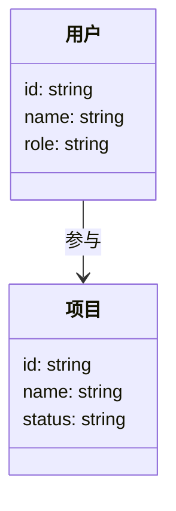
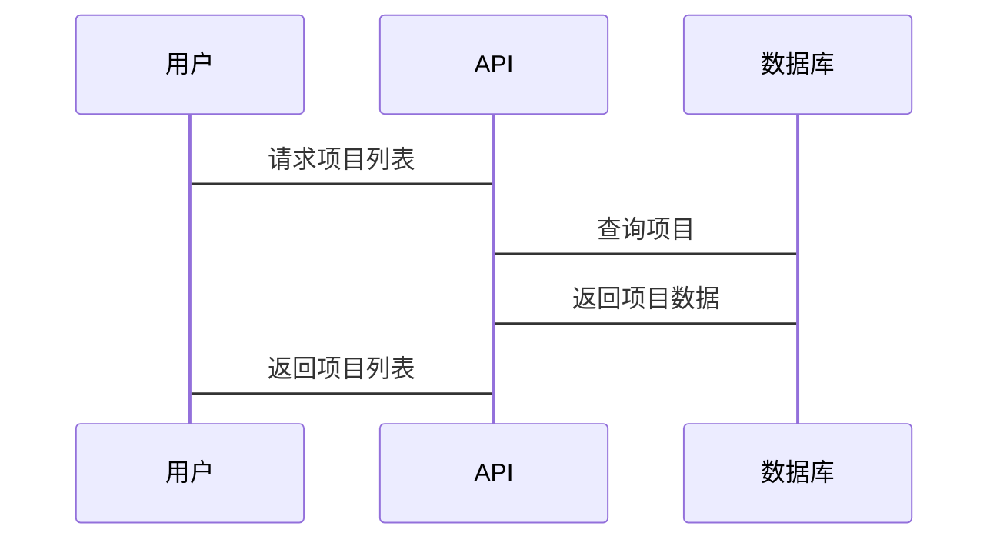

                 


# 彼得林奇对公司创新生态系统网络分析方法

## 关键词：
- 公司创新生态系统
- 网络分析方法
- 彼得林奇
- 网络结构
- 创新节点识别
- 系统架构设计
- 数学模型

## 摘要：
本文探讨了彼得·林奇的网络分析方法在公司创新生态系统中的应用。通过构建网络模型，识别关键创新节点，分析系统的动态演化，并提供实际案例。文章详细解释了网络分析的核心概念、算法原理、数学模型，并通过系统架构设计和项目实战，展示了如何应用这些方法进行创新生态系统分析。最后，总结了最佳实践和注意事项，为读者提供了全面的指导。

---

## 第1章：公司创新生态系统概述

### 1.1 创新生态系统的定义与特征
创新生态系统是一个由多个参与者组成的复杂网络，包括公司内部团队、外部合作伙伴、客户、供应商等。其特征包括复杂性、动态性、多层次结构等。创新生态系统通过协作和资源共享，推动持续创新。

### 1.2 彼得·林奇的网络分析方法
彼得·林奇的网络分析方法关注网络中的关键节点和关系，用于识别创新驱动力。网络分析通过节点中心性、社区发现等方法，帮助理解网络结构和关键参与者。

### 1.3 问题背景与研究意义
随着市场竞争加剧，企业需要快速响应变化。网络分析帮助识别关键创新节点，优化资源配置，提升创新能力，具有重要的研究意义。

---

## 第2章：网络分析的核心概念

### 2.1 网络分析的基本原理
网络分析研究节点和边的结构，常用方法包括社会网络分析、路径分析等。节点代表参与者，边代表关系，权重表示关系强度。

### 2.2 创新生态系统中的网络结构
创新生态系统中的节点包括研发团队、合作伙伴，边包括协作关系、资源共享。网络结构动态演化，推动创新。

### 2.3 核心概念的ER实体关系图
```mermaid
er
actor:
    id: string
    name: string
    role: string
    connections: list
```

---

## 第3章：网络分析算法原理

### 3.1 网络分析算法概述
常用算法包括PageRank、LSI、社区发现算法。PageRank计算节点重要性，LSI用于语义分析。

### 3.2 算法实现步骤
1. 数据预处理：清理和标准化数据。
2. 网络构建：定义节点和边。
3. 算法计算：如PageRank。
4. 结果分析：识别关键节点。

### 3.3 算法实现
```python
import networkx as nx

G = nx.Graph()
G.add_nodes_from([1, 2, 3])
G.add_edges_from([(1, 2), (2, 3)])

print(nx.pagerank(G))
```

---

## 第4章：数学模型和公式

### 4.1 网络分析的数学模型
邻接矩阵表示网络结构，拉普拉斯矩阵用于计算特征向量。

### 4.2 核心公式推导
PageRank公式：
$$
PR(i) = \alpha \cdot PR(j) + (1-\alpha)
$$

---

## 第5章：系统分析与架构设计

### 5.1 问题场景介绍
分析某公司的创新项目网络，识别关键创新节点。

### 5.2 项目介绍
项目目标：优化创新流程。范围：公司内部团队和外部合作伙伴。

### 5.3 系统功能设计（领域模型）


### 5.4 系统架构设计


### 5.5 系统接口设计
API接口：
- 请求：`POST /api/projects`
- 响应：项目数据

### 5.6 系统交互序列图


---

## 第6章：项目实战

### 6.1 环境安装
安装Python、NetworkX、Matplotlib。

### 6.2 系统核心实现源代码
```python
import networkx as nx
import matplotlib.pyplot as plt

G = nx.Graph()
G.add_nodes_from(['R&D团队', '合作伙伴1', '合作伙伴2'])
G.add_edges_from([('R&D团队', '合作伙伴1'), ('R&D团队', '合作伙伴2')])

nx.draw(G, with_labels=True)
plt.show()
```

### 6.3 代码应用解读与分析
代码构建了公司与合作伙伴的网络，展示了协作关系。

### 6.4 实际案例分析
分析某公司创新网络，识别关键节点，优化资源配置。

---

## 第7章：最佳实践与总结

### 7.1 总结
网络分析帮助识别创新节点，优化生态系统结构，提升创新能力。

### 7.2 最佳实践 tips
- 数据质量至关重要。
- 结合其他分析方法。
- 定期更新网络模型。

### 7.3 注意事项
- 数据隐私需注意。
- 结果需结合实际业务。
- 模型具有局限性。

### 7.4 拓展阅读
推荐书籍：《网络科学导论》。

---

## 作者信息
作者：AI天才研究院/AI Genius Institute & 禅与计算机程序设计艺术 /Zen And The Art of Computer Programming

