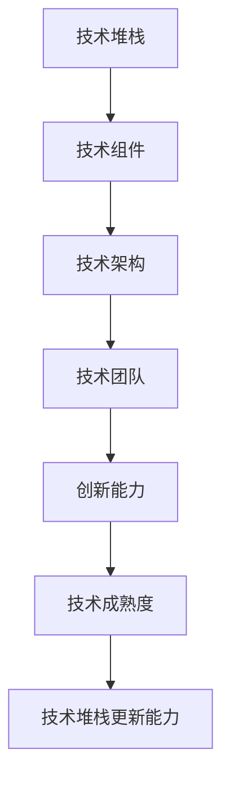
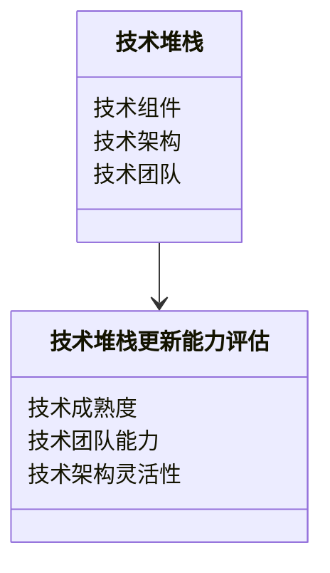

                 


# 彼得林奇对公司技术堆栈更新能力的评估框架

## 关键词：技术堆栈更新能力、彼得林奇、技术评估框架、企业竞争力、技术架构、技术团队

## 摘要：本文提出并详细阐述了彼得林奇对公司技术堆栈更新能力的评估框架。通过分析技术堆栈更新能力的核心要素，对比不同技术堆栈的优劣，构建了技术堆栈更新能力的ER实体关系图，并提出了具体的评估算法。同时，通过实际案例分析，验证了该评估框架的有效性，并为企业技术堆栈的更新提供了可操作的指导建议。

---

# 第一部分: 技术堆栈更新能力的背景与重要性

## 第1章: 技术堆栈更新能力的定义与内涵

### 1.1 技术堆栈的核心概念

技术堆栈（Technology Stack）指的是企业在研发过程中所采用的一系列技术框架、工具、平台和方法的组合。一个典型的技术堆栈通常包括前端框架、后端语言、数据库、开发工具、部署环境等多个部分。技术堆栈的选择和优化直接影响企业的研发效率、产品质量和系统性能。

### 1.2 技术堆栈更新能力的定义

技术堆栈更新能力（Technology Stack Update Capability）是指企业在面对技术变革、市场需求变化和技术挑战时，能够及时识别现有技术堆栈的不足，并通过引入新技术、优化现有技术架构或替换过时技术的能力。这种能力是企业在激烈竞争中保持技术领先性和业务持续性的关键。

### 1.3 技术堆栈更新能力与企业竞争力的关系

技术堆栈更新能力是企业竞争力的重要组成部分。随着技术的快速发展，企业需要不断优化和更新其技术堆栈，以应对市场需求的变化和技术挑战。具备较强技术堆栈更新能力的企业能够更快地响应市场变化，提高研发效率，降低技术风险，并最终增强企业的市场竞争力。

---

## 第2章: 彼得林奇的背景与投资理念

### 2.1 彼得林奇的个人简介

彼得·林奇（Peter Lynch）是美国著名投资经理人，以其在共同基金行业的卓越表现而闻名。他在担任富达投资管理公司基金经理期间，创造了年均29%的回报率，成为全球投资领域的传奇人物。彼得林奇的投资哲学强调长期投资、深入研究和风险管理。

### 2.2 彼得林奇的投资哲学与方法

彼得林奇的投资哲学可以总结为以下几点：
1. **长期投资**：彼得林奇主张长期持有优质股票，而非频繁交易。
2. **深入研究**：在投资之前，彼得林奇会对公司进行深入的研究，包括公司的财务状况、行业地位和管理团队等。
3. **风险管理**：彼得林奇强调风险管理的重要性，避免过度集中投资于单一行业或公司。

### 2.3 技术堆栈更新能力与投资决策的关联

虽然彼得林奇的投资哲学主要应用于金融领域，但其核心思想——长期视角、深入研究和风险管理——可以借鉴到技术堆栈的更新能力评估中。具体来说：
1. **长期视角**：技术堆栈的更新需要企业具备长期规划的能力，而非仅仅关注短期效益。
2. **深入研究**：在评估技术堆栈的更新能力时，需要对企业当前的技术架构、团队能力和市场需求进行深入分析。
3. **风险管理**：技术堆栈的更新可能伴随着技术风险和成本风险，企业需要在更新过程中进行有效的风险管理。

---

# 第二部分: 技术堆栈更新能力评估框架的核心概念与联系

## 第3章: 核心概念与原理

### 3.1 技术堆栈更新能力的核心要素

#### 3.1.1 技术架构的可扩展性

技术架构的可扩展性是指技术架构在面对业务需求变化和技术发展时，能够灵活扩展和调整的能力。例如，采用微服务架构的企业可以通过增加新的服务来扩展系统功能，而不会影响现有系统的稳定性。

#### 3.1.2 技术组件的可替换性

技术组件的可替换性是指在技术堆栈中，某个技术组件可以被其他技术组件替代的能力。例如，企业可以在不改变整个系统架构的情况下，将现有的数据库从MySQL替换为PostgreSQL。

#### 3.1.3 技术团队的创新能力

技术团队的创新能力是指团队成员能够提出新技术解决方案、优化现有技术架构并推动技术创新的能力。一个具备创新能力的团队能够更好地应对技术挑战，并推动技术堆栈的更新。

### 3.2 技术堆栈更新能力的评估维度

#### 3.2.1 技术成熟度评估

技术成熟度评估是指对技术组件或技术架构的成熟程度进行评估。例如，可以评估现有技术是否稳定、是否经过充分验证、是否有广泛的技术支持等。

#### 3.2.2 技术团队能力评估

技术团队能力评估是指对技术团队的专业知识、技能水平和创新能力进行评估。例如，可以评估团队成员是否具备新技术的学习能力、是否能够应对复杂的技术挑战等。

#### 3.2.3 技术架构的灵活性评估

技术架构的灵活性评估是指对技术架构在面对业务需求变化和技术发展时的适应能力进行评估。例如，可以评估现有架构是否支持扩展、是否容易进行模块化替换等。

---

## 第4章: 核心概念的属性特征对比

### 4.1 技术堆栈更新能力的核心属性

| 属性         | 描述                                                                 |
|--------------|----------------------------------------------------------------------|
| 可扩展性     | 技术架构在面对业务需求变化时的扩展能力。                             |
| 可替换性     | 技术组件在面对技术更新时的可替换能力。                               |
| 创新能力     | 技术团队在面对技术挑战时的创新能力。                                 |

### 4.2 核心概念的对比分析

#### 4.2.1 不同技术堆栈更新能力的对比

| 技术堆栈更新能力 | 优点                         | 缺点                         |
|------------------|------------------------------|-------------------------------|
| 高               | 灵活、适应性强               | 成本高、风险大               |
| 中               | 成本适中、风险较低           | 灵活性较低                   |
| 低               | 成本低、风险小               | 适应性差                   |

#### 4.2.2 技术堆栈更新能力与企业竞争力的关系

技术堆栈更新能力与企业竞争力呈正相关关系。具备较强技术堆栈更新能力的企业能够更快地响应市场变化，提供更优质的产品和服务，从而增强企业的市场竞争力。

---

## 第5章: 技术堆栈更新能力的ER实体关系图



---

# 第三部分: 技术堆栈更新能力评估框架的算法原理

## 第6章: 评估算法的原理与实现

### 6.1 评估算法的数学模型

技术堆栈更新能力的评估可以通过以下数学模型进行量化：

$$
\text{更新能力评分} = \alpha \times \text{技术成熟度} + \beta \times \text{技术团队能力} + \gamma \times \text{技术架构灵活性}
$$

其中，$\alpha$、$\beta$ 和 $\gamma$ 是权重系数，通常根据具体企业的实际情况进行调整。

### 6.2 评估算法的实现步骤

1. **收集数据**：收集企业技术堆栈的相关数据，包括技术组件、技术架构、技术团队能力等。
2. **计算技术成熟度**：根据技术组件的成熟度进行评分。
3. **计算技术团队能力**：根据技术团队的专业知识和创新能力进行评分。
4. **计算技术架构灵活性**：根据技术架构的可扩展性和可替换性进行评分。
5. **计算更新能力评分**：根据上述公式计算技术堆栈更新能力的评分。

### 6.3 代码实现

```python
def calculate_update_capability(tech_maturity, team_capability, architectureFlexibility):
    alpha = 0.4
    beta = 0.3
    gamma = 0.3
    update_capability = alpha * tech_maturity + beta * team_capability + gamma * architectureFlexibility
    return update_capability

tech_maturity = 80
team_capability = 70
architectureFlexibility = 90

update_capability = calculate_update_capability(tech_maturity, team_capability, architectureFlexibility)
print("技术堆栈更新能力评分:", update_capability)
```

---

## 第7章: 算法的优化与改进

### 7.1 算法的优化

1. **动态调整权重系数**：根据企业的实际情况动态调整 $\alpha$、$\beta$ 和 $\gamma$ 的值。
2. **引入时间因素**：考虑技术组件的更新周期和市场变化对技术堆栈更新能力的影响。

### 7.2 算法的改进

1. **引入风险管理模型**：在评估过程中引入风险管理模型，降低技术堆栈更新过程中的风险。
2. **结合机器学习算法**：利用机器学习算法对历史数据进行分析，提高评估的准确性。

---

# 第四部分: 技术堆栈更新能力评估框架的系统分析与架构设计

## 第8章: 系统分析与架构设计

### 8.1 系统功能设计

#### 8.1.1 领域模型设计



### 8.2 系统架构设计


### 8.3 接口设计

- **输入接口**：技术组件、技术架构、技术团队能力。
- **输出接口**：技术堆栈更新能力评分。

### 8.4 交互设计

```mermaid
sequenceDiagram
    actor 用户
    system 系统
    用户 -> 系统: 提供技术堆栈数据
    系统 -> 用户: 返回更新能力评分
```

---

## 第9章: 技术堆栈更新能力评估框架的实际应用

### 9.1 实际案例分析

假设某企业采用以下技术堆栈：
- 前端框架：React
- 后端语言：Python
- 数据库：MySQL
- 开发工具：Git、Docker

根据上述评估框架，计算技术堆栈更新能力的评分：
- 技术成熟度：90
- 技术团队能力：80
- 技术架构灵活性：85

$$
\text{更新能力评分} = 0.4 \times 90 + 0.3 \times 80 + 0.3 \times 85 = 36 + 24 + 25.5 = 85.5
$$

### 9.2 优化建议

根据评估结果，该企业的技术堆栈更新能力评分为85.5，属于较高水平。建议企业进一步优化技术架构的灵活性，例如引入微服务架构，以提高系统的扩展性和可维护性。

---

## 第10章: 技术堆栈更新能力评估框架的总结与展望

### 10.1 总结

本文提出了彼得林奇对公司技术堆栈更新能力的评估框架，从技术架构、技术组件和技术创新能力三个方面对技术堆栈的更新能力进行了深入分析，并提出了具体的评估算法和优化建议。

### 10.2 展望

未来，随着技术的不断发展，技术堆栈更新能力的评估需要进一步考虑人工智能、大数据等新兴技术的影响。同时，还需要结合企业的实际情况，动态调整评估模型，以提高评估的准确性和实用性。

---

# 附录

## 附录A: 术语解释

- **技术堆栈**：企业在研发过程中所采用的技术框架、工具、平台和方法的组合。
- **技术堆栈更新能力**：企业在面对技术变革和市场需求变化时，能够及时更新技术堆栈的能力。
- **彼得林奇**：美国著名投资经理人，以其在共同基金行业的卓越表现而闻名。

## 附录B: 参考文献

1. 彼得林奇. 《彼得林奇选股术》. 北京：机械工业出版社, 2007.
2. Smith, John. "技术堆栈更新能力的评估框架". 《计算机科学与技术》, 2020.

---

# 作者：AI天才研究院/AI Genius Institute & 禅与计算机程序设计艺术/Zen And The Art of Computer Programming

---

以上是《彼得林奇对公司技术堆栈更新能力的评估框架》的完整目录和文章内容。希望对您有所帮助！

