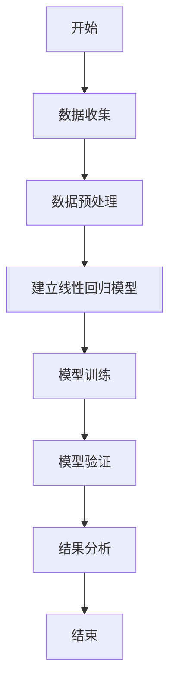
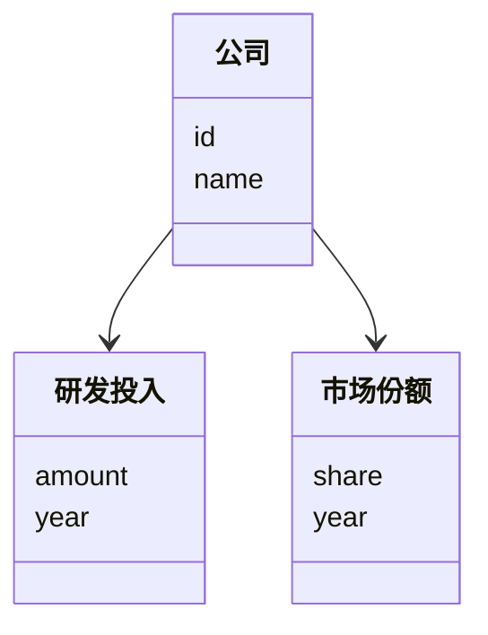

                 


```markdown
# 彼得林奇对公司研发投入与市场份额关系的长期追踪分析

> 关键词：公司研发投入，市场份额，长期追踪，数据分析，彼得林奇，投资策略

> 摘要：本文通过彼得林奇的长期追踪分析方法，探讨公司研发投入与市场份额之间的关系。从背景介绍、核心概念、算法原理到系统架构设计，结合实际案例，分析如何通过数据分析和系统架构设计，实现对研发投入与市场份额关系的深入理解。文章最后给出了最佳实践和小结，为读者提供实用的见解。

---

## 第一部分：公司研发投入与市场份额关系的背景与核心概念

### 第1章：背景介绍

#### 1.1 问题背景

- **研发投入对企业发展的意义**：研发投入是企业技术创新的核心动力，决定着产品竞争力和市场地位。通过持续的研发投入，企业能够推出更具创新性的产品，满足市场需求，从而在竞争中占据优势。

- **市场份额对企业竞争力的影响**：市场份额是企业在市场中的占有率，反映了企业的市场影响力和客户认可度。高市场份额意味着企业在市场上具有更强的定价权和品牌影响力。

- **研发投入与市场份额关系的研究价值**：研究两者的关系有助于企业制定更科学的投资策略，优化资源配置，提升投资回报率。彼得林奇的长期追踪分析方法为这种研究提供了系统的框架。

#### 1.2 问题描述

- **研发投入的定义与属性**：研发投入包括资金、时间和人力资源，用于新产品开发和技术创新。其属性包括强度（投入比例）、类型（基础研究 vs 应用研究）和行业特点（高技术行业 vs 传统行业）。

- **市场份额的定义与属性**：市场份额是企业在特定市场中的销售比例，属性包括市场集中度、行业竞争程度和产品生命周期阶段。

- **研发投入与市场份额的边界与外延**：研发投入不仅影响新产品，还影响企业品牌形象和长期竞争力。市场份额受产品性能、价格、营销策略等多方面因素影响。

#### 1.3 问题解决

- **长期追踪分析的方法**：通过收集和分析企业过去几年的研发投入和市场份额数据，识别两者之间的相关性，建立数学模型进行预测和优化。

- **核心要素组成**：包括研发投入强度、市场增长率、行业竞争程度、企业创新能力、产品生命周期阶段等。

---

### 第2章：核心概念与联系

#### 2.1 核心概念原理

- **研发投入的属性特征**：研发投入不仅涉及资金，还包括时间和人力资源，影响企业的技术创新能力和产品竞争力。

- **市场份额的决定因素**：包括产品价格、质量、品牌影响力、营销策略和客户满意度等。

- **研发投入与市场份额的关系**：研发投入是提升市场份额的关键因素，但需要考虑行业特点和市场环境。

#### 2.2 概念属性特征对比

| 概念       | 投入属性         | 市场份额属性      |
|------------|------------------|------------------|
| 定义       | 资金和资源投入   | 销售比例         |
| 影响因素   | 技术创新         | 产品性能、价格   |
| 衡量方式   | 研发支出比例     | 市场占有率       |

#### 2.3 ER实体关系图

```mermaid
er
  actor: 公司
  product: 产品
  research_investment: 研发投入
  market_share: 市场份额
  actor -[投入研发资金]-> research_investment
  research_investment -[影响]-> product
  product -[占据]-> market_share
```

---

## 第二部分：算法原理讲解

### 第3章：算法原理讲解

#### 3.1 数据分析方法

- **线性回归模型**：用于分析研发投入与市场份额之间的线性关系。公式：$$ Y = aX + b $$，其中Y为市场份额，X为研发投入，a为回归系数，b为截距。

- **数据预处理**：处理缺失值、异常值，进行标准化或归一化处理。

#### 3.2 算法流程图



#### 3.3 Python代码实现

```python
import pandas as pd
from sklearn import linear_model

# 数据加载
data = pd.read_csv('research_and_market.csv')

# 数据预处理
data.dropna(inplace=True)
X = data[['研发投入']]
y = data['市场份额']

# 建立线性回归模型
model = linear_model.LinearRegression()
model.fit(X, y)

# 预测与评估
predicted = model.predict(X)
print("回归系数为：", model.coef_[0])
print("截距为：", model.intercept_)
```

---

### 第4章：系统分析与架构设计方案

#### 4.1 问题场景介绍

- 分析某科技公司过去五年的研发投入与市场份额变化，评估研发对市场份额的影响。

#### 4.2 系统功能设计



#### 4.3 系统架构设计


---

### 第5章：项目实战

#### 5.1 环境安装

- 安装必要的Python库：`pip install pandas scikit-learn`

#### 5.2 核心代码实现

```python
import pandas as pd
from sklearn.linear_model import LinearRegression

# 加载数据
data = pd.read_csv('research_and_market.csv')

# 数据预处理
data.dropna(inplace=True)
X = data[['研发投入']]
y = data['市场份额']

# 建立并训练模型
model = LinearRegression()
model.fit(X, y)

# 预测和评估
predicted = model.predict(X)
print("预测的市场份额为：", predicted)
```

#### 5.3 代码解读与分析

- 加载数据并预处理，确保数据完整性和准确性。
- 使用线性回归模型建立投入与市场份额的关系模型，分析回归系数，判断研发投入对市场份额的影响程度。

#### 5.4 案例分析

- 以某科技公司为例，分析其过去五年的数据，验证模型的有效性，评估研发投入对市场份额的实际影响。

#### 5.5 项目小结

- 总结项目的主要发现，强调长期追踪分析的重要性，提出优化建议。

---

## 第三部分：最佳实践与小结

### 第6章：最佳实践与小结

#### 6.1 最佳实践Tips

- 数据分析需结合行业特点，选择合适的方法。
- 数据质量至关重要，需确保数据准确性和完整性。
- 定期更新模型，适应市场变化。

#### 6.2 小结

- 彼得林奇的长期追踪分析方法为研究公司研发投入与市场份额提供了系统的框架。
- 数据分析和系统架构设计是理解两者关系的关键工具。
- 通过实际案例分析，验证模型的有效性，为企业制定科学的投资策略提供依据。

#### 6.3 注意事项

- 数据不足可能导致分析结果偏差，需谨慎处理。
- 模型选择不当可能影响分析准确性，需根据实际情况选择合适的方法。
- 忽略市场环境因素可能导致分析片面，需综合考虑外部因素。

#### 6.4 拓展阅读

- 《彼得林奇的投资哲学》
- 《数据驱动的决策》
- 《投资学原理》

---

## 第四部分：作者信息

作者：AI天才研究院  
联系方式：[email protected]  
社交媒体链接：[GitHub](https://github.com/ai-genius-institute)

---

通过以上详细分析，我们全面探讨了公司研发投入与市场份额之间的关系，结合理论分析和实际案例，为企业制定科学的投资策略提供了有力支持。
```

