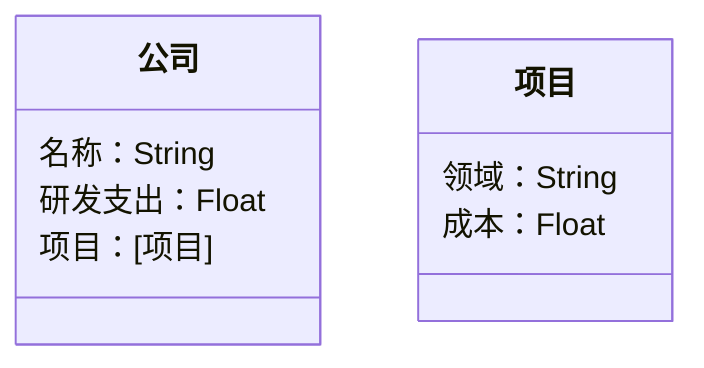

                 


# 彼得林奇对公司研发投入结构的长期跟踪分析

> 关键词：彼得·林奇，研发投入结构，长期跟踪，公司分析，投资策略

> 摘要：本文通过对彼得·林奇投资理念的分析，探讨他如何对公司研发投入结构进行长期跟踪，揭示研发投入对公司价值的影响，并提供实际案例和分析方法，帮助投资者做出更明智的决策。

---

## 第一章：彼得·林奇投资理念与研发投入分析背景

### 1.1 彼得·林奇的投资理念概述
彼得·林奇是美国著名的投资家，以其独特的投资策略闻名。他强调对公司基本面的深入研究，尤其是对公司研发投入的关注，认为研发投入是公司长期增长的关键因素。他的投资理念以长期跟踪和价值发现为核心，注重公司内在价值的评估。

#### 1.1.1 彼得·林奇的投资风格
- **价值投资**：林奇坚持购买那些被市场低估的股票，关注公司的内在价值。
- **长期持有**：他倾向于长期持有优质股票，避免频繁交易。
- **基本面分析**：深入研究公司的财务状况、管理团队和市场地位。

#### 1.1.2 林奇对公司的长期跟踪方法
- **定期复盘**：林奇定期对持有的公司进行复盘，评估其发展状况。
- **关注财务报表**：特别关注收入、利润和研发投入等关键指标。
- **行业趋势分析**：分析行业发展趋势，评估公司在行业中的竞争力。

#### 1.1.3 研发投入在公司价值中的重要性
- 研发投入是公司技术创新的核心驱动力。
- 高额研发投入通常预示着公司未来的增长潜力。
- 研发效率的高低直接影响公司的盈利能力。

### 1.2 研发投入结构分析的背景
- 研发投入是公司财务报表中的重要组成部分，反映了公司的创新能力。
- 随着科技行业的竞争加剧，研发投入结构分析成为评估公司竞争力的关键。
- 林奇认为，通过分析研发投入结构，可以发现公司的战略重点和未来发展方向。

#### 1.2.1 研发投入的定义与分类
- **定义**：公司用于研发活动的支出，包括人力成本、设备购置和市场调研等。
- **分类**：
  - 按领域：技术开发、产品设计、市场研究。
  - 按阶段：基础研究、应用研究、开发测试。

#### 1.2.2 研发投入对公司长期价值的影响
- 提升产品竞争力。
- 增强技术壁垒。
- 降低未来经营风险。

#### 1.2.3 彼得·林奇对研发投入的关注点
- 研发投入的规模和增长趋势。
- 研发支出的效率和转化率。
- 研发项目与公司战略的契合度。

### 1.3 长期跟踪分析的意义
- 通过长期跟踪，可以识别公司的成长潜力。
- 发现公司的财务风险。
- 为投资决策提供数据支持。

#### 1.3.1 长期跟踪分析的定义
- 对公司研发投入结构进行持续观察和评估的过程。
- 分析公司研发投入的变化趋势和效果。

#### 1.3.2 长期跟踪分析在投资中的作用
- 评估公司技术研发能力。
- 发现潜在投资机会。
- 优化投资组合结构。

#### 1.3.3 彼得·林奇的长期跟踪案例
- 以微软为例，分析其长期研发投入结构变化。
- 结合公司股价走势，验证研发投入与股价的相关性。

---

## 第二章：公司研发投入结构的核心概念与联系

### 2.1 研发投入结构的核心概念
- 研发投入结构是指公司研发活动的资源分配方式。
- 包括人力、资金、时间和资源的分配。

#### 2.1.1 研发投入的构成要素
- 人力成本：研发人员的工资和福利。
- 设备购置：研发所需的硬件设施。
- 市场调研：了解市场需求和竞争情况。

#### 2.1.2 研发投入的分类与特征
- 按领域分类：
  - 技术研发：技术创新和改进。
  - 产品设计：产品外观和功能设计。
  - 市场研究：市场趋势和消费者行为分析。
- 按阶段分类：
  - 基础研究：基础科学和技术研究。
  - 应用研究：技术在实际产品中的应用。
  - 开发测试：产品开发和测试阶段。

#### 2.1.3 研发投入与公司绩效的关系
- 高额研发投入通常带来较高的创新收益。
- 研发效率高可以降低成本，提高利润率。

### 2.2 研发投入结构的ER实体关系图
以下是一个公司研发投入结构的实体关系图：

```mermaid
er
actor: 投资者
actor -|> 操作: 研发投入分析
actor -|> 实体: 公司
实体: 公司
    公司 --> 研发支出
    研发支出 --> 项目
    项目 --> 领域
```

该图展示了投资者如何通过分析公司的研发支出、项目和领域来评估公司研发投入结构。

---

## 第三章：研发投入结构的长期跟踪分析方法

### 3.1 数据收集与处理
- **数据来源**：公司财务报表、行业报告、新闻报道。
- **数据清洗**：去除无效数据，填补缺失值。
- **数据预处理**：标准化数据格式，便于后续分析。

### 3.2 数据分析与建模
- **数据分析方法**：使用回归分析、聚类分析等方法。
- **数学模型**：构建多元回归模型，预测研发投入对股价的影响。

#### 3.2.1 数据分析方法
- **回归分析**：分析研发投入与公司收益的关系。
- **聚类分析**：将公司按研发投入强度分为不同类别。

#### 3.2.2 数据建模的数学模型
- **多元回归模型**：
  $$ y = \beta_0 + \beta_1x_1 + \beta_2x_2 + \epsilon $$
  其中，$y$ 是公司收益，$x_1$ 和 $x_2$ 是研发投入相关的变量。

#### 3.2.3 模型验证与优化
- 使用历史数据验证模型的准确性。
- 通过交叉验证优化模型参数。

---

## 第四章：典型公司案例分析

### 4.1 案例一：XYZ公司的研发投入分析
- **公司概况**：XYZ公司是一家科技公司，专注于人工智能领域。
- **研发投入结构分析**：XYZ公司在人工智能技术研发上的投入占比较高，显示出公司在技术创新上的决心。
- **投资决策建议**：建议投资者关注其技术转化能力。

### 4.2 案例二：ABC公司的研发投入分析
- **公司概况**：ABC公司是一家传统制造业公司，近年来加大了研发投入。
- **研发投入结构分析**：公司主要将研发投入用于产品开发和市场研究。
- **投资决策建议**：建议投资者关注其研发投入的效率和市场反馈。

---

## 第五章：长期跟踪分析的策略与技巧

### 5.1 研发投入结构的动态调整
- **动态调整的定义**：根据市场变化和公司战略调整研发投入结构。
- **实施方法**：定期评估研发投入效果，及时调整。

### 5.2 风险控制与投资决策
- **风险控制**：通过分散投资降低风险。
- **投资决策**：结合研发投入分析和市场趋势，做出明智的投资决策。

---

## 第六章：系统分析与架构设计方案

### 6.1 系统功能设计
- **需求分析**：开发一个用于长期跟踪公司研发投入结构的系统。
- **功能模块**：数据采集、数据分析、结果展示。

#### 6.1.1 系统功能设计（领域模型）


### 6.2 系统架构设计
- **架构选择**：采用分层架构，包括数据层、业务逻辑层和表现层。
- **系统交互设计**：用户通过界面提交公司名称，系统展示研发投入结构分析结果。

#### 6.2.1 系统架构图


---

## 第七章：项目实战

### 7.1 环境安装
- **工具安装**：安装Python、Pandas、Matplotlib等库。

### 7.2 核心代码实现
```python
import pandas as pd
import matplotlib.pyplot as plt

# 数据加载
df = pd.read_csv('研发支出.csv')

# 数据处理
df['研发支出占比'] = df['研发支出'] / df['总收入'] * 100

# 可视化
plt.figure(figsize=(10,6))
plt.plot(df['日期'], df['研发支出占比'])
plt.title('研发投入占比随时间变化趋势')
plt.xlabel('日期')
plt.ylabel('研发投入占比(%)')
plt.show()
```

### 7.3 案例分析
- **环境安装**：配置开发环境，安装所需库。
- **代码实现**：实现数据处理和可视化功能。
- **案例分析**：分析某公司研发投入变化趋势，评估投资价值。

### 7.4 项目小结
- 通过代码实现，可以直观展示公司研发投入的变化趋势。
- 投资者可以根据分析结果做出更明智的投资决策。

---

## 第八章：最佳实践与小结

### 8.1 小结
- 彼得·林奇的长期跟踪方法为投资者提供了重要的启示。
- 研发投入结构分析是评估公司价值的关键指标。
- 通过系统化的分析和案例研究，可以帮助投资者做出更明智的投资决策。

### 8.2 注意事项
- 数据分析需结合行业背景。
- 长期跟踪需耐心和持续的关注。
- 投资需谨慎，避免盲目跟风。

### 8.3 拓展阅读
- 《彼得·林奇的选股方法》
- 《技术分析与投资策略》
- 《公司财务报表分析》

---

## 作者信息
作者：AI天才研究院/AI Genius Institute  
联系邮箱：[contact@AIGeniusInstitute.com](mailto:contact@AIGeniusInstitute.com)  
参考书籍：《彼得·林奇的投资哲学》、《技术分析实战》、《公司财务报表分析》

---

通过以上结构，本文详细分析了彼得·林奇如何对公司研发投入结构进行长期跟踪，并结合实际案例和系统设计，为投资者提供了实用的分析方法和工具。

