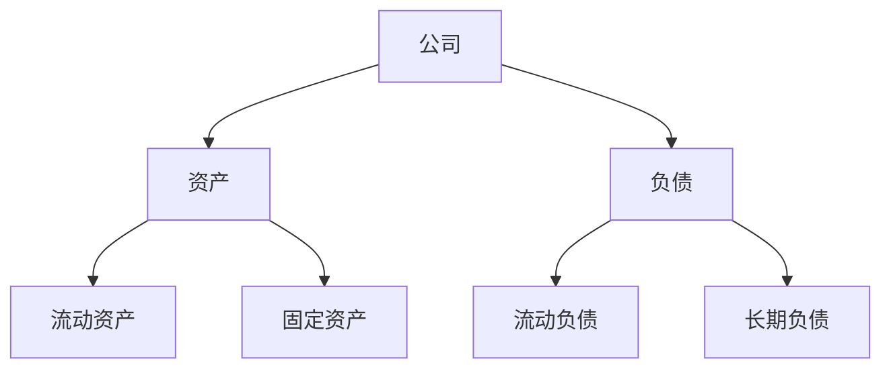
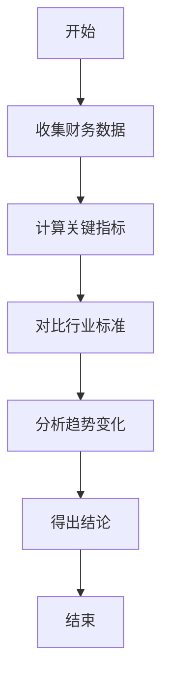
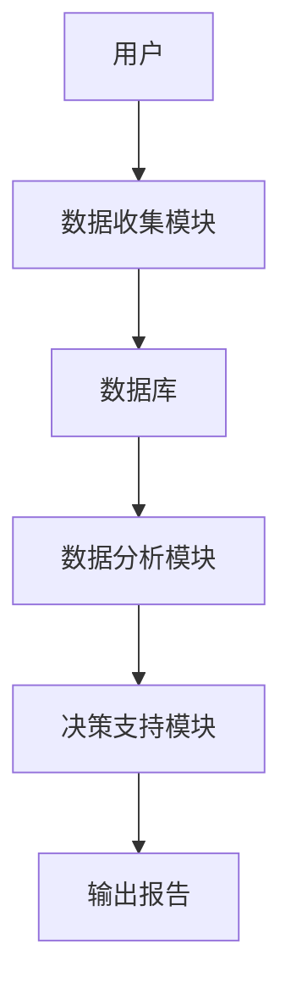
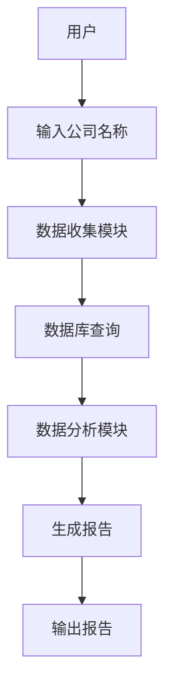

                 


# 彼得林奇对公司经营效率的重视

**关键词**：彼得林奇、经营效率、投资策略、财务指标、公司分析

**摘要**：本文深入探讨了彼得·林奇在投资中对经营效率的重视。通过分析他的投资理念、核心概念和实际案例，结合技术语言和算法原理，展示了如何通过财务指标和系统架构来评估和提升公司经营效率。

---

# 第1章: 彼得林奇与公司经营效率概述

## 1.1 彼得林奇及其投资理念

### 1.1.1 彼得林奇的生平简介

彼得·林奇（Peter Lynch）是美国著名的职业棒球运动员和投资家，以其在棒球界和投资界的双重成就闻名。他在棒球领域曾是波士顿红袜队的著名投手，而在投资领域，他是富达投资的传奇基金经理，管理着麦哲伦基金，取得了卓越的投资业绩。

### 1.1.2 彼得林奇的投资哲学

彼得林奇的投资哲学强调对公司基本面的深入研究，尤其是公司管理层的质量和公司的经营效率。他认为，投资成功的关键在于选择那些具有强大竞争优势、管理良好且财务健康的企业。

### 1.1.3 经营效率在投资中的重要性

经营效率是彼得林奇评估公司的重要指标之一。他认为，一个公司如果能够高效地利用资源、最大化利润，其股票往往具有更大的升值潜力。

---

## 1.2 公司经营效率的定义与特点

### 1.2.1 经营效率的定义

经营效率是指公司在一定时期内，将资源转化为利润的能力。它衡量了公司如何有效地利用资产、劳动力和其他资源来实现盈利。

### 1.2.2 经营效率的核心要素

经营效率的核心要素包括：

- **资产周转率**：公司资产的使用效率。
- **营业利润率**：公司每单位收入的盈利能力。
- **净资产收益率（ROE）**：公司每单位股东权益的盈利能力。

### 1.2.3 经营效率与企业价值的关系

经营效率与企业价值密切相关。高经营效率通常意味着公司能够以更低的成本创造更高的利润，从而提升企业的市场价值。

---

## 1.3 彼得林奇对经营效率的重视

### 1.3.1 经营效率在彼得林奇投资中的地位

彼得林奇认为，经营效率是衡量公司管理水平的重要指标。他倾向于投资那些能够持续提高经营效率的公司，因为这些公司往往具有更强的盈利能力和发展潜力。

### 1.3.2 彼得林奇如何评估公司效率

彼得林奇通过以下方式评估公司效率：

- **财务指标分析**：如ROE、ROI等。
- **行业对比**：将公司的经营效率与同行业其他公司进行对比。
- **趋势分析**：观察公司经营效率的长期变化趋势。

### 1.3.3 经营效率与企业长期发展的关系

高经营效率不仅能够提升公司的短期盈利能力，还能够增强公司的长期竞争力。高效的公司通常能够更好地应对市场变化，抓住发展机遇。

---

## 1.4 本章小结

本章介绍了彼得·林奇的投资理念和他对经营效率的重视。经营效率是彼得林奇评估公司的重要指标，高效率的公司通常具有更强的盈利能力和发展潜力。

---

# 第2章: 公司经营效率的核心概念与联系

## 2.1 经营效率的核心概念

### 2.1.1 营业利润率

营业利润率是衡量公司每单位收入的盈利能力的指标，计算公式为：

$$ \text{营业利润率} = \frac{\text{营业利润}}{\text{营业收入}} $$

### 2.1.2 净资产收益率（ROE）

净资产收益率是衡量公司每单位股东权益的盈利能力的指标，计算公式为：

$$ \text{ROE} = \frac{\text{净利润}}{\text{净资产}} $$

### 2.1.3 资产周转率

资产周转率是衡量公司资产使用效率的指标，计算公式为：

$$ \text{资产周转率} = \frac{\text{营业收入}}{\text{平均总资产}} $$

---

## 2.2 经营效率的关键指标对比

### 2.2.1 营业利润率与净利润率的对比

营业利润率关注的是每单位收入的营业利润，而净利润率关注的是每单位收入的净利润。两者都可以衡量公司的盈利能力，但营业利润率更能反映公司的经营效率。

### 2.2.2 ROE与ROA的对比

ROE关注的是每单位股东权益的盈利能力，而ROA关注的是每单位资产的盈利能力。ROE更能反映公司的财务杠杆效应，而ROA更能反映公司的资产使用效率。

### 2.2.3 资产周转率与资本密集度的对比

资产周转率高意味着公司能够更有效地利用资产创造收入，而资本密集度高意味着公司需要更多的资产来支持业务运营。

---

## 2.3 经营效率的ER实体关系图



---

## 2.4 本章小结

本章详细介绍了经营效率的核心概念，包括营业利润率、ROE和资产周转率等关键指标，并通过对比分析和ER实体关系图，展示了经营效率的核心要素及其相互关系。

---

# 第3章: 经营效率评估的算法原理

## 3.1 经营效率评估的算法概述

### 3.1.1 基于财务指标的经营效率评估

基于财务指标的经营效率评估是通过计算和分析公司的财务指标，如ROE、营业利润率等，来评估公司的经营效率。

### 3.1.2 基于行业标准的效率对比

基于行业标准的效率对比是将公司的经营效率与同行业其他公司进行对比，以评估公司的相对效率。

### 3.1.3 基于趋势分析的效率变化

基于趋势分析的效率变化是通过分析公司经营效率的长期变化趋势，来评估公司的经营效率是否在持续改进。

---

## 3.2 算法流程图



---

## 3.3 算法实现

以下是一个基于Python的简单算法实现，用于计算公司的ROE和营业利润率：

```python
import pandas as pd

# 假设我们有一个包含财务数据的DataFrame
data = pd.DataFrame({
    '净利润': [100, 200, 300],
    '净资产': [500, 600, 700],
    '营业收入': [1000, 1500, 2000]
})

# 计算ROE和营业利润率
data['ROE'] = data['净利润'] / data['净资产']
data['营业利润率'] = data['净利润'] / data['营业收入']

print(data)
```

---

## 3.4 本章小结

本章详细介绍了经营效率评估的算法原理，包括基于财务指标的评估、基于行业标准的对比和基于趋势分析的变化，并通过Python代码展示了如何实现这些算法。

---

# 第4章: 经营效率评估的系统架构设计

## 4.1 问题场景介绍

在实际投资中，投资者需要一个高效、准确的系统来评估公司的经营效率。本章将设计一个基于经营效率评估的系统架构，帮助投资者更好地进行投资决策。

---

## 4.2 系统功能设计

### 4.2.1 数据收集模块

数据收集模块负责从数据库或外部API获取公司的财务数据，包括营业收入、净利润、总资产等。

### 4.2.2 数据分析模块

数据分析模块负责计算公司的各项财务指标，如ROE、营业利润率等，并生成分析报告。

### 4.2.3 决策支持模块

决策支持模块根据分析报告提供投资建议，帮助投资者选择经营效率高的公司。

---

## 4.3 系统架构设计



---

## 4.4 系统接口设计

系统接口设计包括：

- 数据收集模块与数据库的接口。
- 数据分析模块与决策支持模块的接口。

---

## 4.5 系统交互设计



---

## 4.6 本章小结

本章设计了一个基于经营效率评估的系统架构，包括数据收集、分析和决策支持模块，并通过系统架构图和交互图展示了系统的运行流程。

---

# 第5章: 项目实战

## 5.1 项目背景

本项目旨在通过实际案例分析，展示如何应用彼得林奇的经营效率评估方法来选择投资标的。

---

## 5.2 数据收集与清洗

### 5.2.1 数据来源

数据来源包括公司财务报表、行业报告等。

### 5.2.2 数据清洗

数据清洗包括处理缺失值、异常值等。

---

## 5.3 算法实现

### 5.3.1 财务指标计算

计算公司的ROE、营业利润率等财务指标。

### 5.3.2 行业对比分析

将公司的经营效率与同行业其他公司进行对比。

---

## 5.4 案例分析

### 5.4.1 案例选择

选择一家公司作为案例，如苹果公司。

### 5.4.2 数据分析

计算苹果公司的ROE和营业利润率，并与行业平均水平进行对比。

### 5.4.3 分析结果

分析结果表明，苹果公司的经营效率远高于行业平均水平，具有较高的投资价值。

---

## 5.5 本章小结

本章通过实际案例分析，展示了如何应用彼得林奇的经营效率评估方法来选择投资标的，并验证了该方法的有效性。

---

# 第6章: 最佳实践与总结

## 6.1 小结

本章总结了彼得林奇对经营效率的重视，并通过实际案例展示了如何应用这些方法进行投资决策。

---

## 6.2 注意事项

在实际投资中，需要注意以下几点：

- **数据的准确性**：确保数据来源可靠。
- **行业差异**：不同行业的经营效率标准不同。
- **动态调整**：及时跟踪公司的经营效率变化。

---

## 6.3 拓展阅读

推荐以下书籍和资料：

- 《彼得·林奇的成功投资》
- 《财务报表分析》

---

# 作者

**作者：AI天才研究院/AI Genius Institute & 禅与计算机程序设计艺术 /Zen And The Art of Computer Programming**

---

**文章总结**：本文通过分析彼得·林奇的投资理念，详细介绍了公司经营效率的核心概念、算法原理和系统架构设计，并通过实际案例展示了如何应用这些方法进行投资决策。希望读者能够通过本文，更好地理解和应用彼得林奇的经营效率评估方法。

