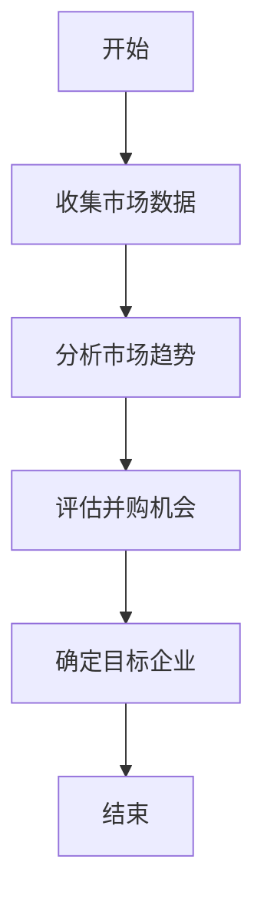

                 


## # 彼得林奇的"市场机会"在跨境并购中的识别

### Keywords: 彼得林奇、市场机会、跨境并购、投资策略、并购分析、识别方法

### 摘要：  
本文通过深入分析彼得林奇的市场机会理论，探讨其在跨境并购中的识别方法。文章结合理论与实践，从市场机会识别的核心要素、算法原理、系统架构到实际案例分析，全面阐述如何在跨境并购中捕捉市场机会，为投资者提供理论支持和实践指导。  

---

## # 第一部分: 背景介绍

### ## 第1章: 彼得林奇的市场机会理论概述

#### ### 1.1 彼得林奇的市场机会理论  
- ###### 1.1.1 彼得林奇的市场机会理论背景  
  彼得林奇（Peter Lynch）是美国著名投资经理人，以其在富达投资集团管理麦哲伦基金的卓越表现闻名。他的市场机会理论强调通过基本面分析和行业趋势识别潜在的投资机会。这种理论的核心在于发现市场中的低估企业，并在市场波动中捕捉投资机会。  

- ###### 1.1.2 市场机会的核心概念  
  市场机会是指在特定市场条件下，某种产品、服务或行业表现出的潜在盈利能力。彼得林奇认为，市场机会的识别需要结合行业趋势、公司基本面和市场情绪三方面进行综合分析。  

- ###### 1.1.3 市场机会的识别方法  
  彼得林奇的市场机会识别方法包括：  
  1. 行业分析：选择处于上升周期的行业。  
  2. 公司分析：关注具有竞争优势的企业。  
  3. 市场情绪分析：避免过度拥挤的市场。  

#### ### 1.2 跨境并购的定义与特点  
- ###### 1.2.1 跨境并购的定义  
  跨境并购是指一家企业收购另一家位于不同国家或地区的企业的行为。这种并购方式通常涉及跨国界的资源整合、市场拓展和战略协同。  

- ###### 1.2.2 跨境并购的核心要素  
  1. **战略目标**：实现全球化布局或获取技术优势。  
  2. **市场进入**：通过并购快速进入新市场。  
  3. **价值创造**：通过资源整合实现协同效应。  

- ###### 1.2.3 跨境并购的驱动因素  
  1. **市场扩张**：企业寻求新的增长点。  
  2. **技术获取**：通过并购获取关键技术。  
  3. **成本优势**：利用目标国家的低成本环境。  

#### ### 1.3 彼得林奇市场机会理论与跨境并购的关系  
- ###### 1.3.1 理论与实践的结合  
  彼得林奇的市场机会理论为跨境并购提供了理论支持，尤其是在目标企业选择和市场趋势判断方面具有重要指导意义。  

- ###### 1.3.2 市场机会识别在跨境并购中的重要性  
  在跨境并购中，市场机会识别是决定并购成功与否的关键因素。通过识别市场机会，企业可以更好地选择目标企业，优化并购策略。  

- ###### 1.3.3 理论应用的边界与外延  
  彼得林奇的理论主要适用于中短期市场机会识别，但在跨境并购中，还需结合宏观环境、政策风险和文化差异等复杂因素进行综合判断。  

---

## # 第二部分: 核心概念与联系

### ## 第2章: 市场机会识别的核心要素

#### ### 2.1 市场机会识别的原理  
- ###### 2.1.1 市场机会识别的基本原理  
  市场机会识别基于对市场趋势、行业动态和企业基本面的分析，通过定性和定量方法结合，判断特定市场中是否存在投资机会。  

- ###### 2.1.2 彼得林奇理论的核心要素  
  1. **行业周期**：选择处于上升周期的行业。  
  2. **企业基本面**：关注具有竞争优势的企业。  
  3. **市场情绪**：避免过度拥挤的市场。  

- ###### 2.1.3 市场机会识别的关键步骤  
  1. **行业分析**：判断行业发展趋势。  
  2. **企业分析**：评估目标企业的竞争优势。  
  3. **市场情绪分析**：判断市场热度。  

#### ### 2.2 核心概念对比分析  
- ###### 2.2.1 市场机会与投资机会的对比  
  | 对比维度 | 市场机会 | 投资机会 |  
  |---------|----------|----------|  
  | 定义     | 特定市场中的潜在收益 | 投资者在特定市场中的潜在收益 |  
  | 范围     | 整个市场 | 单一企业或项目 |  
  | 关键因素 | 行业趋势、市场环境 | 企业基本面、财务状况 |  

- ###### 2.2.2 跨境并购与其他并购方式的对比  
  | 对比维度 | 跨境并购 | 国内并购 |  
  |---------|----------|----------|  
  | 地域范围 | 跨国 | 国内 |  
  | 风险因素 | 政策风险、文化差异 | 本地化风险较低 |  
  | 战略目标 | 全球化布局、技术获取 | 市场扩张 |  

- ###### 2.2.3 彼得林奇理论与其他投资理论的对比  
  | 对比维度 | 彼得林奇理论 | 帕克森尼原理 |  
  |---------|--------------|--------------|  
  | 核心思想 | 基于基本面和行业趋势的市场机会识别 | 基于资产定价的套利机会识别 |  
  | 适用场景 | 中小盘股投资 | 股票市场套利 |  
  | 优势     | 强调长期投资和价值发现 | 强调短期套利机会 |  

#### ### 2.3 实体关系图（ER图）分析  
- ###### 2.3.1 市场机会识别的ER实体关系图  
  ```mermaid
  graph TD
  Market_Opportunity --> Industry_Trend
  Market_Opportunity --> Company_Financials
  Market_Opportunity --> Market_Mood
  ```

- ###### 2.3.2 跨境并购的核心实体关系  
  ```mermaid
  graph TD
  Cross-border_Mergers --> Target_Company
  Cross-border_Mergers --> Acquiring_Company
  Cross-border_Mergers --> Market_Environment
  ```

- ###### 2.3.3 理论与实践的实体关系对比  
  ```mermaid
  graph TD
  Peter_Linchen_Theory --> Market_Opportunity
  Market_Opportunity --> Cross-border_Mergers
  ```

---

## # 第三部分: 算法原理讲解

### ## 第3章: 市场机会识别算法原理

#### ### 3.1 市场机会识别算法的流程图  


#### ### 3.2 算法实现  
- ###### 3.2.1 市场机会指数计算  
  $$ \text{市场机会指数} = \frac{\text{行业增长率} \times \text{企业ROE} \times \text{市场情绪}}{100} $$  

- ###### 3.2.2 Python代码实现  
  ```python
  def market_opportunity_index(industry_growth, roe, market_mood):
      return (industry_growth * roe * market_mood) / 100

  # 示例
  industry_growth = 10  # 行业增长率(%)
  roe = 15              # 净资产收益率(%)
  market_mood = 0.8     # 市场情绪（0-1）
  index = market_opportunity_index(industry_growth, roe, market_mood)
  print(f"市场机会指数为：{index}")
  ```

---

## # 第四部分: 数学模型与公式

### ## 第4章: 数学模型与公式

#### ### 4.1 市场机会识别的数学模型  
  $$ \text{市场机会} = \text{行业趋势} \times \text{企业基本面} \times \text{市场情绪} $$  

#### ### 4.2 具体公式  
  $$ \text{行业趋势} = \frac{\sum_{i=1}^{n} \text{行业增长率}_i}{n} $$  
  $$ \text{企业基本面} = \frac{\text{ROE} + \text{净利率}}{2} $$  
  $$ \text{市场情绪} = \frac{\sum_{i=1}^{m} \text{投资者情绪}_i}{m} $$  

---

## # 第五部分: 系统分析与架构设计

### ## 第5章: 系统分析与架构设计

#### ### 5.1 问题场景介绍  
  在跨境并购中，如何利用彼得林奇的市场机会理论设计一个智能化的市场机会识别系统？  

#### ### 5.2 系统功能设计  
  ```mermaid
  graph TD
  User --> Market_Data_Input
  Market_Data_Input --> Data_Processing
  Data_Processing --> Market_Opportunity_Assessment
  Market_Opportunity_Assessment --> Result_Output
  ```

#### ### 5.3 系统架构设计  
  ```mermaid
  graph TD
  User --> API_Gateway
  API_Gateway --> Market_Data_Service
  Market_Data_Service --> Market_Opportunity_Service
  Market_Opportunity_Service --> Database
  ```

#### ### 5.4 系统接口设计  
  - 数据接口：市场数据获取接口。  
  - 计算接口：市场机会指数计算接口。  

---

## # 第六部分: 项目实战

### ## 第6章: 项目实战

#### ### 6.1 环境安装  
  安装Python和相关库（如Pandas、NumPy）。  

#### ### 6.2 核心代码实现  
  ```python
  import pandas as pd
  import numpy as np

  def calculate_market_opportunity(data):
      industry_growth = data['industry_growth'].mean()
      roe = data['roe'].mean()
      market_mood = data['market_mood'].mean()
      return industry_growth * roe * market_mood / 100

  # 示例数据
  data = pd.DataFrame({
      'industry_growth': [10, 12, 8],
      'roe': [15, 18, 12],
      'market_mood': [0.8, 0.7, 0.9]
  })
  print(f"市场机会指数为：{calculate_market_opportunity(data)}")
  ```

#### ### 6.3 案例分析  
  假设某企业计划进行跨境并购，目标行业为人工智能。通过市场机会指数计算，发现该行业的市场机会指数为75，表明存在较高的市场机会。  

---

## # 第七部分: 最佳实践与总结

### ## 第7章: 最佳实践与总结

#### ### 7.1 最佳实践  
  - 在进行跨境并购前，必须进行充分的市场机会识别。  
  - 结合彼得林奇理论与实际市场环境，制定合理的并购策略。  

#### ### 7.2 小结  
  彼得林奇的市场机会理论为跨境并购提供了重要的理论支持。通过市场机会识别算法和系统设计，可以帮助企业在跨境并购中更好地捕捉市场机会，实现投资目标。  

#### ### 7.3 注意事项  
  - 跨境并购涉及复杂的法律和政策风险，需谨慎评估。  
  - 市场机会指数仅为参考指标，需结合实际情况进行调整。  

---

## # 附录

### ## 附录A: 常用工具与资源  
- Python编程语言  
- Pandas、NumPy等数据分析库  

### ## 附录B: 相关文献  
- 彼得林奇的《选股的艺术》  
- 克拉克的《并购的智慧》  

---

## # 索引

- 彼得林奇市场机会理论  
- 跨境并购  
- 市场机会识别算法  

---

## # 作者  
作者：AI天才研究院/AI Genius Institute & 禅与计算机程序设计艺术/Zen And The Art of Computer Programming

