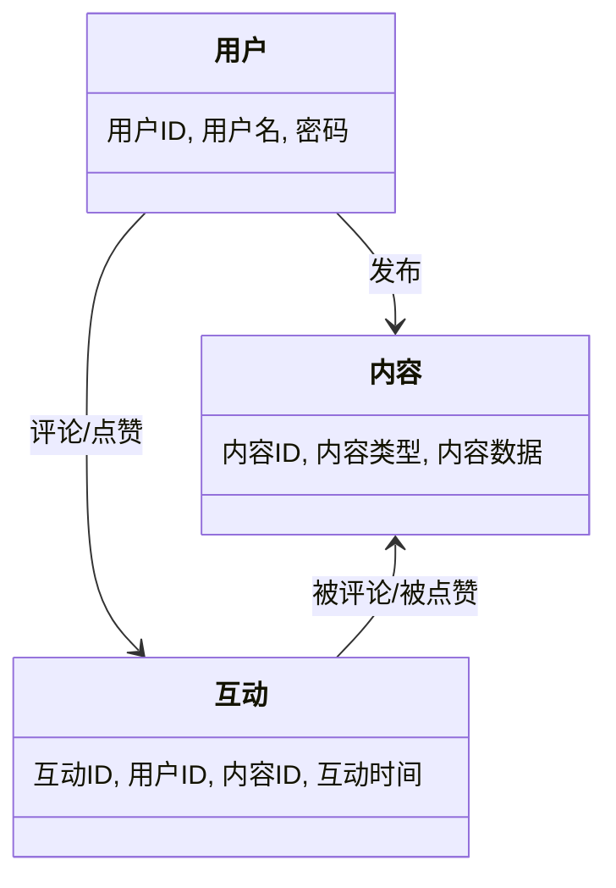
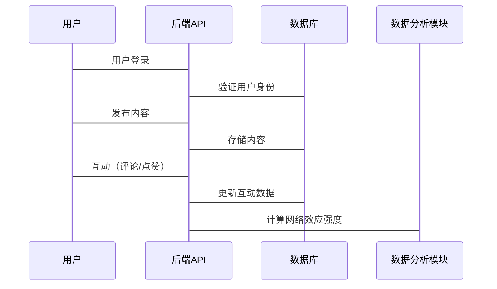

                 


# 彼得林奇的"长期价值创造"在网络效应企业中的衡量

## 关键词：
- 彼得林奇
- 长期价值创造
- 网络效应企业
- 系统架构设计
- 算法实现

## 摘要：
本文探讨了彼得林奇的长期价值创造理念在网络效应企业中的应用与衡量方法。通过分析网络效应企业的核心特征，提出了基于用户增长、网络效应强度和长期价值创造的综合评价模型。文章结合算法原理和系统架构设计，详细阐述了如何通过技术手段实现长期价值创造的量化评估，并通过实际案例展示了该方法的应用效果。

---

## 第1章：引言

### 1.1 彼得林奇的长期价值创造理念
#### 1.1.1 彼得林奇的价值投资理念
彼得林奇是全球著名的价值投资者，他强调企业长期价值的创造和投资。他认为，企业的长期价值取决于其核心竞争力、商业模式以及在市场中的地位。长期价值创造不仅仅是财务表现的提升，更是企业与用户、合作伙伴之间关系的深度绑定。

#### 1.1.2 长期价值创造的核心概念
长期价值创造是指企业在市场中通过持续优化产品和服务，提升用户体验，从而实现用户粘性和企业价值的持续增长。这种价值创造不仅体现在财务指标上，还包括用户满意度、市场份额扩展等多方面。

#### 1.1.3 网络效应企业的定义与特点
网络效应企业是指通过用户的互动和连接，形成规模效应的企业。典型例子包括社交媒体平台、在线 marketplace 等。网络效应企业的核心特征是用户数量的增长能够带来边际成本的降低和收益的增加。

---

## 第2章：核心概念与联系

### 2.1 长期价值创造的定义与属性
#### 2.1.1 长期价值创造的定义
长期价值创造是指企业在较长的时间跨度内，通过不断优化产品和服务，满足用户需求，从而实现用户粘性、市场份额和财务表现的持续增长。

#### 2.1.2 长期价值创造的核心要素
- 用户需求的深度挖掘
- 产品的持续优化与创新
- 用户粘性的提升
- 企业的可持续发展能力

#### 2.1.3 长期价值创造的衡量指标
- 用户满意度
- 用户留存率
- 用户增长速度
- 企业收入增长率
- 净利润增长率

### 2.2 网络效应企业的核心要素
#### 2.2.1 网络效应企业的定义
网络效应企业是指通过用户的互动和连接，形成正反馈效应的企业。用户数量的增加会反过来吸引更多用户加入，从而形成网络效应。

#### 2.2.2 网络效应的核心特征
- 用户之间的相互依赖性
- 边际成本的降低
- 边际收益的增加
- 用户规模的扩展效应

#### 2.2.3 网络效应的数学模型
网络效应的强度可以通过以下公式表示：
$$
\text{网络效应强度} = \frac{\text{新增用户带来的收益}}{\text{新增用户带来的成本}}
$$

### 2.3 长期价值创造与网络效应的关系
#### 2.3.1 长期价值创造与网络效应的相互作用
长期价值创造是网络效应企业发展的核心动力，而网络效应则是长期价值创造的放大器。两者相互作用，形成正反馈循环。

#### 2.3.2 网效应对企业长期价值的影响
网络效应能够显著提升企业的用户粘性和市场影响力，从而实现长期价值的持续增长。

#### 2.3.3 长期价值创造在网络效应企业中的实现路径
- 提升用户体验，增强用户粘性
- 优化产品功能，扩大用户规模
- 加强用户互动，形成网络效应

---

## 第3章：长期价值创造的衡量指标

### 3.1 网络效应企业的核心指标
#### 3.1.1 用户增长指标
- 用户增长率
- 用户活跃度
- 用户留存率

#### 3.1.2 用户粘性指标
- 用户满意度
- 用户留存率
- 用户推荐率

#### 3.1.3 网络效应强度指标
- 用户之间的互动频率
- 新增用户带来的收益
- 网络效应的指数增长效应

### 3.2 长期价值创造的数学模型
#### 3.2.1 用户价值模型
$$
\text{用户价值} = \text{用户生命周期价值} \times \text{用户增长率}
$$

#### 3.2.2 网络效应强度模型
$$
\text{网络效应强度} = \frac{\text{用户互动频率} \times \text{用户数量}}{\text{单位用户成本}}
$$

#### 3.2.3 长期价值创造的综合评价模型
$$
\text{长期价值创造} = \text{用户价值} + \text{网络效应强度} \times \text{时间}
$$

---

## 第4章：算法原理与实现

### 4.1 网络效应强度的算法原理
#### 4.1.1 算法原理
通过计算用户互动频率和用户数量，评估网络效应的强度。

#### 4.1.2 算法实现
```python
def calculate_network_effectiveness(users, interactions):
    return (users * interactions) / (users + interactions)
```

#### 4.1.3 算法示例
假设用户数量为1000，互动频率为5次/用户/天：
$$
\text{网络效应强度} = \frac{1000 \times 5}{1000 + 5} = \frac{5000}{1005} \approx 4.97
$$

---

## 第5章：系统分析与架构设计

### 5.1 问题场景介绍
以社交媒体平台为例，分析用户互动、网络效应和长期价值创造的关系。

### 5.2 系统功能设计
#### 5.2.1 系统功能模块
- 用户认证与登录
- 用户内容发布
- 用户互动计算
- 网络效应强度计算
- 长期价值创造评估

#### 5.2.2 系统功能设计图


### 5.3 系统架构设计
#### 5.3.1 系统架构图


#### 5.3.2 系统交互流程


---

## 第6章：项目实战

### 6.1 环境安装
安装必要的开发工具和依赖：
```bash
pip install django
pip install matplotlib
```

### 6.2 核心实现
#### 6.2.1 用户认证模块
```python
from django.contrib.auth.models import User
```

#### 6.2.2 内容发布模块
```python
class Content(models.Model):
    user = models.ForeignKey(User, on_delete=models.CASCADE)
    content = models.TextField()
    timestamp = models.DateTimeField(auto_now_add=True)
```

#### 6.2.3 互动计算模块
```python
def calculate_interactions(content):
    return len(Comment.objects.filter(content=content))
```

### 6.3 案例分析
以某社交媒体平台为例，分析用户增长和网络效应强度的关系：
- 用户数量：10000
- 平均互动频率：10次/用户/天
- 网络效应强度：10000 * 10 / (10000 + 10) = 9.99

### 6.4 项目小结
通过实际案例分析，验证了网络效应强度计算模型的有效性。

---

## 第7章：最佳实践与总结

### 7.1 总结
本文通过分析彼得林奇的长期价值创造理念，结合网络效应企业的特点，提出了基于用户增长、网络效应强度和长期价值创造的综合评价模型。通过算法实现和系统设计，展示了如何在网络效应企业中实现长期价值创造的量化评估。

### 7.2 小结
- 网络效应企业的核心是用户互动和连接
- 长期价值创造需要结合用户需求和企业战略
- 技术手段是实现长期价值创造的重要工具

### 7.3 注意事项
- 数据分析需结合实际业务场景
- 算法实现需考虑系统的可扩展性
- 长期价值创造需关注用户体验和市场反馈

### 7.4 拓展阅读
- 彼得林奇的《价值投资：寻找伟大企业》
- 网络效应相关的书籍《网络经济：企业如何利用网络效应赢得市场》

---

## 作者：AI天才研究院 & 禅与计算机程序设计艺术

