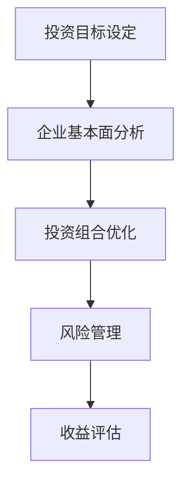
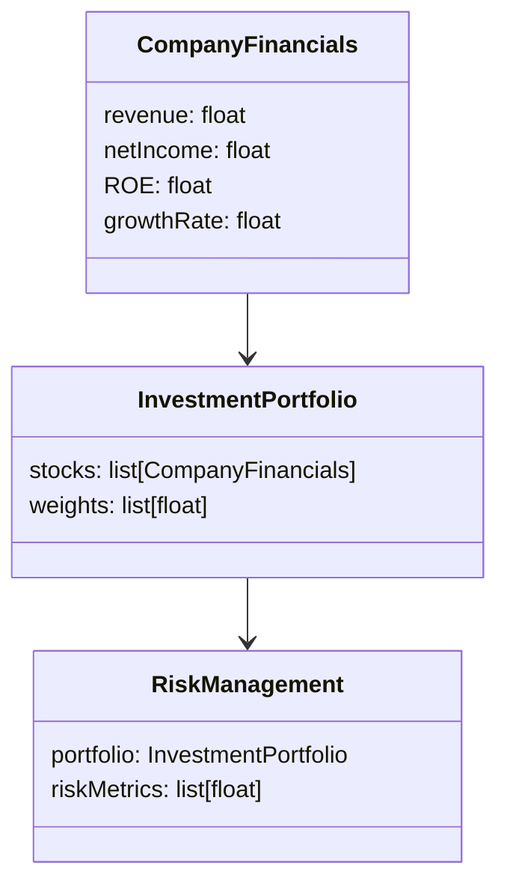
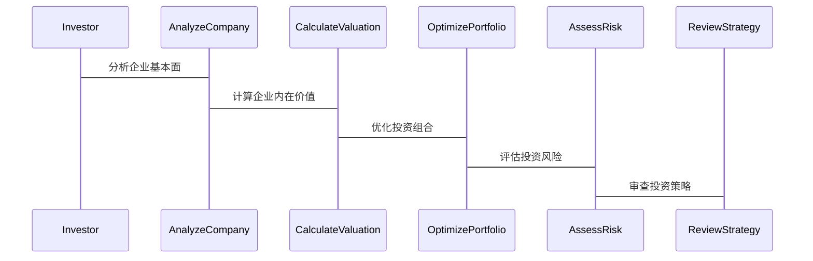
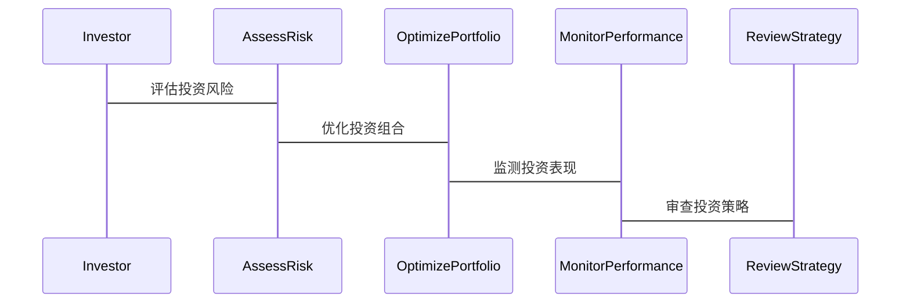

                 


# 彼得林奇的"长期价值创造"投资理念

> 关键词：彼得林奇，长期价值创造，投资理念，价值投资，企业分析

> 摘要：本文深入探讨了彼得林奇的“长期价值创造”投资理念，从其核心概念、选股标准、企业分析方法到实战案例，结合技术语言和系统化思维，全面解析了这一投资理念的内在逻辑和实际应用。通过对企业基本面、管理层能力、行业环境等关键因素的系统分析，揭示了如何通过长期价值创造实现投资收益最大化。

---

## 第一部分: 长期价值创造的核心概念

### 第1章: 彼得林奇的生平与投资理念

#### 1.1 彼得林奇的生平简介
彼得·林奇（Peter Lynch）是美国著名的投资专家，被誉为“共同基金之父”。他从1977年到2000年担任富达麦哲伦基金（Fidelity Magellen Fund）的经理，在他的领导下，该基金年平均回报率达到29%，远超市场平均水平。林奇的投资哲学以“长期价值创造”为核心，强调通过深入研究企业的基本面，选择那些具有持续增长潜力和合理估值的公司进行投资。

#### 1.2 彼得林奇的投资哲学
林奇的投资理念可以总结为以下几点：
1. **价值投资**：寻找那些市场价格低于其内在价值的企业。
2. **长期视角**：关注企业的长期增长潜力，而非短期市场波动。
3. **深入研究**：通过对企业基本面的详细分析，识别具有竞争优势的企业。
4. **分散投资**：通过投资多个行业和企业来分散风险。

#### 1.3 彼得林奇的投资风格与特点
林奇的投资风格以“深度基本面分析”和“长期价值创造”为特点。他强调投资者必须对企业进行深入研究，包括财务状况、管理层能力、行业环境等多个方面。此外，他还注重对企业竞争优势的识别，认为只有具有强大竞争优势的企业才能实现长期价值创造。

---

### 第2章: 长期价值创造的定义与核心要素

#### 2.1 长期价值创造的定义
长期价值创造是指通过投资于那些具有持续增长潜力的企业，使其内在价值随着时间的推移不断增长，从而为投资者带来超额收益。与短期交易不同，长期价值创造注重企业的基本面和长期发展潜力，而非市场的短期波动。

#### 2.2 长期价值创造的核心要素
长期价值创造的核心要素包括：
1. **企业基本面**：企业的财务状况、盈利能力、成长潜力等。
2. **管理层能力**：企业管理层的素质、决策能力和透明度。
3. **行业环境**：行业的生命周期、竞争格局和政策环境。

#### 2.3 长期价值创造与投资的关系
长期价值创造是投资的核心目标。通过投资于具有长期增长潜力的企业，投资者可以在较长的时间内实现资产的增值。与短期交易相比，长期价值创造更能抵御市场的波动，实现稳定的收益。

---

### 第3章: 彼得林奇的长期价值创造理念

#### 3.1 彼得林奇的长期价值投资策略
林奇的投资策略可以总结为以下几点：
1. **寻找低估的企业**：通过对企业基本面的分析，寻找市场价格低于内在价值的企业。
2. **关注企业的竞争优势**：投资于具有强大竞争优势的企业，例如成本优势、技术优势、品牌优势等。
3. **分散投资**：通过投资于多个行业和企业，分散投资风险。

#### 3.2 彼得林奇的选股标准
林奇选股的核心标准是企业是否具有长期增长潜力和合理估值。具体包括以下几个方面：
1. **低市盈率**：企业市盈率低于行业平均水平，表明企业具有一定的估值优势。
2. **高ROE**：企业的净资产收益率（ROE）较高，表明企业具有较强的盈利能力。
3. **稳定的财务状况**：企业的财务状况稳定，无重大财务风险。

---

### 第4章: 长期价值创造的核心要素分析

#### 4.1 企业基本面分析
企业基本面分析是长期价值创造的核心内容之一。主要包括以下几个方面：
1. **财务状况分析**：通过企业的财务报表，分析企业的资产状况、负债状况和盈利能力。
2. **盈利能力分析**：分析企业的净利润率、ROE等指标，评估企业的盈利能力。
3. **成长潜力分析**：分析企业的收入增长率、净利润增长率等指标，评估企业的成长潜力。

#### 4.2 企业管理层分析
企业管理层是企业价值创造的关键因素之一。分析企业管理层的能力和决策风格，可以帮助投资者判断企业未来的发展潜力。具体包括：
1. **管理层的素质与能力**：分析企业管理层的教育背景、行业经验等。
2. **管理层的决策风格**：分析管理层的决策是否稳健、保守或激进。
3. **管理层的透明度**：分析管理层是否透明，是否会及时披露企业信息。

#### 4.3 行业环境分析
行业环境是企业长期发展的重要外部因素。分析行业环境可以帮助投资者判断企业的竞争地位和未来的发展潜力。具体包括：
1. **行业的生命周期**：分析行业所处的生命周期阶段，例如成长期、成熟期或衰退期。
2. **行业的竞争格局**：分析行业内的主要竞争对手，判断企业的竞争优势。
3. **行业的政策环境**：分析行业的政策法规，判断政策对企业的影响。

---

### 第5章: 彼得林奇的选股策略与实战案例

#### 5.1 彼得林奇的选股标准
林奇选股的核心标准是企业是否具有长期增长潜力和合理估值。具体包括以下几个方面：
1. **低市盈率**：企业市盈率低于行业平均水平，表明企业具有一定的估值优势。
2. **高ROE**：企业的净资产收益率（ROE）较高，表明企业具有较强的盈利能力。
3. **稳定的财务状况**：企业的财务状况稳定，无重大财务风险。

#### 5.2 彼得林奇的经典投资案例
1. **可口可乐的投资案例**：
   - 投资背景：可口可乐是一家具有强大品牌优势和市场地位的企业，且财务状况稳定。
   - 投资结果：林奇通过长期持有可口可乐的股票，获得了稳定的收益。
2. **家庭健康公司（HJ Heinz）的投资案例**：
   - 投资背景：HJ Heinz是一家以生产食品为主的公司，具有较强的市场竞争力和稳定的财务状况。
   - 投资结果：林奇通过投资HJ Heinz，获得了较高的收益。

---

### 第6章: 长期价值创造的实现路径

#### 6.1 投资者的心理与行为分析
投资者的心理和行为对投资决策有着重要影响。以下是投资者常见的心理偏差和误区：
1. **过度自信**：投资者往往过于自信，认为自己能够准确预测市场走势。
2. **从众心理**：投资者往往跟随市场的趋势，忽视企业的基本面。
3. **情绪化决策**：投资者往往受情绪影响，做出非理性的投资决策。

#### 6.2 风险管理与长期价值创造
风险管理是实现长期价值创造的重要保障。投资者需要通过以下方式来管理投资风险：
1. **分散投资**：通过投资于多个行业和企业，分散投资风险。
2. **设定止损**：在投资组合中设定止损点，避免亏损过大。
3. **定期调整**：根据市场环境和企业基本面的变化，定期调整投资组合。

---

## 第二部分: 长期价值创造的技术实现与系统分析

### 第7章: 长期价值创造的技术实现

#### 7.1 技术实现的核心概念
长期价值创造的技术实现主要依赖于对企业基本面的深度分析和投资组合的优化管理。以下是技术实现的核心概念：
1. **企业基本面分析**：通过对企业财务报表的分析，评估企业的盈利能力、成长潜力和财务状况。
2. **投资组合管理**：通过优化投资组合，分散投资风险，实现长期收益最大化。

#### 7.2 技术实现的系统架构
以下是长期价值创造技术实现的系统架构：



#### 7.3 技术实现的关键算法
以下是长期价值创造技术实现中的关键算法：

```python
def calculate_valuation(company_financials):
    # 计算企业内在价值
    # company_financials 包含企业的财务数据
    # 使用DCF模型计算企业内在价值
    pass

def optimize_portfolio(stocks, weights):
    # 根据股票和权重，优化投资组合
    # 使用现代投资组合理论，最小化风险或最大化收益
    pass
```

---

### 第8章: 长期价值创造的系统分析

#### 8.1 系统分析的核心问题
长期价值创造的系统分析主要围绕以下几个问题展开：
1. **企业基本面分析**：如何通过财务报表分析企业的盈利能力、成长潜力和财务状况？
2. **投资组合优化**：如何通过优化投资组合，实现收益最大化和风险最小化？
3. **风险管理**：如何通过风险管理，保障投资的长期收益？

#### 8.2 系统分析的架构设计
以下是长期价值创造系统分析的架构设计：



---

## 第三部分: 长期价值创造的实战应用与风险管理

### 第9章: 长期价值创造的实战应用

#### 9.1 实战应用的核心内容
长期价值创造的实战应用主要依赖于对企业基本面的深度分析和投资组合的优化管理。以下是实战应用的核心内容：
1. **企业基本面分析**：通过对企业财务报表的分析，评估企业的盈利能力、成长潜力和财务状况。
2. **投资组合优化**：根据企业的基本面分析结果，优化投资组合，分散投资风险。

#### 9.2 实战应用的案例分析
以下是长期价值创造实战应用的案例分析：



---

### 第10章: 风险管理与长期价值创造

#### 10.1 风险管理的核心内容
风险管理是实现长期价值创造的重要保障。以下是风险管理的核心内容：
1. **分散投资**：通过投资于多个行业和企业，分散投资风险。
2. **设定止损**：在投资组合中设定止损点，避免亏损过大。
3. **定期调整**：根据市场环境和企业基本面的变化，定期调整投资组合。

#### 10.2 风险管理的实战应用
以下是风险管理的实战应用：



---

## 第四部分: 长期价值创造的总结与展望

### 第11章: 长期价值创造的总结

#### 11.1 核心内容回顾
长期价值创造的核心内容包括：
1. **企业基本面分析**：通过对企业财务报表的分析，评估企业的盈利能力、成长潜力和财务状况。
2. **投资组合优化**：根据企业的基本面分析结果，优化投资组合，分散投资风险。
3. **风险管理**：通过分散投资、设定止损和定期调整投资组合，保障投资的长期收益。

#### 11.2 长期价值创造的重要性和意义
长期价值创造是投资的核心目标。通过投资于具有长期增长潜力的企业，投资者可以在较长的时间内实现资产的增值。与短期交易相比，长期价值创造更能抵御市场的波动，实现稳定的收益。

---

### 第12章: 长期价值创造的展望

#### 12.1 长期价值创造的未来趋势
随着市场的不断发展和技术的进步，长期价值创造的未来趋势主要体现在以下几个方面：
1. **技术驱动**：随着人工智能和大数据技术的进步，企业基本面分析和投资组合优化将更加依赖于技术手段。
2. **全球化**：随着全球化的深入，投资者可以投资于全球市场，寻找具有长期增长潜力的企业。
3. **可持续投资**：随着环保和社会责任意识的增强，可持续投资将成为长期价值创造的重要方向。

#### 12.2 长期价值创造的未来挑战
尽管长期价值创造具有广阔的前景，但也面临一些挑战：
1. **技术风险**：随着技术的进步，投资者需要不断学习新的技术手段，以应对市场的变化。
2. **市场波动**：市场的波动性和不确定性将对长期价值创造提出更高的要求。
3. **政策风险**：政策的变化将对企业的长期发展产生重要影响，投资者需要关注政策环境的变化。

---

## 作者：AI天才研究院/AI Genius Institute & 禅与计算机程序设计艺术 /Zen And The Art of Computer Programming

