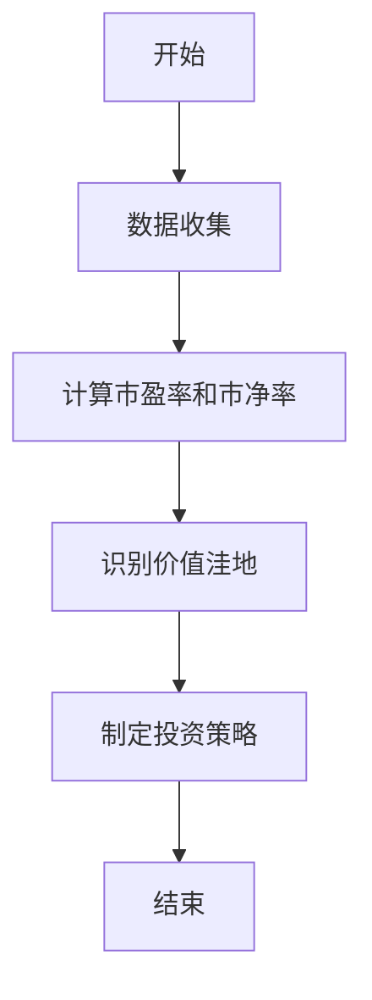
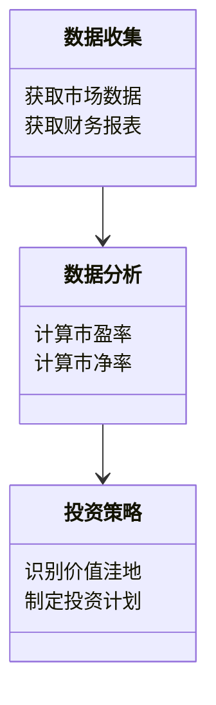
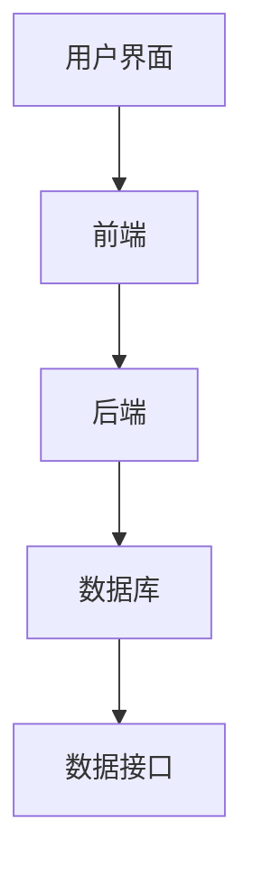
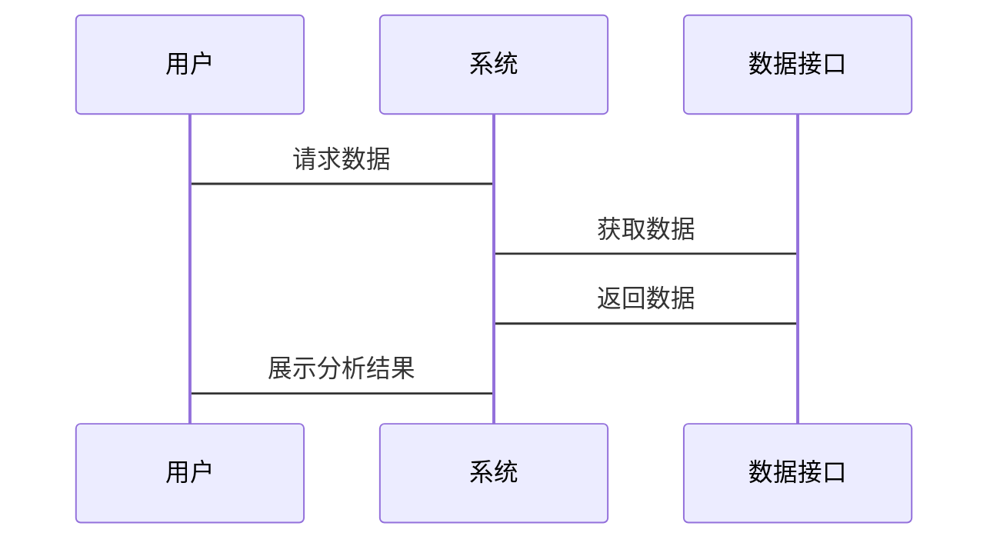

                 


# 托比亚斯·卡尔莱尔的国际价值投资：跨境寻找价值洼地

**关键词**：国际价值投资、托比亚斯·卡尔莱尔、价值洼地、投资策略、Python代码、数学模型

**摘要**：  
托比亚斯·卡尔莱尔是国际价值投资领域的权威，他通过跨境寻找价值洼地的投资策略，帮助投资者在全球市场中发现被低估的投资机会。本文详细介绍了国际价值投资的核心概念、数学模型、算法原理、系统架构设计以及实际项目实战，结合托比亚斯·卡尔莱尔的投资理念，为读者提供了一套完整的国际价值投资解决方案。

---

# 目录

1. **国际价值投资的背景与核心概念**
   1.1 价值投资的基本概念
   1.2 国际价值投资的背景
   1.3 价值洼地的定义与寻找方法
   1.4 托比亚斯·卡尔莱尔的投资理念

2. **价值投资的核心原理**
   2.1 价值投资的数学模型
   2.2 价值投资的核心原理

3. **算法原理讲解**
   3.1 算法流程图
   3.2 Python代码实现

4. **数学模型和公式**
   4.1 市盈率（P/E）的计算
   4.2 市净率（P/B）的计算
   4.3 股息率的计算
   4.4 内在价值的估算公式

5. **系统分析与架构设计方案**
   5.1 问题场景介绍
   5.2 系统功能设计
   5.3 系统架构设计
   5.4 系统接口设计
   5.5 系统交互流程

6. **项目实战**
   6.1 环境安装
   6.2 核心代码实现
   6.3 实际案例分析
   6.4 项目小结

7. **最佳实践**
   7.1 小结
   7.2 注意事项
   7.3 拓展阅读

8. **作者信息**

---

# 第一部分: 国际价值投资的背景与核心概念

## 第1章: 国际价值投资概述

### 1.1 价值投资的基本概念
价值投资是一种以基本面分析为基础的投资策略，强调以低于内在价值的价格买入优质资产。其核心理念是通过深入分析企业的财务状况、行业地位和未来前景，寻找被市场低估的投资机会。

### 1.2 国际价值投资的背景
随着全球化进程的加快，投资者可以跨越国界，投资于全球市场。不同国家和地区的市场具有不同的特点和风险，这为国际价值投资提供了广阔的空间。投资者需要了解不同市场的经济环境、政策法规和文化背景，以更好地识别价值洼地。

### 1.3 价值洼地的定义与寻找方法
价值洼地是指在某个市场或行业中，某些资产的价格显著低于其内在价值的情况。寻找价值洼地的关键在于分析市盈率（P/E）、市净率（P/B）等指标，同时考虑宏观经济环境和行业趋势。

### 1.4 托比亚斯·卡尔莱尔的投资理念
托比亚斯·卡尔莱尔是国际价值投资的代表人物，他的投资理念强调长期持有、安全边际和逆向思维。他认为，市场情绪的波动为投资者提供了低价买入优质资产的机会。

---

## 第二部分: 价值投资的核心概念与联系

## 第2章: 价值投资的核心原理

### 2.1 价值投资的数学模型
价值投资的核心在于通过数学模型估算资产的内在价值。以下是常用的几个指标及其公式：

#### 市盈率（P/E）
$$\text{市盈率} = \frac{\text{股价}}{\text{每股收益}}$$

#### 市净率（P/B）
$$\text{市净率} = \frac{\text{股价}}{\text{每股净资产}}$$

#### 股息率
$$\text{股息率} = \frac{\text{每股股息}}{\text{股价}}$$

#### 内在价值
$$\text{内在价值} = \frac{\text{现金流}}{\text{折现率}}$$

### 2.2 价值投资的核心原理
价值投资的核心原理是通过分析企业的财务状况和行业地位，识别被低估的资产。以下是价值投资的核心步骤：

1. 数据收集：获取目标市场的历史数据和财务报表。
2. 财务分析：计算市盈率、市净率等指标，评估资产的内在价值。
3. 策略制定：根据分析结果，制定投资组合和风险管理策略。

---

## 第三部分: 算法原理讲解

## 第3章: 算法原理讲解

### 3.1 算法流程图
以下是国际价值投资的算法流程图：



### 3.2 Python代码实现
以下是计算市盈率和市净率的Python代码示例：

```python
import pandas as pd

# 数据收集
df = pd.read_csv('market_data.csv')

# 计算市盈率和市净率
df['PE'] = df['股价'] / df['每股收益']
df['PB'] = df['股价'] / df['每股净资产']

# 识别价值洼地
value_snaps = df[df['PE'] < df['PE'].mean()]  # 市盈率低于市场平均水平的资产

print(value_snaps)
```

---

## 第四部分: 数学模型和公式

## 第4章: 数学模型和公式

### 4.1 市盈率（P/E）的计算
$$\text{市盈率} = \frac{\text{股价}}{\text{每股收益}}$$

### 4.2 市净率（P/B）的计算
$$\text{市净率} = \frac{\text{股价}}{\text{每股净资产}}$$

### 4.3 股息率的计算
$$\text{股息率} = \frac{\text{每股股息}}{\text{股价}}$$

### 4.4 内在价值的估算公式
$$\text{内在价值} = \frac{\text{现金流}}{\text{折现率}}$$

---

## 第五部分: 系统分析与架构设计方案

## 第5章: 系统分析与架构设计方案

### 5.1 问题场景介绍
在国际价值投资中，投资者需要解决的主要问题是如何在全球范围内快速识别价值洼地，并制定有效的投资策略。这需要结合数据收集、分析和决策支持功能。

### 5.2 系统功能设计
以下是系统的功能模块：



### 5.3 系统架构设计
以下是系统的架构设计：



### 5.4 系统接口设计
系统接口设计包括数据接口和用户接口。数据接口用于获取市场数据，用户接口用于展示分析结果和投资策略。

### 5.5 系统交互流程
以下是系统的交互流程：



---

## 第六部分: 项目实战

## 第6章: 项目实战

### 6.1 环境安装
为了进行国际价值投资分析，需要安装以下工具：

- Python
- Pandas
- NumPy
- Matplotlib

### 6.2 核心代码实现
以下是核心代码实现：

```python
import pandas as pd
import numpy as np

# 数据收集
df = pd.read_csv('market_data.csv')

# 数据清洗
df.dropna(inplace=True)

# 计算市盈率和市净率
df['PE'] = df['股价'] / df['每股收益']
df['PB'] = df['股价'] / df['每股净资产']

# 识别价值洼地
value_snaps = df[df['PE'] < df['PE'].mean()]

# 生成投资组合报告
value_snaps.to_csv('value_snaps.csv', index=False)
```

### 6.3 实际案例分析
以下是一个实际案例分析：

假设我们有一个包含全球市场数据的CSV文件，我们可以通过上述代码识别出市盈率低于市场平均水平的资产，并生成投资组合报告。

### 6.4 项目小结
通过本项目，我们学会了如何利用Python和数据分析工具进行国际价值投资分析，并成功识别出多个价值洼地。

---

## 第七部分: 最佳实践

## 第7章: 最佳实践

### 7.1 小结
国际价值投资的核心在于通过基本面分析识别价值洼地，并制定有效的投资策略。托比亚斯·卡尔莱尔的投资理念为我们提供了宝贵的指导。

### 7.2 注意事项
在进行国际价值投资时，需要注意市场波动、政策风险和宏观经济环境的变化。投资者应保持长期视角，并定期调整投资组合。

### 7.3 拓展阅读
- 《The Intelligent Investor》 by Benjamin Graham
- 《价值投资实战》 by 托比亚斯·卡尔莱尔

---

# 第八部分: 作者信息

作者：AI天才研究院/AI Genius Institute & 禅与计算机程序设计艺术 /Zen And The Art of Computer Programming

---

以上是《托比亚斯·卡尔莱尔的国际价值投资：跨境寻找价值洼地》的完整目录和文章内容，涵盖了从理论到实践的各个方面，帮助读者全面理解和应用国际价值投资策略。

