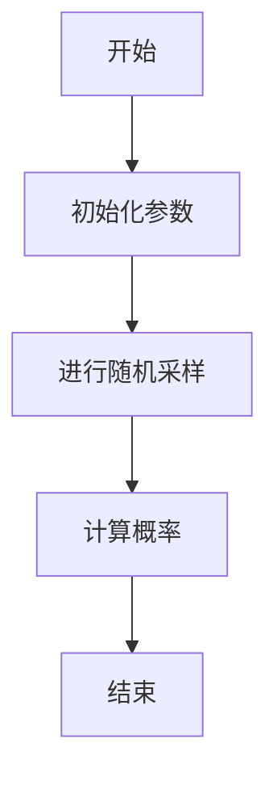
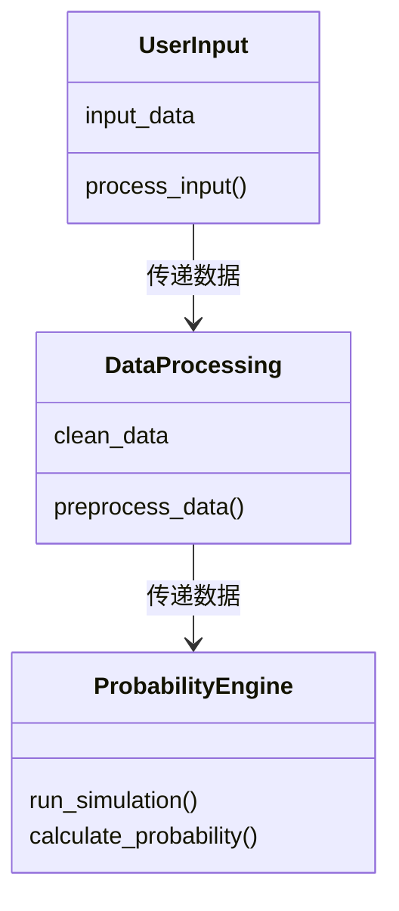

                 


# 智能个人财务目标实现概率计算器

## 关键词：概率计算、财务目标、蒙特卡洛模拟、贝叶斯网络、马尔可夫链、系统架构

## 摘要：
本文详细介绍了一款智能个人财务目标实现概率计算器的设计与实现。通过概率计算的核心算法，如蒙特卡洛模拟和贝叶斯网络，结合系统架构设计，帮助用户评估财务目标的实现概率。文章从背景介绍、核心概念、算法原理、系统架构到项目实战，全面解析了如何构建这样一个智能计算器。

---

### 第一部分: 智能个人财务目标实现概率计算器的背景与核心概念

#### 第1章: 智能个人财务目标实现概率的背景与问题描述

##### 1.1 财务目标与概率计算的背景
###### 1.1.1 个人财务目标的定义与分类
个人财务目标是人们在财务规划中设定的具体目标，通常包括储蓄目标、投资目标、退休计划等。这些目标可以分为短期目标（1-3年）、中期目标（3-5年）和长期目标（5年以上）。

###### 1.1.2 概率计算在财务规划中的作用
概率计算可以帮助个人了解实现财务目标的可能性。例如，通过计算投资组合的预期回报率和风险，可以评估在不同市场条件下实现目标的概率。

###### 1.1.3 当前财务目标实现概率计算的现状与挑战
目前，许多个人和机构使用简单的财务模型来预测目标的实现，但这些模型通常忽略了市场波动、个人支出变化等复杂因素。因此，引入概率计算可以提高预测的准确性。

##### 1.2 问题背景与问题描述
###### 1.2.1 财务目标实现概率计算的核心问题
如何量化财务目标实现的概率？如何将复杂的经济因素纳入计算模型？

###### 1.2.2 问题解决的目标与意义
目标是开发一个智能计算器，帮助用户评估财务目标实现的概率，意义在于提高财务规划的科学性和可操作性。

###### 1.2.3 问题的边界与外延
本计算器主要针对个人用户，不考虑机构或企业的财务规划。模型假设市场条件不变，未来数据基于历史数据分析。

##### 1.3 核心概念与关系
###### 1.3.1 核心概念的定义
- 财务目标：用户设定的财务目标。
- 概率：目标实现的可能性。
- 影响因素：影响目标实现的各种变量，如收入、支出、投资回报率等。

###### 1.3.2 核心概念的属性特征对比表格
| 概念 | 属性 | 描述 |
|------|------|------|
| 财务目标 | 时间范围 | 短期、中期、长期 |
| 概率 | 范围 | 0到1之间 |
| 影响因素 | 类型 | 收入、支出、投资回报率 |

###### 1.3.3 ER实体关系图架构
```mermaid
erDiagram
    user {
        id INT
        financial_goals VARCHAR
        probability DECIMAL
    }
    factors {
        id INT
        factor_name VARCHAR
        value DECIMAL
    }
    user --> factors : 影响因素
```

#### 第2章: 概率计算的核心概念与原理

##### 2.1 概率计算的基本原理
###### 2.1.1 概率的基本概念与性质
概率是衡量某件事情发生的可能性，范围在0到1之间。概率具有可加性和条件性。

###### 2.1.2 概率计算的数学模型
概率模型是描述随机现象的数学工具，常用的模型包括离散型概率分布和连续型概率分布。

###### 2.1.3 概率分布的类型与应用
- 离散型分布：如二项分布，适用于有明确结果的情况。
- 连续型分布：如正态分布，适用于连续变量。

##### 2.2 财务目标实现概率的核心算法
###### 2.2.1 蒙特卡洛模拟算法
蒙特卡洛模拟是一种通过随机采样来估计概率的方法。其步骤如下：


###### 2.2.2 贝叶斯网络算法
贝叶斯网络是一种有向图模型，用于表示变量之间的条件概率关系。其核心公式为：
$$P(A|B) = \frac{P(B|A)P(A)}{P(B)}$$

###### 2.2.3 马尔可夫链模型
马尔可夫链用于描述系统在不同状态之间的转移概率，其状态转移方程为：
$$P(n+1) = P(n) \cdot T$$
其中，T为转移矩阵。

##### 2.3 算法原理的数学模型与公式
###### 2.3.1 蒙特卡洛模拟的数学模型
$$P(X) = \frac{\text{成功次数}}{\text{总试验次数}}$$

###### 2.3.2 贝叶斯网络的公式推导
$$P(A|B) = \frac{P(B|A)P(A)}{P(B)}$$

###### 2.3.3 马尔可夫链的状态转移方程
$$P(n+1) = P(n) \cdot T$$

---

### 第三部分: 系统架构与实现方案

#### 第3章: 系统架构设计

##### 3.1 系统功能模块划分
###### 3.1.1 用户输入模块
用户输入财务目标、收入、支出等信息。

###### 3.1.2 数据处理模块
对输入数据进行清洗和预处理。

###### 3.1.3 概率计算引擎模块
运行蒙特卡洛模拟或贝叶斯网络算法，计算实现概率。

##### 3.2 系统架构的类图设计


##### 3.3 系统交互流程设计
###### 3.3.1 用户输入流程
用户输入财务目标和相关数据。

###### 3.3.2 数据处理流程
对输入数据进行清洗和预处理。

###### 3.3.3 结果输出流程
显示计算结果和实现概率。

#### 第4章: 项目实战与实现

##### 4.1 环境安装与配置
安装Python和相关库（如NumPy、Pandas、Scipy）。

##### 4.2 核心代码实现
###### 4.2.1 输入处理函数
```python
def process_input(user_input):
    # 处理用户输入
    pass
```

###### 4.2.2 概率计算函数
```python
def calculate_probability(data):
    # 运行蒙特卡洛模拟
    pass
```

###### 4.2.3 结果展示函数
```python
def display_result(probability):
    print(f"实现概率为：{probability}%")
```

##### 4.3 代码解读与分析
详细解释每段代码的功能和实现原理。

##### 4.4 实际案例分析
以具体案例为例，展示如何使用计算器评估实现概率。

---

### 第四部分: 最佳实践与注意事项

#### 第5章: 案例分析与经验总结

##### 5.1 典型案例分析
分析一个用户的财务目标实现概率，并解释结果。

##### 5.2 经验总结与改进建议
总结使用中的经验，提出改进建议。

#### 第6章: 注意事项与拓展阅读

##### 6.1 使用中的常见问题与解答
解答用户在使用过程中可能遇到的问题。

##### 6.2 进一步阅读的资料推荐
推荐相关书籍和论文，供深入学习。

##### 6.3 未来研究方向
探讨未来可能的研究方向和技术进步。

---

### 作者：AI天才研究院/AI Genius Institute & 禅与计算机程序设计艺术 /Zen And The Art of Computer Programming

