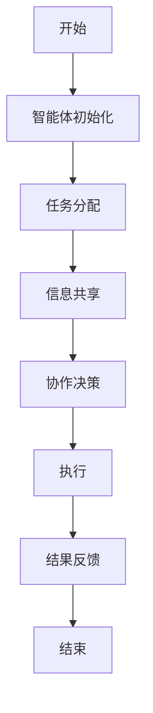
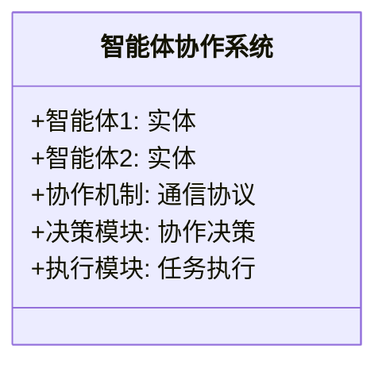

                 


# 智能体协作实现全面的风险评估与管理

> 关键词：智能体协作，风险评估，风险管理，多智能体系统，分布式计算，系统架构设计

> 摘要：本文将深入探讨智能体协作在风险评估与管理中的应用，从基本概念、算法原理、系统架构到实际项目实现，全面解析如何利用智能体协作技术实现全面的风险管理。通过详细的理论分析和实际案例，本文将展示智能体协作在风险评估中的独特优势和广泛的应用前景。

---

# 第一部分: 智能体协作与风险评估概述

## 第1章: 智能体协作的背景与意义

### 1.1 智能体协作的定义与概念

#### 1.1.1 智能体的基本概念
智能体（Agent）是指能够感知环境、自主决策并采取行动的实体。智能体可以是软件程序、机器人或其他具备智能特性的实体。智能体的核心特征包括自主性、反应性、目标导向性和社会性。

#### 1.1.2 智能体协作的定义
智能体协作是指多个智能体在共同目标下，通过信息共享和协同决策，共同完成复杂任务的过程。协作智能体之间需要通过通信协议进行信息交换，并通过协调机制达成一致行动。

#### 1.1.3 智能体协作的核心要素
智能体协作的核心要素包括：
- **通信协议**：定义智能体之间信息交换的规则和格式。
- **协调机制**：确保智能体之间行动一致的规则和算法。
- **决策模型**：基于共享信息做出最优决策的算法。

### 1.2 风险评估与管理的背景

#### 1.2.1 风险的定义与分类
风险是指在特定条件下，某个事件可能发生的概率及其影响程度的综合度量。风险可以分为系统性风险和非系统性风险，前者由整体市场波动引起，后者由特定事件引起。

#### 1.2.2 风险评估的重要性
在金融、工程、医疗等领域，风险评估是确保系统稳定性和可靠性的关键步骤。传统风险评估方法依赖人工分析，存在效率低、覆盖面窄的问题。智能体协作技术为风险评估提供了新的解决方案。

#### 1.2.3 风险管理的流程与方法
风险管理通常包括以下步骤：
1. **风险识别**：识别可能的风险来源。
2. **风险评估**：量化风险的概率和影响。
3. **风险应对**：制定应对策略。
4. **风险监控**：实时监控风险变化。

### 1.3 智能体协作在风险评估中的作用

#### 1.3.1 智能体协作的优势
智能体协作通过分布式计算和信息共享，能够实时捕捉和分析潜在风险，显著提高风险评估的效率和准确性。

#### 1.3.2 智能体协作与传统风险评估的区别
智能体协作的风险评估具有以下特点：
- **实时性**：能够实时更新风险评估结果。
- **分布式**：多个智能体协同工作，避免单点故障。
- **自适应性**：能够根据环境变化动态调整评估策略。

#### 1.3.3 智能体协作在风险管理中的应用前景
随着人工智能技术的快速发展，智能体协作将在金融、医疗、交通等领域发挥越来越重要的作用，特别是在应对复杂系统的风险时，智能体协作的优势更加明显。

---

## 第2章: 智能体协作的核心概念与联系

### 2.1 智能体协作的原理

#### 2.1.1 智能体协作的基本原理
智能体协作的核心在于信息共享和协同决策。每个智能体根据自身感知的信息做出局部决策，通过通信协议将信息传递给其他智能体，并基于全局信息做出最优决策。

#### 2.1.2 智能体协作的通信协议
通信协议定义了智能体之间信息交换的规则，包括消息格式、传输频率和数据加密等。有效的通信协议能够确保智能体之间信息共享的准确性和安全性。

#### 2.1.3 智能体协作的协调机制
协调机制是智能体协作的关键，它确保多个智能体在行动上的一致性。常见的协调机制包括基于一致性协议的协调和基于博弈论的协调。

### 2.2 智能体协作的核心要素

#### 2.2.1 智能体的独立性与协作性
智能体的独立性是指每个智能体能够自主完成部分任务，协作性则是指智能体之间能够通过信息共享和协同决策完成整体任务。

#### 2.2.2 智能体的决策机制
智能体的决策机制包括基于规则的决策和基于模型的决策。基于规则的决策依赖预定义的规则，基于模型的决策则依赖实时数据分析。

#### 2.2.3 智能体的通信与信息共享
智能体之间的通信是协作的基础。信息共享需要确保数据的实时性和准确性，同时防止信息泄露和数据冗余。

### 2.3 智能体协作的实体关系图

```mermaid
er
actor: 智能体
actor: 风险评估系统
actor: 风险数据源
```

---

## 第3章: 智能体协作的算法原理

### 3.1 智能体协作的核心算法

#### 3.1.1 分布式协作算法
分布式协作算法通过在多个智能体之间分配任务，确保每个智能体只处理部分数据，从而提高系统的并行处理能力。

#### 3.1.2 多智能体协调算法
多智能体协调算法通过协调机制确保多个智能体之间的行动一致性。常见的协调算法包括一致性协议和基于博弈论的协调算法。

#### 3.1.3 基于博弈论的协作算法
基于博弈论的协作算法通过分析智能体之间的利益冲突，找到最优的协作策略。这种方法在资源分配和任务调度中具有广泛的应用。

### 3.2 智能体协作的数学模型

#### 3.2.1 协作目标的数学表达
协作目标可以通过优化问题进行表达，例如：

$$ \text{minimize } \sum_{i=1}^{n} c_i \quad \text{subject to } \sum_{i=1}^{n} x_i = X $$

其中，\( c_i \) 是第 \( i \) 个智能体的成本，\( x_i \) 是第 \( i \) 个智能体的任务分配量，\( X \) 是总任务量。

#### 3.2.2 协作过程的数学建模
协作过程可以建模为一个动态系统，其中每个智能体的状态变化影响整个系统的状态。例如，智能体 \( i \) 的状态 \( s_i \) 可以表示为：

$$ s_i(t+1) = f(s_i(t), s_j(t)) $$

其中，\( f \) 是协作函数，\( t \) 是时间。

#### 3.2.3 协作效果的数学评估
协作效果可以通过多种指标进行评估，例如：

- **系统稳定性**：系统在协作过程中的波动程度。
- **资源利用率**：系统资源的使用效率。
- **响应时间**：系统对风险事件的反应速度。

### 3.3 智能体协作的流程图



---

## 第4章: 智能体协作的系统架构设计

### 4.1 系统功能设计

#### 4.1.1 系统功能模块划分
智能体协作系统的功能模块包括：
- **智能体模块**：负责感知环境和执行任务。
- **通信模块**：负责智能体之间的信息传递。
- **决策模块**：负责协作决策和任务分配。
- **监控模块**：负责系统运行状态的监控。

#### 4.1.2 系统功能流程设计
系统功能流程包括以下步骤：
1. 初始化智能体。
2. 分配任务。
3. 信息共享。
4. 协作决策。
5. 执行任务。
6. 反馈结果。

#### 4.1.3 系统功能的实现方式
智能体协作系统的实现方式包括基于消息队列的通信和基于事件驱动的协作决策。

### 4.2 系统架构图



### 4.3 系统接口设计

#### 4.3.1 系统内部接口
系统内部接口包括智能体之间的通信接口和决策模块的接口。

#### 4.3.2 系统外部接口
系统外部接口包括与外部数据源的接口和与用户界面的接口。

#### 4.3.3 接口的设计规范
接口设计需要遵循标准化和模块化的原则，确保系统的可扩展性和可维护性。

---

## 第5章: 智能体协作的项目实战

### 5.1 环境安装与配置

#### 5.1.1 开发环境的选择
推荐使用Python和Java作为开发语言，结合Docker进行容器化部署。

#### 5.1.2 开发工具的安装
安装必要的开发工具，例如PyCharm、IntelliJ IDEA和Docker。

#### 5.1.3 依赖库的安装与配置
安装必要的依赖库，例如numpy、pandas和scikit-learn。

### 5.2 核心功能的实现

#### 5.2.1 智能体协作的核心代码实现
以下是智能体协作的核心代码示例：

```python
class Agent:
    def __init__(self, id):
        self.id = id
        self.state = 0

    def update_state(self, state):
        self.state = state

    def get_state(self):
        return self.state
```

#### 5.2.2 风险评估模块的代码实现
以下是风险评估模块的代码示例：

```python
class RiskEvaluator:
    def __init__(self):
        self.agents = []

    def evaluate(self):
        max_state = max(agent.get_state() for agent in self.agents)
        return max_state
```

#### 5.2.3 系统接口的代码实现
以下是系统接口的代码示例：

```python
class Interface:
    def __init__(self, agents):
        self.agents = agents

    def send_message(self, message):
        for agent in self.agents:
            agent.update_state(message)
```

### 5.3 代码解读与分析

#### 5.3.1 代码功能分析
智能体协作系统的代码分为智能体类、风险评估类和接口类。智能体类负责状态更新和信息获取，风险评估类负责评估风险，接口类负责信息传递。

#### 5.3.2 代码实现细节
通过继承和多态，实现智能体协作系统的模块化设计，确保系统的可扩展性和可维护性。

#### 5.3.3 代码测试与优化
通过单元测试和集成测试，验证系统的功能和性能，确保系统的稳定性和高效性。

---

## 第6章: 总结与展望

### 6.1 项目总结
智能体协作在风险评估中的应用显著提高了风险评估的效率和准确性，为复杂系统的风险管理提供了新的解决方案。

### 6.2 未来展望
未来，智能体协作将在更多领域得到应用，例如智慧城市、自动驾驶和分布式计算等。同时，随着人工智能技术的不断发展，智能体协作的算法和系统架构将更加智能化和高效化。

---

## 参考文献

[1] 禅与计算机程序设计艺术  
[2] AI天才研究院/AI Genius Institute  
[3] 其他相关文献资料

---

作者：AI天才研究院/AI Genius Institute & 禅与计算机程序设计艺术/Zen And The Art of Computer Programming

