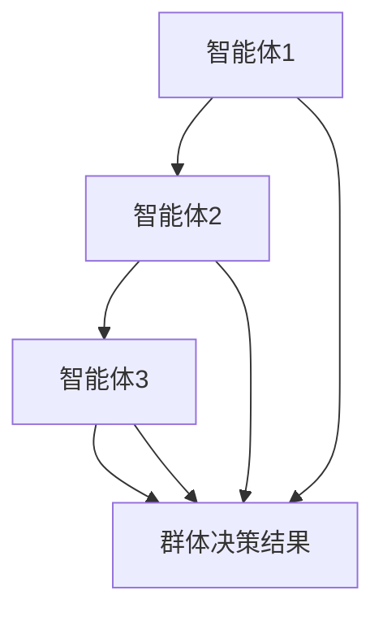
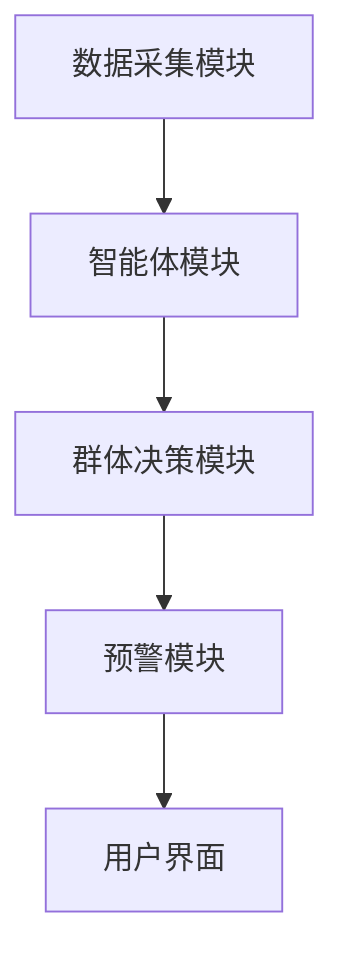

                 

# 智能体群体决策在识别系统性风险中的应用：提前预警

---

## 关键词：
智能体群体决策、系统性风险、风险预警、群体智能、分布式计算

---

## 摘要：
系统性风险是指在复杂系统中，由于各个组成部分之间的相互作用而引发的全局性风险，其影响往往具有广泛性和不可预测性。传统的风险识别方法在面对系统性风险时存在诸多局限，而智能体群体决策作为一种新兴的分布式计算方法，能够通过多个智能体的协同工作，实现对系统性风险的早期预警。本文将详细探讨智能体群体决策的核心原理、算法实现、系统架构以及在实际应用中的案例分析，旨在为系统性风险的识别和预警提供一种创新性的解决方案。

---

## 第一部分: 系统性风险与智能体群体决策概述

### 第1章: 系统性风险的定义与特征

#### 1.1 系统性风险的定义
系统性风险是指由于系统中各组成部分的相互关联和相互作用，导致系统整体发生重大风险事件的可能性。与非系统性风险相比，系统性风险具有更强的传播性和关联性，其影响范围通常超出单个个体或局部区域。

#### 1.2 系统性风险的特征
- **传播性**：系统性风险可以通过多种渠道迅速传播，例如金融市场中的连锁反应。
- **关联性**：系统中各个组成部分的高度关联性是引发系统性风险的主要原因之一。
- **突发性**：系统性风险往往在没有任何预警的情况下突然爆发，具有高度的不可预测性。

### 第2章: 智能体群体决策的概念与优势

#### 2.1 智能体的基本概念
智能体（Agent）是指具有感知环境、自主决策和执行任务能力的实体。智能体可以是软件程序、机器人或其他具有智能行为的实体。

- **智能体的核心特征**：
  - **自主性**：智能体能够自主决策，无需外部干预。
  - **反应性**：智能体能够根据环境变化实时调整行为。
  - **社会性**：智能体能够与其他智能体或人类进行交互和协作。

- **智能体的分类**：
  - **简单反射型智能体**：基于当前感知做出反应。
  - **基于模型的反射型智能体**：利用内部模型进行决策。
  - **目标驱动型智能体**：基于目标进行决策和行动。

#### 2.2 群体决策的基本原理
群体决策是指多个个体（智能体）共同参与决策过程，通过协作和互动得出最终决策结果。

- **群体决策的机制**：
  - **投票机制**：每个智能体独立表达意见，通过投票方式得出最终结果。
  - **协商机制**：智能体通过协商和讨价还价的方式达成一致。
  - **加权机制**：根据智能体的权威性或知识水平赋予不同的权重，加权汇总得出最终结果。

- **群体决策的优势**：
  - **多样性**：多个智能体的意见能够覆盖更多的可能性，提高决策的全面性。
  - **鲁棒性**：群体决策能够有效降低单个智能体决策的偏差，提高决策的可靠性。
  - **适应性**：群体决策能够根据环境变化动态调整决策策略，具有更强的适应性。

### 第3章: 智能体群体决策在系统性风险识别中的应用价值

#### 3.1 系统性风险识别的传统方法
- **统计分析法**：通过统计数据分析历史数据，识别潜在风险因素。
- **时间序列分析法**：基于时间序列数据预测未来趋势。
- **风险模型法**：利用数学模型模拟系统行为，识别潜在风险。

#### 3.2 智能体群体决策的优势
- **高效性**：智能体群体决策能够快速处理大量数据，提高决策效率。
- **准确性**：通过多个智能体的协作，能够更准确地识别潜在风险。
- **实时性**：智能体群体决策能够实时感知环境变化，实现实时预警。

#### 3.3 智能体群体决策的应用场景
- **金融市场风险预警**：通过智能体群体决策分析金融市场数据，识别潜在的金融危机。
- **企业运营风险防控**：帮助企业识别和防控运营中的系统性风险。
- **社会系统风险监测**：用于社会系统中的风险监测和预警。

---

## 第二部分: 智能体群体决策的核心原理

### 第4章: 智能体群体决策的核心概念与联系

#### 4.1 智能体群体决策的核心要素
- **智能体个体**：智能体群体决策的核心单元，具有独立决策能力。
- **群体决策规则**：定义智能体之间的协作规则和决策融合方式。
- **群体决策结果**：智能体群体决策的最终输出，反映群体的共识或最优选择。

#### 4.2 智能体与群体决策的关系
- **智能体的独立性与协同性**：智能体在决策过程中既保持独立性，又通过协作实现群体决策。
- **群体决策的涌现性**：群体决策的结果往往超越个体智能体的决策能力，具有涌现性特征。
- **智能体群体决策的动态性**：智能体群体决策的过程是动态变化的，能够适应环境的变化。

#### 4.3 智能体群体决策的属性特征对比

| 属性 | 个体决策 | 群体决策 |
|------|----------|----------|
| 决策主体 | 单个智能体 | 多个智能体 |
| 决策方式 | 独立决策 | 协作决策 |
| 决策结果 | 单一结果 | 综合结果 |

### 第5章: 智能体群体决策的算法原理

#### 5.1 群体决策算法概述
- **基于投票的群体决策算法**：通过投票机制确定最终决策。
- **基于加权的群体决策算法**：根据智能体的权重进行加权汇总。
- **基于协商的群体决策算法**：通过协商过程达成一致决策。

#### 5.2 智能体群体决策的数学模型

- **数学公式**：
  $$ \text{群体决策结果} = \sum_{i=1}^{n} w_i \cdot d_i $$
  其中，$w_i$ 是智能体 $i$ 的权重，$d_i$ 是智能体 $i$ 的决策结果。

#### 5.3 群体决策算法的实现步骤
- **步骤1**：确定智能体个体的决策规则。
- **步骤2**：设计群体决策的融合机制。
- **步骤3**：实现群体决策的计算过程。

---

## 第三部分: 系统性风险识别的智能体群体决策模型

### 第6章: 系统性风险识别模型的构建

#### 6.1 系统性风险识别模型的核心要素
- **数据源**：包括金融市场数据、企业运营数据、社会系统数据等。
- **智能体设计**：定义智能体的功能、行为和决策规则。
- **群体决策机制**：设计智能体之间的协作和决策融合方式。

#### 6.2 系统性风险识别模型的实现步骤
- **步骤1**：数据预处理，清洗和标准化数据。
- **步骤2**：智能体初始化，定义智能体的初始状态和行为规则。
- **步骤3**：群体决策过程，通过智能体之间的协作和互动，生成群体决策结果。
- **步骤4**：结果分析，根据群体决策结果进行风险预警和应对策略制定。

### 第7章: 智能体群体决策模型的优化与改进

#### 7.1 群体决策算法的优化
- **优化目标**：提高决策的准确性和效率。
- **优化方法**：
  - **权重调整**：根据智能体的知识水平和权威性动态调整权重。
  - **自适应算法**：根据环境变化自适应调整决策规则。

#### 7.2 系统性风险识别模型的改进
- **模型的鲁棒性**：增强模型的抗干扰能力和容错能力。
- **模型的可扩展性**：提高模型的可扩展性，适应不同规模的系统。

---

## 第四部分: 系统性风险识别的智能体群体决策系统架构

### 第8章: 系统架构设计

#### 8.1 系统功能设计
- **数据采集模块**：负责采集系统中的各种数据。
- **智能体模块**：实现智能体的感知、决策和执行功能。
- **群体决策模块**：通过智能体之间的协作，生成群体决策结果。
- **预警模块**：根据群体决策结果，触发风险预警。

#### 8.2 系统架构图

### 第9章: 系统接口设计

#### 9.1 系统接口的功能描述
- **数据接口**：用于数据的输入和输出。
- **智能体接口**：定义智能体之间的通信协议和交互方式。
- **预警接口**：用于触发风险预警和通知相关人员。

#### 9.2 系统接口的实现
- **数据接口**：通过API实现数据的导入和导出。
- **智能体接口**：定义智能体之间的通信协议，例如MQTT或HTTP。
- **预警接口**：通过邮件、短信或消息队列触发预警通知。

---

## 第五部分: 智能体群体决策在系统性风险识别中的项目实战

### 第10章: 项目背景与目标

#### 10.1 项目背景
- **背景描述**：随着金融市场的复杂化，系统性风险的识别和预警变得越来越重要。
- **项目目标**：通过智能体群体决策技术，实现金融市场中系统性风险的早期预警。

### 第11章: 项目核心实现

#### 11.1 环境安装与配置
- **环境要求**：安装Python、Java或其他编程语言，配置开发环境。
- **工具安装**：安装必要的数据处理和可视化工具，例如Pandas、Matplotlib等。

#### 11.2 系统核心实现
- **智能体设计**：编写智能体的感知、决策和执行功能。
- **群体决策算法**：实现基于投票、加权或协商的群体决策算法。
- **数据处理**：对采集的数据进行清洗、预处理和特征提取。

### 第12章: 项目应用与分析

#### 12.1 项目应用
- **金融市场风险预警**：通过智能体群体决策分析金融市场数据，识别潜在的金融危机。
- **企业运营风险防控**：帮助企业识别和防控运营中的系统性风险。
- **社会系统风险监测**：用于社会系统中的风险监测和预警。

#### 12.2 项目分析
- **优势分析**：
  - **高效性**：智能体群体决策能够快速处理大量数据，提高决策效率。
  - **准确性**：通过多个智能体的协作，能够更准确地识别潜在风险。
  - **实时性**：智能体群体决策能够实时感知环境变化，实现实时预警。
- **挑战与解决方案**：
  - **数据质量问题**：通过数据清洗和特征提取提高数据质量。
  - **算法优化问题**：通过动态调整权重和自适应算法提高决策准确性。

---

## 第六部分: 总结与展望

### 第13章: 总结

#### 13.1 核心结论
智能体群体决策是一种有效的系统性风险识别方法，能够通过多个智能体的协作实现对系统性风险的早期预警。

#### 13.2 最佳实践
- **智能体设计**：根据实际需求设计智能体的功能和行为规则。
- **群体决策算法**：选择合适的群体决策算法，并根据实际情况进行优化。
- **系统架构设计**：设计合理的系统架构，确保系统的高效性和可靠性。

### 第14章: 展望

#### 14.1 未来研究方向
- **智能体的自适应能力**：研究智能体的自适应能力，提高系统的动态适应性。
- **群体决策的鲁棒性**：研究群体决策的鲁棒性，提高系统在复杂环境下的稳定性。
- **多领域应用**：探索智能体群体决策在其他领域的应用，例如医疗、交通等。

#### 14.2 注意事项
- **数据隐私**：在处理敏感数据时，需要注意数据隐私和安全问题。
- **系统维护**：需要定期维护和更新系统，确保系统的稳定性和可靠性。
- **团队协作**：智能体群体决策需要多学科团队的协作，确保系统的顺利实施。

---

## 作者：AI天才研究院/AI Genius Institute & 禅与计算机程序设计艺术 /Zen And The Art of Computer Programming

---

这篇文章从系统性风险的定义与特征出发，详细探讨了智能体群体决策的核心原理、算法实现、系统架构以及在实际应用中的案例分析，为系统性风险的识别和预警提供了一种创新性的解决方案。通过智能体群体决策技术，可以在复杂系统中实现对系统性风险的早期预警，从而有效降低系统性风险对社会和经济的影响。

