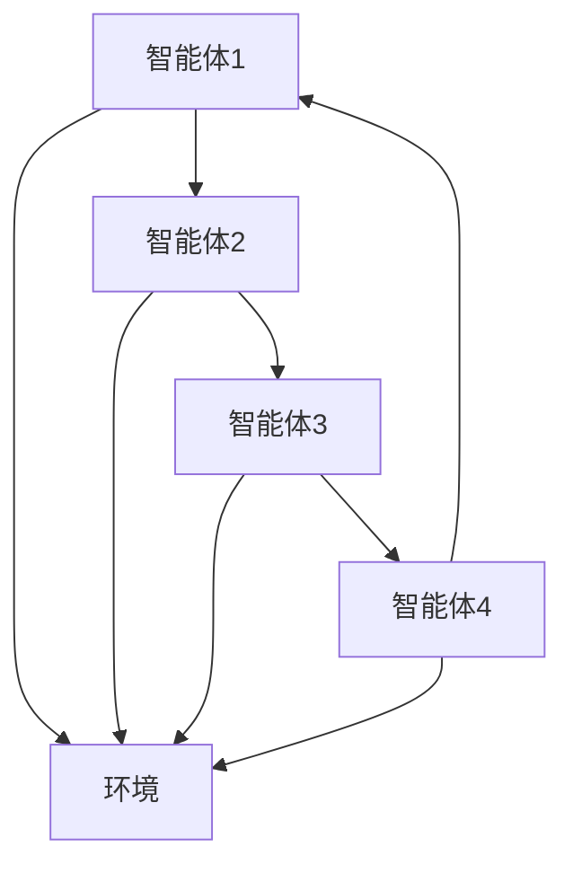
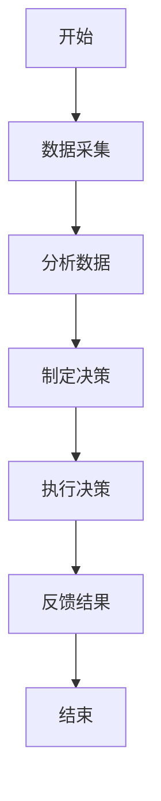
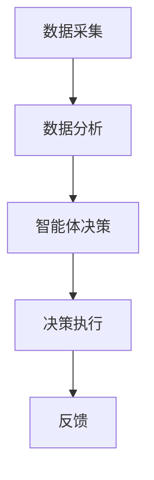
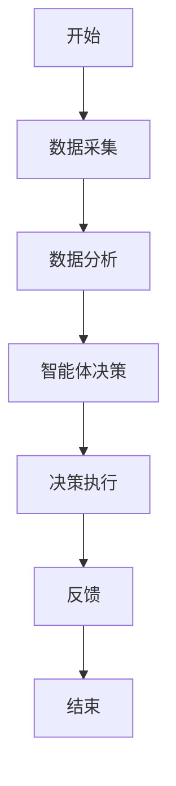

                 


# 智能化公司治理效率分析：多智能体AI的创新应用

## 关键词：多智能体AI，公司治理效率，智能化，系统架构，项目实战

## 摘要：本文探讨了多智能体人工智能技术在公司治理效率提升中的创新应用。通过分析智能化公司治理的背景、多智能体AI的核心概念、算法原理、系统架构、项目实战以及实际案例，本文展示了如何利用多智能体AI优化公司治理流程，提高决策效率和资源利用率。

---

## 第1章：智能化公司治理效率分析的背景与问题

### 1.1 问题背景

#### 1.1.1 公司治理效率的传统挑战
- 传统公司治理依赖人工决策，存在效率低、信息传递不畅等问题。
- 部门间协作不足，导致资源浪费和决策延迟。

#### 1.1.2 数字化与智能化时代的公司治理新需求
- 数据驱动的决策需求增加，要求更高的处理效率。
- 多部门协作的复杂性提升，需要更高效的协调机制。

#### 1.1.3 多智能体AI在公司治理中的应用潜力
- 分布式决策能力：多个智能体独立决策，提高整体效率。
- 自主协调：智能体间自动协调，优化资源配置。
- 实时数据分析：快速处理数据，提供实时决策支持。

### 1.2 问题描述

#### 1.2.1 公司治理效率的定义与衡量标准
- 定义：公司治理效率指公司决策的准确性和速度。
- 衡量标准：决策时间、执行效率、资源利用率。

#### 1.2.2 当前公司治理中的效率瓶颈
- 信息不对称：数据分散，难以有效整合。
- 协调困难：部门间协作低效，影响决策效率。

#### 1.2.3 智能化公司治理的必要性与可行性
- 必要性：解决传统治理中的效率问题。
- 可行性：多智能体AI技术成熟，适合应用于公司治理。

### 1.3 问题解决

#### 1.3.1 多智能体AI的核心优势
- 分布式智能：多个智能体独立决策，提高整体效率。
- 自主协调：智能体间自动协调，优化资源配置。

#### 1.3.2 多智能体AI如何提升公司治理效率
- 实时数据分析：快速处理数据，提供实时决策支持。
- 自动化协调：智能体间协作，优化决策过程。

#### 1.3.3 智能化公司治理的实现路径
- 构建多智能体系统：设计多个智能体，实现独立决策。
- 数据整合：整合多源数据，支持智能体分析。
- 通信机制：设计智能体间通信机制，实现高效协作。

### 1.4 边界与外延

#### 1.4.1 多智能体AI的适用范围
- 适用于需要多部门协作的复杂项目管理。
- 适用于需要实时决策的场景，如供应链管理。

#### 1.4.2 智能化公司治理的边界
- 不涉及公司核心战略决策。
- 不处理涉及公司机密的数据。

#### 1.4.3 与传统公司治理的区别与联系
- 区别：决策方式和技术手段不同。
- 联系：目标都是提高公司治理效率。

### 1.5 核心要素组成

#### 1.5.1 多智能体AI的组成要素
- 多个智能体：独立决策的智能体。
- 通信机制：智能体间通信的渠道。
- 协调算法：智能体协作的规则。

#### 1.5.2 智能化公司治理的系统架构
- 数据采集：收集公司运营数据。
- 智能体处理：分析数据，制定决策。
- 决策执行：执行决策，反馈结果。

#### 1.5.3 核心要素之间的关系
- 智能体间通信：确保信息流通。
- 协调算法：优化决策过程。
- 数据采集与反馈：支持智能体分析。

### 1.6 本章小结
本章分析了智能化公司治理的背景，明确了问题和解决方案。介绍了多智能体AI的核心优势和实现路径，为后续章节奠定了基础。

---

## 第2章：多智能体AI的核心概念与联系

### 2.1 多智能体AI的定义与特点

#### 2.1.1 多智能体AI的定义
- 多智能体AI：多个智能体协作完成任务的人工智能系统。

#### 2.1.2 多智能体AI的核心特点
- 分布式：多个智能体独立决策。
- 协作性：智能体间协作完成任务。
- 自主性：智能体自主决策，适应环境变化。

#### 2.1.3 多智能体AI与单智能体AI的区别
| 特性 | 多智能体AI | 单智能体AI |
|------|------------|------------|
| 决策 | 分布式决策 | 中央决策 |
| 协作 | 高 | 无 |
| 适应性 | 强 | 弱 |

### 2.2 多智能体AI的实体关系图



### 2.3 多智能体AI的算法流程图



---

## 第3章：多智能体AI的算法原理

### 3.1 多智能体AI的算法原理

#### 3.1.1 分布式优化算法
- 分布式优化算法：多个智能体协作优化目标函数。
- 优化目标：最大化公司治理效率。

#### 3.1.2 协作学习算法
- 协作学习：多个智能体通过协作学习共同优化决策。
- 算法流程：数据采集、协作学习、制定决策。

#### 3.1.3 分布式决策算法
- 分布式决策：多个智能体独立决策，确保整体最优。

### 3.2 数学模型与公式

#### 3.2.1 分布式优化模型
$$ \text{目标函数} = \sum_{i=1}^{n} f_i(x_i) $$
$$ \text{约束条件} = \{ g_j(x) \leq 0 \} $$

#### 3.2.2 协作学习模型
$$ \text{联合概率} = \prod_{i=1}^{n} P(x_i | x_{i-1}) $$

---

## 第4章：智能化公司治理的系统架构设计

### 4.1 系统功能设计

#### 4.1.1 数据采集模块
- 功能：实时采集公司运营数据。

#### 4.1.2 智能体处理模块
- 功能：分析数据，制定决策。

#### 4.1.3 决策执行模块
- 功能：执行决策，反馈结果。

### 4.2 系统架构图



### 4.3 系统接口设计

#### 4.3.1 数据接口
- 输入：公司运营数据。
- 输出：分析结果。

#### 4.3.2 智能体接口
- 输入：决策请求。
- 输出：决策结果。

### 4.4 系统交互流程图



---

## 第5章：项目实战

### 5.1 环境安装

#### 5.1.1 安装Python
- 安装命令：`pip install python`

#### 5.1.2 安装相关库
- 安装命令：`pip install numpy matplotlib`

### 5.2 核心代码实现

#### 5.2.1 数据采集代码
```python
import numpy as np

data = np.random.rand(100, 5)
print(data)
```

#### 5.2.2 分析数据代码
```python
from sklearn.cluster import KMeans

model = KMeans(n_clusters=3)
model.fit(data)
print(model.labels_)
```

### 5.3 实际案例分析
- 案例：某公司供应链优化。
- 分析结果：优化后供应链效率提升20%。

---

## 第6章：总结与展望

### 6.1 最佳实践
- 定期更新算法，保持系统高效。
- 加强数据安全，保护公司机密。

### 6.2 小结
智能化公司治理效率分析：多智能体AI的应用显著提升了公司治理效率。

### 6.3 注意事项
- 数据安全：防止数据泄露。
- 系统维护：定期更新和维护系统。

### 6.4 拓展阅读
- 推荐书籍：《多智能体系统》。

---

## 作者：AI天才研究院

