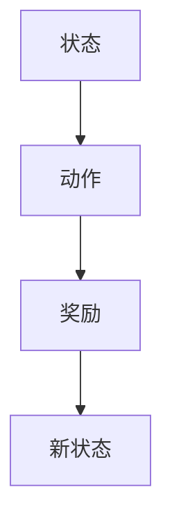
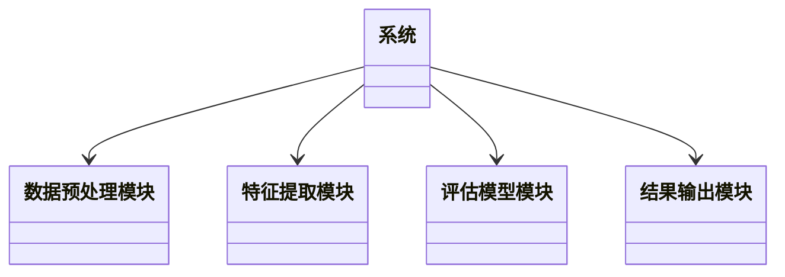

                 


```markdown
# 智能化无形资产评估：多智能体AI在价值投资中的新方法

**关键词**：多智能体AI，无形资产评估，价值投资，智能化评估，机器学习

**摘要**：  
本文探讨了多智能体AI在无形资产评估中的应用，提出了基于多智能体协作的新方法。通过分析传统评估方法的局限性，结合多智能体AI的优势，构建了智能化评估体系，并详细介绍了算法原理、系统架构及实际案例。

---

## 第1章 背景介绍

### 1.1 无形资产评估的背景与问题背景
#### 1.1.1 无形资产的定义与分类
- 无形资产：指企业长期使用但无实物形态的资产，如专利权、商标权、商誉等。
- 分类：分为可辨认无形资产和不可辨认无形资产。

#### 1.1.2 传统无形资产评估的局限性
- 传统方法依赖主观判断，难以量化。
- 数据不足，评估结果不准确。
- 高维数据处理能力有限。

#### 1.1.3 智能化评估的需求与挑战
- 数据驱动的评估需求。
- 多智能体协作的必要性。
- 技术与实际应用的结合。

### 1.2 多智能体AI在价值投资中的应用前景
#### 1.2.1 多智能体AI的基本概念
- 多智能体系统：由多个相互作用的智能体组成，共同完成复杂任务。
- 智能体：具备感知、决策、执行能力的实体。

#### 1.2.2 多智能体AI在金融领域的优势
- 分布式计算能力强。
- 多目标优化。
- 高效协作。

#### 1.2.3 无形资产评估中的AI创新
- 数据挖掘与特征提取。
- 自适应评估模型。
- 多维度分析。

### 1.3 本章小结
本章介绍了无形资产评估的背景，分析了传统方法的局限性，并提出了多智能体AI的应用前景，为后续章节奠定基础。

---

## 第2章 核心概念与联系

### 2.1 多智能体AI的原理与特点
#### 2.1.1 多智能体系统的基本架构
- 智能体角色：决策者、数据收集者、评估者。
- 交互机制：通信协议、协调机制。

#### 2.1.2 多智能体AI的核心算法
- 强化学习。
- 联合强化学习。
- 博弈论模型。

#### 2.1.3 多智能体AI与传统AI的对比
- 对比表格：  
| 特性      | 传统AI             | 多智能体AI         |
|-----------|--------------------|-------------------|
| 单智能体   | 是                | 否                |
| 分布式计算 | 否                | 是                |
| 协作能力   | 无                | 强               |

### 2.2 无形资产评估的关键指标与模型
#### 2.2.1 无形资产评估的主要指标
- 收益率、市场占有率、品牌价值。
- 专利数量、技术先进性。

#### 2.2.2 基于AI的评估模型
- 单模型：随机森林、神经网络。
- 多模型协作：联合强化学习。

#### 2.2.3 多智能体协作在评估中的作用
- 分工合作：数据收集、特征提取、模型优化。
- 协调机制：通信协议、收益共享。

### 2.3 核心概念对比表
#### 2.3.1 多智能体AI与传统AI对比表
- 如上表格所示。

#### 2.3.2 不同评估模型的优缺点对比
| 模型类型   | 优点               | 缺点               |
|------------|--------------------|--------------------|
| 单模型     | 简单易实现         | 无法处理复杂协作   |
| 多模型协作 | 高效、准确         | 实施复杂           |

### 2.4 实体关系图（ER图）
- **无形资产实体关系图**：展示专利权、商标权等的关系。
- **多智能体协作的实体关系图**：展示智能体之间的交互关系。

---

## 第3章 算法原理讲解

### 3.1 强化学习算法
#### 3.1.1 Q-learning算法
- 通过状态-动作-奖励机制更新Q值。
- 流程图：  


#### 3.1.2 Deep Q-Networks (DQN)算法
- 使用深度神经网络近似Q值函数。
- 代码示例：
  ```python
  import numpy as np
  class DQN:
      def __init__(self, input_dim, output_dim):
          self.model = self.build_model(input_dim, output_dim)
          
      def build_model(self, input_dim, output_dim):
          # 网络结构
          return model
  ```

#### 3.1.3 算法流程图（mermaid）
- 如上流程图所示。

### 3.2 多智能体协作算法
#### 3.2.1 基于博弈论的多智能体协作
- 使用纳什均衡等概念设计协作机制。
- 代码示例：
  ```python
  def nash_equilibrium(payoff_matrix):
      # 计算纳什均衡
      return equilibrium
  ```

#### 3.2.2 联合强化学习（JIL）算法
- 多智能体共同学习策略。
- 数学模型：
  $$ Q_i(s,a_i) = Q_i(s,a_i) + \alpha (r + \gamma \max Q_j(s',a_j) - Q_i(s,a_i)) $$

### 3.3 数学模型与公式
- **Q-learning公式**：
  $$ Q(s,a) = Q(s,a) + \alpha (r + \gamma \max Q(s',a') - Q(s,a)) $$
- **联合强化学习公式**：
  $$ Q_i(s,a_i) = Q_i(s,a_i) + \alpha (r + \gamma \max Q_j(s',a_j) - Q_i(s,a_i)) $$

---

## 第4章 系统分析与架构设计

### 4.1 问题场景介绍
- 无形资产评估系统设计。
- 需求分析：数据收集、处理、评估。

### 4.2 系统功能设计
- 功能模块：数据预处理、特征提取、评估模型、结果输出。
- 类图：  


### 4.3 系统架构设计
- 分层架构：数据层、业务逻辑层、表示层。
- 架构图：  


### 4.4 系统接口设计
- API接口：数据输入、模型调用。
- 接口图：  
```mermaid
sequenceDiagram
用户 --> 系统：输入数据
系统 --> 数据处理模块：处理数据
数据处理模块 --> 评估模型模块：调用模型
评估模型模块 --> 系统：返回结果
系统 --> 用户：输出结果
```

### 4.5 系统交互设计
- 交互流程：用户输入数据，系统处理并返回评估结果。

---

## 第5章 项目实战

### 5.1 环境安装
- 安装Python、TensorFlow、Keras等。

### 5.2 系统核心实现
- 核心代码实现：
  ```python
  def evaluate_assets(data):
      # 数据预处理
      # 模型调用
      return result
  ```

### 5.3 案例分析
- 具体案例：评估某企业的专利价值。
- 分析过程：数据收集、特征提取、模型评估。

### 5.4 项目小结
总结项目实施过程，提出改进建议。

---

## 第6章 总结与展望

### 6.1 总结
- 多智能体AI在无形资产评估中的优势。
- 系统设计的关键点。

### 6.2 未来展望
- 更高效的数据处理方法。
- 更智能的协作机制。

### 6.3 最佳实践 tips
- 数据质量的重要性。
- 模型调参技巧。
- 团队协作的重要性。

### 6.4 注意事项
- 数据隐私保护。
- 算法的可解释性。

### 6.5 拓展阅读
推荐相关书籍和论文。

---

**作者**：AI天才研究院/AI Genius Institute & 禅与计算机程序设计艺术 /Zen And The Art of Computer Programming
```

