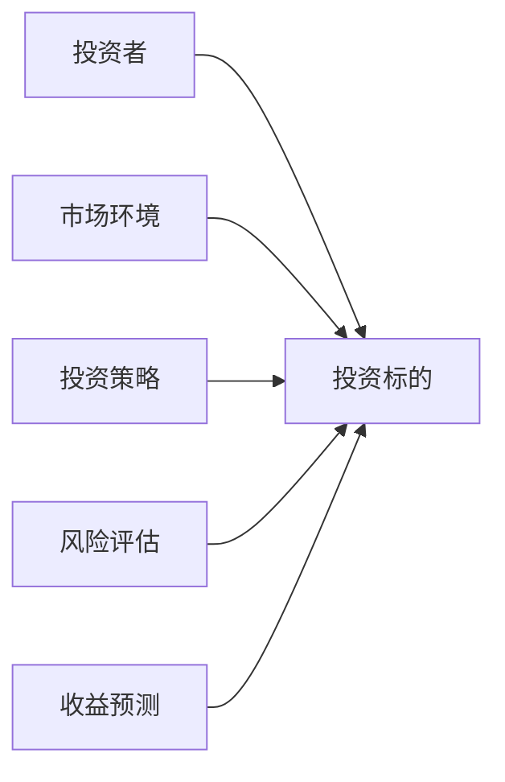
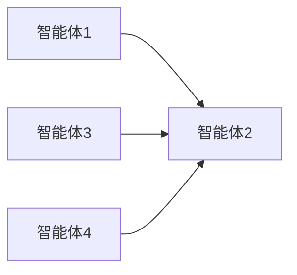
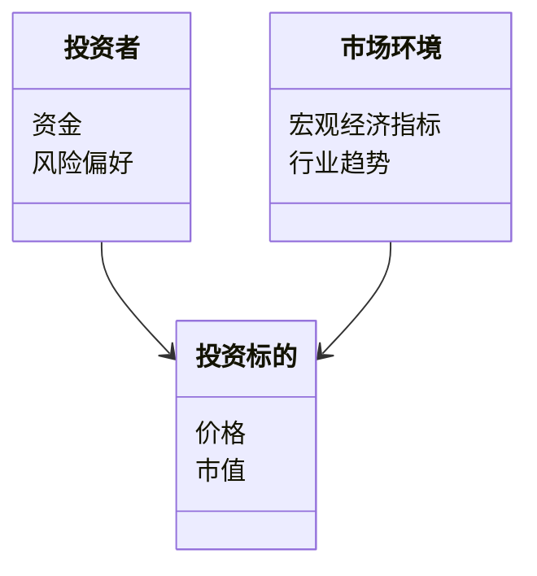

                 


# 智能化行业转型机会识别：多智能体AI在价值投资中的新方法

> **关键词**：智能化转型，多智能体AI，价值投资，人工智能，系统架构

> **摘要**：随着人工智能技术的快速发展，多智能体AI在价值投资中的应用为行业转型带来了新的机会。本文系统地探讨了多智能体AI的核心概念、算法原理、系统架构及其在价值投资中的实际应用，通过案例分析和项目实战，展示了如何利用多智能体AI技术提升投资决策的智能化水平。

---

## 第一章: 智能化行业转型的背景与挑战

### 1.1 问题背景

#### 1.1.1 传统行业面临的数字化转型压力
随着全球经济的快速发展，传统行业正面临着前所未有的挑战。数字化转型已成为企业生存和发展的必然选择。然而，传统行业的经营模式和决策方式往往依赖于经验和人工判断，难以适应市场变化和竞争压力。

#### 1.1.2 智能化转型的核心驱动力
智能化转型的核心驱动力在于技术的进步，尤其是人工智能、大数据和云计算等技术的快速发展。这些技术为企业提供了更高效、更精准的决策支持工具，能够帮助企业在复杂多变的市场环境中捕捉机会，规避风险。

#### 1.1.3 价值投资在行业转型中的关键作用
价值投资作为一种重要的投资策略，其核心在于通过深入分析企业的基本面，寻找具有长期增长潜力的投资标的。在智能化转型的背景下，价值投资需要借助多智能体AI技术，以实现更精准的市场分析和投资决策。

### 1.2 问题描述

#### 1.2.1 行业转型中的痛点分析
传统行业在转型过程中面临诸多痛点，包括信息不对称、决策效率低下、市场风险难以量化等。这些问题严重制约了企业的市场竞争力和盈利能力。

#### 1.2.2 传统价值投资的局限性
传统价值投资方法主要依赖人工分析，存在主观性强、效率低、覆盖面窄等局限性。在市场环境日益复杂化的今天，传统方法难以满足投资者对实时、精准决策的需求。

#### 1.2.3 智能化转型中的机会识别
智能化转型为价值投资带来了新的机会。通过多智能体AI技术，投资者可以更全面地分析市场信息，识别潜在的投资机会，从而在竞争中占据优势。

### 1.3 问题解决与边界

#### 1.3.1 多智能体AI的引入
多智能体AI通过分布式计算和协作学习，能够更高效地处理复杂问题。将其引入价值投资领域，可以显著提升投资决策的智能化水平。

#### 1.3.2 多智能体AI的核心解决思路
多智能体AI的核心解决思路包括分布式计算、协作学习和自适应优化。通过这些方法，多智能体AI能够实时分析市场动态，优化投资组合，降低投资风险。

#### 1.3.3 解决方案的边界与外延
多智能体AI解决方案的边界在于其应用场景和数据范围。外延则包括与区块链、大数据等其他技术的结合，进一步拓展其应用潜力。

### 1.4 多智能体AI的概念结构

#### 1.4.1 多智能体AI的定义
多智能体AI是由多个智能体组成的系统，每个智能体负责特定任务，通过协作完成复杂问题的解决。

#### 1.4.2 多智能体AI的核心要素
多智能体AI的核心要素包括智能体、通信机制、协作规则和决策模型。

#### 1.4.3 多智能体AI的系统架构
多智能体AI的系统架构包括感知层、决策层和执行层。感知层负责数据采集，决策层负责策略制定，执行层负责具体操作。

---

## 第二章: 多智能体AI的核心概念与联系

### 2.1 多智能体AI的定义与特点

#### 2.1.1 多智能体AI的定义
多智能体AI是一种由多个智能体组成的系统，通过协作完成复杂任务。

#### 2.1.2 多智能体AI的核心特点
- 分布式计算
- 协作与竞争
- 自适应与学习

### 2.2 多智能体AI的实体关系图



### 2.3 多智能体AI的核心原理

#### 2.3.1 分布式智能
多智能体AI通过分布式计算，能够同时处理大量数据，提高决策效率。

#### 2.3.2 协作与竞争
智能体之间的协作与竞争能够促进系统优化，提高决策的准确性。

#### 2.3.3 自适应与学习
多智能体AI能够通过机器学习技术，不断优化自身的决策模型。

### 2.4 本章小结

---

## 第三章: 多智能体AI的算法原理

### 3.1 算法原理概述

#### 3.1.1 多智能体系统的基本结构
多智能体系统的基本结构包括感知、决策和执行三个部分。

#### 3.1.2 多智能体协作的机制
多智能体协作机制包括通信、协商和协调三个步骤。

#### 3.1.3 多智能体决策的数学模型
多智能体决策的数学模型包括状态表示、动作选择和奖励函数。

### 3.2 多智能体协作算法



#### 3.2.1 基于强化学习的协作
基于强化学习的协作算法通过智能体之间的互动，优化决策策略。

#### 3.2.2 基于博弈论的协作
基于博弈论的协作算法通过分析智能体之间的博弈关系，找到最优解。

#### 3.2.3 基于分布式计算的协作
基于分布式计算的协作算法通过并行计算，提高系统的处理能力。

### 3.3 算法实现

#### 3.3.1 Python实现

```python
class Agent:
    def __init__(self, state_space, action_space):
        self.state_space = state_space
        self.action_space = action_space
        self.q_table = np.zeros((state_space, action_space))
        
    def take_action(self, state):
        return np.argmax(self.q_table[state])
```

### 3.4 本章小结

---

## 第四章: 多智能体AI的数学模型

### 4.1 数学模型概述

#### 4.1.1 状态空间的表示
状态空间的表示包括连续和离散两种形式。

#### 4.1.2 动作空间的表示
动作空间的表示包括离散和连续两种形式。

#### 4.1.3 奖励函数的定义
奖励函数的定义是衡量智能体行为优劣的关键。

### 4.2 数学模型的详细推导

#### 4.2.1 状态转移方程
$$ P(s' | s, a) = \text{概率在状态 } s \text{ 下采取动作 } a \text{ 后转移到状态 } s' $$

#### 4.2.2 奖励函数
$$ R(s, a) = \text{在状态 } s \text{ 下采取动作 } a \text{ 所获得的奖励} $$

### 4.3 本章小结

---

## 第五章: 多智能体AI的系统架构设计

### 5.1 问题场景介绍

#### 5.1.1 投资决策的复杂性
投资决策涉及多种因素，包括市场波动、企业基本面等。

#### 5.1.2 系统设计的挑战
系统设计需要考虑数据采集、处理、分析和决策等多个环节。

### 5.2 系统功能设计

#### 5.2.1 领域模型


### 5.3 系统架构设计

#### 5.3.1 分层架构
系统架构分为感知层、决策层和执行层。

#### 5.3.2 组件设计
组件设计包括数据采集、数据处理、决策引擎和执行模块。

### 5.4 本章小结

---

## 第六章: 项目实战

### 6.1 环境安装

#### 6.1.1 安装Python
```bash
pip install python
```

#### 6.1.2 安装机器学习库
```bash
pip install scikit-learn
```

### 6.2 核心代码实现

#### 6.2.1 多智能体协作算法实现
```python
import numpy as np

class Agent:
    def __init__(self, state_space, action_space):
        self.state_space = state_space
        self.action_space = action_space
        self.q_table = np.zeros((state_space, action_space))
        
    def take_action(self, state):
        return np.argmax(self.q_table[state])
```

### 6.3 案例分析与解读

#### 6.3.1 案例分析
分析一个具体的案例，展示多智能体AI在价值投资中的应用。

#### 6.3.2 实际效果与优化
讨论系统的实际效果，并提出优化建议。

### 6.4 项目小结

---

## 第七章: 总结与展望

### 7.1 本章小结

#### 7.1.1 多智能体AI的核心价值
多智能体AI能够显著提升投资决策的智能化水平。

#### 7.1.2 项目成果与经验
通过项目实战，我们验证了多智能体AI在价值投资中的应用潜力。

### 7.2 注意事项

#### 7.2.1 数据质量的重要性
数据质量是系统性能的基础，必须予以高度重视。

#### 7.2.2 系统维护与更新
系统需要定期维护和更新，以适应市场环境的变化。

### 7.3 拓展阅读

#### 7.3.1 相关技术
推荐一些相关的技术书籍和论文。

#### 7.3.2 实战项目
推荐一些实战项目，供读者深入学习。

---

## 作者信息

**作者：AI天才研究院/AI Genius Institute & 禅与计算机程序设计艺术 /Zen And The Art of Computer Programming**

---

# 结语

通过本文的系统阐述，我们深入探讨了多智能体AI在价值投资中的应用，展示了其在智能化行业转型中的巨大潜力。希望本文能够为相关领域的研究和实践提供有价值的参考和启发。

