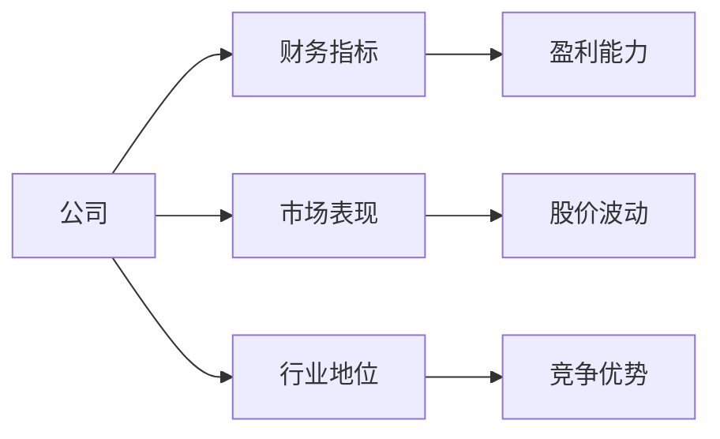

                 


# 智能系统辅助识别隐藏冠军股

**关键词**：隐藏冠军股、智能系统、大数据分析、机器学习、股票投资、金融技术

**摘要**：本文详细探讨了如何利用智能系统辅助识别隐藏冠军股。通过结合大数据分析和机器学习技术，我们提出了一种有效的方法来识别那些在特定领域表现优异但尚未被广泛认知的公司。文章从背景介绍、核心概念、算法原理、系统架构到项目实战，全面分析了隐藏冠军股识别的过程，并通过实际案例展示了智能系统在其中的应用。

---

## 正文

### 第一部分：背景介绍

#### 第1章：隐藏冠军股的定义与特征

##### 1.1 隐藏冠军股的定义与特征

**1.1.1 什么是隐藏冠军股**

隐藏冠军股是指那些在某个特定行业或市场中表现优异，但由于市值较小或市场关注度低，尚未被广泛认知的公司。这些公司通常具有强大的竞争优势和持续的盈利能力，但可能未被主流投资者发现。

**1.1.2 隐藏冠军股的核心特征**

- **专注特定市场**：隐藏冠军股通常专注于特定的细分市场，能够在该领域中占据领先地位。
- **高成长性**：这些公司往往具有较高的成长性，能够在较长的时间内保持稳定的增长。
- **低估值**：由于市场关注度低，这些公司的股票可能被低估，具有较大的增值潜力。
- **竞争优势明显**：隐藏冠军股通常在技术、成本、市场份额等方面具有明显的优势。

**1.1.3 隐藏冠军股的市场价值**

隐藏冠军股的投资价值主要体现在其高成长性和低估值上。通过识别这些公司，投资者可以在早期阶段介入，获得超额收益。此外，隐藏冠军股的行业地位和竞争优势也为公司的长期增长提供了保障。

**1.1.4 隐藏冠军股与传统投资方法的区别**

传统投资方法通常依赖于市场趋势和宏观经济指标，而隐藏冠军股的识别则更加注重公司基本面和行业地位。智能系统通过分析大量数据，能够更精准地识别这些潜在的冠军股。

---

#### 第2章：智能系统在金融投资中的作用

##### 2.1 智能系统在金融投资中的应用

- **大数据分析**：智能系统能够处理和分析大量的市场数据，包括财务数据、行业趋势、市场情绪等，从而发现潜在的投资机会。
- **机器学习**：通过机器学习算法，智能系统能够识别数据中的模式和趋势，预测股票价格走势，并辅助投资者做出决策。
- **实时监控**：智能系统可以实时监控市场动态，及时发现潜在的隐藏冠军股。

##### 2.2 隐藏冠军股识别的挑战与机遇

- **挑战**：隐藏冠军股的识别需要大量的数据和复杂的算法支持，同时还需要考虑市场的不确定性和信息的不完整性。
- **机遇**：随着大数据和人工智能技术的发展，智能系统能够更高效地识别隐藏冠军股，为投资者提供新的投资机会。

---

### 第二部分：核心概念与联系

#### 第3章：隐藏冠军股识别的核心概念

##### 3.1 核心概念原理

- **数据驱动的股票分析方法**：通过分析公司的财务数据、市场表现和行业地位，识别潜在的隐藏冠军股。
- **机器学习在股票预测中的应用**：利用机器学习算法，如支持向量机、随机森林等，预测股票价格走势，并识别隐藏冠军股。

##### 3.2 核心概念属性对比表

| 对比维度         | 传统股票分析方法 | 机器学习方法 |
|------------------|-------------------|--------------|
| 数据来源         | 财务报表、行业报告 | 大数据       |
| 分析方法         | 财务指标分析     | 模型预测     |
| 预测准确性       | 较低             | 较高         |

##### 3.3 ER实体关系图



---

### 第三部分：算法原理

#### 第4章：基于机器学习的隐藏冠军股识别算法

##### 4.1 算法流程概述

- **数据预处理**：清洗数据，去除异常值和缺失值。
- **特征选择**：选择对公司价值影响最大的特征，如盈利能力、市场份额等。
- **模型训练**：利用机器学习算法，如随机森林、XGBoost等，训练模型。
- **模型评估**：通过交叉验证等方法评估模型的准确性。

##### 4.2 算法流程图


##### 4.3 算法实现代码

```python
import pandas as pd
from sklearn.ensemble import RandomForestClassifier
from sklearn.model_selection import train_test_split
from sklearn.metrics import accuracy_score

# 数据加载
data = pd.read_csv('hidden_champion_data.csv')

# 特征选择
features = ['profit_margin', 'market_share', 'growth_rate']
target = 'is_hidden_champion'

# 数据分割
X = data[features]
y = data[target]
X_train, X_test, y_train, y_test = train_test_split(X, y, test_size=0.2, random_state=42)

# 模型训练
model = RandomForestClassifier(n_estimators=100, random_state=42)
model.fit(X_train, y_train)

# 模型评估
y_pred = model.predict(X_test)
print(f'Accuracy: {accuracy_score(y_test, y_pred)}')
```

##### 4.4 算法的数学模型

随机森林是一种基于决策树的集成学习算法，其数学模型如下：

$$
y = \text{sign} \left( \sum_{i=1}^{n} \text{Tree}(x)_i \right)
$$

其中，$n$ 是决策树的数量，$\text{Tree}(x)_i$ 是第 $i$ 棵树的预测结果。

---

### 第四部分：系统分析与架构设计

#### 第5章：隐藏冠军股识别系统的架构设计

##### 5.1 系统功能设计

- **数据采集模块**：实时采集市场数据，包括股票价格、财务数据等。
- **数据分析模块**：对数据进行清洗、特征提取和模型训练。
- **预警模块**：根据模型预测结果，生成预警信号，提示投资者潜在的隐藏冠军股。

##### 5.2 系统架构设计


##### 5.3 接口设计

- **输入接口**：接收市场数据和用户指令。
- **输出接口**：展示分析结果和预警信号。

##### 5.4 交互流程图


---

### 第五部分：项目实战

#### 第6章：隐藏冠军股识别系统的实战应用

##### 6.1 环境安装

```bash
pip install pandas scikit-learn matplotlib
```

##### 6.2 核心代码实现

```python
import pandas as pd
from sklearn.ensemble import RandomForestClassifier
from sklearn.model_selection import train_test_split
from sklearn.metrics import accuracy_score

# 数据加载
data = pd.read_csv('hidden_champion_data.csv')

# 特征选择
features = ['profit_margin', 'market_share', 'growth_rate']
target = 'is_hidden_champion'

# 数据分割
X = data[features]
y = data[target]
X_train, X_test, y_train, y_test = train_test_split(X, y, test_size=0.2, random_state=42)

# 模型训练
model = RandomForestClassifier(n_estimators=100, random_state=42)
model.fit(X_train, y_train)

# 模型评估
y_pred = model.predict(X_test)
print(f'Accuracy: {accuracy_score(y_test, y_pred)}')

# 预测结果展示
test_data = data.iloc[-1]
prediction = model.predict(test_data[features].values.reshape(1, -1))
print(f'Prediction: {"Hidden Champion" if prediction[0] == 1 else "Not Hidden Champion"}')
```

##### 6.3 实际案例分析

假设我们有一个包含以下数据的公司：

| 特征         | 值         |
|--------------|------------|
| 利润 margin | 15%        |
| 市场份额      | 20%        |
| 增长率        | 12%        |

通过上述模型，我们可以预测该公司是否为隐藏冠军股：

```python
test_data = {'profit_margin': 15, 'market_share': 20, 'growth_rate': 12}
prediction = model.predict(pd.DataFrame([test_data]))
print(f'Prediction: {"Hidden Champion" if prediction[0] == 1 else "Not Hidden Champion"}')
```

---

### 第六部分：最佳实践

#### 第7章：隐藏冠军股识别的注意事项

##### 7.1 小结

通过智能系统辅助识别隐藏冠军股，投资者可以更高效地发现潜在的投资机会。然而，识别过程中需要注意数据质量、模型选择和实时监控等因素。

##### 7.2 注意事项

- **数据质量**：确保数据的完整性和准确性。
- **模型调优**：根据实际情况调整模型参数，提高预测准确性。
- **实时监控**：及时更新数据和模型，保持系统的实时性。

##### 7.3 拓展阅读

- 《机器学习实战》
- 《Python机器学习》
- 《数据挖掘导论》

---

## 附录

### 附录A：数据来源

- 财务数据：公司财报、行业报告。
- 市场数据：股票价格、市场指数。

### 附录B：工具安装命令

```bash
pip install pandas scikit-learn matplotlib
```

### 附录C：参考文献

- 刘军, 《Python机器学习实战》.
- 周志华, 《机器学习导论》.

---

**作者：AI天才研究院/AI Genius Institute & 禅与计算机程序设计艺术/Zen And The Art of Computer Programming**

