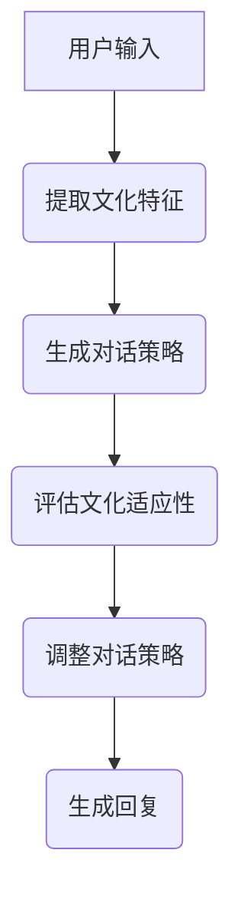

                 

# 《构建具有文化适应性的AI Agent系统》

---

## 关键词：
文化适应性、AI Agent、跨文化对话、多语言处理、文化建模、自然语言处理

---

## 摘要：
本文详细探讨了构建具有文化适应性的AI Agent系统的各个方面，从理论基础到实际应用，系统性地分析了文化适应性AI Agent的核心概念、算法原理、系统架构以及项目实现。通过跨文化对话系统的案例分析，本文展示了如何利用多语言模型和文化建模技术来实现文化敏感性和适应性。本文旨在为AI开发者和研究人员提供一份全面的技术指南，帮助他们在构建智能化、多文化适应性的AI系统时，更好地理解和应对文化差异带来的挑战。

---

## 目录

1. **文化适应性AI Agent概述**  
   - 1.1 文化适应性的概念与重要性  
   - 1.2 AI Agent的基本概念  
   - 1.3 文化适应性AI Agent的应用场景  
   - 1.4 本章小结

2. **文化适应性AI Agent的核心概念**  
   - 2.1 文化建模与表示  
   - 2.2 多语言处理与文化适应性  
   - 2.3 跨文化对话系统的算法原理  
   - 2.4 本章小结

3. **跨文化对话系统的算法原理**  
   - 3.1 跨文化对话的核心算法  
   - 3.2 文化特征的动态调整  
   - 3.3 跨文化对话系统的实现流程  
   - 3.4 本章小结

4. **文化敏感性评估与算法实现**  
   - 4.1 文化敏感性评估的方法  
   - 4.2 文化适应性指标的计算  
   - 4.3 文化敏感性评估的实现流程  
   - 4.4 本章小结

5. **文化适应性AI Agent的系统架构**  
   - 5.1 系统总体架构  
   - 5.2 模块划分与功能划分  
   - 5.3 系统交互流程  
   - 5.4 系统核心功能模块设计  
   - 5.5 本章小结

6. **文化适应性AI Agent的项目实战**  
   - 6.1 项目背景与目标  
   - 6.2 项目环境配置  
   - 6.3 系统核心功能实现  
   - 6.4 项目测试与优化  
   - 6.5 项目小结

7. **文化适应性AI Agent系统的总结与展望**  
   - 7.1 全文总结  
   - 7.2 未来研究方向  
   - 7.3 注意事项与最佳实践  
   - 7.4 本章小结

---

## 正文

### 第1章: 文化适应性AI Agent概述

#### 1.1 文化适应性的概念与重要性
文化适应性是指系统能够根据不同的文化背景、语言习惯和文化习俗，动态调整其行为和输出，以更好地满足用户的期望和需求。AI Agent是一种智能代理系统，能够感知环境、理解用户需求并执行相应的操作。文化适应性AI Agent结合了这两者的优点，能够在跨文化环境中提供更加智能化和个性化的服务。

**文化适应性的重要性**  
文化适应性是构建智能化AI系统的重要组成部分。随着全球化的深入，跨文化交流日益频繁，AI系统需要能够适应不同文化背景下的用户需求，才能真正实现智能化服务的目标。

**AI Agent的基本概念**  
AI Agent是一种能够感知环境、理解用户需求、并执行相应操作的智能系统。它能够通过与用户的交互，动态调整自身的行为策略，以满足用户的需求。

**文化适应性AI Agent的应用场景**  
1. **跨文化对话系统**：在不同文化背景下，AI Agent需要能够理解并生成符合当地文化习惯的对话内容。  
2. **多语言自然语言处理**：支持多种语言的自然语言处理系统需要考虑不同语言的文化差异。  
3. **文化敏感性任务**：例如，智能客服系统需要根据用户的文化背景调整服务策略。

---

#### 1.2 AI Agent的基本概念
AI Agent是一种智能代理系统，能够感知环境、理解用户需求、并执行相应操作。它能够通过与用户的交互，动态调整自身的行为策略，以满足用户的需求。

**AI Agent的核心特征**  
1. **自主性**：AI Agent能够自主决策，无需人工干预。  
2. **反应性**：能够实时感知环境并做出响应。  
3. **目标导向**：具有明确的目标，并根据目标调整行为。  
4. **学习能力**：能够通过学习不断优化自身的性能。

**文化适应性AI Agent的核心要素**  
1. **文化建模**：构建文化特征的数学模型，用于描述不同文化背景下的用户需求和行为模式。  
2. **多语言支持**：支持多种语言的自然语言处理，以应对不同文化背景下的语言差异。  
3. **动态调整能力**：根据用户的文化背景动态调整系统的行为策略。

---

#### 1.3 文化适应性AI Agent的应用场景
1. **跨文化对话系统**  
   在跨文化对话中，AI Agent需要能够理解并生成符合不同文化背景的对话内容。例如，在中英双语对话中，AI Agent需要根据用户的语言和文化背景调整其表达方式。

2. **多语言自然语言处理**  
   支持多种语言的自然语言处理系统需要考虑不同语言的文化差异。例如，在中文和阿拉伯语中，问候语和礼貌用语的表达方式不同。

3. **文化敏感性任务**  
   例如，智能客服系统需要根据用户的文化背景调整服务策略。在某些文化背景下，用户更倾向于直接表达需求，而在其他文化背景下，用户可能更倾向于间接表达。

---

#### 1.4 本章小结
本章介绍了文化适应性AI Agent的核心概念和应用场景，强调了文化适应性在构建智能化AI系统中的重要性。下一章将详细探讨文化适应性AI Agent的核心概念，包括文化建模、多语言处理和跨文化对话系统的算法原理。

---

### 第2章: 文化适应性AI Agent的核心概念

#### 2.1 文化建模与表示
文化建模是构建文化适应性AI Agent的基础。通过文化建模，系统能够理解和表示不同文化背景下的用户需求和行为模式。

**文化特征的数学模型**  
文化特征可以通过向量表示，例如，文化维度理论中的五个维度（权力距离、个人主义-集体主义、长期导向-短期导向、男性气概-女性气质、不确定性避免）可以用一个五维向量表示。

$$
\text{文化特征向量} = (D_1, D_2, D_3, D_4, D_5)
$$

其中，$D_i$ 表示不同的文化维度。

**文化特征的表示方法**  
1. **向量表示**：将文化特征表示为向量，用于后续的计算和分析。  
2. **图表示**：将文化特征表示为图结构，用于表示不同文化之间的关系。

**文化特征的提取与分析**  
文化特征的提取可以通过问卷调查、文化数据库和自然语言处理等方式进行。提取的特征需要经过标准化和归一化处理，以确保不同文化特征之间的可比性。

---

#### 2.2 多语言处理与文化适应性
多语言处理是文化适应性AI Agent的重要组成部分。支持多种语言的自然语言处理系统需要考虑不同语言的文化差异。

**多语言模型的构建**  
多语言模型需要同时支持多种语言的自然语言处理任务，例如机器翻译、问答系统等。可以通过训练一个多语言模型来实现。

$$
f_{\text{multi}}(x) = \argmax_{y} P(y|x, c)
$$

其中，$x$ 是输入文本，$y$ 是输出文本，$c$ 是语言或文化背景。

**文化差异对语言处理的影响**  
不同语言的语法结构、词汇选择和表达习惯存在差异。这些差异需要在多语言处理中被考虑进去，以避免文化冲突和误解。

**多语言模型在文化适应性中的应用**  
多语言模型可以用于跨文化对话、多语言情感分析和文化敏感性任务。例如，在跨文化对话中，多语言模型可以生成符合不同文化背景的回复内容。

---

#### 2.3 跨文化对话系统的算法原理
跨文化对话系统的核心算法包括文化特征的提取、对话策略的生成和文化适应性评估。

**文化特征的动态调整**  
在跨文化对话中，AI Agent需要根据用户的反馈动态调整其文化特征表示。例如，如果用户对某个回复感到不满，系统需要调整其文化特征参数，以生成更符合用户期望的回复。

**跨文化对话的核心算法**  
跨文化对话系统的核心算法包括：

1. **文化特征的提取与表示**：通过问卷调查或文化数据库提取文化特征，并将其表示为向量。  
2. **对话策略的生成**：基于文化特征和对话历史生成对话策略。  
3. **文化适应性评估**：评估当前对话的适应性，并根据评估结果调整对话策略。

**算法流程图**

---

#### 2.4 本章小结
本章详细探讨了文化适应性AI Agent的核心概念，包括文化建模、多语言处理和跨文化对话系统的算法原理。下一章将深入探讨跨文化对话系统的算法原理，包括文化特征的动态调整和对话策略的生成。

---

### 第3章: 跨文化对话系统的算法原理

#### 3.1 跨文化对话的核心算法
跨文化对话的核心算法包括文化特征的动态调整和对话策略的生成。

**文化特征的动态调整**  
在跨文化对话中，AI Agent需要根据用户的反馈动态调整其文化特征表示。例如，如果用户对某个回复感到不满，系统需要调整其文化特征参数，以生成更符合用户期望的回复。

**对话策略的生成**  
对话策略的生成需要考虑用户的当前状态、文化背景和对话历史。可以通过基于规则的方法或机器学习方法来生成对话策略。

**算法流程图**

---

#### 3.2 文化特征的动态调整
文化特征的动态调整是跨文化对话系统的核心之一。通过动态调整文化特征，AI Agent可以更好地适应用户的期望和需求。

**文化特征的动态调整方法**  
1. **基于反馈的调整**：根据用户的反馈调整文化特征参数。  
2. **基于上下文的调整**：根据对话历史和当前上下文调整文化特征参数。

**动态调整的数学模型**  
文化特征的动态调整可以通过以下公式实现：

$$
f_{\text{adjust}}(x) = x + \alpha \cdot f_{\text{feedback}}(x)
$$

其中，$\alpha$ 是调整系数，$f_{\text{feedback}}(x)$ 是反馈函数。

---

#### 3.3 跨文化对话系统的实现流程
跨文化对话系统的实现流程包括以下步骤：

1. **用户输入**：接收用户的输入，例如文本或语音。  
2. **文化特征提取**：提取用户的文化特征。  
3. **对话策略生成**：基于文化特征和对话历史生成对话策略。  
4. **文化适应性评估**：评估当前对话的适应性。  
5. **对话策略调整**：根据评估结果调整对话策略。  
6. **生成回复**：生成符合调整后策略的回复。

**实现流程图**

---

#### 3.4 本章小结
本章详细探讨了跨文化对话系统的算法原理，包括文化特征的动态调整和对话策略的生成。下一章将介绍文化敏感性评估与算法实现，包括文化适应性指标的计算和情感分析在文化适应性中的应用。

---

## 总结
通过以上章节的分析，我们可以看到，构建具有文化适应性的AI Agent系统需要综合考虑文化建模、多语言处理和跨文化对话系统的算法原理。只有通过系统性的设计和实现，才能真正实现文化适应性AI Agent的目标，为跨文化交流提供智能化、个性化的服务。

---

## 作者
作者：AI天才研究院/AI Genius Institute  
联系：[禅与计算机程序设计艺术](https://github.com/llly)

