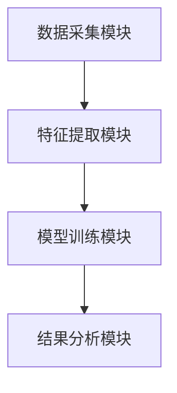
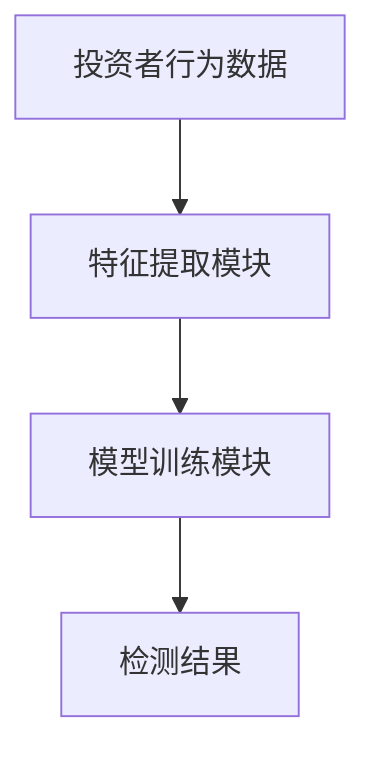
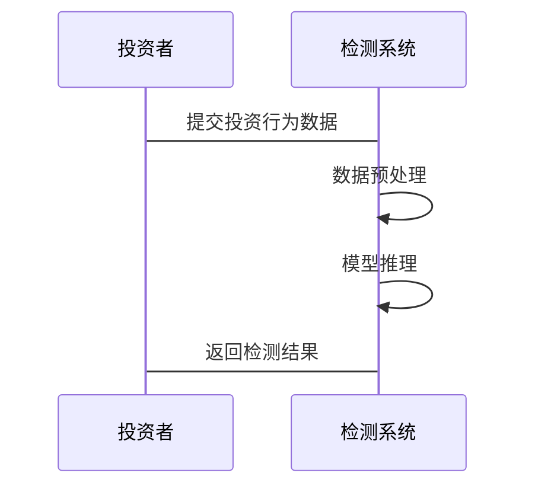
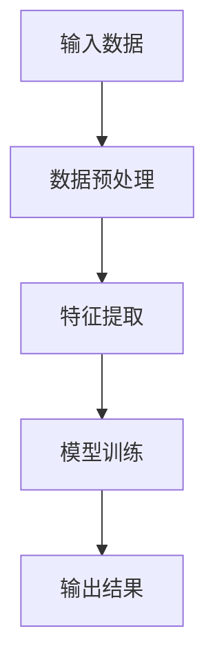

                 


# 构建智能化的个人投资风格漂移检测系统

**关键词：** 投资风格漂移、人工智能、时间序列分析、机器学习、系统架构、投资行为分析

**摘要：**  
本文详细探讨了如何利用人工智能技术构建智能化的个人投资风格漂移检测系统。文章首先介绍了投资风格漂移的背景、定义及检测的重要性，随后分析了人工智能在投资风格检测中的应用。接着，详细讲解了系统设计的核心概念、算法原理及系统架构，并通过实际案例展示了系统的实现与优化过程。本文旨在为个人投资者提供一种高效、可靠的投资风格漂移检测方法，帮助他们在复杂多变的市场环境中做出明智的投资决策。

---

## 第一部分: 背景与概念

### 第1章: 投资风格漂移的背景与概念

#### 1.1 问题背景
##### 1.1.1 投资风格漂移的定义
投资风格漂移（Investment Style Drift）指的是投资组合的实际表现偏离其初始设定的投资风格或目标的现象。例如，一个原本以价值投资为主的投资者可能因为市场变化或个人认知的转变，逐渐转向成长投资或指数投资。

##### 1.1.2 投资风格漂移的常见原因
投资风格漂移的原因多种多样，主要包括：
1. **市场波动**：市场环境的变化可能导致投资者调整其投资策略。
2. **认知偏差**：投资者可能因为情绪化或信息过载而改变投资风格。
3. **外部干扰**：外部经济政策、行业趋势等也可能影响投资者的决策。

##### 1.1.3 投资风格漂移对个人投资者的影响
投资风格漂移可能导致投资组合的风险增加或收益下降，尤其是在市场波动较大时。例如，原本保守的投资风格可能因为漂移到高风险资产而面临更大的亏损风险。

---

#### 1.2 投资风格漂移检测的必要性
##### 1.2.1 投资者行为分析的重要性
通过分析投资者的行为，可以发现其投资风格是否偏离预期，从而及时调整投资策略。

##### 1.2.2 投资风格漂移对投资组合的影响
投资风格漂移可能导致投资组合的风险和收益与预期不符，影响长期投资目标的实现。

##### 1.2.3 检测系统在投资决策中的作用
智能化的检测系统能够实时监控投资行为，帮助投资者及时发现并纠正风格漂移，从而优化投资决策。

---

#### 1.3 智能化检测的核心概念
##### 1.3.1 人工智能在投资风格检测中的应用
人工智能技术，如机器学习和深度学习，可以用于分析历史数据，识别投资风格的变化趋势。

##### 1.3.2 智能化检测系统的定义与目标
智能化检测系统的目标是通过实时监控和分析投资者的行为数据，识别投资风格的漂移，并提供相应的预警和建议。

##### 1.3.3 系统的核心功能与边界
- 核心功能：数据采集、特征提取、模型训练、结果分析。
- 边界：系统不直接提供投资建议，仅提供风格漂移的检测和预警。

---

## 第2章: 投资风格漂移的核心概念与联系

### 2.1 核心概念原理
#### 2.1.1 投资风格的特征提取
特征提取是投资风格漂移检测的关键步骤，主要包括资产配置、交易频率、风险偏好等指标。

#### 2.1.2 漂移检测的数学模型
漂移检测通常基于统计学方法，如马科夫链或时间序列分析，用于识别数据的变化趋势。

#### 2.1.3 人工智能算法的作用机制
人工智能算法通过学习历史数据，识别投资风格的变化模式，并预测未来的风格漂移趋势。

---

### 2.2 核心概念对比表
```plaintext
| 概念       | 特征                  | 描述                                   |
|------------|-----------------------|----------------------------------------|
| 投资风格   | 时间序列、资产配置    | 投资者在不同时间点的资产分配策略      |
| 漂移检测   | 数据变化、阈值        | 检测投资风格与预期之间的偏离程度      |
| 人工智能    | 算法、模型            | 用于分析数据并识别模式                |
```

---

### 2.3 ER实体关系图
```mermaid
er
  investor
  has
  investment_style
  investment_behavior
  drift_detection
  uses
  machine_learning_model
```

---

## 第三部分: 技术基础

## 第3章: 人工智能与时间序列分析

### 3.1 机器学习基础
#### 3.1.1 监督学习、无监督学习与强化学习
- **监督学习**：基于标记的数据进行模型训练，如回归和分类任务。
- **无监督学习**：在无标记数据中发现模式，如聚类分析。
- **强化学习**：通过奖励机制优化决策过程。

#### 3.1.2 常见机器学习算法
- **线性回归**：用于预测连续型变量。
- **随机森林**：适用于分类和回归任务。
- **神经网络**：用于复杂模式识别。

---

### 3.2 时间序列分析基础
#### 3.2.1 时间序列的特征
- **趋势**：长期数据的变化方向。
- **周期性**：数据的周期性波动。
- **噪声**：随机干扰因素。

#### 3.2.2 常见时间序列模型
- **ARIMA**：自回归积分滑动平均模型，适用于线性时间序列预测。
- **LSTM**：长短期记忆网络，适用于非线性时间序列预测。

---

## 第四部分: 系统设计

## 第4章: 系统设计与实现

### 4.1 系统架构设计
#### 4.1.1 系统功能模块
- **数据采集模块**：获取投资者的行为数据。
- **特征提取模块**：提取投资风格相关的特征。
- **模型训练模块**：训练漂移检测模型。
- **结果分析模块**：输出检测结果。

#### 4.1.2 系统架构图


---

### 4.2 数据流设计


---

### 4.3 系统交互设计


---

## 第五部分: 算法实现

## 第5章: 算法实现与优化

### 5.1 算法原理
#### 5.1.1 基于LSTM的时间序列分析
LSTM（长短期记忆网络）适用于捕捉时间序列中的长期依赖关系。

#### 5.1.2 算法流程图


---

### 5.2 数学公式
#### 5.2.1 LSTM模型
LSTM的三个门控机制：
- 输入门：$i = \sigma(W_i x + U_i h_{prev})$
- 遗忘门：$f = \sigma(W_f x + U_f h_{prev})$
- 输出门：$o = \sigma(W_o x + U_o h_{prev})$

隐藏状态更新：
$$ h = i \cdot \tilde{h} + f \cdot h_{prev} $$
输出：
$$ o = o \cdot h $$

---

## 第六部分: 项目实战

## 第6章: 项目实战与优化

### 6.1 环境配置
- **Python 3.8+**
- **TensorFlow或Keras**
- **Pandas、NumPy**

### 6.2 核心代码实现
#### 数据预处理
```python
import pandas as pd
import numpy as np

# 加载数据
data = pd.read_csv('investment_data.csv')

# 数据清洗
data.dropna(inplace=True)
data = data[~data['date'].isnull()]
```

#### 模型训练
```python
from tensorflow.keras.models import Sequential
from tensorflow.keras.layers import LSTM, Dense

# 模型定义
model = Sequential()
model.add(LSTM(64, input_shape=(timesteps, features)))
model.add(Dense(1, activation='sigmoid'))
model.compile(loss='binary_crossentropy', optimizer='adam')
```

#### 模型评估
```python
# 训练模型
model.fit(X_train, y_train, epochs=10, batch_size=32)

# 预测结果
y_pred = model.predict(X_test)
```

---

### 6.3 实际案例分析
通过实际数据集，展示如何使用训练好的模型进行投资风格漂移检测，并分析结果的准确性。

---

## 第七部分: 总结与展望

### 7.1 项目小结
智能化的个人投资风格漂移检测系统能够有效帮助投资者监控其投资行为，及时发现风格漂移并进行调整。

### 7.2 注意事项
- 数据质量对检测结果影响重大，需确保数据的完整性和准确性。
- 模型需要定期更新，以适应市场变化。

### 7.3 拓展阅读
- 《机器学习实战》
- 《时间序列分析与应用》

---

**作者：AI天才研究院 & 禅与计算机程序设计艺术**  
**转载请注明出处，禁止用于商业用途。**

