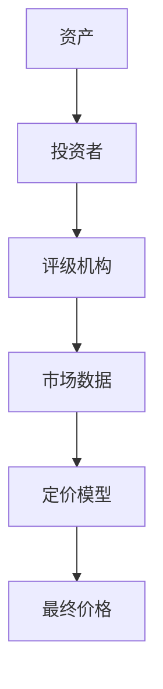
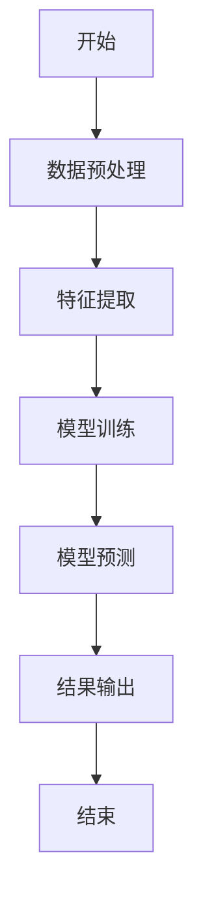
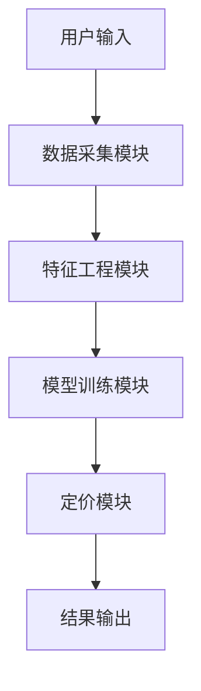

                 


# 构建智能化的资产证券化定价模型

## 关键词
资产证券化、定价模型、机器学习、智能算法、金融建模

## 摘要
资产证券化定价模型是金融领域的重要工具，用于评估和确定资产证券化产品的市场价值。随着人工智能和大数据技术的发展，智能化定价模型逐渐成为主流。本文将详细介绍如何构建一个智能化的资产证券化定价模型，从背景知识到算法实现，再到实际应用，帮助读者全面掌握相关技术和方法。

---

# 第一部分: 资产证券化定价模型的背景与核心概念

## 第1章: 资产证券化定价模型的背景介绍

### 1.1 资产证券化的定义与特点
#### 1.1.1 资产证券化的定义
资产证券化是指将缺乏流动性的资产转化为可在市场上交易的证券的过程。这种过程通过将资产池打包，发行债券或其他金融工具来实现资金的快速流动。

#### 1.1.2 资产证券化的核心特点
- **分散风险**：通过将不同资产打包，降低单一资产的风险。
- **提高流动性**：将长期资产转化为短期证券，提升市场流动性。
- **复杂性**：涉及多种金融工具和法律结构。

#### 1.1.3 资产证券化在金融领域的应用
资产证券化广泛应用于房地产、汽车贷款、信用卡应收账款等领域，帮助机构优化资产负债表，提高资金利用效率。

### 1.2 资产定价模型的背景与重要性
#### 1.2.1 资产定价的基本概念
资产定价是通过分析资产的内在价值和市场因素，确定其合理价格的过程。传统方法包括现金流贴现法和相对估值法。

#### 1.2.2 传统资产定价模型的局限性
传统模型难以应对市场波动、数据不足和复杂资产结构等问题，尤其是在资产证券化中，传统方法显得力不从心。

#### 1.2.3 智能化定价模型的必要性
智能化定价模型通过机器学习和大数据分析，能够更好地捕捉市场动态，提高定价的准确性和效率。

## 第2章: 资产证券化定价模型的核心概念与联系

### 2.1 核心概念原理
#### 2.1.1 资产证券化定价模型的原理
定价模型通过分析资产池的现金流、信用风险和市场因素，预测证券的市场价格。

#### 2.1.2 智能化定价的核心要素
- **数据采集**：收集资产池的历史数据和市场信息。
- **特征提取**：提取影响资产价格的关键特征。
- **模型训练**：使用机器学习算法训练定价模型。
- **定价预测**：基于模型预测证券的价格。

#### 2.1.3 模型的输入与输出
- **输入**：资产池数据、市场指标、信用评级。
- **输出**：证券的市场价格、风险评估。

### 2.2 核心概念属性对比表格
| 概念 | 属性 | 描述 |
|------|------|------|
| 资产 | 类型 | 金融资产、实物资产等 |
| 定价 | 方法 | 市场定价、内在价值定价等 |
| 模型 | 输入 | 资产特征、市场数据等 |
| 模型 | 输出 | 资产价格、风险评估等 |

### 2.3 ER实体关系图架构


---

# 第二部分: 资产证券化定价模型的算法原理

## 第3章: 算法原理概述

### 3.1 机器学习在资产定价中的应用
#### 3.1.1 机器学习的优势
- **数据驱动**：利用大量数据进行模式识别。
- **非线性关系**：捕捉传统模型难以发现的复杂关系。

#### 3.1.2 常见的定价算法选择
- **随机森林**：适用于特征工程和非线性关系。
- **神经网络**：适合处理复杂数据和动态变化。

#### 3.1.3 算法的优缺点分析
- **随机森林**：优点是鲁棒性强，缺点是解释性较差。
- **神经网络**：优点是能力强，缺点是需要大量数据和计算资源。

### 3.2 算法流程图


### 3.3 算法实现代码示例
```python
import pandas as pd
from sklearn.ensemble import RandomForestRegressor

# 数据预处理
data = pd.read_csv('asset_data.csv')
features = data.drop('price', axis=1)
target = data['price']

# 特征提取
selected_features = features[['cash_flow', 'credit_score', 'market_index']]

# 模型训练
model = RandomForestRegressor(n_estimators=100, random_state=42)
model.fit(selected_features, target)

# 模型预测
new_asset = pd.DataFrame({
    'cash_flow': [100],
    'credit_score': [75],
    'market_index': [150]
})
predicted_price = model.predict(new_asset)
print(f'预测价格为：{predicted_price[0]}')
```

---

## 第4章: 算法的数学模型与公式

### 4.1 现金流贴现模型
现金流贴现模型（DCF）用于估算资产的内在价值。公式如下：
$$
\text{资产价值} = \sum_{t=1}^{n} \frac{\text{现金流}_t}{(1 + r)^t}
$$
其中，$r$ 是折现率，$t$ 是时间。

### 4.2 风险调整模型
考虑信用风险的定价模型可以使用违约概率（PD）和违约损失率（LGD）进行调整：
$$
\text{调整价格} = \text{初始价格} \times (1 - \text{PD} \times \text{LGD})
$$

### 4.3 机器学习模型的数学表示
随机森林模型可以表示为：
$$
f(x) = \sum_{i=1}^{n} \text{Tree}_i(x)
$$
其中，$n$ 是树的数量，$\text{Tree}_i(x)$ 是第$i$棵树的预测函数。

---

# 第三部分: 资产证券化定价模型的系统架构

## 第5章: 系统架构设计

### 5.1 问题场景介绍
在资产证券化中，定价模型需要处理大量数据，包括资产池的现金流、市场指标和信用评级。

### 5.2 系统功能设计
- **数据采集**：从数据库获取资产池数据。
- **特征工程**：提取关键特征并进行数据清洗。
- **模型训练**：使用机器学习算法训练定价模型。
- **定价模块**：基于训练好的模型预测证券价格。

### 5.3 系统架构图


### 5.4 接口设计与交互流程
- **接口设计**：定义API接口，用于数据输入和结果输出。
- **交互流程**：
  1. 用户输入资产池数据。
  2. 数据采集模块获取数据。
  3. 特征工程模块处理数据。
  4. 模型训练模块训练模型。
  5. 定价模块预测价格。
  6. 结果输出模块展示结果。

---

## 第6章: 项目实战

### 6.1 环境安装
- 安装Python和必要的库：
  ```bash
  pip install pandas scikit-learn matplotlib
  ```

### 6.2 核心实现代码
```python
import pandas as pd
from sklearn.ensemble import RandomForestRegressor
from sklearn.metrics import mean_absolute_error

# 数据加载
data = pd.read_csv('asset_data.csv')

# 特征与目标分离
X = data.drop('price', axis=1)
y = data['price']

# 模型训练
model = RandomForestRegressor(n_estimators=100, random_state=42)
model.fit(X, y)

# 模型预测
new_asset = pd.DataFrame({
    'feature1': [0.5],
    'feature2': [0.7],
    'feature3': [1.2]
})
predicted_price = model.predict(new_asset)
print(f'预测价格为：{predicted_price[0]}')

# 模型评估
y_pred = model.predict(X)
mae = mean_absolute_error(y, y_pred)
print(f'MAE: {mae}')
```

### 6.3 实际案例分析
以房地产资产证券化为例，分析模型如何预测证券价格，并解读结果。

### 6.4 项目小结
总结项目实现的关键步骤和注意事项，强调数据质量、特征选择和模型调优的重要性。

---

# 第四部分: 最佳实践与注意事项

## 第7章: 最佳实践

### 7.1 小结
智能化资产证券化定价模型的关键在于数据质量、特征选择和模型优化。

### 7.2 注意事项
- 数据清洗：处理缺失值和异常值。
- 特征工程：提取有意义的特征，避免维度灾难。
- 模型调优：使用交叉验证和超参数优化提高性能。

### 7.3 拓展阅读
推荐相关书籍和论文，帮助读者深入学习资产证券化和机器学习的知识。

---

# 作者：AI天才研究院/AI Genius Institute & 禅与计算机程序设计艺术 /Zen And The Art of Computer Programming

