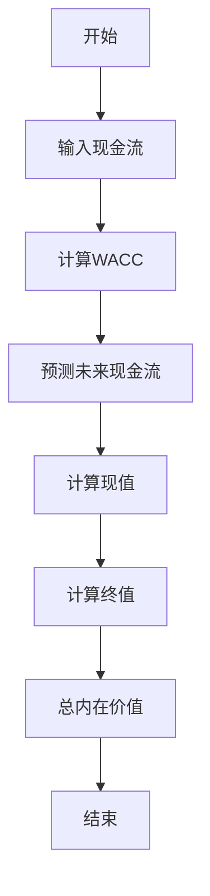
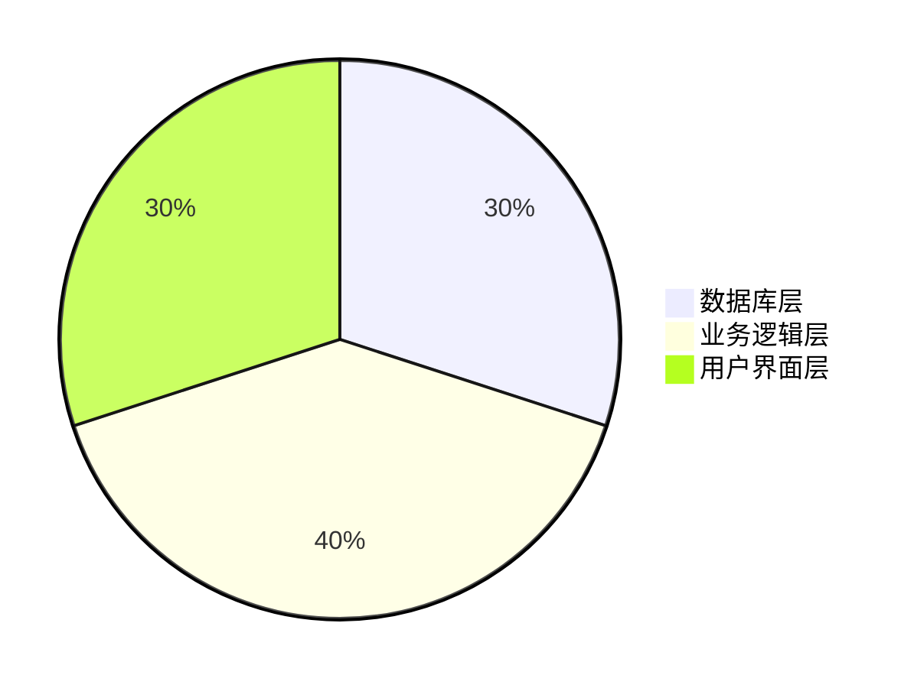
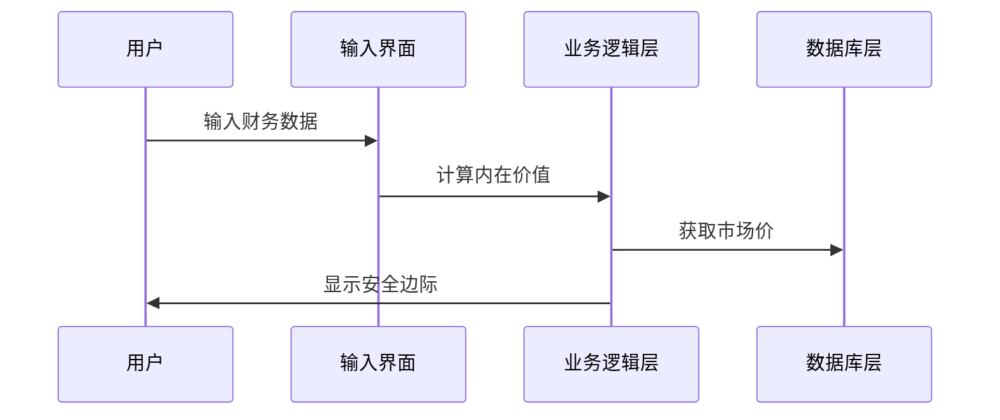

                 


# 《格雷厄姆的价值投资实战技巧》

---

## 关键词

- 价值投资、格雷厄姆、基本面分析、安全边际、内在价值、DCF模型、投资策略

---

## 摘要

本文深入探讨格雷厄姆的价值投资理论，从核心概念到实战技巧，结合数学模型和代码实现，全面解析价值投资的方法。通过基本面分析、安全边际计算、内在价值评估，以及实际案例分析，帮助读者掌握格雷厄姆的投资理念，并通过系统设计和项目实战，提升投资决策能力。

---

## 正文

---

## 第一部分：价值投资的背景与基础

### 第1章：价值投资的定义与核心理念

#### 1.1 价值投资的定义

价值投资是一种基于公司基本面分析的投资策略，旨在通过识别市场价格低于其内在价值的股票，实现长期稳定的收益。格雷厄姆是该领域的奠基人，他强调安全边际和内在价值的重要性。

**核心理念：**
- **安全边际**：购买价格低于内在价值，以降低风险。
- **内在价值**：公司未来现金流的现值，计算其真实价值。

#### 1.2 价值投资的历史演变

- **早期发展**：20世纪初，格雷厄姆与多德共同提出价值投资理论。
- **现代演变**：格雷厄姆的理论被后来投资者如巴菲特、彼得·林奇等继承和发展，形成多样化的价值投资策略。

#### 1.3 核心要素

- **基本面分析**：分析公司的财务报表、行业地位、竞争优势等。
- **安全边际**：购买价格低于内在价值，确保收益。
- **内在价值**：通过DCF模型计算公司未来现金流的现值。

#### 1.4 对比其他投资策略

- **技术分析**：依赖价格走势和成交量，忽视基本面。
- **成长投资**：侧重公司未来的增长潜力，而非当前估值。

---

### 第2章：基本面分析与安全边际

#### 2.1 基本面分析

- **财务报表分析**：利润表、资产负债表、现金流量表。
  - **利润表**：收入、成本、利润。
  - **资产负债表**：资产、负债、所有者权益。
  - **现金流量表**：经营活动、投资活动、筹资活动的现金流。

- **行业分析与竞争优势**：分析行业趋势，评估公司在行业中的地位和竞争优势。

#### 2.2 安全边际计算

- **定义**：购买价格低于内在价值，确保收益。
- **计算公式**：
  \[
  安全边际 = 内在价值 - 市场价格
  \]
  若安全边际为正，说明价格合理。

#### 2.3 核心概念对比

| 概念       | 基本面分析 | 技术分析 |
|------------|------------|----------|
| 定价基础   | 公司价值   | 价格走势 |
| 数据来源   | 财务报表   | 价格和成交量 |
| 目标       | 寻找低估股票 | 预测价格走势 |

---

## 第二部分：算法原理与系统设计

### 第3章：DCF模型与内在价值计算

#### 3.1 DCF模型原理

- **定义**：通过现金流折现计算公司内在价值。
- **步骤**：
  1. 预测未来现金流。
  2. 计算加权平均资本成本（WACC）。
  3. 折现未来现金流，计算现值。
  4. 加上当前现金流，得出内在价值。

#### 3.2 DCF模型实现

- **Python代码示例**：

```python
import numpy as np

def calculate_intrinsic_value(fcf, wacc, horizon=10, discount_rate=0.05):
    # 预测未来现金流
    future_cash_flows = [fcf * (1 + 0.05)**i for i in range(horizon)]
    # 现金流的现值
    present_value = sum(fcf * (1 + wacc)**-i for i, fcf in enumerate(future_cash_flows))
    # 加上终值
    terminal_value = future_cash_flows[-1] * (1 + discount_rate)**-horizon
    total_intrinsic_value = present_value + terminal_value
    return total_intrinsic_value

# 示例计算
fcf = 100  # 自由现金流
wacc = 0.10  # 加权平均资本成本
iv = calculate_intrinsic_value(fcf, wacc)
print(f"内在价值：{iv:.2f}")
```

#### 3.3 算法流程图（Mermaid）



---

### 第4章：系统架构与交互设计

#### 4.1 系统功能设计

- **需求分析**：用户需要一个工具来计算内在价值和安全边际。
- **功能模块**：
  - 数据输入：公司财务数据。
  - 计算模块：DCF模型计算内在价值。
  - 安全边际计算：比较市场价格与内在价值。

#### 4.2 系统架构设计（Mermaid）



#### 4.3 接口设计

- **输入接口**：用户输入公司财务数据。
- **输出接口**：显示内在价值和安全边际。

#### 4.4 交互流程（Mermaid）



---

## 第三部分：项目实战

### 第5章：价值投资实战

#### 5.1 环境安装

- **工具**：Python、Jupyter Notebook、数据获取API（如Yahoo Finance）。
- **安装步骤**：
  ```bash
  pip install pandas numpy matplotlib yfinance
  ```

#### 5.2 核心代码实现

- **数据获取**：

```python
import yfinance as yf

# 下载苹果股票数据
aapl = yf.Ticker('AAPL')
aapl_info = aapl.info
aapl_financials = aapl.financials
```

- **计算内在价值**：

```python
def calculate_intrinsic_value(fcf, wacc):
    # 预测未来现金流
    future_cash_flows = [fcf * (1 + 0.05)**i for i in range(10)]
    # 现金流的现值
    present_value = sum(fcf * (1 + wacc)**-i for i, fcf in enumerate(future_cash_flows))
    # 计算终值
    terminal_value = future_cash_flows[-1] * (1 + 0.05)**-10
    total_intrinsic_value = present_value + terminal_value
    return total_intrinsic_value

# 示例计算
fcf = 100  # 自由现金流
wacc = 0.10
iv = calculate_intrinsic_value(fcf, wacc)
print(f"内在价值：{iv:.2f}")
```

#### 5.3 案例分析

- **案例公司**：以苹果公司为例，计算其内在价值和安全边际。
- **步骤**：
  1. 获取财务数据。
  2. 计算内在价值。
  3. 对比市场价格，计算安全边际。

#### 5.4 项目总结

- **关键点**：选择合适的模型，准确的数据输入，合理的假设参数。
- **挑战**：数据获取的准确性和模型假设的合理性。

---

## 第四部分：最佳实践与注意事项

### 第6章：最佳实践

#### 6.1 小结

- **总结**：格雷厄姆的价值投资需要基本面分析、安全边际计算和内在价值评估。
- **心理因素**：克服情绪影响，坚持长期投资。

#### 6.2 风险管理

- **分散投资**：降低单一股票的风险。
- **定期复核**：监控投资组合，及时调整。

#### 6.3 注意事项

- **数据准确性**：确保财务数据的准确性。
- **模型假设**：合理假设，避免偏差。
- **市场变化**：关注宏观经济和行业趋势。

#### 6.4 拓展阅读

- **书籍推荐**：《聪明的投资者》、《投资学入门》。
- **在线资源**：投资论坛、博客、视频课程。

---

## 附录

### 附录A：术语表

- **DCF模型**：现金流折现模型。
- **WACC**：加权平均资本成本。
- **安全边际**：购买价格低于内在价值的部分。

### 附录B：数据来源

- **Yahoo Finance**：提供实时股票数据。
- **公司财报**：提供财务数据。

### 附录C：工具推荐

- **Python**：数据处理和分析。
- **Excel**：简单的数据计算。

### 附录D：进一步阅读

- 格雷厄姆的《聪明的投资者》。
- 巴菲特的股东大会演讲。

---

## 作者

作者：AI天才研究院/AI Genius Institute & 禅与计算机程序设计艺术/Zen And The Art of Computer Programming

---

**摘要**：本文系统地介绍了格雷厄姆的价值投资理论，从核心概念到实战技巧，结合数学模型和代码实现，全面解析价值投资的方法。通过基本面分析、安全边际计算、内在价值评估，以及实际案例分析，帮助读者掌握格雷厄姆的投资理念，并通过系统设计和项目实战，提升投资决策能力。

