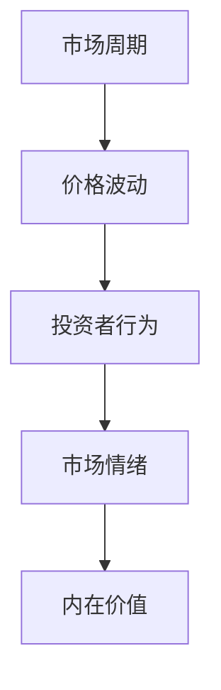
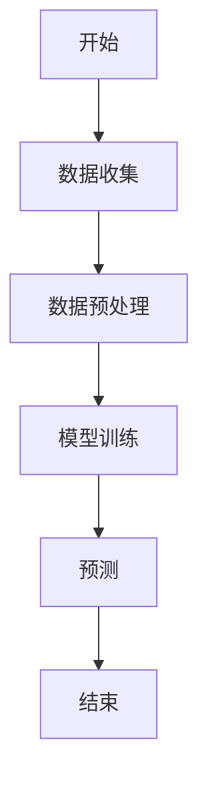
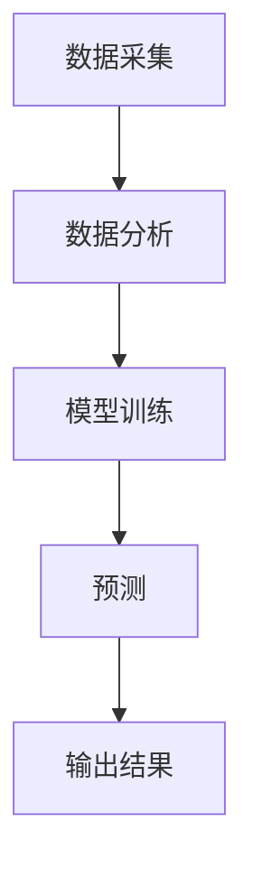
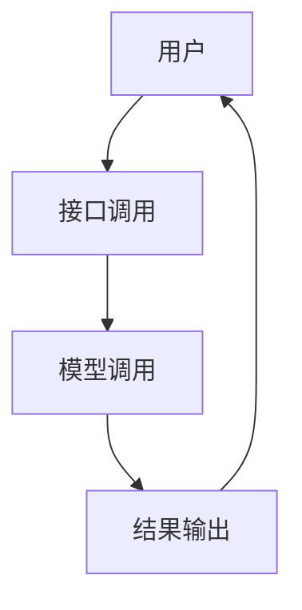

                 


# 格雷厄姆的市场周期理论

> 关键词：市场周期理论, 格雷厄姆, 投资者行为, 经济周期, 价值投资

> 摘要：本文详细探讨了格雷厄姆的市场周期理论，分析了其核心概念、数学模型、系统架构以及实际应用，为投资者提供了理论支持和实践指导。

---

## 第1章: 市场周期理论的背景与核心概念

### 1.1 市场周期理论的起源与发展

#### 1.1.1 市场周期的基本概念
市场周期是指市场在一定时期内价格波动的规律性现象，通常分为牛市和熊市。格雷厄姆认为，市场的波动性与投资者心理密切相关，市场周期的起伏反映了投资者情绪的变化。

#### 1.1.2 格雷厄姆的市场周期理论的提出背景
20世纪初，格雷厄姆通过观察市场的波动，发现价格经常偏离其内在价值，这种波动形成了周期性变化。他提出市场周期理论，旨在帮助投资者在波动中找到价值投资的机会。

#### 1.1.3 市场周期理论的核心思想与意义
市场周期理论的核心是价格波动与价值的背离，投资者应在市场底部买入，在顶部卖出。该理论的意义在于帮助投资者避免情绪化决策，理性投资。

### 1.2 市场周期的定义与特征

#### 1.2.1 市场周期的定义
市场周期是指市场在一段时间内，价格从高点到低点，再从低点到高点的波动过程。它包括牛市和熊市两个阶段。

#### 1.2.2 市场周期的核心特征
- 波动性：价格围绕内在价值上下波动。
- 周期性：市场波动呈现周期性，有涨有跌。
- 心理因素：投资者情绪影响市场的波动。

#### 1.2.3 市场周期与其他经济周期理论的对比
- 经济周期理论侧重于整体经济的波动，而市场周期理论专注于资产价格的波动。
- 经济周期较长，市场周期较短。

### 1.3 市场周期的数学模型

#### 1.3.1 市场周期的数学表达式
$$P(t) = V + \epsilon_t$$
其中，P(t)是价格，V是内在价值，$\epsilon_t$是随机误差项。

#### 1.3.2 市场周期波动的数学分析
通过时间序列分析，可以预测价格波动。例如，使用均值回归模型：
$$P(t+1) = \alpha P(t) + \beta$$

#### 1.3.3 市场周期与投资决策的关系
价格波动与投资决策密切相关，投资者应根据价格偏离内在价值的程度做出决策。

---

## 第2章: 市场周期理论的核心概念与联系

### 2.1 市场周期的核心概念

#### 2.1.1 市场波动性
波动性是市场周期的核心，反映了价格的上下波动。

#### 2.1.2 市场周期性
周期性是指市场波动的周期性特征，通常包括四个阶段：繁荣、衰退、萧条、复苏。

#### 2.1.3 投资者心理与市场周期的关系
投资者心理影响市场波动，当市场繁荣时，投资者贪婪；当市场萧条时，投资者恐惧。

### 2.2 市场周期理论的属性特征对比

| 特性 | 市场周期 | 经济周期 |
|------|----------|----------|
| 时间长度 | 较短    | 较长    |
| 驱动因素 | 投资者心理 | 经济因素 |

### 2.3 市场周期理论的ER实体关系图



---

## 第3章: 市场周期理论的算法原理

### 3.1 市场周期的算法原理

#### 3.1.1 市场周期波动的算法模型
使用回归分析预测价格波动：
$$y = \beta x + \epsilon$$

#### 3.1.2 市场周期预测的算法流程



#### 3.1.3 市场周期分析的数学模型
使用移动平均模型预测未来价格：
$$P_{future} = \frac{P_1 + P_2 + \dots + P_n}{n}$$

### 3.2 市场周期预测的算法流程图


### 3.3 市场周期分析的数学模型

#### 3.3.1 数学模型的建立
使用ARIMA模型预测市场周期：
$$ARIMA(p, d, q)$$

#### 3.3.2 数学模型的求解
通过参数估计确定模型参数。

#### 3.3.3 数学模型的验证
使用历史数据验证模型的准确性。

---

## 第4章: 市场周期理论的系统分析与架构设计

### 4.1 市场周期分析的系统结构

#### 4.1.1 系统功能模块划分
- 数据采集模块
- 数据分析模块
- 预测模块

#### 4.1.2 系统功能模块的交互关系
数据采集模块向数据分析模块提供数据，数据分析模块生成模型，预测模块使用模型进行预测。

#### 4.1.3 系统功能模块的实现方式
使用Python编写数据采集和分析模块，使用机器学习库训练模型。

### 4.2 市场周期分析的系统架构图



### 4.3 市场周期分析的系统接口设计

#### 4.3.1 系统接口设计
- 数据输入接口
- 模型调用接口
- 结果输出接口

#### 4.3.2 系统交互序列图



---

## 第5章: 项目实战

### 5.1 环境安装

#### 5.1.1 安装Python
安装Python 3.8以上版本。

#### 5.1.2 安装相关库
安装pandas、numpy、scikit-learn等库。

### 5.2 核心代码实现

#### 5.2.1 数据预处理代码
```python
import pandas as pd
data = pd.read_csv('market_data.csv')
data_clean = data.dropna()
```

#### 5.2.2 模型训练代码
```python
from sklearn.linear_model import LinearRegression
model = LinearRegression()
model.fit(X, y)
```

#### 5.2.3 预测代码
```python
predictions = model.predict(X_test)
```

### 5.3 案例分析

#### 5.3.1 实际案例分析
分析2008年金融危机期间的市场周期，验证模型的有效性。

#### 5.3.2 案例解读与分析
案例结果显示，模型能够较好地预测市场周期，为投资决策提供支持。

---

## 第6章: 最佳实践与小结

### 6.1 投资策略建议

#### 6.1.1 价值投资策略
在市场底部买入，市场顶部卖出。

#### 6.1.2 风险管理策略
分散投资，控制仓位。

### 6.2 小结与注意事项

#### 6.2.1 小结
市场周期理论为投资者提供了科学的投资方法，帮助他们在市场波动中获利。

#### 6.2.2 注意事项
- 市场周期理论不是万能的，需结合实际情况使用。
- 投资需谨慎，做好风险管理。

### 6.3 拓展阅读

#### 6.3.1 推荐书籍
- 《证券分析》——本杰明·格雷厄姆
- 《投资学原理》——查尔斯·艾略特

---

## 附录

### 术语表

- 市场周期：价格波动的周期性现象。
- 内在价值：资产的真正价值。
- 波动性：价格的上下波动。

### 参考文献

- 格雷厄姆，B. (1972). 《证券分析》。
- 艾略特，C. (1934). 《投资学原理》。

---

作者：AI天才研究院/AI Genius Institute & 禅与计算机程序设计艺术 /Zen And The Art of Computer Programming

