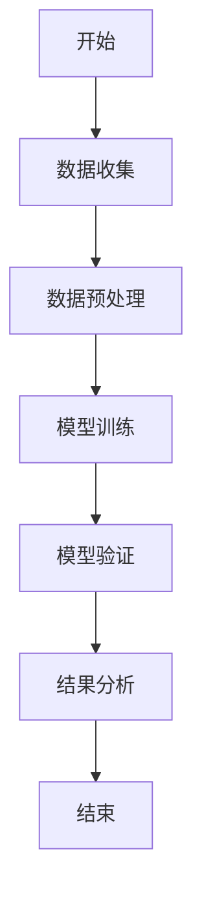
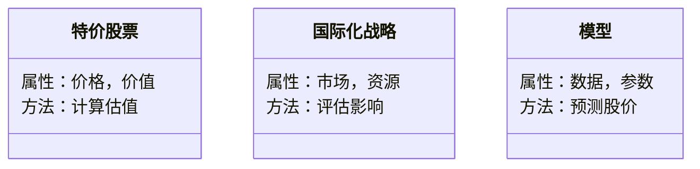
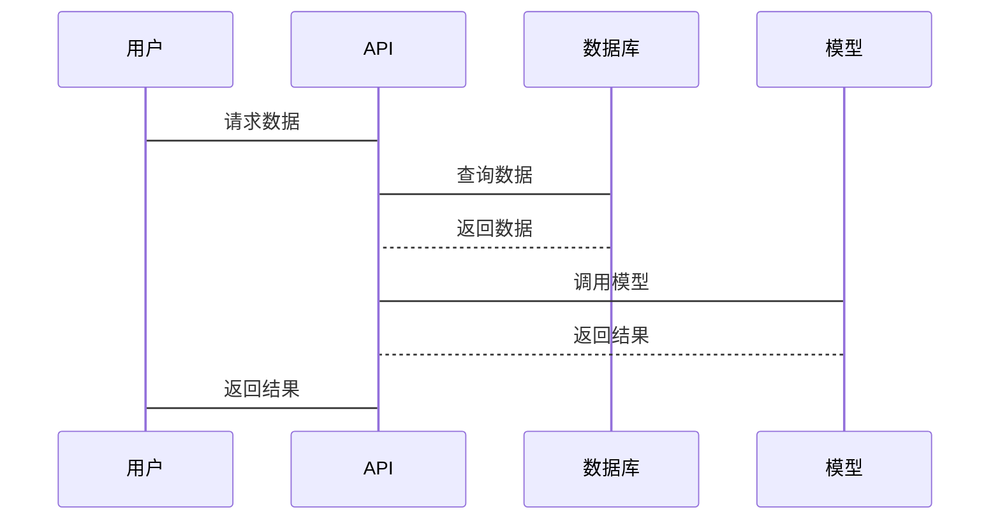

                 


# 特价股票与公司国际化战略的关系

## 关键词：特价股票、公司国际化战略、数学模型、系统架构、项目实战

## 摘要：  
本文探讨了特价股票与公司国际化战略之间的关系，分析了特价股票在公司国际化战略中的作用与影响，通过数学模型和系统架构设计，详细阐述了如何利用特价股票进行国际化战略决策，提供了项目实战和最佳实践的指导。

---

## 第一部分: 特价股票与公司国际化战略的关系概述

### 第1章: 特价股票与公司国际化战略的背景介绍

#### 1.1 特价股票的定义与特点
##### 1.1.1 特价股票的定义  
特价股票是指市场价格低于其内在价值的股票，通常被认为是被市场低估的投资机会。这些股票可能来自财务状况良好的公司，但由于市场波动或其他因素，其股价未能反映出其真实价值。

##### 1.1.2 特价股票的核心特点  
- **低估值**：股价低于行业平均水平或历史平均水平。
- **高潜力**：公司基本面良好，具有增长潜力。
- **风险相对较低**：通常来自财务稳定的公司，风险较小。

##### 1.1.3 特价股票的市场定位与投资价值  
特价股票在市场中被视为高回报低风险的投资选择，尤其在经济低迷或市场波动时，更具吸引力。

#### 1.2 公司国际化战略的定义与类型
##### 1.2.1 公司国际化战略的定义  
公司国际化战略是指企业在全球范围内扩展业务、市场和资源的战略规划。它包括进入新市场、并购、合资合作等多种形式。

##### 1.2.2 公司国际化战略的主要类型  
- **出口战略**：通过出口产品或服务进入新市场。
- **直接投资**：在目标市场建立全资子公司或合资企业。
- **联合 ventures**：与其他企业合作，共同开发市场。
- **品牌国际化**：通过全球化品牌推广，提升国际知名度。

##### 1.2.3 公司国际化战略的实施步骤与关键因素  
实施步骤包括市场调研、战略规划、资源分配、风险管理等。关键因素包括市场进入壁垒、文化差异、法律法规等。

#### 1.3 特价股票与公司国际化战略的关系
##### 1.3.1 特价股票与公司国际化战略的相互作用  
公司国际化战略的实施可能影响股价，而特价股票的出现也可能推动公司国际化战略的实施。

##### 1.3.2 特价股票在公司国际化战略中的地位与作用  
特价股票可以作为公司国际化战略的融资工具或投资标的，帮助公司扩展国际市场。

##### 1.3.3 特价股票与公司国际化战略的协同发展  
通过合理配置特价股票，公司可以在国际化过程中优化资本结构，降低风险。

---

### 第2章: 特价股票与公司国际化战略的核心概念与联系

#### 2.1 特价股票的核心概念原理
##### 2.1.1 特价股票的形成机制  
特价股票通常由市场低估或公司基本面改善引发，投资者可能发现这些股票的价值被忽视。

##### 2.1.2 特价股票的市场表现与投资者行为  
投资者倾向于在市场低迷时寻找特价股票，通过长期持有或价值重估实现收益。

##### 2.1.3 特价股票的估值模型与定价策略  
常用的估值模型包括市盈率（P/E）、市净率（P/B）等，帮助投资者判断股票是否低估。

#### 2.2 公司国际化战略的核心概念原理
##### 2.2.1 公司国际化战略的实施逻辑  
国际化战略通常涉及市场扩展、资源整合和竞争优势的构建。

##### 2.2.2 公司国际化战略的资源分配与风险控制  
公司需要合理分配资金、人才等资源，并通过风险管理工具降低国际化过程中的风险。

##### 2.2.3 公司国际化战略的绩效评估与优化  
通过财务指标（如ROE、市场份额）和非财务指标（如品牌影响力）评估战略效果，并进行优化。

#### 2.3 特价股票与公司国际化战略的联系分析
##### 2.3.1 特价股票在公司国际化战略中的战略意义  
特价股票可以作为公司国际化融资的工具，或作为投资标的，优化资本结构。

##### 2.3.2 公司国际化战略对特价股票的影响路径  
公司国际化战略的实施可能提升公司业绩和市场地位，从而影响股价，使其脱离特价状态。

##### 2.3.3 特价股票与公司国际化战略的协同效应  
通过协同效应，公司可以在国际化过程中利用特价股票优化资本结构，降低风险。

---

### 第3章: 特价股票与公司国际化战略的数学模型与算法原理

#### 3.1 特价股票与公司国际化战略的数学模型
##### 3.1.1 特价股票的估值模型  
$$ V = \frac{E}{P/E} $$  
其中，\( V \) 为股票价值，\( E \) 为公司净利润，\( P/E \) 为市盈率。

##### 3.1.2 公司国际化战略的绩效评估模型  
$$ ROI = \frac{净利润}{投入资金} \times 100\% $$  
其中，ROI 表示投资回报率。

##### 3.1.3 特价股票与公司国际化战略的关联模型  
$$ Impact = \beta \times (V - P) $$  
其中，\( \beta \) 表示市场风险系数，\( V \) 为股票价值，\( P \) 为市场价格。

#### 3.2 算法原理与流程图
##### 3.2.1 算法原理  
通过回归分析，评估公司国际化战略对公司股价的影响，进而判断是否存在特价股票机会。

##### 3.2.2 算法流程图（使用 Mermaid）  


#### 3.3 算法实现与代码示例
##### 3.3.1 数据收集与预处理  
使用 Python 的 pandas 库清洗数据，处理缺失值和异常值。

##### 3.3.2 模型训练与优化  
使用 scikit-learn 库训练线性回归模型，评估公司国际化战略对公司股价的影响。

##### 3.3.3 结果分析与可视化  
通过 matplotlib 库绘制股价变化趋势图，验证模型预测结果。

---

### 第4章: 特价股票与公司国际化战略的系统分析与架构设计

#### 4.1 问题场景介绍
##### 4.1.1 特价股票与公司国际化战略的分析目标  
分析公司国际化战略对股价的影响，识别潜在的特价股票机会。

##### 4.1.2 问题场景描述  
某公司计划实施国际化战略，希望通过分析股价变化，判断是否存在特价股票投资机会。

##### 4.1.3 问题解决的思路与方法  
通过构建数学模型，评估公司国际化战略对公司股价的影响，识别特价股票。

#### 4.2 项目介绍
##### 4.2.1 项目目标  
评估公司国际化战略对股价的影响，识别潜在的特价股票。

##### 4.2.2 项目范围  
包括数据收集、模型构建、结果分析等。

#### 4.3 系统功能设计
##### 4.3.1 领域模型（使用 Mermaid 类图）  


#### 4.4 系统架构设计
##### 4.4.1 系统架构（使用 Mermaid 架构图）  
```mermaid
container 系统架构 {
    数据层
    业务逻辑层
    表现层
}
```

#### 4.5 系统接口设计
##### 4.5.1 API 接口  
定义 RESTful API，用于数据收集和模型调用。

#### 4.6 系统交互设计
##### 4.6.1 交互流程图（使用 Mermaid 序列图）  


---

### 第5章: 特价股票与公司国际化战略的项目实战

#### 5.1 项目实战
##### 5.1.1 环境安装  
安装 Python、pandas、scikit-learn、matplotlib 等工具。

##### 5.1.2 核心实现
编写代码，收集数据，构建模型，进行分析。

##### 5.1.3 代码实现与解读  
```python
import pandas as pd
from sklearn.linear_model import LinearRegression
import matplotlib.pyplot as plt

# 数据收集
data = pd.read_csv('international_strategy.csv')

# 数据预处理
data = data.dropna()

# 模型训练
model = LinearRegression()
model.fit(data[['市场', '资源']], data['股价'])

# 模型验证
 predictions = model.predict(data[['市场', '资源']])
 plt.scatter(data['股价'], predictions)
 plt.xlabel('实际股价')
 plt.ylabel('预测股价')
 plt.show()
```

##### 5.1.4 案例分析与结果解读  
分析某公司国际化战略对股价的影响，判断是否存在特价股票机会。

##### 5.1.5 项目小结  
总结项目实施过程，提出改进建议。

---

### 第6章: 特价股票与公司国际化战略的最佳实践

#### 6.1 小结
##### 6.1.1 核心观点总结  
特价股票与公司国际化战略密切相关，合理配置可以优化投资回报。

##### 6.1.2 实施经验总结  
建议投资者在实施国际化战略时，结合特价股票进行综合分析。

#### 6.2 注意事项
##### 6.2.1 投资风险提示  
国际化战略存在不确定性，投资者需谨慎评估风险。

##### 6.2.2 数据质量的重要性  
数据质量直接影响模型准确性，需确保数据的完整性和准确性。

#### 6.3 拓展阅读
##### 6.3.1 相关文献推荐  
推荐阅读《国际化的战略管理》和《股票估值与投资策略》。

##### 6.3.2 网站与工具推荐  
推荐使用 Yahoo Finance 和 Bloomberg 等金融数据平台。

---

## 作者：AI天才研究院/AI Genius Institute & 禅与计算机程序设计艺术 /Zen And The Art of Computer Programming

