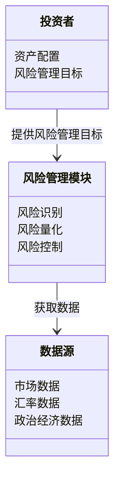
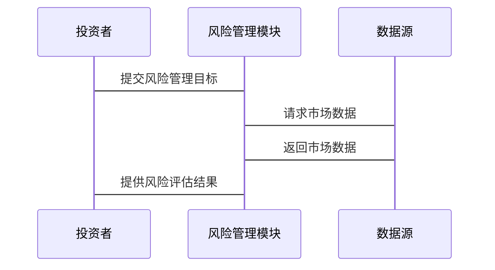

                 


# 特价股票投资中的国际化风险管理

> 关键词：特价股票，国际化风险管理，投资策略，风险管理框架，数学模型，资产配置

> 摘要：本文深入探讨了在特价股票投资中面临的国际化风险管理问题，从核心概念到算法原理，再到系统架构与项目实战，全面分析了如何在全球化背景下有效管理和应对投资风险。文章结合理论与实践，为投资者提供了系统的风险管理框架和实用的策略建议。

---

## 第一部分: 特价股票投资中的国际化风险管理背景与概述

### 第1章: 特价股票与国际化风险管理概述

#### 1.1 特价股票的基本概念

##### 1.1.1 特价股票的定义与特点
特价股票是指市场价格低于其内在价值的股票，通常具有较高的投资潜力。其特点包括低估值、高成长性和较高的风险回报比。

##### 1.1.2 特价股票的投资价值与风险
特价股票的投资价值体现在其潜在的增值空间，但其风险主要来自于市场波动、公司基本面变化和流动性风险。

##### 1.1.3 特价股票与普通股票的区别
| 特性 | 特价股票 | 普通股票 |
|------|----------|----------|
| 价格 | 低于内在价值 | 反映市场供需 |
| 风险 | 高 | 中等 |
| 投资价值 | 高 | 一般 |

#### 1.2 国际化风险管理的背景与意义

##### 1.2.1 全球化投资的兴起
随着全球经济一体化，投资者可以跨国配置资产，但这也带来了复杂的跨国风险。

##### 1.2.2 国际化风险管理的必要性
跨国投资涉及多国法律、经济和政治环境，风险管理是确保投资安全的核心。

##### 1.2.3 国际化风险管理的核心目标
通过识别、量化和控制跨国投资风险，确保投资组合的稳定性和收益性。

#### 1.3 特价股票投资中的风险管理挑战

##### 1.3.1 特价股票市场的波动性
市场波动可能导致股票价格快速变化，增加了风险管理的难度。

##### 1.3.2 跨国投资中的汇率风险
汇率波动直接影响跨国投资的收益，增加了投资决策的复杂性。

##### 1.3.3 政治经济环境的不确定性
国际政治和经济环境的变化可能对投资产生重大影响，如贸易摩擦、政策变化等。

---

### 第2章: 国际化风险管理的核心概念

#### 2.1 风险管理的基本原理

##### 2.1.1 风险的定义与分类
风险是投资收益的不确定性，可分为系统性风险和非系统性风险。

##### 2.1.2 风险管理的流程与方法
1. 风险识别：确定可能的风险来源。
2. 风险量化：评估风险的影响程度。
3. 风险控制：制定应对策略。

##### 2.1.3 风险管理的数学模型
系统性风险可以通过Beta系数量化，而非系统性风险可以通过标准差量化。

#### 2.2 特价股票投资中的风险来源

##### 2.2.1 市场风险
市场价格波动对投资组合的影响。

##### 2.2.2 汇率风险
汇率变化对跨国投资收益的影响。

##### 2.2.3 政治风险
国际政治经济环境变化对投资的影响。

##### 2.2.4 公司特风险
公司自身经营状况对股票价格的影响。

#### 2.3 国际化风险管理的策略与工具

##### 2.3.1 风险分散
通过多元化投资降低风险。

##### 2.3.2 期权与期货工具
利用金融衍生品对冲风险。

##### 2.3.3 资产配置策略
通过合理配置资产种类降低风险。

---

### 第3章: 特价股票投资中的国际化风险管理框架

#### 3.1 风险管理框架的构建

##### 3.1.1 风险识别与评估
通过分析市场、汇率和政治环境等因子，识别潜在风险。

##### 3.1.2 风险量化与测量
使用VaR（在险价值）和CVaR（条件在险价值）等指标量化风险。

##### 3.1.3 风险控制与应对
制定应对策略，如对冲、分散投资等。

#### 3.2 风险管理框架的实施步骤

##### 3.2.1 确定风险管理目标
明确风险管理的具体目标和范围。

##### 3.2.2 选择风险管理工具
根据风险类型选择合适的对冲工具。

##### 3.2.3 制定风险管理策略
制定风险分散、对冲等具体策略。

##### 3.2.4 实施与监控
持续监控风险变化，及时调整策略。

---

## 第四部分: 系统分析与架构设计方案

### 第4章: 投资风险管理系统的架构设计

#### 4.1 问题场景介绍
跨国投资涉及多国市场，需要实时监控和动态调整风险管理策略。

#### 4.2 项目介绍
构建一个跨国投资风险管理平台，帮助投资者实时监控和管理风险。

#### 4.3 系统功能设计（领域模型）

##### 4.3.1 领域模型（Mermaid 类图）


#### 4.4 系统架构设计（Mermaid 架构图）


#### 4.5 系统接口设计
- 输入接口：接收投资者的资产配置和风险管理目标。
- 输出接口：提供风险评估结果和对冲建议。

#### 4.6 系统交互设计（Mermaid 序列图）


---

## 第五部分: 项目实战

### 第5章: 投资风险管理系统的实现

#### 5.1 环境安装
- 安装Python和相关库（如Pandas、NumPy、Matplotlib）。
- 安装风险管理相关的金融库（如Pyfolio、Riskfolio-Lib）。

#### 5.2 系统核心实现源代码

##### 5.2.1 风险量化代码
```python
import pandas as pd
import numpy as np

def calculate VaR(returns, confidence_level):
    returns_sorted = np.sort(returns)
    index = int(len(returns_sorted) * (1 - confidence_level))
    VaR = -returns_sorted[index]
    return VaR

# 示例数据
returns = pd.Series([0.02, -0.01, 0.03, -0.02, 0.01])
confidence_level = 0.95
VaR = calculate VaR(returns, confidence_level)
print(f"VaR at {confidence_level} confidence level: {VaR}")
```

##### 5.2.2 资产配置代码
```python
import numpy as np
from scipy.optimize import minimize

def portfolio_optimization(returns, covariance, weights_sum=1):
    n = len(weights_sum)
    # 定义优化目标
    def objective(weights):
        return (weights.T @ covariance @ weights).item()
    # 定义约束条件
    constraints = [{'type': 'eq', 'fun': lambda w: sum(w) - weights_sum},
                   {'type': 'eq', 'fun': lambda w: sum(w * returns) - 0}]
    # 初始猜测
    initial_guess = np.array([1.0 / n] * n)
    # 求解
    result = minimize(objective, initial_guess, constraints)
    return result.x

# 示例数据
returns = np.array([0.1, 0.15, 0.05])
covariance = np.array([[0.04, 0.02, 0.01],
                        [0.02, 0.09, 0.03],
                        [0.01, 0.03, 0.05]])
weights = portfolio_optimization(returns, covariance)
print(f"Optimal weights: {weights}")
```

#### 5.3 代码应用解读与分析
通过上述代码，我们可以量化投资组合的风险并优化资产配置，从而降低国际化投资中的风险。

#### 5.4 实际案例分析和详细讲解剖析
以某跨国投资组合为例，分析如何通过上述方法降低汇率和市场风险。

#### 5.5 项目小结
通过实战项目，我们可以看到数学模型和系统架构在风险管理中的实际应用。

---

## 第六部分: 总结与展望

### 第6章: 最佳实践与总结

#### 6.1 关键点回顾
- 风险管理是国际化投资的核心。
- 多元化的策略和数学模型是有效的工具。
- 系统监控和动态调整是关键。

#### 6.2 最佳实践 tips
- 定期监控市场和政治环境的变化。
- 合理配置资产，分散风险。
- 学习和应用新的风险管理工具。

#### 6.3 未来展望
随着人工智能和大数据技术的发展，风险管理将更加智能化和精准化。

---

作者：AI天才研究院/AI Genius Institute & 禅与计算机程序设计艺术 /Zen And The Art of Computer Programming

