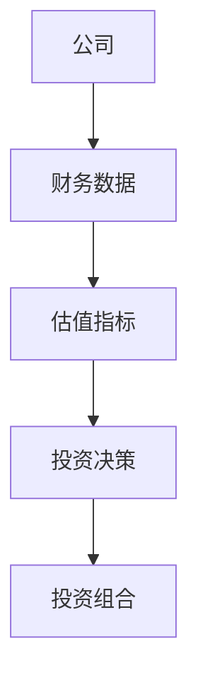
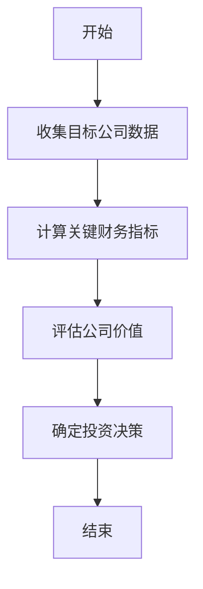
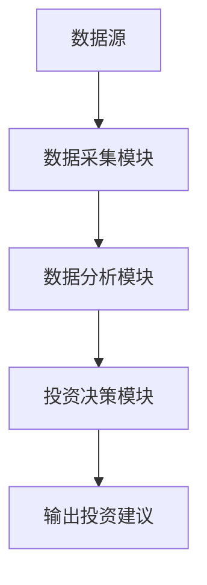

                 


# 《玛丽·巴芙的全球价值投资策略》

---

## 关键词：
- 价值投资
- 玛丽·巴芙
- 全球投资
- 股票估值
- 投资策略
- 财务分析

---

## 摘要：
玛丽·巴芙的全球价值投资策略是一种以基本面分析为核心，结合长期持有和安全边际原则的投资方法。本文将从价值投资的背景、核心概念、算法原理、数学模型、系统架构、项目实战以及最佳实践等多个维度，全面解析玛丽·巴芙的投资理念和策略。通过详细的理论分析、代码实现和实际案例，本文旨在为投资者提供一套可操作的全球价值投资框架。

---

## 第一部分：价值投资的背景与基础

### 第1章：价值投资的定义与背景

#### 1.1 价值投资的核心概念
- 1.1.1 价值投资的定义  
  价值投资是一种以低于内在价值的价格买入优质资产的投资策略，强调对公司基本面的深入分析和长期持有。

- 1.1.2 价值投资的历史演变  
  从本杰明·格雷厄姆到沃伦·巴菲特，价值投资经历了从学术理论到实践应用的演变。

- 1.1.3 玛丽·巴芙的价值投资哲学  
  玛丽·巴芙继承并发展了传统的价值投资理念，强调在全球范围内寻找被市场低估的优质企业。

---

#### 1.2 全球投资环境的现状
- 1.2.1 全球化投资的特点  
  全球化投资允许投资者在更广泛的市场中寻找机会，但也带来了更高的复杂性和不确定性。

- 1.2.2 现代投资工具与策略  
  包括ETF、指数基金、量化投资等工具的出现，使得价值投资的实施更加多样化。

- 1.2.3 价值投资在全球市场中的应用  
  本文将重点分析玛丽·巴芙如何在全球范围内应用价值投资策略。

---

## 第二部分：价值投资的核心概念与联系

### 第2章：价值投资的核心原理

#### 2.1 价值投资的基本原理
- 2.1.1 安全边际的概念  
  安全边际是价值投资的核心原则之一，指买入价格低于内在价值的部分，以降低投资风险。

- 2.1.2 长期投资的逻辑  
  长期投资通过复利效应实现财富增长，同时减少短期市场波动的干扰。

- 2.1.3 市场先生的比喻  
  巴菲特提出的市场先生概念，帮助投资者理解市场情绪与投资机会的关系。

---

#### 2.2 核心概念对比分析
- 2.2.1 价值投资与成长投资的对比  
  价值投资注重低估值，成长投资注重高增长，两者在投资目标和策略上有显著差异。

- 2.2.2 价值投资与趋势投资的对比  
  趋势投资依赖于技术分析，而价值投资依赖于基本面分析。

- 2.2.3 价值投资与指数投资的对比  
  指数投资追求市场平均收益，而价值投资追求超额收益。

---

### 第3章：价值投资的核心概念联系

#### 3.1 价值投资的核心要素
- 公司基本面：包括盈利能力、财务状况、竞争优势等。
- 市场估值：包括市盈率、市净率、股息率等。
- 投资组合：包括资产配置、风险分散等。

#### 3.2 核心概念对比表格
| 投资策略 | 价值投资 | 成长投资 | 趋势投资 |
|----------|-----------|----------|----------|
| 核心目标 | 低估值   | 高增长  | 技术信号 |
| 分析方法 | 基本面分析 | 增速分析 | 技术分析 |
| 持股时间 | 长期      | 中长期  | 短期      |

#### 3.3 实体关系图（ER图）


---

## 第三部分：价值投资的算法与数学模型

### 第4章：价值投资的算法原理

#### 4.1 价值投资的量化分析
- 4.1.1 基本面分析的步骤  
  1. 收集公司数据：包括财务报表、行业地位、管理层等。  
  2. 计算财务指标：如ROE（净资产收益率）、ROA（资产净利率）等。  
  3. 评估公司价值：通过DCF模型（ discounted cash flow model）估算内在价值。

- 4.1.2 财务指标的筛选方法  
  1. 利润能力：ROE > 15%。  
  2. 偿债能力：流动比率 > 2。  
  3. 成长能力：收入增速 > 行业平均。

---

#### 4.2 算法流程图


---

#### 4.3 代码实现
```python
import pandas as pd

def calculate_value(company_data):
    pe_ratio = company_data['股价'] / company_data['每股收益']
    return pe_ratio

# 示例数据
company_data = {
    '股价': 100,
    '每股收益': 10,
    '净资产收益率': 20,
    '流动比率': 2.5,
    '收入增速': 15
}

pe_ratio = calculate_value(company_data)
print(f"市盈率：{pe_ratio}")
```

---

### 第5章：价值投资的数学模型

#### 5.1 估值模型
- 现金流折现模型（DCF模型）：
  $$ V = \sum_{t=1}^{n} \frac{CF_t}{(1 + r)^t} $$
  其中，\( V \) 为公司价值，\( CF_t \) 为第 \( t \) 年的现金流，\( r \) 为折现率。

- 市盈率模型：
  $$ P/E = \frac{P}{E} $$
  其中，\( P \) 为股价，\( E \) 为每股收益。

---

#### 5.2 模型对比
- DCF模型适用于成长型企业，市盈率模型适用于成熟型企业。

---

## 第四部分：价值投资的系统架构设计

### 第6章：价值投资的系统架构

#### 6.1 投资决策系统的功能设计
- 数据采集模块：收集公司基本面数据和市场数据。
- 数据分析模块：计算财务指标和估值指标。
- 投资决策模块：根据模型生成投资建议。

#### 6.2 系统架构图


---

## 第五部分：价值投资的项目实战

### 第7章：价值投资的实战应用

#### 7.1 项目环境安装
- 安装Python和必要的库：
  ```bash
  pip install pandas numpy matplotlib
  ```

---

#### 7.2 核心代码实现
```python
import pandas as pd
import numpy as np

def calculate_intrinsic_value(revenue, net_profit_margin, growth_rate):
    # 计算未来现金流
    cash_flows = []
    for i in range(5):
        cash_flows.append(revenue * (1 + growth_rate) ** i * net_profit_margin)
    # 折现率假设为10%
    discount_rate = 0.10
    present_value = sum(cash_flows / (1 + discount_rate) ** i for i in range(5))
    return present_value

# 示例数据
revenue = 100000000
net_profit_margin = 0.1
growth_rate = 0.15

intrinsic_value = calculate_intrinsic_value(revenue, net_profit_margin, growth_rate)
print(f"内在价值：{intrinsic_value}")
```

---

#### 7.3 案例分析
- 案例：某科技公司基本面分析与估值。
- 分析过程：数据收集、指标计算、估值模型应用。

---

## 第六部分：价值投资的最佳实践

### 第8章：价值投资的注意事项

#### 8.1 投资中的常见误区
- 过度关注短期波动。
- 忽视公司基本面。
- 过度依赖单一指标。

#### 8.2 投资中的小结
- 价值投资需要耐心和纪律。
- 需要不断学习和更新知识。
- 要结合全球市场进行分散投资。

---

## 第七部分：拓展阅读

### 8.3 拓展阅读推荐
- 《聪明的投资者》（本杰明·格雷厄姆）
- 《巴菲特致股东的信》（沃伦·巴菲特）
- 《投资中最简单的事》（彼得·林奇）

---

## 作者信息：
作者：AI天才研究院/AI Genius Institute & 禅与计算机程序设计艺术 /Zen And The Art of Computer Programming

---

以上为《玛丽·巴芙的全球价值投资策略》的完整大纲和文章内容。通过这一系列的分析和讲解，我们可以深入理解价值投资的核心理念、算法原理和实际应用。希望本文能够为投资者提供有价值的参考和指导。

