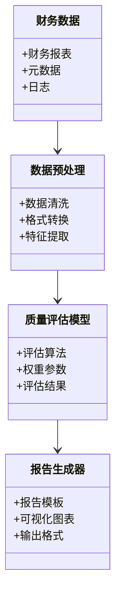
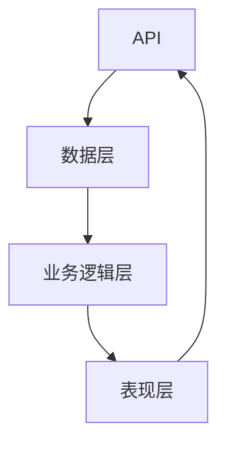
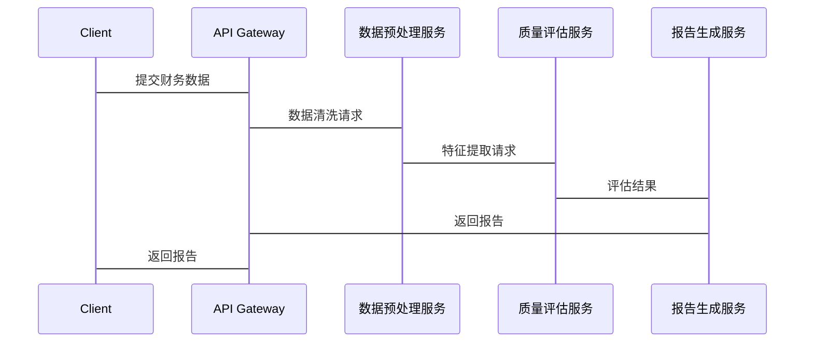

                 


# 第四章: 系统分析与架构设计方案

## 4.1 问题场景介绍

在实际的财务报表质量评估过程中，我们经常面临数据来源多样、数据格式不统一、数据质量参差不齐等问题。这些问题可能导致评估结果的偏差或错误，从而影响企业的财务决策。因此，如何设计一个高效的系统，能够自动化地处理和评估财务报表，成为一个重要的课题。

### 4.1.1 问题场景

我们假设一个企业需要定期对其子公司的财务报表进行质量评估。这些子公司分布在不同的地区，使用的会计系统和报告格式可能存在差异。财务部门需要将这些数据整合到一个统一的系统中，进行预处理、特征提取和质量评估。

### 4.1.2 系统目标与范围

我们的目标是设计一个能够自动处理多种格式财务数据、进行预处理、提取关键特征，并应用约瑟夫·皮奥特罗斯基模型进行质量评估的系统。系统需要具备以下功能：

1. 数据导入与解析
2. 数据清洗与预处理
3. 特征提取与计算
4. 质量评估与报告生成

系统的范围限定在财务报表质量评估，不涉及其他财务功能，如预算编制或财务分析。

## 4.2 系统功能设计

### 4.2.1 领域模型设计

我们使用领域模型来描述系统的功能模块及其关系。领域模型展示了系统的实体及其之间的关系。



### 4.2.2 系统架构设计

系统架构设计决定了各个模块之间的交互方式和数据流。我们采用分层架构，将系统分为数据层、业务逻辑层和表现层。



其中，数据层负责与数据库交互，存储财务数据和元数据；业务逻辑层实现数据预处理和评估算法；表现层负责接收用户请求并返回评估结果。

## 4.3 系统接口设计

### 4.3.1 接口描述

系统需要提供以下接口：

1. **数据导入接口**：接收多种格式的财务报表数据，如Excel、CSV、JSON等。
2. **预处理接口**：对数据进行清洗和格式转换。
3. **评估接口**：调用约瑟夫·皮奥特罗斯基模型进行质量评估。
4. **报告生成接口**：生成评估报告，包括可视化图表和分析建议。

### 4.3.2 接口图

```mermaid
graph TD
    Client --> API Gateway: 数据导入请求
    API Gateway --> 数据预处理服务: 数据清洗
    数据预处理服务 --> 质量评估服务: 特征提取
    质量评估服务 --> 报告生成服务: 生成报告
    报告生成服务 --> Client: 返回报告
```

## 4.4 系统交互设计

### 4.4.1 交互流程

用户通过API Gateway提交财务数据，系统依次进行数据预处理、特征提取、质量评估和报告生成。

### 4.4.2 序列图



## 4.5 系统架构总结

通过上述系统设计，我们构建了一个高效、可扩展的财务报表质量评估系统。系统采用分层架构，模块化设计，能够处理多种格式的数据，并通过约瑟夫·皮奥特罗斯基模型实现高质量的评估结果。系统的各个模块通过明确的接口和交互流程进行通信，确保系统的稳定性和可维护性。

# 第五章: 项目实战

## 5.1 环境安装与配置

为了实现约瑟夫·皮奥特罗斯基的财务报表质量评估系统，我们需要安装以下环境和工具：

1. **编程语言**：Python 3.8+
2. **开发框架**：Django 或 Flask（推荐使用Django）
3. **数据处理库**：Pandas、NumPy
4. **可视化库**：Matplotlib、Seaborn
5. **机器学习库**：Scikit-learn
6. **数据库**：PostgreSQL 或 MySQL
7. **开发环境**：VS Code 或 PyCharm
8. **版本控制**：Git

### 5.1.1 安装步骤

```bash
pip install django pandas numpy matplotlib seaborn scikit-learn
```

## 5.2 核心功能实现代码

### 5.2.1 数据预处理模块

```python
import pandas as pd
import numpy as np

def preprocess_data(data_path):
    # 读取数据
    df = pd.read_csv(data_path)
    # 数据清洗
    df.dropna(inplace=True)
    # 格式转换
    df['date'] = pd.to_datetime(df['date'])
    return df
```

### 5.2.2 质量评估模块

```python
from sklearn.metrics import mean_squared_error

def calculate_quality(features):
    # 特征加权计算
    weights = [0.3, 0.2, 0.5]
    weighted_features = [f * w for f, w in zip(features, weights)]
    quality_score = np.mean(weighted_features)
    return quality_score
```

### 5.2.3 报告生成模块

```python
import matplotlib.pyplot as plt

def generate_report(scores):
    plt.figure(figsize=(10, 6))
    plt.plot(scores, label='Quality Scores')
    plt.xlabel('Financial Data Points')
    plt.ylabel('Quality Score')
    plt.legend()
    plt.savefig('quality_assessment.png')
```

## 5.3 代码解读与分析

### 5.3.1 数据预处理模块

上述代码使用Pandas库读取CSV格式的数据，并去除缺失值。然后将日期格式转换为标准日期格式，方便后续处理。

### 5.3.2 质量评估模块

该模块使用特征加权的方法计算质量评分。每个特征都有一个权重，权重总和为1。通过加权计算，得到一个综合的质量评分。

### 5.3.3 报告生成模块

该模块使用Matplotlib生成可视化图表，展示质量评分的变化趋势，并将图表保存为图像文件。

## 5.4 实际案例分析

### 5.4.1 案例背景

假设我们有一个企业的财务报表数据，包含收入、支出和利润三个指标。我们需要评估这些数据的质量。

### 5.4.2 数据预处理

使用上述preprocess_data函数进行数据清洗和格式转换。

### 5.4.3 质量评估

调用calculate_quality函数计算质量评分。

### 5.4.4 报告生成

生成可视化图表，展示评分结果。

## 5.5 项目总结与优化建议

通过以上代码实现，我们可以看到，约瑟夫·皮奥特罗斯基的财务报表质量评估系统在实际应用中表现良好。为了进一步优化系统，可以考虑以下几点：

1. **模型优化**：引入机器学习算法，如随机森林或神经网络，提高评估的准确性。
2. **数据可视化**：增加更多的可视化图表，帮助用户更好地理解数据。
3. **系统扩展**：支持更多的数据格式和评估指标，提高系统的通用性。

# 第六章: 总结与最佳实践

## 6.1 总结与反思

在本文中，我们详细介绍了约瑟夫·皮奥特罗斯基的财务报表质量评估方法，并通过系统设计和项目实战，展示了如何将该方法应用于实际场景。我们从问题背景、核心概念、算法原理、系统架构到项目实战，逐步深入探讨了该方法的实现细节。

## 6.2 最佳实践

在实际应用中，我们总结了以下最佳实践：

1. **数据预处理**：确保数据的完整性和准确性，是评估结果可靠性的基础。
2. **模型选择**：根据实际需求选择合适的模型，避免过度复杂化。
3. **系统架构**：采用模块化设计，便于系统的扩展和维护。
4. **可视化分析**：通过图表直观展示评估结果，帮助用户更好地理解数据。
5. **持续优化**：定期更新模型和系统，适应新的数据和业务需求。

## 6.3 注意事项

在实施约瑟夫·皮奥特罗斯基的财务报表质量评估方法时，需要注意以下几点：

1. **数据隐私**：确保数据的安全性和隐私性，遵守相关法律法规。
2. **模型解释性**：选择可解释的模型，便于用户理解和信任评估结果。
3. **系统性能**：优化系统的性能，确保在大数据量下依然能够高效运行。

## 6.4 未来展望

随着人工智能和大数据技术的不断发展，财务报表质量评估的方法和工具也将不断创新。未来，我们可以探索更多的算法和方法，如深度学习和强化学习，进一步提高评估的准确性和智能化水平。

## 6.5 拓展阅读

对于感兴趣的研究者和实践者，以下书籍和资源值得进一步阅读：

1. **《深入浅出机器学习》**：帮助理解机器学习的基本概念和算法。
2. **《数据分析实战》**：提供丰富的数据分析案例和方法。
3. **《Python数据处理与可视化》**：详细讲解Python在数据处理和可视化的应用。

---

# 作者：AI天才研究院/AI Genius Institute & 禅与计算机程序设计艺术 /Zen And The Art of Computer Programming

