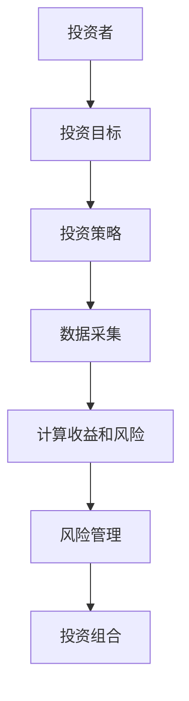

                 


# 约翰·伯格的指数投资哲学：为什么市场难以战胜

**关键词**：指数投资，约翰·伯格，市场有效性，投资者行为，长期投资，被动投资

**摘要**：本文深入探讨了约翰·伯格的指数投资哲学，分析了指数投资的核心概念、数学模型、与主动投资的比较以及其在实际投资中的应用。通过系统化的分析和详细的案例研究，本文揭示了为什么市场难以被战胜，并为投资者提供了实用的建议。

---

## 第1章: 指数投资的起源与核心概念

### 1.1 约翰·伯格与指数投资的起源

#### 1.1.1 约翰·伯格的生平简介

约翰·伯格（John C. Bogle）是指数投资领域的先驱，被誉为“指数基金之父”。他于1940年出生于美国宾夕法尼亚州，1965年创立了华安基金（Vanguard Group），并在此基础上推出了全球第一只指数基金——Vanguard 500 Index Fund。伯格的贡献不仅在于他开创了指数投资的先河，还在于他通过长期实践验证了指数投资的有效性和优越性。

#### 1.1.2 索罗维基指数投资理论的提出

伯格的指数投资理论基于以下几个核心假设：

1. **市场有效性**：市场是有效的，即股票的价格已经反映了所有可获得的信息。这意味着，通过基本面分析或技术分析来战胜市场几乎是不可能的。
2. **投资者行为心理学**：投资者往往容易受到情绪的影响，做出非理性的决策，如追涨杀跌，这会导致投资收益的不稳定。
3. **长期投资的优越性**：通过长期持有指数基金，投资者可以避免频繁交易的成本和风险，从而实现稳定的收益。

#### 1.1.3 索罗维基指数投资的核心思想

伯格的核心思想可以概括为：通过长期持有低成本的指数基金，投资者可以以较低的成本获得市场的平均收益，从而实现财富的稳步增长。

---

### 1.2 指数投资的定义与特点

#### 1.2.1 指数投资的定义

指数投资是一种被动投资策略，其核心是通过跟踪市场指数（如标普500指数）来实现投资收益。指数基金的投资组合通常由指数中的成分股构成，且权重与指数中的权重一致。

#### 1.2.2 指数投资的核心特点

1. **低成本**：指数基金的管理费用较低，因为其投资策略简单，不需要频繁的交易和管理。
2. **分散化**：通过投资多个成分股，指数基金可以有效分散风险。
3. **长期稳定性**：指数投资注重长期收益，避免了短期波动的影响。

#### 1.2.3 指数投资与主动投资的区别

| 属性                | 指数投资                | 主动投资                |
|---------------------|-------------------------|-------------------------|
| 投资策略            | 被动跟踪市场指数        | 主动选择个股和时机      |
| 管理费用            | 低                     | 高                     |
| 风险                | 低（分散化）            | 高（集中投资）          |
| 收益                | 稳定（市场平均收益）    | 不稳定（可能跑赢或跑输市场）|

---

## 第2章: 指数投资的核心数学模型与公式

### 2.1 指数投资的数学模型

#### 2.1.1 市场指数的计算公式

市场指数的计算通常基于成分股的加权平均值。例如，标普500指数的计算公式为：

$$ \text{指数值} = \frac{\sum (P_i \times W_i)}{W_i} $$

其中，\( P_i \) 是成分股的当前价格，\( W_i \) 是其权重。

#### 2.1.2 指数投资的收益计算

假设投资者投入 \( M \) 元资金，投资于一只跟踪市场指数的指数基金。指数在投资期间的涨幅为 \( R \)，则投资者的收益为：

$$ \text{收益} = M \times R $$

---

### 2.2 指数投资的成本分析

#### 2.2.1 交易成本的计算

指数基金的交易成本通常包括管理费用和托管费用。假设管理费用率为 \( C \)，则每年的总成本为：

$$ \text{总成本} = M \times C $$

#### 2.2.2 成本对长期收益的影响

考虑通货膨胀和复利效应，长期收益可以通过以下公式计算：

$$ \text{净收益} = (M \times (1 + R - C))^t $$

其中，\( t \) 是投资的年数。

---

## 第3章: 指数投资与主动投资的比较

### 3.1 主动投资的定义与特点

#### 3.1.1 主动投资的核心思想

主动投资的核心思想是通过精选个股和择时交易来战胜市场。然而，这种策略的成功率非常低，且需要承担较高的交易成本和管理费用。

#### 3.1.2 主动投资的优缺点

| 优点                | 缺点                |
|---------------------|---------------------|
| 可能获得超额收益    | 成本高              |
| 可能捕捉市场机会    | 风险高              |

#### 3.1.3 主动投资的数学模型

主动投资的收益可以通过以下公式计算：

$$ \text{主动收益} = \text{超额收益} - \text{管理成本} $$

---

### 3.2 指数投资与主动投资的比较分析

#### 3.2.1 长期收益比较

长期来看，指数投资的收益通常优于主动投资，因为主动投资的高成本和高风险往往会侵蚀收益。

#### 3.2.2 风险比较

指数投资的风险较低，因为其通过分散化投资降低了个股风险。而主动投资的风险较高，因为其集中投资于少数股票。

#### 3.2.3 成本比较

指数投资的成本较低，而主动投资的成本较高，这使得后者难以长期战胜市场。

---

## 第4章: 指数投资的系统分析

### 4.1 投资者行为分析

#### 4.1.1 投资者心理偏差

投资者的行为往往受到心理偏差的影响，例如：

1. **过度自信**：投资者倾向于相信自己能够预测市场走势。
2. **羊群效应**：投资者容易跟随市场潮流，导致非理性决策。

#### 4.1.2 行为对投资决策的影响

心理偏差会导致投资者做出错误的投资决策，例如在市场高点追涨，在市场低点恐慌性抛售。

#### 4.1.3 理性与非理性决策的对比

| 理性决策             | 非理性决策             |
|----------------------|-------------------------|
| 基于事实和数据       | 基于情绪和直觉         |
| 长期视角             | 短期视角               |

---

### 4.2 市场行为分析

#### 4.2.1 市场有效性的假设

市场有效性假设认为，市场价格已经反映了所有可获得的信息，因此，通过基本面分析或技术分析来战胜市场几乎是不可能的。

#### 4.2.2 市场波动的规律

市场波动是随机的，无法被预测。因此，投资者应该关注长期趋势，而不是短期波动。

#### 4.2.3 市场参与者的行为对指数的影响

市场参与者的非理性行为会导致短期波动，但长期来看，市场会回归其内在价值。

---

## 第5章: 指数投资的架构设计方案

### 5.1 投资策略的制定

#### 5.1.1 投资目标的设定

投资者需要明确自己的投资目标，例如：

1. 长期资本增值
2. 稳定的现金流
3. 风险控制

#### 5.1.2 投资期限的确定

投资期限的长短会影响投资策略的选择。长期投资者更适合指数投资，而短期投资者则更适合主动投资。

#### 5.1.3 投资组合的构建

指数投资的组合通常由跟踪市场指数的基金构成。例如，投资于标普500指数基金，可以实现对整个市场的分散化投资。

---

### 5.2 风险管理的实现

#### 5.2.1 风险的定义与分类

风险是指投资收益的不确定性。指数投资的风险主要包括市场风险和流动性风险。

#### 5.2.2 风险的量化方法

风险可以通过波动率来量化，波动率越高，风险越大。波动率的计算公式为：

$$ \text{波动率} = \sqrt{\frac{\sum (R_i - \bar{R})^2}{N-1}} $$

其中，\( R_i \) 是每期的收益，\( \bar{R} \) 是平均收益，\( N \) 是期数。

#### 5.2.3 风险控制的策略

1. 通过分散化投资降低风险。
2. 长期持有，避免短期波动的影响。

---

### 5.3 系统架构的实现

#### 5.3.1 系统功能设计

指数投资系统的功能模块包括：

1. 数据采集模块：采集市场指数数据。
2. 计算模块：计算指数基金的收益和风险。
3. 投资策略模块：制定投资策略。
4. 风险管理模块：监控和控制风险。

#### 5.3.2 系统架构图



---

## 第6章: 项目实战

### 6.1 环境安装

#### 6.1.1 系统环境

需要安装Python编程语言和相关库，例如Pandas和Matplotlib。

#### 6.1.2 安装步骤

1. 安装Python：可以从官网下载安装。
2. 安装Pandas：使用命令 `pip install pandas`。
3. 安装Matplotlib：使用命令 `pip install matplotlib`。

---

### 6.2 系统核心实现源代码

#### 6.2.1 指数计算代码

```python
import pandas as pd
import matplotlib.pyplot as plt

# 读取指数数据
data = pd.read_csv('index.csv')

# 计算指数值
index_value = data['Close'].mean()

# 可视化指数趋势
plt.plot(data['Date'], data['Close'])
plt.title('Index Trend')
plt.xlabel('Date')
plt.ylabel('Price')
plt.show()
```

#### 6.2.2 成本计算代码

```python
# 计算总成本
management_cost = 0.01  # 管理费用率
total_cost = data['Close'].mean() * management_cost

print(f"Total Cost: {total_cost}")
```

---

### 6.3 代码应用解读与分析

#### 6.3.1 指数计算代码解读

上述代码首先读取指数数据，然后计算指数的平均值，并绘制指数价格的趋势图。这可以帮助投资者了解市场的整体走势。

#### 6.3.2 成本计算代码解读

上述代码计算了指数基金的管理费用，并输出了总成本。这可以帮助投资者了解投资成本对收益的影响。

---

### 6.4 实际案例分析

#### 6.4.1 案例背景

假设投资者投入10000元，投资于一只跟踪标普500指数的指数基金，管理费用率为1%。

#### 6.4.2 计算收益

指数在投资期间的平均涨幅为8%。

$$ \text{收益} = 10000 \times 0.08 = 800 \text{元} $$

#### 6.4.3 计算成本

$$ \text{总成本} = 10000 \times 0.01 = 100 \text{元} $$

#### 6.4.4 净收益

$$ \text{净收益} = 800 - 100 = 700 \text{元} $$

---

### 6.5 项目小结

通过上述实战，我们可以看到，指数投资的收益计算相对简单，且成本较低。然而，投资者需要长期持有指数基金，才能实现稳定的收益。

---

## 第7章: 总结与最佳实践

### 7.1 小结

指数投资是一种简单有效的投资策略，其核心思想是通过长期持有低成本的指数基金，获得市场的平均收益。与主动投资相比，指数投资具有低成本、低风险和高稳定性的特点。

### 7.2 注意事项

1. **选择低成本的指数基金**：管理费用率越低，收益越高。
2. **长期持有**：避免频繁交易，减少成本和风险。
3. **分散化投资**：通过投资多个指数基金，进一步分散风险。

### 7.3 拓展阅读

1. 《指数投资入门》——约翰·伯格
2. 《投资学基础》——达里欧

---

**作者：AI天才研究院/AI Genius Institute & 禅与计算机程序设计艺术 /Zen And The Art of Computer Programming**

