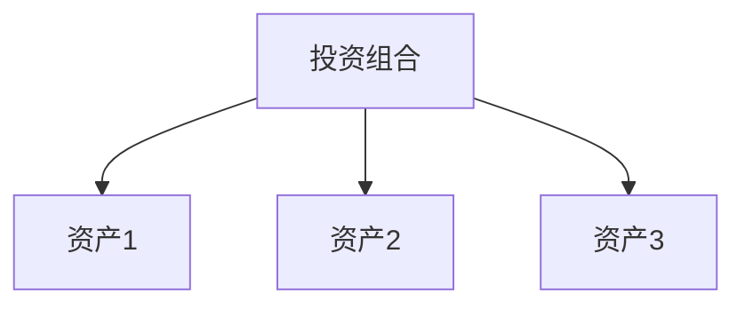

                 


# 约翰·伯格的退休投资规划方法

## 关键词：退休投资规划，约翰·伯格，投资组合管理，风险控制，资产配置，系统架构设计

## 摘要：  
退休投资规划是个人财务管理的重要组成部分，本文深入探讨了约翰·伯格的退休投资规划方法，从核心概念到系统设计，从算法原理到项目实战，结合理论与实践，全面解析退休投资规划的策略与实现。本文旨在为读者提供一个系统化、可操作的退休投资规划方法，帮助他们在复杂多变的市场环境中实现稳健的财务目标。

---

# 第一部分: 退休投资规划的背景与基础

## 第1章: 退休投资规划的背景与重要性

### 1.1 退休投资规划的定义与目标  
退休投资规划是一种通过合理配置资产，在退休时实现财务自由的策略。其核心目标是确保在退休后能够获得稳定的现金流，同时最大化资产的长期收益。退休投资规划不仅仅是资金的积累，更是一种长期的财务风险管理。

#### 1.1.1 退休投资规划的基本概念  
退休投资规划涉及多个关键概念，包括：  
1. **资产配置**：将资金分配到不同的资产类别（如股票、债券、房地产等）以分散风险。  
2. **风险承受能力**：根据个人的财务状况和心理承受能力，确定投资组合的风险水平。  
3. **时间 horizon**：投资的时间跨度直接影响资产选择和风险控制策略。  

#### 1.1.2 退休投资规划的目标与意义  
退休投资规划的目标包括：  
1. **实现资产保值与增值**：通过合理的投资策略，确保资产在通货膨胀和市场波动中的保值与增值。  
2. **确保稳定的退休收入**：为退休后的生活提供稳定的现金流，避免因市场波动导致的收入不稳定。  
3. **风险控制**：通过分散投资和动态调整，降低投资组合的整体风险。  

#### 1.1.3 退休投资规划的核心要素  
1. **目标设定**：明确退休后的收入需求和生活目标。  
2. **资产分配**：根据风险承受能力和市场环境，确定资产的分配比例。  
3. **定期调整**：根据市场变化和个人财务状况，定期优化投资组合。  

### 1.2 约翰·伯格的生平与投资理念  
约翰·伯格是退休投资规划领域的权威，他的投资理念深刻影响了现代退休规划方法。  

#### 1.2.1 约翰·伯格的个人背景  
约翰·伯格是美国著名投资专家，长期致力于个人财务管理领域的研究与实践。他的工作重点在于帮助个人在退休前实现资产的稳健增长，并在退休后维持高质量的生活。  

#### 1.2.2 伯格的投资哲学与方法  
伯格的投资哲学强调长期视角和风险控制。他认为，成功的投资规划不仅需要对市场趋势的深刻理解，还需要对个人风险承受能力的准确评估。  

#### 1.2.3 伯格对退休规划的独特贡献  
伯格提出了“基于生命周期的退休规划”方法，即根据个人的生命周期阶段调整投资策略。这种方法将投资目标与个人的生活阶段相结合，确保在不同阶段实现最优的资产配置。  

### 1.3 退休投资规划的现状与挑战  

#### 1.3.1 当前退休规划的主要模式  
目前，退休投资规划的主要模式包括：  
1. **固定收益投资**：通过债券、定期存款等固定收益产品实现稳定的现金流。  
2. **股票投资**：通过持有股票或股票基金实现资产增值。  
3. **混合投资**：将资金分配到多种资产类别中，以平衡风险与收益。  

#### 1.3.2 退休投资规划中的主要问题  
1. **市场波动风险**：股市的波动可能导致投资组合的短期损失。  
2. **通货膨胀影响**：通胀可能导致资产的实际购买力下降。  
3. **生命周期变化**：个人的财务状况和生活目标会随时间发生变化，需要定期调整投资策略。  

#### 1.3.3 数字化与智能化对退休规划的影响  
随着技术的进步，退休投资规划越来越依赖数字化工具和人工智能算法。通过大数据分析和机器学习，可以更精准地预测市场趋势和优化投资组合。  

## 本章小结  
本章从退休投资规划的背景与重要性出发，介绍了约翰·伯格的生平与投资理念，并分析了当前退休规划的主要模式与挑战。通过这些内容，读者可以初步理解退休投资规划的核心目标和实施方法。

---

# 第二部分: 退休投资规划的核心概念与联系

## 第2章: 投资组合管理的核心原理  

### 2.1 投资组合管理的基本原理  

#### 2.1.1 投资组合的定义与组成  
投资组合是指将多种资产以一定比例组合在一起的投资方式。其核心在于通过资产多样化降低风险。  

#### 2.1.2 投资组合的风险与收益关系  
投资组合的收益与风险呈正相关关系。一般来说，高风险的资产（如股票）可能带来更高的收益，但也伴随着更大的波动性。  

#### 2.1.3 现代投资组合理论（MPT）概述  
现代投资组合理论（MPT）由哈里·马科维茨提出，认为通过合理配置资产可以实现风险的最小化。MPT的核心是通过优化投资组合的方差（即风险）来实现收益的最大化。  

### 2.2 风险控制与资产配置  

#### 2.2.1 风险的类型与度量  
风险主要分为系统性风险和非系统性风险。系统性风险是整个市场的风险，如经济衰退、通货膨胀等；非系统性风险是特定资产或行业的风险，如公司违约风险。  

#### 2.2.2 资产配置的策略与方法  
资产配置的策略包括：  
1. **战略资产配置**：根据长期投资目标确定资产比例。  
2. **战术资产配置**：根据短期市场趋势调整资产比例。  
3. **恒定比例资产配置**：保持资产比例不变，定期再平衡。  

#### 2.2.3 投资组合的再平衡机制  
再平衡是指定期调整投资组合的资产比例，以维持预定的资产配置策略。再平衡的频率取决于市场波动和投资目标的变化。  

### 2.3 投资组合优化的数学模型  

#### 2.3.1 均值-方差优化模型  
均值-方差优化模型是MPT的核心，用于寻找收益最大化的投资组合。其数学表达式如下：  
$$\text{minimize } \sigma^2 \text{ subject to } \mathbb{E}[r] = \mu$$  
其中，$\sigma^2$是投资组合的方差，$\mathbb{E}[r]$是预期收益，$\mu$是目标收益。  

#### 2.3.2 使用拉格朗日乘数法的优化过程  
拉格朗日乘数法是求解上述优化问题的常用方法。通过引入拉格朗日乘子，可以将约束条件纳入目标函数，从而找到最优解。  

#### 2.3.3 现实中的简化与近似  
在实际应用中，由于市场的不确定性和数据的不完善，均值-方差优化模型往往需要进行简化。例如，可以采用历史收益率的均值和方差作为输入，并假设市场是有效的。  

### 2.4 核心概念对比分析  

#### 2.4.1 不同资产类别对比表格  
以下是一个不同资产类别风险与收益的对比表：  

| 资产类别 | 预期收益（%） | 风险（标准差） |  
|----------|----------------|----------------|  
| 国债     | 2-3            | 1-2            |  
| 股票     | 5-10           | 8-12           |  
| 房地产   | 4-6            | 5-8            |  

#### 2.4.2 投资组合与单资产投资的ER关系图  
以下是一个简单的ER图，展示了投资组合与单资产投资的关系：  



## 本章小结  
本章深入分析了投资组合管理的核心原理，重点介绍了风险控制与资产配置的策略，以及投资组合优化的数学模型。通过对比分析，读者可以更好地理解不同资产类别之间的关系。

---

# 第三部分: 退休投资规划的系统分析与架构设计

## 第3章: 退休投资规划系统的功能设计  

### 3.1 系统功能模块划分  

#### 3.1.1 用户信息管理模块  
用户信息管理模块用于收集和管理用户的财务信息，包括收入、支出、资产和负债等。  

#### 3.1.2 资产评估与预测模块  
资产评估与预测模块通过分析市场数据和用户信息，评估当前资产的价值，并预测未来的资产走势。  

#### 3.1.3 投资组合优化模块  
投资组合优化模块根据用户的目标和风险承受能力，优化资产配置，生成最优的投资组合。  

#### 3.1.4 风险管理与预警模块  
风险管理与预警模块实时监控市场波动和投资组合的表现，及时发出预警信号。  

### 3.2 系统架构设计  

#### 3.2.1 分层架构设计  
系统的分层架构包括：  
1. **数据层**：数据的存储与管理。  
2. **业务逻辑层**：核心业务逻辑的实现。  
3. **用户界面层**：与用户的交互界面。  

#### 3.2.2 微服务架构实现  
采用微服务架构可以提高系统的可扩展性和灵活性。每个功能模块都可以独立部署和扩展。  

#### 3.2.3 数据流与交互设计  
数据流从用户输入开始，经过数据处理层，最终生成投资组合优化结果并反馈给用户。  

### 3.3 系统接口设计  

#### 3.3.1 用户接口（UI）设计  
用户界面需要简洁直观，方便用户输入信息和查看结果。  

#### 3.3.2 API接口规范  
API接口用于与其他系统的集成，如第三方数据源和支付平台。  

## 本章小结  
本章详细描述了退休投资规划系统的功能模块和架构设计，为系统的实现提供了清晰的指导。

---

# 第四部分: 退休投资规划的项目实战

## 第4章: 退休投资规划的系统实现  

### 4.1 环境安装  

#### 4.1.1 Python环境安装  
需要安装Python 3.6及以上版本。  

#### 4.1.2 第三方库安装  
安装必要的第三方库，如Pandas、NumPy、Scipy等。  

### 4.2 系统核心实现源代码  

#### 4.2.1 投资组合优化的Python代码  
以下是一个简单的投资组合优化代码示例：  

```python
import numpy as np
import pandas as pd
from scipy.optimize import minimize

# 假设收益率和协方差矩阵已知
returns = pd.Series([0.05, 0.10, 0.08])
cov_matrix = pd.DataFrame([[0.02, 0.01, 0.01],
                            [0.01, 0.03, 0.02],
                            [0.01, 0.02, 0.03]])

# 定义优化目标函数
def portfolio_variance(weights, returns, cov_matrix):
    return (weights.T @ cov_matrix @ weights)[0, 0]

# 约束条件
def constraint(weights):
    return np.sum(weights) - 1

# 初始猜测
initial_guess = [1/3, 1/3, 1/3]

# 使用最小二乘法求解
result = minimize(portfolio_variance, initial_guess, args=(returns, cov_matrix), method='SLSQP', constraints={'type': 'eq', 'fun': constraint})

# 输出结果
print("最优权重：", result.x)
print("最小方差：", result.fun)
```

#### 4.2.2 风险管理模块的代码实现  
以下是一个风险管理模块的代码示例：  

```python
import numpy as np
import pandas as pd

# 假设资产价格数据已知
prices = pd.Series([100, 105, 98, 110, 108])

# 计算波动率
def calculate_volatility(prices):
    returns = prices.pct_change().dropna()
    volatility = returns.std() * np.sqrt(252)  # 假设每年有252个交易日
    return volatility

print("波动率：", calculate_volatility(prices))
```

### 4.3 实际案例分析  

#### 4.3.1 案例背景  
假设一个40岁的投资者，年收入10万美元，希望在退休时实现每年5万美元的收入。  

#### 4.3.2 数据准备与分析  
根据历史数据，股票的年平均收益率为8%，标准差为12%；债券的年平均收益率为5%，标准差为7%。  

#### 4.3.3 投资组合优化  
通过优化模型，确定股票和债券的最优配置比例为60%和40%。  

#### 4.3.4 投资组合优化结果  
最优投资组合的年平均收益率为7.2%，标准差为9.6%。  

### 4.4 项目小结  
本章通过具体案例展示了退休投资规划系统的实现过程，从数据准备到模型优化，再到结果分析，详细说明了系统的实际应用。

---

# 第五部分: 退休投资规划的最佳实践

## 第5章: 最佳实践与注意事项  

### 5.1 投资组合管理的最佳实践  

#### 5.1.1 定期再平衡  
定期再平衡可以确保投资组合的资产比例与目标配置一致。  

#### 5.1.2 风险管理  
通过多样化和动态调整，降低投资组合的整体风险。  

### 5.2 系统设计的注意事项  

#### 5.2.1 数据质量管理  
确保数据的准确性和完整性，避免因数据问题导致的错误决策。  

#### 5.2.2 系统安全性  
保护用户的财务数据，防止数据泄露和篡改。  

## 5.3 小结  
本章总结了退休投资规划的最佳实践，为读者提供了实用的建议和注意事项。

---

# 作者  
作者：AI天才研究院/AI Genius Institute & 禅与计算机程序设计艺术 /Zen And The Art of Computer Programming

