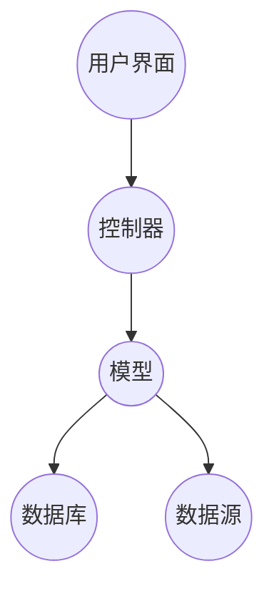
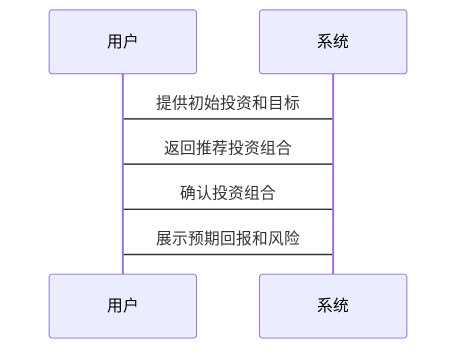

                 


# 约翰·伯格的长期投资回报预期

## 关键词：约翰·伯格，长期投资，投资回报，投资策略，投资哲学，投资模型

## 摘要：约翰·伯格是投资界的传奇人物，他的长期投资回报预期理论深刻影响了现代投资策略。本文将详细探讨约翰·伯格的投资哲学、数学模型、系统架构，并通过实际案例分析，帮助读者理解如何应用这些理论实现稳健的投资回报。

---

## 第一部分: 长期投资回报预期的背景与基础

## 第1章: 投资的基本概念与长期投资的重要性

### 1.1 投资的基本概念

#### 1.1.1 资产与投资的定义
- **资产**：指能够为企业或个人带来未来经济利益的资源，如现金、股票、债券、房地产等。
- **投资**：将资金投入某个项目或资产，期望在未来获得超过初始投入的回报。

#### 1.1.2 投资的分类与特点
- **分类**：包括股票投资、债券投资、房地产投资、私募股权等。
- **特点**：风险与收益并存，时间跨度不同，流动性差异显著。

#### 1.1.3 长期投资与短期投资的对比
- **长期投资**：持有时间超过一年，注重资产增值，较少受短期市场波动影响。
- **短期投资**：持有时间较短，波动性较大，风险更高。

### 1.2 长期投资的重要性

#### 1.2.1 长期投资的核心价值
- **复利效应**：通过时间的推移，收益滚雪球式增长，实现财富的稳定积累。
- **平滑波动**：长期投资能够摊薄市场短期波动的影响，降低整体风险。

#### 1.2.2 长期投资与个人财务规划的关系
- 长期投资是实现财务自由的重要手段，帮助个人在退休后获得稳定的收入来源。

#### 1.2.3 长期投资在经济周期中的作用
- 长期投资有助于在经济衰退期间维持资产价值，平滑经济波动带来的影响。

### 1.3 约翰·伯格的投资哲学

#### 1.3.1 约翰·伯格的生平简介
- 约翰·伯格是价值投资的倡导者，曾管理著名的富达投资系列基金，以长期稳健的回报著称。

#### 1.3.2 约翰·伯格的投资理念
- 重视基本面分析，选择具有持续盈利能力和良好管理的公司。
- 倡导长期持有优质资产，避免频繁交易以降低成本。

#### 1.3.3 约翰·伯格的经典投资策略
- **安全边际**：买入价格低于内在价值的资产，以降低投资风险。
- **分散投资**：通过投资多个优质资产降低特定风险。

---

## 第2章: 长期投资回报预期的核心概念

### 2.1 长期投资回报的定义与特征

#### 2.1.1 长期投资回报的定义
- 长期投资回报是指在持有资产超过一定时间后，获得的总收益，包括资本增值和收益再投资的复利效应。

#### 2.1.2 长期投资回报的特征
- 时间依赖性：回报与持有时间密切相关，时间越长，潜在回报越高。
- 复利效应：收益的再投资带来指数级增长。

### 2.2 投资回报预期的构成要素

#### 2.2.1 投资回报的来源
- 股息收入、资本增值、债券利息等。

#### 2.2.2 投资回报的时间因素
- 投资期限长短直接影响回报的计算和风险承受能力。

#### 2.2.3 投资回报的市场环境影响
- 经济周期、利率水平、通货膨胀等因素影响投资回报。

### 2.3 长期投资回报预期的边界与外延

#### 2.3.1 长期投资回报的边界条件
- 资产质量、市场流动性、政策环境等是影响回报的重要因素。

#### 2.3.2 长期投资回报的外延领域
- 包括指数基金、ETF等被动投资策略，强调分散化投资。

#### 2.3.3 长期投资回报与其他投资策略的对比
- 对比主动管理与被动管理，分析两种策略在长期回报上的优劣。

---

## 第3章: 长期投资回报预期的数学模型与分析

### 3.1 长期投资回报的数学模型

#### 3.1.1 复利计算公式
$$ A = P \times (1 + r)^n $$
其中，A为终值，P为本金，r为年利率，n为投资年数。

#### 3.1.2 资产配置模型
$$ w_i = \frac{a_i}{\sum a_i} $$
其中，w_i为第i种资产的权重，a_i为第i种资产的配置比例。

### 3.2 投资回报预期的波动性分析

#### 3.2.1 方差与标准差的计算
$$ \sigma = \sqrt{\sum_{i=1}^{n} (x_i - \mu)^2} $$
其中，σ为标准差，x_i为每期回报，μ为平均回报。

#### 3.2.2 风险调整后的回报模型
$$ R_a = R_p - \beta \times (R_m - R_f) $$
其中，R_a为风险调整后的回报，R_p为资产的预期回报，β为贝塔系数，R_m为市场预期回报，R_f为无风险利率。

### 3.3 约翰·伯格投资回报模型的数学表达

#### 3.3.1 伯格模型的基本假设
- 市场是有效的，价格反映所有可获得信息。
- 长期持有优质资产能获得超越市场的回报。

#### 3.3.2 伯格投资模型的数学表达
$$ R = r_f + \beta \times (R_m - r_f) + \alpha $$
其中，α为超额收益，体现伯格选择优质资产的能力。

---

## 第4章: 长期投资回报预期的系统架构与设计

### 4.1 问题场景介绍
- 投资者希望通过长期投资实现财富增长，需要一个系统化的框架来制定和执行投资策略。

### 4.2 系统功能设计
- **数据采集**：收集市场数据，如股票价格、经济指标等。
- **模型计算**：应用数学模型计算投资回报预期。
- **结果展示**：以可视化形式展示投资回报和风险指标。

### 4.3 系统架构设计


### 4.4 系统接口设计
- **数据接口**：与金融数据源对接，获取实时市场数据。
- **用户界面接口**：提供友好的用户交互界面，展示投资组合和回报预期。

### 4.5 系统交互设计


---

## 第5章: 项目实战——基于约翰·伯格策略的投资回报模拟

### 5.1 环境安装
- **Python环境**：安装Python 3.8及以上版本。
- **库的安装**：使用pip安装Pandas、NumPy、Matplotlib等库。

### 5.2 核心实现

#### 5.2.1 数据获取
```python
import pandas as pd
import numpy as np

# 获取股票数据
data = pd.read_csv('stock.csv')
```

#### 5.2.2 模型实现
```python
def calculate_return(prices):
    returns = []
    for i in range(1, len(prices)):
        return_ = (prices[i] / prices[i-1]) - 1
        returns.append(return_)
    return returns

# 计算回报
returns = calculate_return(data['Price'])
```

#### 5.2.3 结果展示
```python
import matplotlib.pyplot as plt

plt.hist(returns, bins=20)
plt.title('投资回报分布')
plt.xlabel('回报率')
plt.ylabel('频数')
plt.show()
```

### 5.3 代码解读与分析
- 数据获取：从CSV文件中读取股票价格数据。
- 回报计算：计算每日回报率，展示回报分布。

### 5.4 案例分析
- 分析某股票的历史回报，验证伯格策略的有效性。

### 5.5 项目小结
- 通过模拟项目，验证长期投资策略的有效性，强调纪律性和耐心的重要性。

---

## 第6章: 长期投资回报预期的最佳实践与风险管理

### 6.1 最佳投资实践
- 定期定额投资，分散投资，长期持有优质资产。

### 6.2 风险管理
- 定期评估投资组合，调整风险敞口，避免过度集中。

### 6.3 投资决策中的心理因素
- 克服贪婪与恐惧，避免情绪化决策。

### 6.4 小结
- 理解并应用伯格的投资哲学，结合系统化的方法，实现稳健的投资回报。

---

## 第7章: 总结与展望

### 7.1 总结
- 伯格的长期投资回报预期理论为投资者提供了稳健的投资框架，结合数学模型和系统设计，能够有效指导投资实践。

### 7.2 展望
- 随着技术进步，投资分析将更加精准，新兴市场和创新金融工具将为长期投资提供更多机会。

### 7.3 注意事项
- 投资有风险，需保持理性，避免盲目跟风。

---

## 作者：AI天才研究院/AI Genius Institute & 禅与计算机程序设计艺术 /Zen And The Art of Computer Programming

