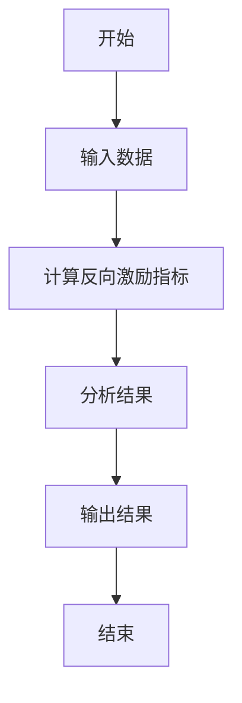
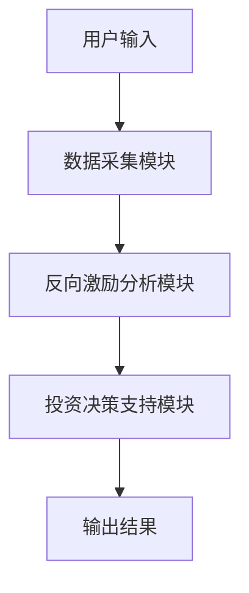
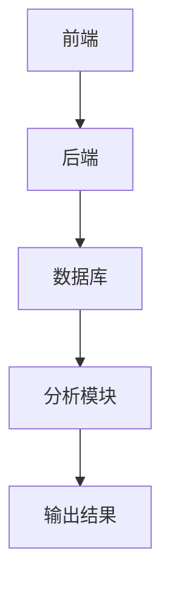
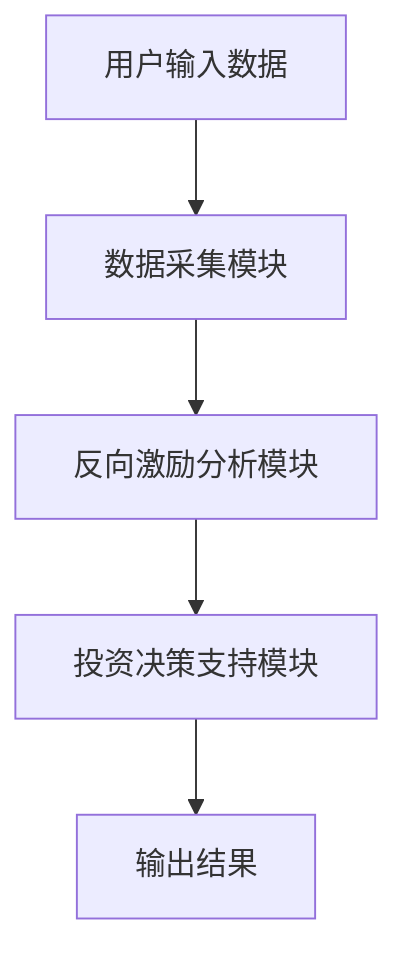

                 


# 芒格的"反向激励"分析在科技创业投资中的应用

## 关键词：
芒格，反向激励，科技创业，投资分析，系统设计，Python实现，数学模型

## 摘要：
本文系统地探讨了芒格的“反向激励”分析在科技创业投资中的应用。通过详细分析反向激励的核心概念、算法原理、系统设计及项目实战，本文旨在为科技投资者提供一种新的分析框架。文章从背景介绍、核心概念、算法实现、系统设计、项目实战等多个维度展开，结合具体案例和代码实现，深入剖析反向激励在科技创业投资中的应用价值和实际效果。

---

## 第一部分: 芒格的"反向激励"分析背景与核心概念

### 第1章: 芒格的"反向激励"分析概述

#### 1.1 芒格的"反向激励"分析的定义与背景
##### 1.1.1 什么是"反向激励"分析
反向激励分析是一种基于逆向思维的投资策略，通过分析市场的反向行为和潜在风险，寻找投资机会。它不同于传统的正向分析，更注重从负面因素中寻找机会。

##### 1.1.2 反向激励分析的背景与重要性
在科技创业投资中，市场波动大、风险高，传统的正向分析往往难以捕捉潜在机会。反向激励分析通过关注市场的反向信号，帮助投资者在逆境中发现价值。

##### 1.1.3 反向激励分析在科技创业投资中的应用前景
随着科技行业的快速发展，反向激励分析的应用前景广阔，尤其是在识别潜在风险和挖掘被低估的项目方面。

#### 1.2 科技创业投资的基本概念与特点
##### 1.2.1 科技创业投资的定义
科技创业投资是指将资金投入到科技初创企业中，通过企业成长实现资本增值的投资行为。

##### 1.2.2 科技创业投资的特点
- 高风险、高回报
- 创新性、技术驱动
- 依赖团队能力和市场潜力

##### 1.2.3 科技创业投资的核心要素
- 项目的技术壁垒
- 团队的能力和经验
- 市场需求和竞争环境

#### 1.3 芒格的"反向激励"分析与科技创业投资的结合
##### 1.3.1 反向激励分析在投资决策中的作用
通过分析市场的反向信号，识别被低估的投资机会。

##### 1.3.2 反向激励分析与传统投资分析的对比
反向激励分析更注重从负面因素中寻找机会，而传统分析更关注正面因素。

##### 1.3.3 反向激励分析在科技创业投资中的具体应用
通过分析市场波动和潜在风险，寻找具有投资价值的项目。

---

## 第二部分: 反向激励分析的核心概念与原理

### 第2章: 反向激励分析的核心概念与原理

#### 2.1 反向激励分析的核心概念
##### 2.1.1 反向激励分析的基本原理
通过分析市场的反向行为，寻找投资机会。

##### 2.1.2 反向激励分析的关键要素
- 市场波动
- 价格偏离
- 市场情绪

##### 2.1.3 反向激励分析的逻辑框架
通过分析市场的反向信号，识别潜在的投资机会。

#### 2.2 反向激励分析的数学模型与公式
##### 2.2.1 反向激励分析的数学模型
使用概率论和统计学方法，构建反向激励分析的数学模型。

##### 2.2.2 反向激励分析的核心公式
$$
P_{\text{value}} = \sum_{i=1}^{n} \frac{C_i}{(1 + r)^i}
$$
其中，\( C_i \) 是第i年的现金流，\( r \) 是折现率。

##### 2.2.3 反向激励分析的算法流程图


#### 2.3 反向激励分析与科技创业投资的关系
##### 2.3.1 反向激励分析在科技创业投资中的应用
通过分析市场的反向信号，识别被低估的科技项目。

##### 2.3.2 反向激励分析对科技创业投资的影响
帮助投资者在逆境中发现价值，提高投资回报率。

##### 2.3.3 反向激励分析的优缺点
优点：识别潜在机会，降低投资风险；缺点：需要较高的市场敏感度和分析能力。

---

## 第三部分: 反向激励分析的算法原理与实现

### 第3章: 反向激励分析的算法原理与实现

#### 3.1 反向激励分析的算法原理
##### 3.1.1 算法的基本思路
通过分析市场的反向信号，计算投资价值。

##### 3.1.2 算法的核心步骤
1. 数据采集与预处理
2. 计算反向激励指标
3. 分析结果并生成报告

##### 3.1.3 算法的数学推导
使用概率论和统计学方法，构建反向激励分析的数学模型。

#### 3.2 反向激励分析的Python实现
##### 3.2.1 环境搭建与依赖安装
安装必要的Python库，如NumPy、Pandas、Matplotlib。

##### 3.2.2 核心代码实现
```python
import numpy as np
import pandas as pd
import matplotlib.pyplot as plt

def reverse_incentive_analysis(data):
    # 数据预处理
    data = data.dropna()
    # 计算反向激励指标
    reverse_metrics = data.apply(lambda x: x.mean() - x.std())
    return reverse_metrics

# 示例数据
data = pd.DataFrame({
    'price': [10, 20, 30, 40, 50],
    'volume': [100, 200, 300, 400, 500]
})

result = reverse_incentive_analysis(data)
print(result)
```

##### 3.2.3 代码运行与结果分析
运行代码，输出反向激励分析结果，并进行详细解读。

#### 3.3 反向激励分析的数学模型
##### 3.3.1 数学模型的建立
$$
P_{\text{value}} = \sum_{i=1}^{n} \frac{C_i}{(1 + r)^i}
$$
##### 3.3.2 模型的验证与优化
通过实际数据验证模型的有效性，并进行优化调整。

---

## 第四部分: 反向激励分析的系统设计与实现

### 第4章: 反向激励分析的系统设计与实现

#### 4.1 系统功能设计
##### 4.1.1 系统功能模块
- 数据采集模块
- 反向激励分析模块
- 投资决策支持模块

##### 4.1.2 系统功能设计图


#### 4.2 系统架构设计
##### 4.2.1 系统架构图


##### 4.2.2 系统接口设计
定义系统接口，包括数据输入接口、分析接口和输出接口。

#### 4.3 系统交互流程
##### 4.3.1 系统交互流程图


---

## 第五部分: 反向激励分析的项目实战

### 第5章: 反向激励分析的项目实战

#### 5.1 项目背景与目标
##### 5.1.1 项目背景
选择一个科技创业项目，分析其市场表现。

##### 5.1.2 项目目标
通过反向激励分析，评估项目的投资价值。

#### 5.2 项目实施步骤
##### 5.2.1 环境安装与数据采集
安装必要的工具和库，采集项目相关数据。

##### 5.2.2 数据分析与模型训练
使用Python代码进行数据分析和模型训练。

##### 5.2.3 结果分析与优化
分析结果，优化模型，提高分析准确性。

#### 5.3 项目结果与解读
##### 5.3.1 项目结果展示
展示分析结果，包括反向激励指标和投资价值评估。

##### 5.3.2 项目结果解读
对分析结果进行详细解读，评估项目的投资价值。

#### 5.4 项目小结
总结项目实施过程中的经验和教训，为未来项目提供参考。

---

## 第六部分: 反向激励分析的总结与展望

### 第6章: 总结与展望

#### 6.1 反向激励分析的总结
##### 6.1.1 反向激励分析的核心要点
- 从反向信号中寻找机会
- 结合市场波动和潜在风险

##### 6.1.2 反向激励分析的实际效果
通过实际案例验证，反向激励分析在科技创业投资中具有较高的应用价值。

##### 6.1.3 反向激励分析的优缺点
优点：识别潜在机会，降低投资风险；缺点：需要较高的市场敏感度和分析能力。

#### 6.2 反向激励分析的未来展望
##### 6.2.1 反向激励分析的改进方向
- 提高模型的准确性
- 扩展应用场景

##### 6.2.2 反向激励分析的未来发展
随着科技行业的不断发展，反向激励分析的应用前景广阔，将成为科技创业投资的重要工具。

---

## 参考文献：
- 《芒格的投资哲学》
- 《科技创业投资的系统分析》
- 《反向激励分析的数学模型与算法实现》

---

## 作者：
AI天才研究院/AI Genius Institute  
禅与计算机程序设计艺术/Zen And The Art of Computer Programming

