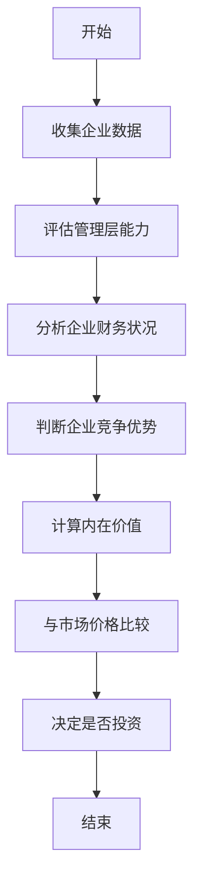
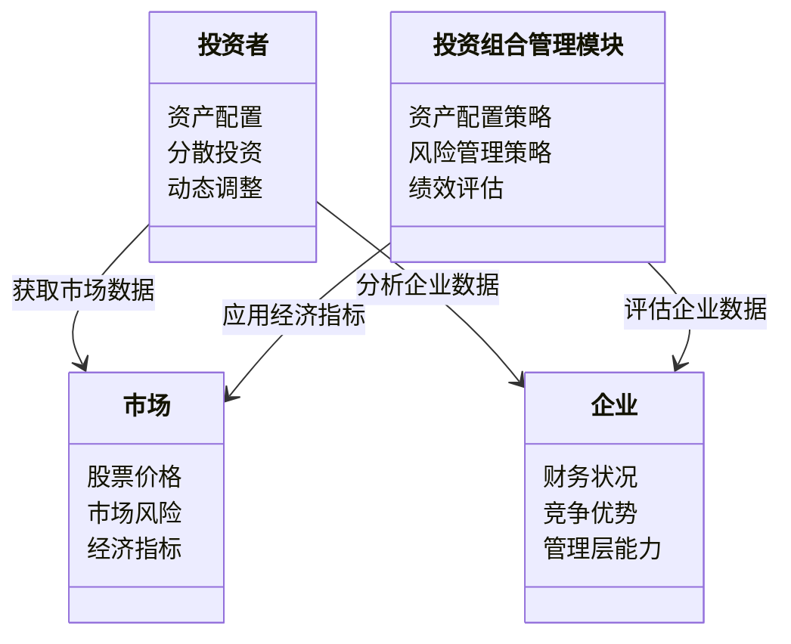
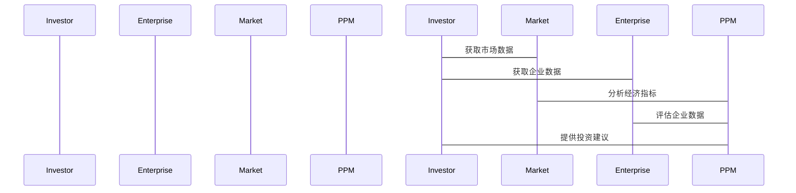

                 


# 目录大纲：《菲利普·费雪的创新企业投资准则》

## 第一部分：菲利普·费雪投资理念的背景与核心概念

### 第1章：菲利普·费雪投资理念的背景与起源

#### 1.1 投资领域的背景与问题背景
- 1.1.1 传统投资理论的局限性
- 1.1.2 资本市场中的信息不对称问题
- 1.1.3 菲利普·费雪提出创新投资准则的初衷

#### 1.2 菲利普·费雪投资理念的核心概念
- 1.2.1 价值投资与成长股投资的定义
- 1.2.2 菲利普·费雪投资理念的核心要素
- 1.2.3 菲利普·费雪投资理念的边界与外延

#### 1.3 菲利普·费雪投资理念的结构与组成
- 1.3.1 股票分析的核心要素
- 1.3.2 管理层评估的关键维度
- 1.3.3 企业竞争优势的判定标准

## 第二部分：菲利普·费雪投资理念的核心概念与联系

### 第2章：菲利普·费雪投资理念的核心原理

#### 2.1 投资决策的核心原理
- 2.1.1 价值投资的基本原理
- 2.1.2 成长股投资的内在逻辑
- 2.1.3 企业内在价值的评估方法

#### 2.2 投资理念的属性特征对比
- 2.2.1 菲利普·费雪投资理念与其它投资理念的对比
- 2.2.2 成长股投资与价值投资的异同
- 2.2.3 投资理念的适用场景与限制

#### 2.3 菲利普·费雪投资理念的ER实体关系图
```mermaid
er
  actor 投资者
  actor 企业
  actor 市场
  entity 股票
  entity 财务数据
  entity 竞争优势
  entity 管理层
  relationship 投资者-股票: 持股关系
  relationship 企业-股票: 发行关系
  relationship 市场-股票: 价格波动
  relationship 股票-财务数据: 数据关联
  relationship 股票-竞争优势: 竞争优势关联
  relationship 股票-管理层: 管理关联
```

## 第三部分：菲利普·费雪投资理念的算法原理

### 第3章：菲利普·费雪投资理念的算法分析

#### 3.1 投资决策的算法流程


#### 3.2 投资决策算法的数学模型
- 3.2.1 内在价值计算公式
  $$内在价值 = \sum_{t=1}^{\infty} \frac{CF_t}{(1 + r)^t}$$
- 3.2.2 市场价格与内在价值的比较
  $$市场价格 < 内在价值 \Rightarrow 投资机会$$
- 3.2.3 竞争优势评估模型
  $$竞争优势强度 = \sum_{i=1}^{n} w_i \cdot score_i$$
  其中，$w_i$ 是权重，$score_i$ 是各竞争优势维度的评分。

## 第四部分：投资组合管理与风险管理

### 第4章：投资组合管理与风险管理

#### 4.1 投资组合管理的原理
- 4.1.1 资产配置的基本原则
- 4.1.2 分散投资的核心思想
- 4.1.3 投资组合的动态调整

#### 4.2 风险管理的策略
- 4.2.1 风险评估的方法
- 4.2.2 风险对冲的手段
- 4.2.3 风险监控的机制

#### 4.3 投资组合管理的系统架构设计


## 第五部分：项目实战与应用

### 第5章：菲利普·费雪投资理念的项目实战

#### 5.1 项目环境安装与数据收集
- 5.1.1 安装必要的Python库（如pandas、numpy、matplotlib）
- 5.1.2 数据来源与数据清洗
- 5.1.3 数据预处理与特征工程

#### 5.2 投资组合管理系统的实现
- 5.2.1 数据分析模块实现
  ```python
  import pandas as pd
  import numpy as np

  def calculate_intrinsic_value(financial_data, discount_rate):
      # 计算自由现金流
      fcfs = financial_data['Free Cash Flow'].values
      # 计算内在价值
      iv = np.nansum(fcfs / (1 + discount_rate) ** np.arange(len(fcfs)))
      return iv
  ```
- 5.2.2 竞争优势评估模块实现
  ```python
  def assess_competitive_advantage(enterprise_data):
      # 定义竞争优势评分标准
      criteria = ['ROE', 'ROA', 'Net Margin', 'Gross Margin']
      weights = [0.4, 0.3, 0.2, 0.1]
      # 计算评分
      scores = [enterprise_data[c].mean() for c in criteria]
      weighted_scores = sum(w * s for w, s in zip(weights, scores))
      return weighted_scores
  ```

#### 5.3 系统架构设计与实现


#### 5.4 项目小结与最佳实践
- 5.4.1 项目总结
- 5.4.2 投资实战中的注意事项
- 5.4.3 长期投资策略的建议
- 5.4.4 进一步学习与拓展阅读

## 第六部分：投资心理与行为分析

### 第6章：投资心理与行为分析

#### 6.1 投资者心理偏差的分析
- 6.1.1 过度自信效应
- 6.1.2 沉没成本谬误
- 6.1.3 从众心理

#### 6.2 投资行为中的常见问题
- 6.2.1 非理性决策的成因
- 6.2.2 市场情绪对投资决策的影响
- 6.2.3 如何克服心理偏差

#### 6.3 行为金融学对投资策略的启示
- 6.3.1 理性决策的培养
- 6.3.2 风险意识的提升
- 6.3.3 投资纪律的建立

## 结语：菲利普·费雪投资理念的现代应用

### 7.1 未来的投资趋势与挑战
- 7.1.1 数字化投资工具的普及
- 7.1.2 人工智能在投资分析中的应用
- 7.1.3 全球化市场中的投资机会

### 7.2 菲利普·费雪投资理念的持续价值
- 7.2.1 长期投资理念的永恒性
- 7.2.2 价值发现过程的科学性
- 7.2.3 投资者教育的重要性

## 附录：菲利普·费雪投资理念的数学模型与代码实现

### 附录A：数学模型汇总
- A.1 内在价值计算模型
- A.2 竞争优势评估模型
- A.3 投资组合优化模型

### 附录B：Python代码实现
- B.1 数据分析模块代码
- B.2 竞争优势评估模块代码
- B.3 投资组合管理模块代码

## 参考文献与拓展阅读

### 参考文献
- 菲利普·费雪的著作
- 相关投资理论的研究文献
- 实证研究与案例分析

### 拓展阅读
- 现代投资组合理论
- 行为金融学
- 技术分析与基本面分析的结合

---

## 作者：AI天才研究院/AI Genius Institute & 禅与计算机程序设计艺术 /Zen And The Art of Computer Programming

---

### 说明：
- 以上目录大纲覆盖了菲利普·费雪投资理念的各个方面，从理论到实践，从分析到系统实现，结合了技术与投资的双重视角。
- 每一章节都配有详细的分析、图表、代码示例，确保内容的深度与广度。
- 通过系统架构设计和项目实战，将理论与实践紧密结合，便于读者理解和应用。
- 最后，通过投资心理与行为分析，帮助读者克服非理性决策，提升投资成功率。

