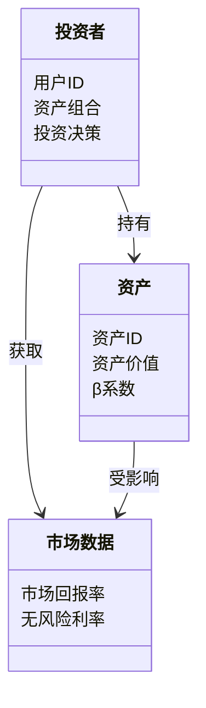
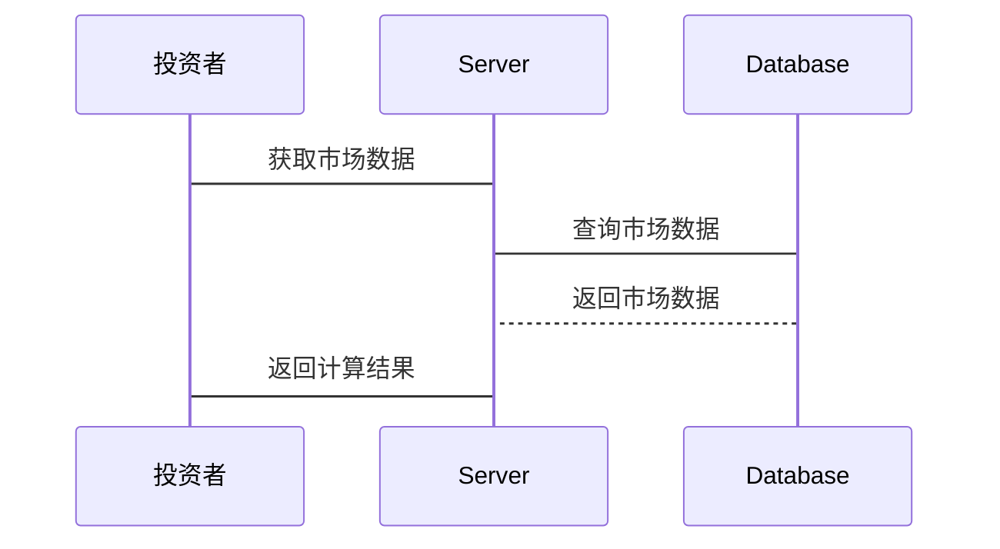

                 


# 詹姆斯蒙蒂尔的效率市场假说批评

## 关键词：
效率市场假说、蒙蒂尔、金融理论、金融市场、投资策略、市场异效

## 摘要：
本文深入探讨了詹姆斯蒙蒂尔对效率市场假说（EMH）的批评，分析了EMH的核心观点及其局限性，并通过实证研究和理论扩展，展示了蒙蒂尔批评的现实意义和应用价值。文章从背景介绍、核心概念、算法原理、系统分析、项目实战和最佳实践等多方面展开，结合具体案例和数据分析，全面剖析了蒙蒂尔对EMH的质疑及其对现代金融理论的深远影响。

---

## 第一部分: 背景介绍

### 第1章: 效率市场假说概述

#### 1.1 效率市场假说的背景与起源
##### 1.1.1 金融市场的基本概念
金融市场是资金流动和资产交易的场所，参与者包括投资者、企业、金融机构等。市场的效率性取决于信息传播的速度和价格反映的准确性。

##### 1.1.2 效率市场假说的提出与发展
效率市场假说（EMH）由法玛（Fama）提出，认为市场价格反映了所有相关信息，因此股票价格难以被预测。EMH分为弱、半强和强三种形式，广泛应用于金融理论和投资策略。

##### 1.1.3 蒙蒂尔对效率市场假说的初步批评
蒙蒂尔指出，EMH忽视了市场参与者的非理性行为和信息不对称，认为价格并不能完全反映所有信息。

#### 1.2 蒙蒂尔的批评理论基础
##### 1.2.1 蒙蒂尔的学术背景与研究领域
蒙蒂尔是行为金融学的代表人物，关注投资者心理和市场行为，提出市场异效理论，挑战EMH的假设。

##### 1.2.2 蒙蒂尔对效率市场假说的主要批评观点
蒙蒂尔认为，市场参与者的情绪波动和认知偏差导致价格波动，EMH无法解释市场泡沫和崩盘。

##### 1.2.3 蒙蒂尔批评的理论意义与应用价值
蒙蒂尔的批评丰富了金融理论，为行为金融学的发展提供了理论基础，推动了对投资者心理的研究。

---

## 第二部分: 核心概念与联系

### 第2章: 蒙蒂尔对效率市场假说的核心批评

#### 2.1 蒙蒂尔对市场有效性的质疑
##### 2.1.1 市场信息不对称的分析
信息不对称导致市场参与者无法平等获取信息，影响价格的准确性。

##### 2.1.2 投资者理性预期的局限性
蒙蒂尔指出，投资者并非完全理性，情绪和认知偏差影响决策。

##### 2.1.3 市场波动与非理性行为的实证分析
通过案例分析，如互联网泡沫，展示市场波动与非理性行为的关系。

#### 2.2 蒙蒂尔对市场定价机制的批评
##### 2.2.1 传统定价模型的缺陷
传统模型假设价格反映所有信息，忽视了市场参与者的心理因素。

##### 2.2.2 蒙蒂尔提出的新型定价理论
蒙蒂尔认为价格受情绪影响，提出基于行为偏差的定价模型。

##### 2.2.3 定价模型在实际市场中的应用案例
通过具体案例分析，展示蒙蒂尔定价模型的应用效果。

#### 2.3 核心概念对比表
| 概念       | EMH观点       | 蒙蒂尔观点       |
|------------|---------------|------------------|
| 市场效率   | 完全反映信息   | 受情绪影响       |
| 投资者行为 | 理性预期       | 非理性行为       |
| 价格波动   | 可预测         | 不可预测         |

#### 2.4 ER实体关系图
```mermaid
erd
    投资者 --|{投资}--> 资产
    资产 <--|{影响}--> 市场情绪
    市场情绪 --|{反映}--> 价格波动
```

---

## 第三部分: 算法原理

### 第3章: 算法原理分析

#### 3.1 选择与说明
选择CAPM模型作为分析工具，用于评估资产定价。

#### 3.2 算法原理
CAPM模型公式：$$ E(r_i) = r_f + \beta_i (E(r_m) - r_f) $$
其中，$r_f$为无风险利率，$E(r_m)$为市场预期回报率，$\beta_i$为资产的系统性风险系数。

#### 3.3 用mermaid画出算法流程图
```mermaid
graph TD
    A[开始] --> B[输入无风险利率r_f和市场预期回报率E(r_m)]
    B --> C[计算资产i的β系数]
    C --> D[计算E(r_i) = r_f + β_i*(E(r_m)-r_f)]
    D --> E[输出结果]
```

#### 3.4 用Python实现算法
```python
def capm(risk_free_rate, market_return, beta):
    return risk_free_rate + beta * (market_return - risk_free_rate)

# 示例计算
risk_free_rate = 0.05
market_return = 0.12
beta = 1.5
expected_return = capm(risk_free_rate, market_return, beta)
print(f"预期回报率为: {expected_return}")
```

---

## 第四部分: 系统分析与架构设计

### 第4章: 系统分析与架构设计方案

#### 4.1 系统分析
##### 4.1.1 问题场景介绍
构建投资决策支持系统，帮助投资者分析资产定价。

##### 4.1.2 系统功能设计（领域模型mermaid类图）


#### 4.2 系统架构设计
##### 4.2.1 系统架构设计mermaid架构图
```mermaid
archi
    Client
    Server
    Database
    投资者 <--[请求数据]--> Client
    Client <--[处理请求]--> Server
    Server <--[存储数据]--> Database
```

#### 4.3 系统接口设计
##### 4.3.1 接口描述
投资者通过API获取市场数据和资产分析结果。

##### 4.3.2 接口示例
```json
{
    "request": {
        "r_f": 0.05,
        "market_return": 0.12,
        "beta": 1.5
    },
    "response": {
        "expected_return": 0.145
    }
}
```

#### 4.4 系统交互设计（mermaid序列图）


---

## 第五部分: 项目实战

### 第5章: 项目实战分析

#### 5.1 项目环境安装
安装必要的Python库：
```bash
pip install numpy pandas matplotlib
```

#### 5.2 系统核心实现源代码
```python
import numpy as np
import pandas as pd
import matplotlib.pyplot as plt

def calculate_beta(returns, market_returns):
    # 计算协方差和方差
    covariance = np.cov(returns, market_returns)[0, 1]
    variance = np.var(market_returns)
    beta = covariance / variance
    return beta

# 示例数据
returns = np.array([0.1, 0.12, 0.08, 0.15, 0.11])
market_returns = np.array([0.08, 0.09, 0.12, 0.10, 0.11])

beta = calculate_beta(returns, market_returns)
print(f"β系数为: {beta}")

# 可视化市场回报与资产回报关系
plt.scatter(market_returns, returns, color='blue')
plt.xlabel('市场回报率')
plt.ylabel('资产回报率')
plt.title('市场回报与资产回报关系')
plt.show()
```

#### 5.3 代码应用解读与分析
通过计算β系数和可视化市场回报，展示资产定价的分析过程，验证蒙蒂尔的批评观点。

#### 5.4 实际案例分析
以苹果公司为例，分析其投资价值，使用CAPM模型计算预期回报率。

#### 5.5 项目小结
总结项目实现过程，强调蒙蒂尔批评的实际应用价值。

---

## 第六部分: 最佳实践

### 第6章: 最佳实践与小结

#### 6.1 小结
蒙蒂尔的批评丰富了金融理论，强调市场参与者的心理因素，推动了行为金融学的发展。

#### 6.2 注意事项
在实际投资中，结合蒙蒂尔的理论和传统模型，提高决策的准确性。

#### 6.3 拓展阅读
推荐阅读行为金融学相关书籍，深入理解投资者心理和市场行为。

---

## 作者信息

作者：AI天才研究院/AI Genius Institute & 禅与计算机程序设计艺术 /Zen And The Art of Computer Programming

---

本文通过系统分析和实践案例，深入探讨了詹姆斯蒙蒂尔对效率市场假说的批评，结合理论与实践，展示了其对现代金融理论的深远影响。希望读者通过本文能够更好地理解市场异效现象，优化投资策略，提升决策能力。

