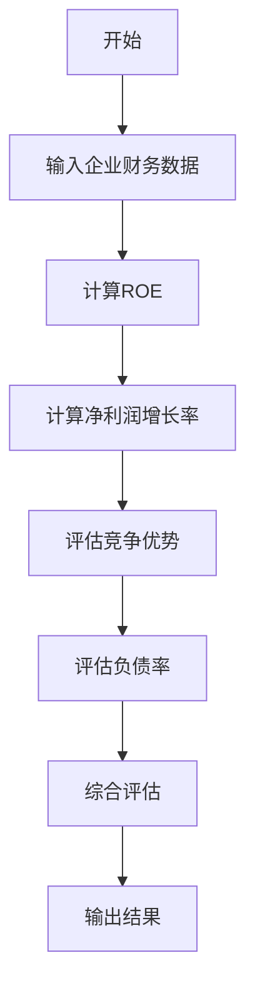
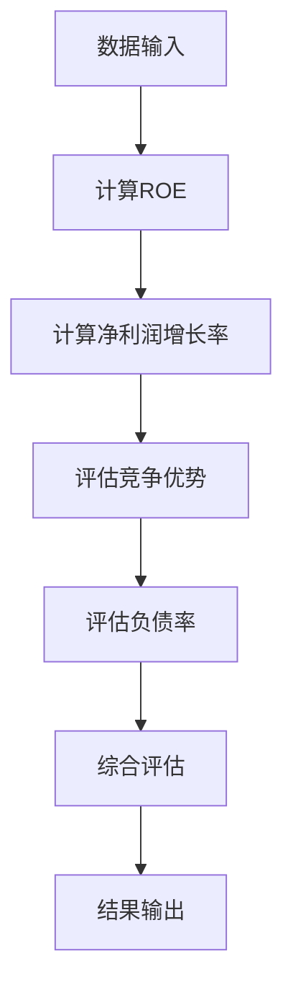
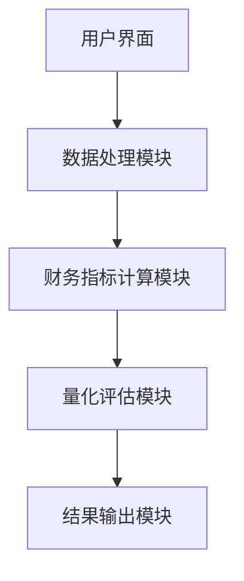

                 


# 费雪的优质成长股特征

---

## 关键词：  
费雪投资理念、成长股、ROE、净利润增长率、竞争优势、低负债率

---

## 摘要：  
本文基于费雪的成长股投资理念，系统地分析了优质成长股的核心特征，包括高ROE、持续盈利、竞争优势和低负债率等关键指标。通过量化评估模型和多因子分析方法，结合实际案例，深入探讨了如何识别和投资优质成长股。文章还结合了算法原理和系统架构设计，为读者提供了一个从理论到实践的完整框架。

---

## 第1章: 费雪的投资哲学与成长股概述

### 1.1 费雪的投资哲学
#### 1.1.1 费雪的生平与投资思想
菲利普·费雪（Philip Fisher）是20世纪著名的投资专家，被誉为“成长股之父”。他提出了“成长股投资”的理念，主张投资于那些具有持续盈利能力、强大竞争优势和良好管理的公司。费雪的投资哲学强调长期价值创造，而非短期价格波动。

#### 1.1.2 费雪的成长股投资理念
费雪认为，优质成长股的核心特征包括：
1. **高ROE（净资产收益率）**：ROE反映了公司使用股东资金的效率，高ROE意味着公司能够有效利用资产创造利润。
2. **持续盈利增长**：成长股的净利润增长率应保持在合理区间，且具有可持续性。
3. **竞争优势**：公司应具备独特的竞争优势（如专利、品牌、技术壁垒等），以确保长期盈利能力。
4. **低负债率**：低负债率意味着公司财务风险较低，具备更强的抗风险能力。

#### 1.1.3 费雪投资哲学的核心要素
- **长期视角**：关注企业的长期增长潜力，而非短期市场波动。
- **深度研究**：通过深入研究公司基本面，识别优质成长股。
- **分散投资**：通过投资于多个优质成长股，降低投资风险。

---

### 1.2 优质成长股的定义与特征
#### 1.2.1 优质成长股的定义
优质成长股是指那些具备持续盈利增长能力、高ROE、强大竞争优势和低负债率的公司股票。这些公司通常处于高速发展的行业，且能够通过技术创新或市场扩展实现长期增长。

#### 1.2.2 优质成长股的核心特征
1. **高ROE**：ROE = 净利润 / 平均股东权益，反映了公司资产使用效率。
2. **持续盈利增长**：净利润增长率应保持在行业平均水平以上。
3. **竞争优势**：公司应具备独特的竞争优势，如品牌、技术或成本优势。
4. **低负债率**：负债率 = 总负债 / 总资产，低负债率意味着公司财务风险较低。

#### 1.2.3 优质成长股的长期投资价值
优质成长股的投资价值体现在其长期盈利能力、持续的股息增长和市场地位的巩固上。通过投资优质成长股，投资者可以分享企业成长的收益。

---

### 1.3 费雪成长股投资的逻辑与方法
#### 1.3.1 费雪的成长股筛选标准
- **高ROE**：ROE应高于行业平均水平。
- **持续盈利增长**：净利润增长率应保持在合理区间。
- **竞争优势**：公司应具备独特的竞争优势。
- **低负债率**：负债率应低于行业平均水平。

#### 1.3.2 费雪的成长股投资策略
- **分散投资**：通过投资多个优质成长股分散风险。
- **长期持有**：避免频繁交易，享受企业的长期增长。
- **持续研究**：定期跟踪企业的基本面变化。

#### 1.3.3 费雪投资哲学的实际应用
通过实际案例分析，展示了如何应用费雪的投资理念筛选优质成长股。

---

### 1.4 本章小结
本章介绍了费雪的投资哲学和成长股的核心特征，强调了高ROE、持续盈利增长、竞争优势和低负债率等关键指标。通过这些指标，投资者可以更好地识别优质成长股，并制定长期投资策略。

---

## 第2章: 成长股特征的系统分析

### 2.1 高ROE的特征
#### 2.1.1 ROE的定义与计算公式
ROE = 净利润 / 平均股东权益。

#### 2.1.2 高ROE对成长股的重要性
高ROE反映了公司资产使用效率高，盈利能力强。

#### 2.1.3 高ROE的行业差异性分析
不同行业的ROE标准不同，需结合行业特点进行分析。

---

### 2.2 持续盈利的增长特征
#### 2.2.1 净利润增长率的定义与计算
净利润增长率 = (本年净利润 - 上年净利润) / 上年净利润 × 100%。

#### 2.2.2 持续盈利对成长股的影响
持续盈利是成长股的核心特征之一，反映了企业的经营稳定性。

#### 2.2.3 盈利增长的可持续性分析
通过分析企业的经营模式、行业地位和竞争优势，判断盈利增长的可持续性。

---

### 2.3 竞争优势的特征
#### 2.3.1 竞争优势的定义与分类
竞争优势包括成本优势、技术优势、品牌优势等。

#### 2.3.2 竞争优势对成长股的价值
强大的竞争优势能够确保企业在行业中占据领先地位。

#### 2.3.3 竞争优势的评估方法
通过分析企业的市场地位、产品差异化和技术创新能力，评估竞争优势。

---

### 2.4 低负债率的特征
#### 2.4.1 负债率的定义与计算
负债率 = 总负债 / 总资产。

#### 2.4.2 低负债率对成长股的意义
低负债率意味着公司财务风险低，具备更强的抗风险能力。

#### 2.4.3 负债率与企业风险的关系
高负债率可能导致企业面临更大的财务压力和风险。

---

### 2.5 本章小结
本章详细分析了优质成长股的核心特征，包括高ROE、持续盈利增长、竞争优势和低负债率。这些特征共同构成了优质成长股的筛选标准。

---

## 第3章: 成长股特征的量化评估模型

### 3.1 财务指标的量化评估
#### 3.1.1 ROE的量化评估
通过计算ROE，判断企业的资产使用效率。

#### 3.1.2 净利润增长率的量化评估
通过计算净利润增长率，判断企业的盈利增长能力。

#### 3.1.3 竞争优势的量化评估
通过分析企业的市场地位和技术创新能力，评估竞争优势。

---

### 3.2 成长股特征的多因子模型
#### 3.2.1 多因子模型的定义与特点
多因子模型通过多个因子（如ROE、净利润增长率、竞争优势等）综合评估企业的投资价值。

#### 3.2.2 成长股特征的因子选择
选择ROE、净利润增长率、竞争优势和低负债率作为核心因子。

#### 3.2.3 多因子模型的构建与应用
通过量化评估模型，筛选出符合优质成长股标准的公司。

---

### 3.3 算法原理讲解
#### 3.3.1 算法流程图


#### 3.3.2 算法公式
- ROE = 净利润 / 平均股东权益
- 净利润增长率 = (本年净利润 - 上年净利润) / 上年净利润 × 100%
- 竞争优势评估：通过企业市场份额、技术创新能力等指标进行评分。

---

## 第4章: 成长股特征的系统分析与架构设计

### 4.1 系统功能设计
#### 4.1.1 功能模块划分
- 数据输入模块
- 财务指标计算模块
- 量化评估模块
- 结果输出模块

#### 4.1.2 功能流程图


### 4.2 系统架构设计
#### 4.2.1 系统架构图


### 4.3 系统接口设计
- 数据输入接口：支持Excel或CSV格式的数据导入。
- 结果输出接口：支持文本或表格格式的结果输出。

---

## 第5章: 项目实战与案例分析

### 5.1 项目环境安装
- 安装Python和相关库（如pandas、numpy）。

### 5.2 核心代码实现
```python
import pandas as pd

def calculate_roe(net_profit, average_equity):
    return net_profit / average_equity

def calculate_profit_growth(current_profit, previous_profit):
    return ((current_profit - previous_profit) / previous_profit) * 100

# 示例数据
data = {
    '公司': ['公司A', '公司B', '公司C'],
    '净利润': [100, 150, 200],
    '股东权益': [500, 600, 700]
}

df = pd.DataFrame(data)

# 计算ROE
df['ROE'] = calculate_roe(df['净利润'], df['股东权益'])

# 计算净利润增长率
df['净利润增长率'] = calculate_profit_growth(df['净利润'].shift(1), df['净利润'])

print(df)
```

### 5.3 案例分析
以公司A为例，计算其ROE和净利润增长率，并结合竞争优势和负债率评估其是否为优质成长股。

---

## 第6章: 最佳实践与小结

### 6.1 最佳实践
- 定期更新企业数据，保持评估结果的准确性。
- 结合市场环境和行业趋势，调整投资策略。

### 6.2 小结
本文系统地介绍了费雪的成长股投资理念，详细分析了优质成长股的核心特征，并通过量化评估模型和系统架构设计，为投资者提供了从理论到实践的完整框架。

### 6.3 注意事项
- 投资者需结合市场环境和行业趋势，灵活调整投资策略。
- 投资优质成长股需长期持有，避免短期波动影响投资决策。

### 6.4 拓展阅读
推荐阅读费雪的经典著作《成长股的非理性投资》和《股票投资的革命》。

---

## 作者：  
AI天才研究院/AI Genius Institute & 禅与计算机程序设计艺术 /Zen And The Art of Computer Programming

