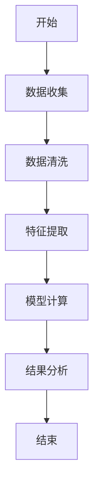
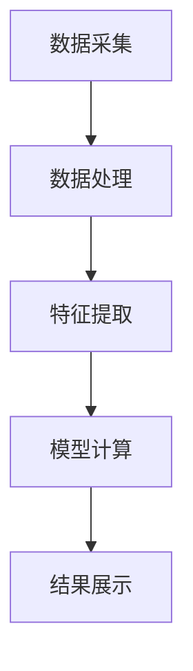
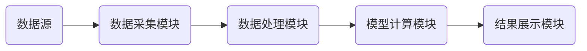
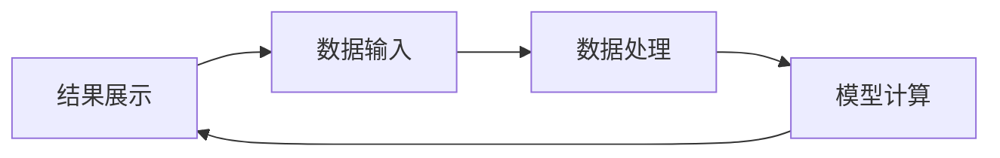

                 


# 费雪的客户忠诚度分析在投资中的应用

> 关键词：费雪客户忠诚度分析，投资决策，客户价值评估，投资组合优化，风险管理

> 摘要：本文深入探讨了费雪的客户忠诚度分析方法及其在投资中的应用。通过分析客户忠诚度的核心概念、数学模型和流程图，结合实际案例，展示了如何将客户忠诚度评估应用于投资组合优化、客户价值分析和风险管理中。文章还详细介绍了系统架构设计和项目实战，帮助读者全面理解费雪客户忠诚度分析的理论与实践。

---

# 第一部分: 费雪的客户忠诚度分析基础

## 第1章: 费雪客户忠诚度分析的背景与概念

### 1.1 客户忠诚度的基本概念

#### 1.1.1 什么是客户忠诚度
客户忠诚度是指客户对企业产品或服务的持续购买和使用意愿。它不仅仅是一个简单的购买行为，而是客户对品牌的情感依赖和信任。

| 客户忠诚度的层次 | 描述 |
|--------------------|------|
| 习惯性忠诚度      | 由于惯性购买，而非情感驱动 |
| 情感性忠诚度      | 客户对品牌有情感依赖 |
| 价值观忠诚度      | 客户认同品牌的核心价值观 |

#### 1.1.2 客户忠诚度的核心要素
- **服务质量**：客户对产品或服务的满意度。
- **品牌认知**：客户对品牌的认知和信任。
- **客户体验**：客户在购买和使用过程中的体验。

#### 1.1.3 客户忠诚度与客户满意度的区别
客户满意度是客户对产品或服务的直接评价，而客户忠诚度是客户行为的长期表现。客户满意度高并不意味着客户忠诚度高，但高忠诚度的客户通常满意度较高。

### 1.2 费雪客户忠诚度分析的提出

#### 1.2.1 费雪分析法的起源
费雪客户忠诚度分析由投资专家约翰·费雪提出，旨在通过量化客户忠诚度来评估企业的长期投资价值。

#### 1.2.2 费雪分析法的核心思想
- 客户忠诚度是企业长期盈利能力的关键因素。
- 忠诚客户能够为企业带来持续的收入和市场占有率。

#### 1.2.3 费雪分析法在投资中的应用价值
- 帮助投资者识别高价值企业。
- 为投资组合优化提供数据支持。

### 1.3 费雪客户忠诚度分析的边界与外延

#### 1.3.1 分析的适用范围
- 适用于长期投资分析。
- 适用于对客户行为有较高依赖性的企业。

#### 1.3.2 分析的局限性
- 依赖于数据的准确性和完整性。
- 无法完全预测市场波动。

#### 1.3.3 其他相关概念的对比
- **客户满意度**：关注客户的即时反馈。
- **客户保留率**：关注客户的留存情况。

---

## 第2章: 费雪客户忠诚度分析的核心模型

### 2.1 费雪客户忠诚度分析的理论框架

#### 2.1.1 分析模型的构成
- **客户忠诚度指数（CLI）**：量化客户忠诚度的核心指标。
- **客户生命周期价值（CLV）**：客户在生命周期内为企业带来的总收入。

#### 2.1.2 模型的输入与输出
- **输入**：客户行为数据、交易记录、市场数据。
- **输出**：客户忠诚度评分、客户生命周期价值预测。

#### 2.1.3 模型的核心假设
- 客户行为数据的可获得性。
- 客户忠诚度与企业利润的正相关性。

### 2.2 费雪客户忠诚度分析的数学模型

#### 2.2.1 模型的公式表示
$$ L = \frac{C}{(1 + r)^n} $$
其中：
- \( L \) 表示客户生命周期价值。
- \( C \) 表示客户在生命周期内的总收入。
- \( r \) 表示贴现率。
- \( n \) 表示生命周期的长度。

#### 2.2.2 模型的变量解释
- **客户收入（C）**：客户在一定时间内的总收入。
- **贴现率（r）**：考虑资金的时间价值。
- **生命周期长度（n）**：客户与企业互动的预期时间。

#### 2.2.3 模型的适用场景
- 长期客户价值评估。
- 投资组合优化中的客户忠诚度分析。

### 2.3 费雪客户忠诚度分析的流程图



---

# 第二部分: 费雪客户忠诚度分析在投资中的应用

## 第3章: 客户忠诚度与投资决策的关系

### 3.1 客户忠诚度对投资价值的影响

#### 3.1.1 忠诚客户的价值
- 忠诚客户为企业带来稳定的收入流。
- 忠诚客户能够降低企业的营销成本。

#### 3.1.2 忠诚客户对投资组合的影响
- 忠诚客户越多，企业的抗风险能力越强。
- 忠诚客户能够提升企业的市场地位。

#### 3.1.3 忠诚客户与企业长期盈利能力的关系
- 忠诚客户是企业长期利润的基石。
- 忠诚客户能够为企业带来持续的市场份额。

### 3.2 费雪分析法在投资中的应用逻辑

#### 3.2.1 投资决策中的客户忠诚度评估
- 通过客户忠诚度指数（CLI）评估企业的投资价值。
- 通过客户生命周期价值（CLV）预测企业的未来收益。

#### 3.2.2 费雪分析法在投资组合优化中的作用
- 帮助投资者识别高忠诚度客户的分布。
- 优化投资组合，降低投资风险。

#### 3.2.3 费雪分析法与风险管理的结合
- 通过客户忠诚度分析识别潜在的客户流失风险。
- 制定风险管理策略，降低投资损失。

---

## 第4章: 费雪客户忠诚度分析的系统架构与实现

### 4.1 系统功能设计

#### 4.1.1 系统功能模块
- 数据采集模块。
- 数据处理模块。
- 模型计算模块。
- 结果展示模块。

#### 4.1.2 系统功能流程图



### 4.2 系统架构设计

#### 4.2.1 系统架构图



### 4.3 系统接口设计

#### 4.3.1 系统接口描述
- 数据输入接口：接收客户行为数据。
- 数据输出接口：展示客户忠诚度评分。

### 4.4 系统交互设计

#### 4.4.1 系统交互流程图



---

## 第5章: 费雪客户忠诚度分析的项目实战

### 5.1 项目背景

#### 5.1.1 项目介绍
- 项目目标：通过费雪客户忠诚度分析优化投资组合。
- 项目范围：分析某企业的客户忠诚度，评估其投资价值。

### 5.2 项目核心实现

#### 5.2.1 环境安装
- Python 3.8+
- 数据处理库：Pandas、NumPy。
- 可视化库：Matplotlib、Seaborn。

#### 5.2.2 核心代码实现

```python
import pandas as pd
import numpy as np

def calculate_clv(customers, revenue, discount_rate, period):
    clv = revenue / (1 + discount_rate)**period
    return clv

# 示例数据
customers = 1000
revenue = 100
discount_rate = 0.05
period = 5

clv = calculate_clv(customers, revenue, discount_rate, period)
print(f"客户生命周期价值：{clv}")
```

#### 5.2.3 代码解读与分析
- **calculate_clv函数**：计算客户生命周期价值。
- **输入参数**：客户数量、收入、贴现率、周期。
- **输出结果**：客户生命周期价值。

### 5.3 实际案例分析

#### 5.3.1 案例背景
- 某企业客户忠诚度指数（CLI）为85，行业平均为70。
- 该企业的客户生命周期价值（CLV）为150元。

#### 5.3.2 案例分析
- 该企业的客户忠诚度高于行业平均水平，说明其客户保留率较高。
- 从投资角度来看，该企业具有较高的长期投资价值。

---

## 第6章: 总结与展望

### 6.1 最佳实践 tips
- 在进行客户忠诚度分析时，确保数据的准确性和完整性。
- 结合其他分析方法（如财务分析、市场分析）进行综合评估。

### 6.2 小结
- 费雪客户忠诚度分析是一种有效的投资工具。
- 通过量化客户忠诚度，投资者可以更好地优化投资组合，降低投资风险。

### 6.3 注意事项
- 客户忠诚度分析结果仅供参考，实际投资需结合市场环境。
- 数据隐私和安全问题需高度重视。

### 6.4 拓展阅读
- 《投资学基础》
- 《客户关系管理》
- 《数据分析与投资策略》

---

# 作者：AI天才研究院/AI Genius Institute & 禅与计算机程序设计艺术 /Zen And The Art of Computer Programming

---

通过以上详细的内容，我们全面介绍了费雪的客户忠诚度分析在投资中的应用。从理论基础到实际案例，从系统架构到项目实战，帮助读者深入了解这一分析方法的核心思想和实践价值。希望本文能为投资领域的从业者提供有价值的参考和启示。

