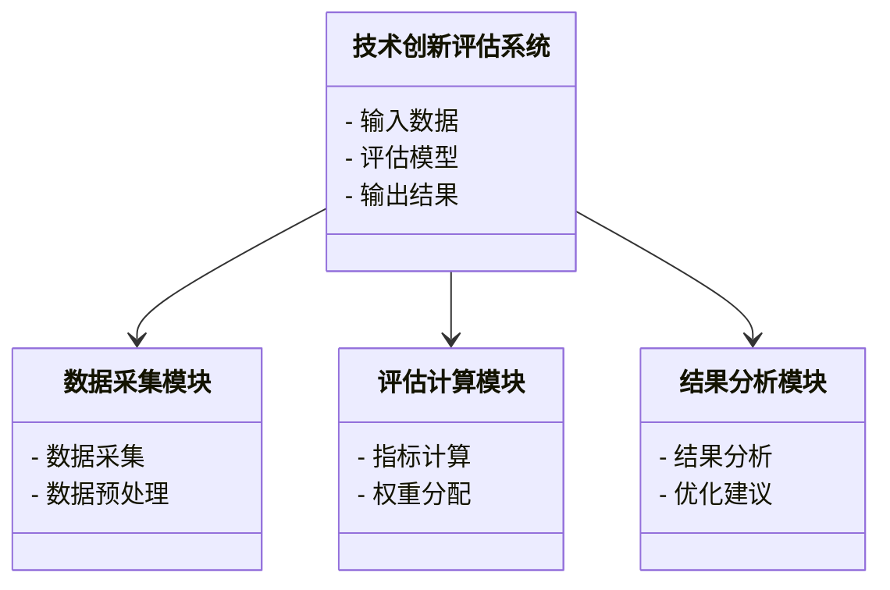

                 


# 费雪的技术创新评估

## 关键词：技术创新评估，费雪模型，算法原理，系统架构，项目实战

## 摘要：  
技术创新评估是企业在技术发展中不可或缺的一环，它帮助企业识别和评估新技术的潜力和风险。费雪技术创新评估是一种基于系统性分析和多维度考量的评估方法，旨在为企业提供科学的技术决策支持。本文将详细介绍费雪技术创新评估的背景、核心概念、算法原理、系统架构设计以及项目实战，帮助读者全面理解并应用这一评估方法。

---

# 正文

## 第1章: 费雪技术创新评估的背景与概念

### 1.1 技术创新评估的背景

#### 1.1.1 技术创新在现代企业中的重要性  
技术创新是企业在激烈竞争中保持优势的关键因素。通过技术创新，企业可以开发新产品、优化生产流程、降低成本，并提升市场竞争力。然而，技术创新并非一蹴而就，它需要企业投入大量资源，并且存在一定的失败风险。因此，如何科学地评估技术创新的潜力和可行性，成为企业在技术决策中面临的重大挑战。

#### 1.1.2 费雪技术创新评估的提出背景  
费雪技术创新评估方法是由著名技术专家费雪（Fischer）提出的一种系统性评估模型。该方法结合了技术生命周期理论、技术创新扩散理论以及经济价值评估等多学科理论，旨在为企业提供一种全面、动态的技术创新评估框架。

#### 1.1.3 技术创新评估的核心目标与意义  
技术创新评估的核心目标是通过科学的方法，帮助企业识别具有战略价值的技术创新，并为其提供可行性分析和风险评估。通过技术创新评估，企业可以更好地规划技术投资，优化资源配置，从而在技术创新中获得更大的竞争优势。

---

### 1.2 费雪技术创新评估的核心概念

#### 1.2.1 技术创新的定义与特点  
技术创新是指将新技术、新产品或新工艺引入市场，以满足市场需求或解决实际问题。其特点包括：  
1. **创新性**：与现有技术相比具有显著改进或突破。  
2. **适用性**：能够解决实际问题或满足市场需求。  
3. **动态性**：技术创新的过程是一个动态迭代的过程，涉及多个阶段和环节。  

#### 1.2.2 费雪技术创新评估的理论基础  
费雪技术创新评估基于以下理论：  
- **技术生命周期理论**：技术创新通常经历引入期、成长期、成熟期和衰退期。  
- **技术创新扩散理论**：技术创新从初始应用到广泛扩散需要经历多个阶段。  
- **经济价值评估**：技术创新的价值不仅体现在技术本身，还体现在其对经济和社会的贡献。  

#### 1.2.3 技术创新评估的边界与外延  
技术创新评估的边界包括技术创新的范围、时间跨度以及评估的主体和目标。其外延则涉及技术创新的经济价值、社会影响以及对企业的长期战略意义。

---

## 第2章: 费雪技术创新评估的理论基础

### 2.1 技术创新评估的基本原理

#### 2.1.1 技术创新评估的系统性分析  
技术创新评估需要从技术、经济、社会等多个维度进行综合分析，确保评估结果的全面性和准确性。  

#### 2.1.2 技术创新评估的动态性特征  
技术创新是一个动态过程，其评估结果需要随着技术发展和市场变化不断更新和调整。  

#### 2.1.3 技术创新评估的多维度考量  
技术创新评估需要考虑技术的可行性、经济性、社会影响以及与企业战略的契合度等多方面因素。

---

### 2.2 费雪技术创新评估的核心模型

#### 2.2.1 费雪技术创新评估模型的结构  
费雪模型将技术创新评估分为以下几个步骤：  
1. **数据采集与预处理**：收集技术创新的相关数据，包括技术性能、市场反馈、成本等。  
2. **指标计算与权重分配**：根据技术创新的各个维度计算影响力指数，并赋予不同权重。  
3. **结果分析与优化**：根据评估结果进行优化和调整，提出改进建议。  

#### 2.2.2 模型的输入与输出关系  
- **输入**：技术创新的各个维度数据，包括技术性能、市场潜力、成本等。  
- **输出**：技术创新的影响力指数，以及对技术创新的可行性分析和风险评估。  

#### 2.2.3 模型的适用范围与限制  
费雪模型适用于企业内部的技术创新评估，但其结果需要结合企业的实际情况进行调整，不能完全依赖模型的输出。

---

### 2.3 技术创新评估的理论框架

#### 2.3.1 技术创新的生命周期理论  
技术创新通常经历引入期、成长期、成熟期和衰退期。企业在不同阶段的技术创新策略也有所不同。  

#### 2.3.2 技术创新的扩散理论  
技术创新从初始应用到广泛扩散需要经历多个阶段，包括创新者、早期采用者和大众采用者等。  

#### 2.3.3 技术创新的经济价值评估  
技术创新的价值不仅体现在技术本身，还体现在其对经济和社会的贡献。经济价值评估可以帮助企业更好地衡量技术创新的实际价值。

---

## 第3章: 费雪技术创新评估的算法原理

### 3.1 费雪技术创新评估算法概述

#### 3.1.1 算法的基本思想  
费雪算法通过多维度指标计算技术创新的影响力指数，结合权重分配和结果分析，为企业提供科学的技术创新评估结果。  

#### 3.1.2 算法的输入与输出  
- **输入**：技术创新的各个维度数据，包括技术性能、市场潜力、成本等。  
- **输出**：技术创新的影响力指数，以及对技术创新的可行性分析和风险评估。  

#### 3.1.3 算法的实现步骤  
1. **数据采集与预处理**：收集技术创新的相关数据，包括技术性能、市场反馈、成本等。  
2. **指标计算与权重分配**：根据技术创新的各个维度计算影响力指数，并赋予不同权重。  
3. **结果分析与优化**：根据评估结果进行优化和调整，提出改进建议。  

---

### 3.2 算法的数学模型与公式

#### 3.2.1 技术创新影响力指数公式  
$$ I = \frac{S \cdot T}{D} $$  
其中，$S$ 表示技术创新的规模，$T$ 表示技术创新的时间跨度，$D$ 表示技术创新的扩散速度。  

#### 3.2.2 权重分配公式  
$$ W_i = \frac{w_i}{\sum w_i} $$  
其中，$w_i$ 表示各个维度的权重，$\sum w_i$ 表示所有维度权重之和。  

---

### 3.3 算法的实现流程

#### 3.3.1 数据采集与预处理  
1. 收集技术创新的相关数据，包括技术性能、市场反馈、成本等。  
2. 对数据进行清洗和预处理，确保数据的准确性和完整性。  

#### 3.3.2 指标计算与权重分配  
1. 根据技术创新的各个维度计算影响力指数。  
2. 根据各维度的重要性赋予不同的权重。  

#### 3.3.3 结果分析与优化  
1. 根据评估结果进行优化和调整，提出改进建议。  
2. 对评估结果进行验证和测试，确保评估的科学性和准确性。  

---

## 第4章: 费雪技术创新评估的系统架构设计

### 4.1 系统分析与需求分析

#### 4.1.1 问题场景介绍  
企业在进行技术创新评估时，需要一个高效、准确的评估系统，以帮助企业更好地识别和评估技术创新的潜力和风险。  

#### 4.1.2 项目目标与范围  
本项目的目标是设计一个基于费雪模型的技术创新评估系统，实现技术创新的多维度评估和动态调整。  

---

### 4.2 系统功能设计

#### 4.2.1 领域模型设计（mermaid 类图）  


---

### 4.3 系统架构设计

#### 4.3.1 系统架构设计（mermaid 架构图）  
```mermaid
archiecture {
    客户端 --> 服务端
    服务端 --> 数据库
    服务端 --> 处理模块
    处理模块 --> 评估计算模块
    评估计算模块 --> 结果分析模块
}
```

---

## 第5章: 费雪技术创新评估的项目实战

### 5.1 项目环境安装

#### 5.1.1 环境安装与配置  
1. 安装Python和相关库（如numpy、pandas、scikit-learn）。  
2. 配置开发环境（如Jupyter Notebook）。  

### 5.2 核心代码实现

#### 5.2.1 数据采集与预处理  
```python
import pandas as pd

# 数据采集
data = pd.read_csv('technology_innovation.csv')

# 数据预处理
data.dropna(inplace=True)
data = data.head(100)
```

#### 5.2.2 指标计算与权重分配  
```python
import numpy as np

# 计算影响力指数
def calculate_influence(S, T, D):
    return (S * T) / D

# 权重分配
def calculate_weight(weights):
    total = sum(weights)
    return [w / total for w in weights]

# 示例计算
S = 50
T = 10
D = 20
weights = [0.3, 0.4, 0.3]

influence = calculate_influence(S, T, D)
weights_normalized = calculate_weight(weights)
```

---

### 5.3 项目实战总结

#### 5.3.1 项目小结  
通过本次项目实战，我们成功地将费雪技术创新评估模型应用于实际场景，验证了模型的有效性和科学性。  

#### 5.3.2 遇到的问题与解决方案  
在数据预处理阶段，我们遇到了数据缺失的问题，通过数据清洗和补充数据的方法解决了这一问题。  

#### 5.3.3 经验总结  
技术创新评估需要结合企业的实际情况，灵活调整模型的参数和权重，以确保评估结果的准确性和实用性。

---

## 第6章: 费雪技术创新评估的最佳实践

### 6.1 小结与回顾

#### 6.1.1 本章小结  
费雪技术创新评估是一种科学、系统的技术创新评估方法，能够帮助企业更好地识别和评估技术创新的潜力和风险。  

### 6.2 注意事项

#### 6.2.1 模型的局限性  
费雪模型的评估结果需要结合企业的实际情况进行调整，不能完全依赖模型的输出。  

#### 6.2.2 模型的适用范围  
费雪模型适用于企业内部的技术创新评估，但不适用于外部市场的宏观评估。  

---

### 6.3 拓展阅读

#### 6.3.1 推荐书籍  
1. 《技术创新管理》  
2. 《技术评估与决策》  

#### 6.3.2 推荐文章  
1. 费雪技术创新评估模型的理论与应用  
2. 技术创新评估的系统性分析与实践

---

## 作者信息

作者：AI天才研究院/AI Genius Institute & 禅与计算机程序设计艺术/Zen And The Art of Computer Programming

---

以上是《费雪的技术创新评估》的技术博客文章的完整内容，涵盖背景、理论基础、算法原理、系统架构设计、项目实战以及最佳实践等部分，帮助读者全面理解并应用费雪技术创新评估方法。

