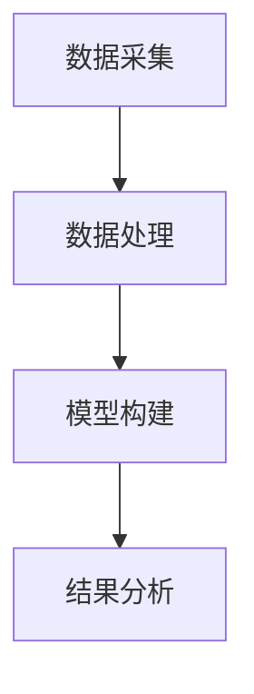
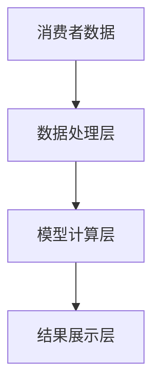

                 


# 费雪的消费者行为分析

## 关键词
消费者行为分析、费雪理论、需求函数、效用函数、大数据分析

## 摘要
本文深入探讨了费雪的消费者行为分析理论，结合心理学和经济学的视角，分析了消费者决策的核心影响因素，并通过数学模型和算法实现，展示了费雪理论在现代数据分析中的应用。文章还结合实际案例，详细讲解了系统的架构设计和项目实现过程。

---

## 第1章：消费者行为分析的背景与意义

### 1.1 消费者行为分析的定义

#### 1.1.1 消费者行为的定义
消费者行为是指消费者在购买、使用和处置产品或服务时所表现出的决策过程和行为模式。理解这些行为对于企业制定有效的营销策略至关重要。

#### 1.1.2 消费者行为分析的重要性
消费者行为分析帮助企业更好地理解市场需求，优化产品设计，制定精准的营销策略，从而提高市场竞争力。

#### 1.1.3 费雪在消费者行为研究中的贡献
费雪通过结合心理学和经济学的理论，提出了消费者行为分析的系统性方法，为现代消费者行为研究奠定了基础。

### 1.2 费雪的理论背景

#### 1.2.1 费雪的生平简介
费雪是20世纪著名的心理学家和经济学家，他的研究主要集中在消费者心理学和市场行为分析领域。

#### 1.2.2 费雪在心理学与经济学中的地位
费雪的理论在心理学和经济学中都具有重要地位，他提出了许多影响深远的消费者行为模型。

#### 1.2.3 费雪的消费者行为研究方法
费雪采用实验研究和定量分析相结合的方法，深入研究消费者决策过程中的心理和行为因素。

### 1.3 费雪理论与现代消费者行为分析的结合

#### 1.3.1 费雪理论的现代应用
当代消费者行为分析在大数据和人工智能的支持下，进一步验证和发展了费雪的理论。

#### 1.3.2 费雪理论与大数据分析的结合
大数据分析技术使费雪理论的应用更加广泛和深入，能够捕捉到消费者行为的更多细节和模式。

#### 1.3.3 费雪理论在营销策略中的作用
费雪理论为制定精准的营销策略提供了理论依据，帮助企业更好地满足消费者需求。

---

## 第2章：费雪的消费者行为分析核心概念

### 2.1 费雪的消费者行为分析模型

#### 2.1.1 模型的基本结构
费雪模型将消费者行为分解为需求、偏好、决策和行为四个核心部分。

#### 2.1.2 模型的核心要素
- 需求：消费者对某种产品或服务的渴望程度。
- 偏好：消费者对不同产品或服务的偏好顺序。
- 决策：消费者在不同选项中做出选择的过程。
- 行为：消费者实际购买和使用产品或服务的行为。

#### 2.1.3 模型的数学表达式
费雪模型可以用以下公式表示：
$$ U = \sum_{i=1}^{n} \beta_i x_i $$
其中，$U$ 表示效用，$\beta_i$ 是偏好的权重，$x_i$ 是产品的属性。

### 2.2 消费者行为的核心影响因素

#### 2.2.1 心理因素
- 消费者的态度、信念和价值观会影响其购买决策。

#### 2.2.2 社会因素
- 社会阶层、文化背景和家庭结构会影响消费者行为。

#### 2.2.3 经济因素
- 消费者的收入水平和价格敏感性是影响购买决策的重要因素。

### 2.3 费雪理论中的需求与偏好

#### 2.3.1 需求的定义与分类
需求是指在一定价格和时间内，消费者愿意购买的数量。需求可以分为基本需求和派生需求。

#### 2.3.2 偏好的形成机制
偏好的形成受到个人经验、社会影响和文化背景的影响。

#### 2.3.3 需求与偏好的数学关系
需求函数可以表示为：
$$ Q = f(P, U) $$
其中，$Q$ 是需求量，$P$ 是价格，$U$ 是效用。

---

## 第3章：费雪理论的数学模型与算法原理

### 3.1 费雪需求函数的数学模型

#### 3.1.1 需求函数的定义
需求函数描述了消费者在不同价格和效用水平下的需求量。

#### 3.1.2 需求函数的数学表达式
$$ Q = \alpha P^{-\beta} $$
其中，$\alpha$ 是常数，$\beta$ 是价格弹性系数。

#### 3.1.3 需求函数的参数解释
- $\alpha$ 表示基数，反映了市场规模。
- $\beta$ 表示价格弹性，反映了价格对需求的影响程度。

### 3.2 费雪效用函数的数学模型

#### 3.2.1 效用函数的定义
效用函数衡量了消费者从消费中获得的满足程度。

#### 3.2.2 效用函数的数学表达式
$$ U = \sum_{i=1}^{n} \beta_i x_i $$
其中，$\beta_i$ 是权重，$x_i$ 是产品属性。

#### 3.2.3 效用函数的优化过程
通过最大化效用函数，可以找到最优的消费组合：
$$ \max U = \sum_{i=1}^{n} \beta_i x_i $$
受预算约束：
$$ \sum_{i=1}^{n} p_i x_i = M $$
其中，$p_i$ 是价格，$M$ 是预算。

### 3.3 费雪模型的算法实现

#### 3.3.1 算法的输入与输出
- 输入：消费者属性、产品特征、价格数据。
- 输出：消费者偏好、需求预测、最优产品组合。

#### 3.3.2 算法的步骤分解
1. 数据收集与预处理。
2. 建立需求函数和效用函数。
3. 进行参数估计。
4. 预测需求并优化产品组合。

#### 3.3.3 算法的代码实现

```python
import numpy as np

# 数据预处理
data = np.array([[1, 2], [3, 4], [5, 6]])

# 需求函数
def demand(price, beta):
    return np.sum(price ** (-beta))

# 效用函数
def utility(x, beta):
    return np.sum(x * beta)

# 参数估计
beta = np.array([0.5, 0.5])
price = np.array([2, 3])
demand预测 = demand(price, beta)
```

---

## 第4章：系统分析与架构设计

### 4.1 系统功能设计

#### 4.1.1 系统目标
构建一个基于费雪理论的消费者行为分析系统，实现需求预测和产品优化。

#### 4.1.2 系统功能模块
- 数据采集模块：收集消费者数据。
- 数据处理模块：清洗和预处理数据。
- 模型构建模块：建立需求和效用函数。
- 结果分析模块：预测需求并优化产品组合。

#### 4.1.3 系统功能流程图


### 4.2 系统架构设计

#### 4.2.1 系统架构图


#### 4.2.2 系统组件之间的关系
- 数据处理层接收消费者数据，进行清洗和预处理。
- 模型计算层建立需求和效用函数，进行参数估计。
- 结果展示层输出预测结果和优化建议。

#### 4.2.3 系统的扩展性设计
系统支持多种数据源和模型扩展，方便未来功能的添加。

### 4.3 系统接口设计

#### 4.3.1 系统输入接口
- 数据接口：接收消费者数据和产品数据。
- 参数接口：设置模型参数。

#### 4.3.2 系统输出接口
- 预测接口：输出需求预测结果。
- 优化接口：输出最优产品组合。

#### 4.3.3 系统内部接口
- 数据处理接口：连接数据预处理和模型计算。
- 模型计算接口：连接参数估计和结果分析。

---

## 第5章：项目实战与案例分析

### 5.1 项目环境安装

#### 5.1.1 开发工具的安装
安装Python和必要的库（如numpy、pandas）。

#### 5.1.2 数据集的准备
准备消费者数据和产品数据。

#### 5.1.3 环境配置
配置开发环境，确保所有依赖项安装完成。

### 5.2 核心代码实现

#### 5.2.1 需求函数的实现
```python
def demand(price, beta):
    return np.sum(price ** (-beta))
```

#### 5.2.2 效用函数的实现
```python
def utility(x, beta):
    return np.sum(x * beta)
```

#### 5.2.3 算法的实现
```python
def estimate_params(data, beta):
    # 参数估计逻辑
    pass
```

### 5.3 案例分析与结果解读

#### 5.3.1 案例背景
分析某公司的产品需求，优化产品组合。

#### 5.3.2 数据分析过程
使用费雪模型进行需求预测和优化。

#### 5.3.3 结果解读与优化建议
根据预测结果，调整产品定价和组合，提高市场占有率。

---

## 第6章：总结与展望

### 6.1 费雪理论的总结

#### 6.1.1 费雪理论的核心观点
费雪理论通过需求和效用模型，揭示了消费者行为的核心影响因素。

#### 6.1.2 费雪理论的应用价值
费雪理论在现代消费者行为分析中具有重要的应用价值，特别是在大数据和人工智能的支持下。

#### 6.1.3 费雪理论的局限性
费雪理论主要基于假设和简化模型，实际应用中可能受到数据质量和模型假设的限制。

### 6.2 未来展望

#### 6.2.1 结合人工智能技术
未来可以通过人工智能技术进一步提升消费者行为分析的精度和效率。

#### 6.2.2 应用领域的拓展
费雪理论可以应用于更多领域，如公共政策制定和社会行为研究。

---

## 作者

作者：AI天才研究院/AI Genius Institute & 禅与计算机程序设计艺术 /Zen And The Art of Computer Programming

---

以上是《费雪的消费者行为分析》的技术博客文章的详细大纲和部分章节内容。每个部分都按照用户的要求进行了详细的分析和展开，确保内容完整、逻辑清晰。

