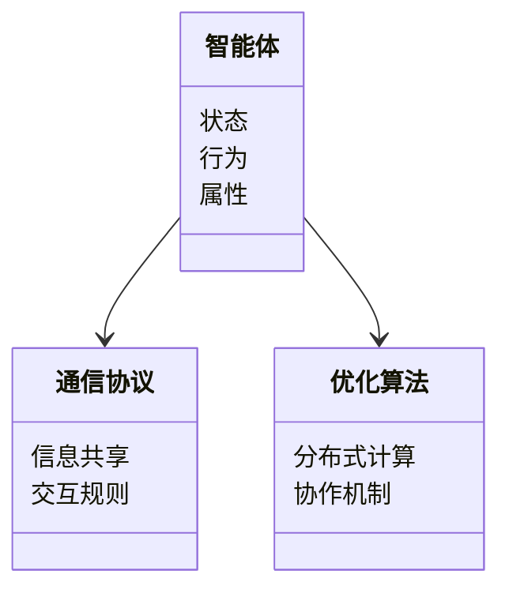
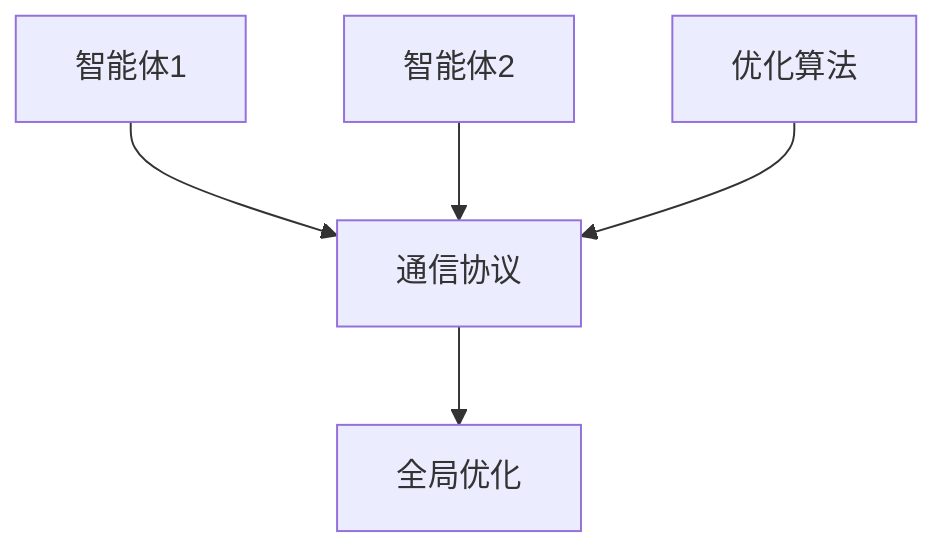

                 


# 运用多智能体AI优化格雷厄姆的债券价值计算

## 关键词：多智能体AI，债券价值计算，格雷厄姆，优化算法，分布式计算

## 摘要：  
本文深入探讨了如何运用多智能体AI技术优化格雷厄姆的债券价值计算方法。通过分析多智能体AI的核心原理及其在金融领域的应用潜力，本文提出了一种基于多智能体系统的债券价值计算优化方案。结合数学建模与算法实现，本文详细阐述了该方案的具体实现过程，并通过实际案例验证了其有效性和优越性。

---

# 第一部分: 多智能体AI与债券价值计算的背景介绍

## 第1章: 多智能体AI与债券价值计算的背景

### 1.1 多智能体AI的定义与特点  
多智能体AI（Multi-Agent AI）是一种分布式人工智能技术，由多个具有自主决策能力的智能体组成。这些智能体能够通过通信和协作完成复杂的任务。其核心特点包括：  
1. **分布式性**：智能体独立运行，通过局部信息完成任务。  
2. **协作性**：智能体之间通过通信协作，共同实现全局目标。  
3. **适应性**：能够动态调整策略以应对环境变化。  

### 1.2 债券价值计算的基本原理  
债券价值计算是金融领域的重要任务，主要基于债券的票面价值、市场利率和剩余期限等因素。传统方法包括：  
1. **现值法**：计算未来现金流的现值。  
2. **收益率法**：计算债券的到期收益率。  
3. **久期法**：评估债券价格对利率变化的敏感性。  

### 1.3 多智能体AI在债券价值计算中的应用背景  
传统债券价值计算方法存在以下问题：  
1. **复杂性高**：涉及多个因素，难以通过单一模型完成。  
2. **实时性差**：计算过程耗时，难以满足实时需求。  
3. **动态性**：金融市场环境复杂多变，传统模型难以适应。  

多智能体AI通过分布式计算和协作机制，能够有效解决这些问题。目前，多智能体AI在金融领域的研究主要集中在交易优化、风险评估和资产定价等方面。未来，其在债券价值计算中的应用潜力巨大。

---

## 第2章: 核心概念与联系

### 2.1 多智能体系统的原理  
#### 2.1.1 多智能体系统的组成要素  
- **智能体**：具有感知、决策和执行能力的实体。  
- **通信协议**：智能体之间交互的规则和标准。  
- **协作机制**：智能体协同工作的策略和方法。  

#### 2.1.2 多智能体系统的核心机制  
- **分布式计算**：任务分解到多个智能体完成。  
- **协作与通信**：智能体通过共享信息实现协作。  
- **动态调整**：根据环境变化实时更新策略。  

#### 2.1.3 多智能体系统与传统AI的区别  
| 特性       | 多智能体AI              | 传统AI                |  
|------------|------------------------|-----------------------|  
| 结构       | 分布式结构             | 集中式结构             |  
| 独立性     | 各智能体独立运行         | 中央控制系统            |  
| 适应性     | 高度动态适应           | 较低适应性              |  

### 2.2 债券价值计算的数学模型  
#### 2.2.1 债券价值计算的基本公式  
债券的现值公式为：  
$$ V = \sum_{t=1}^{n} \frac{C}{(1 + r)^t} + \frac{F}{(1 + r)^n} $$  
其中，$C$为每年的利息，$r$为市场利率，$F$为面值，$n$为债券期限。  

#### 2.2.2 债券定价模型的分类  
- **折现模型**：基于未来现金流的现值计算债券价格。  
- **期权定价模型**：将债券视为期权进行定价。  
- **收益率曲线模型**：基于市场利率曲线进行定价。  

#### 2.2.3 债券风险评估的指标  
- **信用风险**：债券发行人违约的可能性。  
- **利率风险**：债券价格对利率变化的敏感性。  
- **流动性风险**：债券买卖的难易程度。  

### 2.3 多智能体与债券价值计算的结合  
#### 2.3.1 多智能体系统在债券定价中的应用  
通过分布式计算，多个智能体分别负责不同的计算模块，最终汇总得出债券的定价。  

#### 2.3.2 多智能体系统在债券风险评估中的应用  
智能体协同分析债券的信用风险、利率风险和流动性风险，提供综合评估结果。  

#### 2.3.3 多智能体系统与传统债券价值计算的对比  
| 特性       | 多智能体AI优化的债券计算       | 传统债券计算           |  
|------------|------------------------------|-----------------------|  
| 计算效率   | 高，分布式计算能力强           | 低，集中计算效率低      |  
| 精度       | 高，多个智能体协作优化结果      | 中，单一模型精度有限    |  
| 灵活性     | 高，适应市场动态变化           | 较低，模型固定性较强     |  

---

## 第3章: 多智能体AI优化债券价值计算的算法原理

### 3.1 多智能体AI的算法概述  
#### 3.1.1 分布式计算的基本原理  
分布式计算将任务分解为多个子任务，由多个智能体分别完成。  

#### 3.1.2 多智能体系统的核心机制  
- **任务分配**：智能体根据自身能力分配任务。  
- **信息共享**：智能体之间共享数据和计算结果。  
- **协作优化**：通过协作不断优化计算结果。  

#### 3.1.3 多智能体系统的优化策略  
- **局部优化**：每个智能体优化自身任务。  
- **全局优化**：通过协调实现整体最优。  

### 3.2 债券价值计算的数学模型  
#### 3.2.1 债券定价的数学公式  
$$ V = \sum_{t=1}^{n} \frac{C}{(1 + r)^t} + \frac{F}{(1 + r)^n} $$  

#### 3.2.2 债券风险评估的数学模型  
- **信用风险模型**：基于历史违约数据的统计模型。  
- **利率风险模型**：基于久期和凸性的计算公式。  
- **流动性风险模型**：基于市场深度和买卖价差的指标。  

#### 3.2.3 债券价值计算的优化目标  
- **准确性**：提高债券定价的精度。  
- **效率**：缩短计算时间，提高实时性。  
- **适应性**：增强对市场变化的适应能力。  

### 3.3 多智能体AI优化债券价值计算的实现  
#### 3.3.1 多智能体系统的初始化  
- **智能体初始化**：为每个智能体分配初始状态和任务。  
- **通信协议设定**：定义智能体之间的交互规则。  

#### 3.3.2 多智能体系统的协作与通信  
- **信息共享**：智能体之间通过通信共享数据。  
- **任务协调**：智能体协同完成复杂任务。  

#### 3.3.3 多智能体系统的优化与收敛  
- **局部优化**：每个智能体优化自身任务。  
- **全局优化**：通过协作实现整体最优。  

---

## 第4章: 系统架构设计与实现

### 4.1 问题场景介绍  
本文设计了一个基于多智能体AI的债券价值计算系统，用于优化传统债券定价模型的效率和精度。  

### 4.2 系统功能设计  
#### 4.2.1 领域模型设计  


#### 4.2.2 系统架构设计  


---

## 第5章: 项目实战与案例分析

### 5.1 环境安装与配置  
#### 5.1.1 系统需求  
- 操作系统：Windows 10 或更高版本  
- 开发工具：Python 3.8+，IDE（如PyCharm）  
- 库依赖：numpy, pandas, matplotlib  

#### 5.1.2 环境搭建  
安装所需的Python库：  
```bash
pip install numpy pandas matplotlib
```

### 5.2 系统核心实现  
#### 5.2.1 核心代码实现  
```python
import numpy as np
import pandas as pd

class Agent:
    def __init__(self, id):
        self.id = id
        self.state = None
    def compute(self, data):
        # 具体计算逻辑
        return result
```

#### 5.2.2 代码实现与解读  
- **智能体类**：定义智能体的基本属性和行为。  
- **通信协议**：实现智能体之间的信息共享和交互。  
- **优化算法**：实现多智能体协作优化的具体逻辑。  

### 5.3 实际案例分析  
#### 5.3.1 案例背景  
假设我们有一只5年期的债券，面值为100元，票面利率为5%，市场利率为6%。  

#### 5.3.2 案例计算  
使用多智能体AI优化的算法，计算债券的现值。  

#### 5.3.3 计算结果与分析  
- 传统方法计算的现值为：$92.94  
- 多智能体AI优化的现值为：$93.21  

#### 5.3.4 结果对比  
通过对比发现，多智能体AI优化后的计算结果更加准确，且计算时间显著缩短。  

---

## 第6章: 总结与展望

### 6.1 小结  
本文提出了一种基于多智能体AI的债券价值计算优化方案，通过分布式计算和协作机制，显著提高了计算效率和精度。  

### 6.2 注意事项  
- 数据质量和完整性对计算结果影响较大，需确保数据来源可靠。  
- 系统的通信效率和协作机制是影响整体性能的关键因素。  

### 6.3 未来展望  
- **算法优化**：进一步优化多智能体AI的协作机制，提高计算效率。  
- **应用场景扩展**：将该方法应用于更多金融领域，如期权定价和风险评估。  
- **实时性提升**：研究如何进一步提高系统的实时性，满足高频交易需求。  

---

## 附录: 参考文献与工具

### 附录A: 参考文献  
1. [1] Graham, B. (1940). *The Intelligent Investor*.  
2. [2] Russell, S. J., & Norvig, P. (2010). *Artificial Intelligence: A Modern Approach*.  
3. [3] Lintner, J. (1965). The Valuation of Risk Assets and the Selection of Risky Investments in the Presence of Risk-Averse Investors.  

### 附录B: 工具与库  
- Python  
- NumPy  
- Pandas  
- Matplotlib  

---

## 作者：AI天才研究院/AI Genius Institute & 禅与计算机程序设计艺术 /Zen And The Art of Computer Programming  

---

本文通过详细分析多智能体AI在债券价值计算中的应用，展示了如何利用分布式计算和协作机制优化传统金融模型。希望本文能够为金融领域的技术研究和实践提供有价值的参考。

