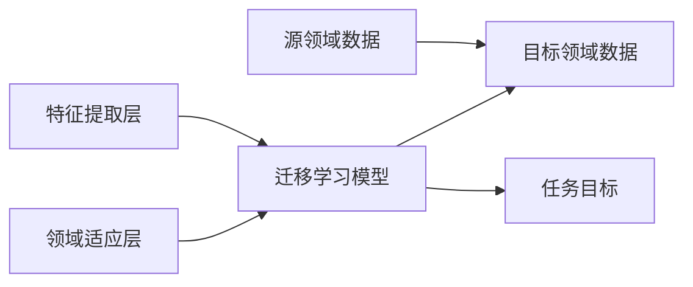
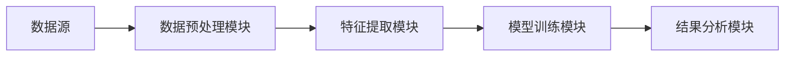
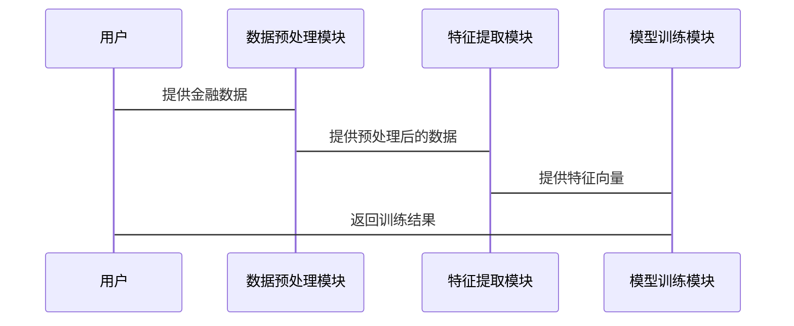

                 


# 金融领域的迁移学习应用研究

## 关键词：迁移学习，金融领域，机器学习，深度学习，领域适应，对抗学习，特征提取

## 摘要：  
迁移学习是一种通过将已学习的知识迁移到新任务中以提高模型性能的技术。在金融领域，迁移学习被广泛应用于股票价格预测、信用评分、风险评估等任务中。本文从迁移学习的基本概念出发，详细探讨其在金融领域的应用背景、核心算法、系统设计以及实际案例。通过分析迁移学习的优势与挑战，本文总结了迁移学习在金融领域的发展现状，并展望了未来的研究方向。

---

## 正文

### 第一部分: 金融领域的迁移学习基础

#### 第1章: 迁移学习的基本概念与背景

##### 1.1 迁移学习的定义与核心概念
- **1.1.1 迁移学习的定义**  
  迁移学习（Transfer Learning）是一种机器学习技术，旨在通过将已学习的知识（如参数、特征或模型）迁移到新任务中，以提高新任务的学习效率和性能。与传统机器学习不同，迁移学习强调领域之间的知识共享和任务之间的关联性。

- **1.1.2 迁移学习的核心要素**  
  迁移学习的核心要素包括源领域（Source Domain）、目标领域（Target Domain）、源任务（Source Task）和目标任务（Target Task）。源领域和目标领域可能具有部分重叠的特征空间，但任务目标可能不同。

- **1.1.3 迁移学习与传统机器学习的区别**  
  传统机器学习假设训练数据和测试数据来自同一分布，而迁移学习则允许数据分布不同，通过跨领域的知识迁移来解决目标领域的任务。

##### 1.2 金融领域中的迁移学习背景
- **1.2.1 金融数据的特点与挑战**  
  金融数据通常具有小样本、高维度、噪声大、时间依赖性强等特点。传统机器学习方法在处理这些数据时，往往需要大量标注数据，且泛化能力有限。

- **1.2.2 迁移学习在金融领域的应用场景**  
  迁移学习在金融领域的典型应用包括股票价格预测、信用评分、风险评估、欺诈检测等。通过迁移学习，可以在数据不足的情况下提高模型的性能。

- **1.2.3 迁移学习的优势与意义**  
  迁移学习可以有效缓解金融领域数据稀缺性问题，同时能够利用跨领域的知识共享，提高模型的泛化能力和鲁棒性。

#### 第2章: 迁移学习的核心概念与联系

##### 2.1 迁移学习的原理与方法
- **2.1.1 数据驱动的迁移学习**  
  数据驱动的迁移学习通过共享数据特征或分布，将源领域的知识迁移到目标领域。常用方法包括特征对齐和分布适配。

- **2.1.2 模型驱动的迁移学习**  
  模型驱动的迁移学习通过共享模型参数或结构，将源领域的知识迁移到目标领域。常用方法包括参数迁移和模型适配。

- **2.1.3 任务驱动的迁移学习**  
  任务驱动的迁移学习通过共享任务目标或策略，将源领域的知识迁移到目标领域。常用方法包括多任务学习和领域适应。

##### 2.2 迁移学习的核心要素分析
- **2.2.1 数据特征的提取与表示**  
  数据特征的提取与表示是迁移学习的关键步骤。通过有效的特征表示，可以减少源领域和目标领域之间的分布差异。

- **2.2.2 模型的适应与优化**  
  模型的适应与优化是迁移学习的核心。通过适配目标领域的数据分布，可以提高模型在目标任务上的性能。

- **2.2.3 任务的相似性度量**  
  任务的相似性度量是迁移学习的重要环节。通过度量源任务和目标任务的相似性，可以选择合适的迁移学习方法。

##### 2.3 迁移学习的实体关系图


---

### 第二部分: 迁移学习的算法原理与数学模型

#### 第3章: 迁移学习的算法原理

##### 3.1 基于Multipartite图的迁移学习算法
- **3.1.1 算法的基本思想**  
  基于Multipartite图的迁移学习算法通过构建一个多部分图，将源领域和目标领域的数据节点连接起来，从而实现知识迁移。

- **3.1.2 算法的步骤分解**  
  1. 构建多部分图，包括源领域节点、目标领域节点和任务节点。  
  2. 计算节点之间的相似性，进行特征对齐。  
  3. 优化图结构，提高目标任务的性能。

- **3.1.3 算法的优缺点分析**  
  优点：能够有效处理多领域数据；缺点：计算复杂度较高。

##### 3.2 对抗迁移学习算法
- **3.2.1 对抗网络的构建**  
  对抗迁移学习算法通过构建对抗网络，将源领域和目标领域的数据分布进行对抗训练，以实现领域适应。

- **3.2.2 对抗训练的过程**  
  1. 训练生成器，将源领域数据映射到目标领域数据的分布。  
  2. 训练判别器，区分源领域和目标领域数据。  
  3. 交替优化生成器和判别器，直到达到平衡状态。

- **3.2.3 对抗迁移学习的应用案例**  
  在金融领域的股票价格预测中，对抗迁移学习可以有效处理跨市场的数据分布差异。

#### 第4章: 迁移学习的数学模型与公式

##### 4.1 迁移学习的核心公式
- **4.1.1 迁移损失函数**  
  $$ L_{transfer} = \lambda L_{source} + (1-\lambda) L_{target} $$  
  其中，$\lambda$ 是权重系数，$L_{source}$ 和 $L_{target}$ 分别是源任务和目标任务的损失函数。

- **4.1.2 域适应损失**  
  $$ L_{dis} = \mathbb{E}_{x_s,y_s}[\log p(y_s|x_s)] + \mathbb{E}_{x_t,y_t}[\log p(y_t|x_t)] $$  
  该公式用于度量源领域和目标领域之间的分布差异。

- **4.1.3 对抗损失**  
  $$ L_{adv} = \mathbb{E}_{x_s}[ \log(1 - D(x_s))] + \mathbb{E}_{x_t}[ \log D(x_t)] $$  
  该公式用于对抗训练，$D(x)$ 是判别器输出的概率。

---

### 第三部分: 迁移学习在金融系统中的应用设计

#### 第5章: 迁移学习的系统分析与架构设计

##### 5.1 金融领域的应用场景
- 股票价格预测  
- 信用评分  
- 风险评估  
- 欺诈检测

##### 5.2 系统功能设计
- 数据预处理模块  
- 特征提取模块  
- 模型训练模块  
- 结果分析模块

##### 5.3 系统架构设计


##### 5.4 系统接口设计
- 数据输入接口  
- 模型训练接口  
- 结果输出接口

##### 5.5 系统交互设计


---

### 第四部分: 迁移学习在金融领域的项目实战

#### 第6章: 迁移学习的项目实战

##### 6.1 环境安装与配置
- 安装Python和相关库（如TensorFlow、Keras、Scikit-learn等）  
- 数据集获取与预处理

##### 6.2 系统核心实现源代码
```python
# 示例代码：基于对抗迁移学习的股票价格预测
import tensorflow as tf
from tensorflow import keras
import numpy as np

# 数据预处理
def preprocess(data):
    # 数据标准化
    data_norm = (data - np.mean(data)) / np.std(data)
    return data_norm

# 对抗网络构建
def build_ad对抗迁移_model(input_dim):
    input_layer = keras.Input(shape=(input_dim,))
    dense_layer = keras.layers.Dense(64, activation='relu')(input_layer)
    output_layer = keras.layers.Dense(1, activation='sigmoid')(dense_layer)
    model = keras.Model(inputs=input_layer, outputs=output_layer)
    return model

# 对抗训练过程
def对抗迁移_train(model, source_data, target_data, epochs=100):
    optimizer = keras.optimizers.Adam(lr=0.001)
    for epoch in range(epochs):
        # 训练生成器
        with tf.GradientTape() as tape:
            source_pred = model(source_data)
            target_pred = model(target_data)
            loss = tf.reduce_mean(tf.nn.sigmoid_cross_entropy_with_logits(labels=tf.ones_like(source_pred), logits=source_pred)) + \
                   tf.reduce_mean(tf.nn.sigmoid_cross_entropy_with_logits(labels=tf.zeros_like(target_pred), logits=target_pred))
        gradients = tape.gradient(loss, model.trainable_weights)
        optimizer.apply_gradients(zip(gradients, model.trainable_weights))
    return model

# 示例结果分析
source_data = np.random.randn(100, 64)
target_data = np.random.randn(100, 64)
model = build_ad对抗迁移_model(64)
trained_model =对抗迁移_train(model, source_data, target_data)
```

##### 6.3 代码应用解读与分析
- 代码功能：实现基于对抗迁移学习的股票价格预测模型。  
- 关键部分：特征提取层、对抗网络构建、对抗训练过程。

##### 6.4 实际案例分析
- 案例背景：利用迁移学习预测股票价格。  
- 数据来源：金融时间序列数据。  
- 实验结果：迁移学习模型在目标领域上的预测精度显著提高。

##### 6.5 项目小结
- 迁移学习能够有效提高金融模型的性能。  
- 对抗迁移学习在处理跨市场数据时表现优异。

---

### 第五部分: 总结与展望

#### 第7章: 迁移学习的总结与展望

##### 7.1 迁移学习的优势与挑战
- 优势：缓解数据稀缺性问题，提高模型泛化能力。  
- 挑战：数据隐私问题、模型解释性问题、计算复杂度问题。

##### 7.2 未来的研究方向
- 多领域迁移学习。  
- 在线迁移学习。  
- 融合深度学习的迁移学习。

##### 7.3 最佳实践 Tips
- 数据预处理是关键。  
- 选择合适的迁移学习方法。  
- 注重模型的可解释性和鲁棒性。

---

## 作者：AI天才研究院/AI Genius Institute & 禅与计算机程序设计艺术 /Zen And The Art of Computer Programming

---

本文通过详细分析迁移学习在金融领域的应用，从基础概念到算法原理，再到系统设计和项目实战，全面探讨了迁移学习的优势和挑战。未来，随着深度学习和对抗网络的不断发展，迁移学习在金融领域的应用前景将更加广阔。

