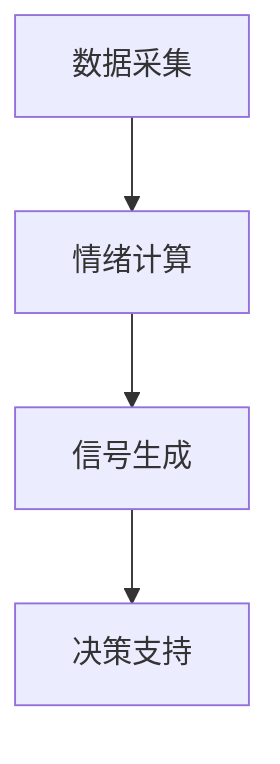
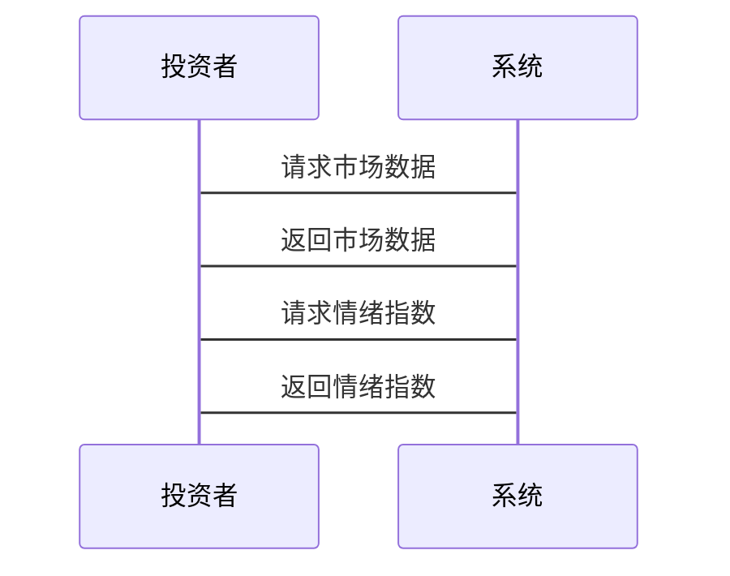

                 


# 霍华德马克斯的市场心理学

> 关键词：霍华德·马克斯、市场心理学、投资决策、行为金融学、情绪周期、认知偏差

> 摘要：本文深入探讨霍华德·马克斯的市场心理学理论，结合行为金融学、情绪周期和认知偏差等核心概念，分析投资者心理如何影响市场行为和投资决策。通过算法原理、系统设计和项目实战，展示如何利用市场心理学提升投资策略的有效性。

---

## 第一部分: 市场心理学基础

### 第1章: 市场心理学概述

#### 1.1 市场心理学的定义与核心概念

##### 1.1.1 什么是市场心理学
市场心理学是一门研究市场参与者（包括投资者、交易员和普通消费者）心理行为及其对市场波动影响的学科。它结合了心理学、经济学和金融学的理论，旨在揭示人类心理如何影响市场定价、交易行为和投资决策。

##### 1.1.2 市场心理学的核心概念
- **心理账户**：投资者如何划分和管理自己的财务资源，影响其决策。
- **情绪周期**：市场参与者在不同市场环境下的情绪变化，如贪婪与恐惧。
- **认知偏差**：投资者在信息处理中常见的心理误差，如过度自信、确认偏误。

##### 1.1.3 市场心理学与投资决策的关系
市场心理学为投资者提供了一种理解市场波动的框架，帮助投资者识别情绪驱动的市场机会和风险。

#### 1.2 投资者心理的基础知识

##### 1.2.1 投资者的心理特征
- **风险偏好**：不同投资者对风险的承受能力不同。
- **情绪稳定性**：情绪波动较大的投资者更容易受到市场波动的影响。
- **认知能力**：投资者的信息处理能力影响其决策质量。

##### 1.2.2 投资者情绪的分类
- **贪婪**：在市场上涨时，投资者倾向于追涨杀跌。
- **恐惧**：在市场下跌时，投资者倾向于恐慌性抛售。
- **乐观与悲观**：市场参与者的情绪基调影响整体市场走势。

##### 1.2.3 投资者行为的常见模式
- **从众心理**：投资者倾向于跟随市场潮流，避免独立思考。
- **羊群效应**：大量投资者同时买卖同一资产，放大市场波动。

#### 1.3 市场参与者的心理特征

##### 1.3.1 机构投资者的心理特征
- **理性决策**：机构投资者通常依赖数据分析和团队决策，情绪影响较小。
- **风险控制**：严格的风控机制降低了情绪驱动的风险。

##### 1.3.2 个人投资者的心理特征
- **情绪驱动**：个人投资者更容易受到贪婪和恐惧的影响。
- **信息不足**：缺乏深入研究，依赖市场传闻和情绪决策。

##### 1.3.3 市场心理的群体效应
- **市场共识**：群体心理形成市场共识，影响资产价格。
- **情绪传染**：市场参与者的情绪会相互影响，放大或缩小市场波动。

---

### 第2章: 投资者心理与市场行为

#### 2.1 投资者心理的核心理论

##### 2.1.1 行为金融学的基本原理
行为金融学通过研究投资者心理，揭示市场非理性行为的规律。其核心观点包括：
- **有限理性**：投资者无法完全理性决策。
- **情绪驱动**：市场波动往往由投资者情绪主导。
- **社会影响**：投资者行为受社会和群体影响。

##### 2.1.2 心理账户理论
心理账户理论指出，投资者将资金分成多个心理账户，每个账户的决策逻辑不同。例如，将资金分为短期投资和长期储蓄，影响其风险承受能力和投资行为。

##### 2.1.3 框架依赖理论
框架依赖理论认为，投资者在面对相同信息时，会因问题的描述方式（积极或消极）而做出不同的决策。

#### 2.2 投资者情绪与市场波动

##### 2.2.1 情绪周期与市场周期
市场情绪通常呈现周期性变化：
1. **乐观阶段**：投资者情绪高涨，市场上涨。
2. **狂热阶段**：情绪达到顶峰，市场泡沫形成。
3. **恐慌阶段**：情绪急剧下降，市场崩盘。
4. **超跌阶段**：情绪触底，市场反弹。

##### 2.2.2 情绪指标的构建与应用
情绪指标（如恐慌指数、市场情绪指数）用于量化市场参与者的整体情绪，帮助投资者判断市场走势。

##### 2.2.3 情绪与市场泡沫的形成
情绪高涨时，投资者过度乐观，导致资产价格虚高，形成市场泡沫。

#### 2.3 认知偏差与投资决策

##### 2.3.1 认知偏差的定义与分类
认知偏差是指人们在信息处理过程中产生的系统性误差，常见的认知偏差包括：
- **过度自信**：认为自己比实际情况更了解市场。
- **确认偏误**：倾向于寻找支持自己观点的信息，忽视相反证据。
- **从众心理**：跟随大多数人的决策，避免独立思考。

##### 2.3.2 常见的认知偏差对投资决策的影响
- **过度交易**：投资者因认知偏差频繁交易，增加交易成本。
- **错失恐惧**：因害怕错失机会而做出冲动决策。

##### 2.3.3 如何克服认知偏差
- **理性分析**：依赖数据和事实，减少情绪驱动的决策。
- **自我反思**：定期审视自己的投资决策，识别认知偏差。

---

### 第3章: 市场心理学的核心概念与联系

#### 3.1 行为金融学的核心理论

##### 3.1.1 有效市场假说与行为偏差
有效市场假说认为市场价格反映所有可用信息，但现实中投资者的认知偏差和情绪波动导致市场 inefficiency。

##### 3.1.2 市场参与者的非理性行为
投资者的非理性行为（如从众心理、过度自信）影响市场价格和市场波动。

##### 3.1.3 行为金融学与传统金融学的对比
- **传统金融学**：假设投资者理性，市场有效。
- **行为金融学**：承认投资者非理性，市场无效。

#### 3.2 投资者情绪与市场信号

##### 3.2.1 情绪与市场信号的关系
- **情绪作为信号**：投资者情绪反映市场参与者的信心和预期。
- **情绪与信号的互动**：市场信号（如价格波动）反过来影响投资者情绪。

##### 3.2.2 情绪对市场信号的干扰
- **噪声交易**：投资者因情绪做出非理性交易，增加市场噪声。
- **信号误读**：情绪波动导致投资者误读市场信号。

---

## 第4章: 算法与数学模型

#### 4.1 市场情绪量化算法

##### 4.1.1 情绪指标的计算公式
$$\text{情绪强度} = \frac{\text{上涨股票数量} - \text{下跌股票数量}}{\text{总股票数量}} \times 100$$

##### 4.1.2 情绪指标的应用场景
- **市场趋势预测**：通过情绪指标判断市场情绪的高低。
- **交易信号生成**：情绪指标超过阈值时触发买卖信号。

##### 4.1.3 算法实现
```python
def calculate_mood_index(rising, falling, total):
    mood_index = ((rising - falling) / total) * 100
    return mood_index

# 示例数据
rising = 1500
falling = 1000
total = 2500

mood_index = calculate_mood_index(rising, falling, total)
print(f"情绪指数为：{mood_index}%")
```

#### 4.2 市场信号分析算法

##### 4.2.1 市场信号的分类
- **买入信号**：情绪指数低于20%。
- **卖出信号**：情绪指数高于80%。

##### 4.2.2 算法实现
```python
def generate_market_signal(mood_index):
    if mood_index < 20:
        return "买入信号"
    elif mood_index > 80:
        return "卖出信号"
    else:
        return "观望"

# 示例数据
mood_index = 25
signal = generate_market_signal(mood_index)
print(f"市场信号为：{signal}")
```

---

## 第5章: 系统设计与实现

#### 5.1 系统架构设计

##### 5.1.1 系统功能模块
- **数据采集**：收集市场数据，如价格、成交量。
- **情绪计算**：计算情绪指数。
- **信号生成**：根据情绪指数生成交易信号。
- **决策支持**：提供投资建议。

##### 5.1.2 系统架构图


#### 5.2 系统接口设计

##### 5.2.1 接口定义
- **输入接口**：市场数据接口。
- **输出接口**：交易信号接口。

##### 5.2.2 接口交互


---

## 第6章: 项目实战

#### 6.1 投资案例分析

##### 6.1.1 案例背景
- **市场环境**：2020年新冠疫情后的市场反弹。
- **投资者情绪**：初期恐慌，后期乐观。

##### 6.1.2 情绪分析
- **情绪指数**：从30%反弹至85%。
- **交易信号**：情绪指数突破80%，触发卖出信号。

##### 6.1.3 投资决策
- **买入信号**：在情绪指数低于20%时买入。
- **卖出信号**：在情绪指数高于80%时卖出。

#### 6.2 项目小结

##### 6.2.1 经验总结
- **情绪指数的有效性**：情绪指数在市场底部和顶部提供有效的交易信号。
- **算法的局限性**：情绪指数无法预测突发事件的影响。

##### 6.2.2 改进建议
- **结合其他指标**：将情绪指数与其他技术指标结合，提高决策准确性。
- **动态调整阈值**：根据市场环境调整情绪指数的阈值。

---

## 第7章: 最佳实践与总结

#### 7.1 投资策略建议

##### 7.1.1 控制情绪影响
- **避免情绪驱动决策**：在投资决策前，进行理性分析。
- **制定投资计划**：明确投资目标和风险承受能力。

##### 7.1.2 利用市场心理变化
- **逆向投资**：在市场恐慌时买入，市场狂热时卖出。

#### 7.2 总结

##### 7.2.1 市场心理学的核心价值
市场心理学帮助投资者理解市场波动的内在逻辑，提升投资决策的质量。

##### 7.2.2 进一步学习建议
- **阅读经典书籍**：《投资心理分析》、《投资者的决策心理》。
- **实践应用**：结合实际市场案例，验证市场心理学理论。

---

## 作者

作者：AI天才研究院/AI Genius Institute & 禅与计算机程序设计艺术/Zen And The Art of Computer Programming

---

通过以上结构，文章从市场心理学的理论基础到实际应用，结合算法、系统设计和项目实战，全面解析霍华德·马克斯的市场心理学思想，为投资者提供科学的投资决策参考。

