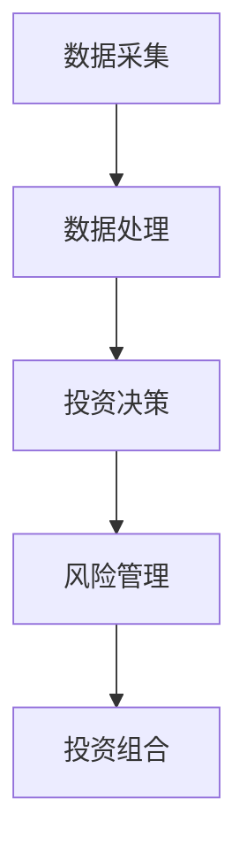

                 


# 马里奥·加贝利的专注型价值投资：集中持股策略

## 关键词：专注型投资、价值投资、集中持股策略、投资组合优化、风险管理、数学模型

## 摘要：  
本文深入探讨了马里奥·加贝利的专注型价值投资策略，特别是其独特的集中持股方法。通过分析其投资理念、数学模型、系统架构及实际案例，本文揭示了专注型投资的核心要素，包括选股标准、投资组合管理、风险管理等。文章还结合实际应用，展示了如何将这些理论转化为技术实现，并通过实战案例验证了该策略的有效性。最后，本文总结了专注型投资的优势与挑战，并展望了其未来的发展趋势。

---

# 第1章：专注型价值投资的背景与核心理念

## 1.1 专注型价值投资的起源与发展

### 1.1.1 价值投资的起源与演变  
价值投资作为一种经典的证券投资策略，起源于20世纪初，其核心理念是通过分析企业的基本面，寻找被市场低估的投资标的。马里奥·加贝利作为现代价值投资的重要代表之一，进一步发展了这一理念，提出了专注型投资的概念。

### 1.1.2 马里奥·加贝利的投资风格与特点  
马里奥·加贝利以专注于少数优质股票而闻名，他的投资策略强调长期持有、深入研究和集中投资。这种风格与传统分散投资策略形成鲜明对比，体现了他对个股质量和公司基本面的高度信任。

### 1.1.3 专注型投资的定义与核心要素  
专注型投资是指将投资组合的重点放在少数精选的股票上，通过深入研究和长期持有，实现超额收益。其核心要素包括：  
- **集中投资**：将大部分资金投入到少数优质企业。  
- **价值发现**：寻找市场低估的股票。  
- **长期持有**：避免频繁交易，降低交易成本。  

## 1.2 专注型投资的核心理念

### 1.2.1 集中持股策略的理论基础  
集中持股策略的理论基础源于现代投资组合理论（MPT），该理论指出，通过合理分配资产可以有效降低投资组合的整体风险。然而，马里奥·加贝利认为，过度分散投资可能导致收益的稀释，因此选择集中投资优质标的更能实现超额收益。

### 1.2.2 价值投资与成长投资的对比  
- **价值投资**：关注市场价格与内在价值的差异，寻找被低估的股票。  
- **成长投资**：关注企业的成长潜力，愿意为未来增长支付较高溢价。  
专注型投资更接近价值投资，但更注重集中和长期持有。

### 1.2.3 专注型投资的优缺点分析  
- **优点**：集中投资能够提高收益潜力，降低交易成本，避免分散投资的风险。  
- **缺点**：集中投资的风险较高，一旦投资标的出现问题，可能导致重大损失。  

## 1.3 专注型投资的边界与外延

### 1.3.1 投资标的的选择标准  
专注型投资要求严格筛选投资标的，通常包括以下标准：  
- 企业具有强大的竞争优势（护城河）。  
- 公司治理结构良好，管理层值得信赖。  
- 财务状况健康，估值合理。  

### 1.3.2 投资组合的构建逻辑  
- **核心原则**：集中投资于少数优质股票。  
- **动态调整**：定期复盘，评估投资标的的表现和市场变化，进行适当调整。  

## 1.4 专注型投资的核心要素组成

### 1.4.1 投资目标的设定  
专注型投资的目标是通过长期持有优质股票，实现资本的稳定增长。

### 1.4.2 投资期限的规划  
专注型投资适合长期投资者，通常建议持有期在5年以上，以充分释放投资标的的成长潜力。

### 1.4.3 投资风险的控制  
通过严格筛选投资标的、分散风险敞口以及定期复盘调整，降低投资风险。

## 1.5 本章小结  
专注型价值投资是一种以集中持股为核心的投资策略，强调通过深入研究和长期持有优质股票，实现超额收益。其核心理念在于选择少数优质标的，避免过度分散，同时注重风险管理。

---

# 第2章：马里奥·加贝利的投资方法论

## 2.1 马里奥·加贝利的投资策略

### 2.1.1 选股标准与投资逻辑  
马里奥·加贝利的选股标准包括：  
- 企业具有强大的竞争优势。  
- 公司估值合理，市场价格低于内在价值。  
- 管理层诚信可靠，具有长期发展愿景。  

### 2.1.2 集中持股的数学模型  
集中持股的数学模型可以表示为：  
$$ \text{收益} = \sum_{i=1}^{n} w_i \times r_i $$  
其中，$w_i$ 是第$i$只股票的权重，$r_i$ 是第$i$只股票的收益率，$n$是投资组合中的股票数量。  

### 2.1.3 投资组合的动态调整  
动态调整的核心在于定期评估投资标的的表现和市场环境的变化，根据实际情况进行调整。

## 2.2 专注型投资的核心要素

### 2.2.1 企业基本面分析  
基本面分析包括对企业的财务状况、盈利能力、成长潜力等方面进行深入研究。

### 2.2.2 市场情绪与估值分析  
市场情绪分析帮助企业判断市场的短期波动，估值分析则用于寻找被低估的股票。

### 2.2.3 长期投资与复利效应  
专注型投资通过长期持有优质股票，利用复利效应实现财富的稳定增长。

## 2.3 投资组合管理策略

### 2.3.1 集中持股的风险管理  
集中持股的风险管理包括：  
- 严格筛选投资标的，降低投资风险。  
- 定期复盘，及时调整投资组合。  

### 2.3.2 定期复盘与调整  
定期复盘是评估投资策略的有效性，及时发现和解决问题。

### 2.3.3 个股与整体市场的关联性分析  
通过分析个股与整体市场的关联性，可以更好地理解投资组合的风险敞口。

## 2.4 专注型投资的数学模型

### 2.4.1 投资组合的收益与风险模型  
收益与风险模型可以通过夏普比率来衡量：  
$$ \text{夏普比率} = \frac{E(r_p) - r_f}{\sigma_p} $$  
其中，$E(r_p)$ 是投资组合的期望收益，$r_f$ 是无风险利率，$\sigma_p$ 是投资组合的收益标准差。  

### 2.4.2 集中持股的夏普比率计算  
通过计算投资组合的夏普比率，可以评估其风险调整后的收益。

### 2.4.3 投资组合的波动率分析  
波动率分析用于衡量投资组合的收益波动情况，帮助投资者更好地理解风险。

## 2.5 本章小结  
马里奥·加贝利的投资方法论以集中持股为核心，结合基本面分析和市场估值，通过严格的选股标准和动态调整策略，实现投资收益的最大化。

---

# 第3章：专注型投资的系统分析与架构设计

## 3.1 系统功能需求

### 3.1.1 数据采集与处理模块  
数据采集模块负责收集股票的财务数据、市场数据等，处理模块对数据进行清洗和整理。

### 3.1.2 投资决策模块  
投资决策模块基于数据分析结果，生成投资建议。

### 3.1.3 风险管理模块  
风险管理模块负责监控投资组合的风险，及时发出预警信号。

## 3.2 系统架构设计

### 3.2.1 系统功能模块设计  
- 数据采集模块：负责收集股票数据。  
- 数据处理模块：对数据进行清洗和整理。  
- 投资决策模块：基于数据分析结果，生成投资建议。  
- 风险管理模块：监控投资组合的风险。  

### 3.2.2 系统架构图  


## 3.3 系统接口设计

### 3.3.1 数据接口  
- 数据接口用于与数据源（如金融数据库）进行交互，获取股票数据。

### 3.3.2 投资决策接口  
- 投资决策接口接收数据处理模块的输出，生成投资建议。

### 3.3.3 风险管理接口  
- 风险管理接口负责监控投资组合的风险，提供预警信息。

## 3.4 系统交互流程

### 3.4.1 数据采集与处理流程  
1. 数据采集模块从数据源获取股票数据。  
2. 数据处理模块对数据进行清洗和整理。  

### 3.4.2 投资决策流程  
1. 投资决策模块基于处理后的数据，生成投资建议。  
2. 风险管理模块监控投资组合的风险，提供预警信息。  

---

# 第4章：专注型投资的实战案例分析

## 4.1 环境配置

### 4.1.1 数据源选择  
选择可靠的数据源，如Yahoo Finance或 Bloomberg。

### 4.1.2 工具安装  
安装必要的工具，如Python、Pandas、NumPy等。

## 4.2 核心代码实现

### 4.2.1 数据获取与处理  
```python
import pandas as pd
import numpy as np

# 获取股票数据
def get_data(ticker):
    data = pd.DataFrame()
    # 数据获取逻辑
    return data

# 数据清洗
def data_cleaning(data):
    # 数据清洗逻辑
    return data
```

### 4.2.2 投资组合构建  
```python
def build_portfolio(data, num_stocks=5):
    # 选择优质股票
    selected_stocks = data.sort_values('valuation_ratio').head(num_stocks)
    return selected_stocks
```

## 4.3 案例分析

### 4.3.1 投资组合构建  
假设我们选择5只优质股票，构建投资组合。

### 4.3.2 投资组合表现  
分析投资组合的历史表现，评估其收益和风险。

## 4.4 项目小结  
通过实战案例，我们可以看到专注型投资策略的有效性，同时也需要注意风险管理的重要性。

---

# 第5章：专注型投资的风险管理与优化

## 5.1 风险管理策略

### 5.1.1 风险来源分析  
- 市场风险：整体市场波动对投资组合的影响。  
- 个股风险：个别股票的表现不佳导致投资组合受损。  

### 5.1.2 风险控制措施  
- 设置止损点：当投资标的跌幅超过一定阈值时，立即卖出。  
- 定期复盘：及时发现和调整投资组合中的问题。  

## 5.2 风险优化建议

### 5.2.1 分散风险敞口  
通过选择不同行业的股票，分散投资组合的风险。

### 5.2.2 加强风险管理模块  
引入先进的风险管理工具和技术，提高风险管理的效率和准确性。

---

# 第6章：专注型价值投资的总结与展望

## 6.1 总结

### 6.1.1 核心内容回顾  
专注型价值投资是一种以集中持股为核心的投资策略，强调通过深入研究和长期持有优质股票，实现超额收益。

### 6.1.2 投资策略的优势  
- 高收益潜力：集中投资于优质股票，可能实现更高的收益。  
- 低交易成本：减少交易次数，降低交易成本。  

## 6.2 展望

### 6.2.1 专注型投资的未来发展趋势  
随着技术的进步，专注型投资将更加依赖于数据分析和人工智能技术。

### 6.2.2 投资者需要注意的问题  
- 风险管理：集中投资风险较高，需要加强风险管理。  
- 市场变化：及时关注市场变化，调整投资策略。  

---

# 作者：AI天才研究院/AI Genius Institute & 禅与计算机程序设计艺术/Zen And The Art of Computer Programming

