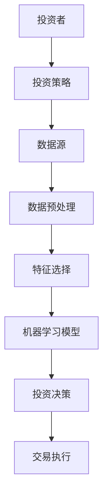
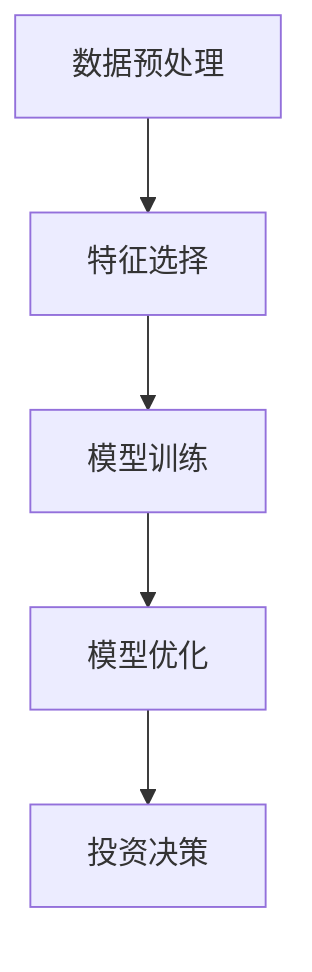
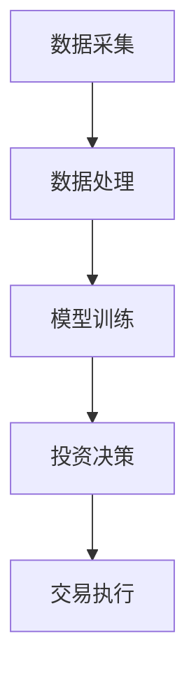
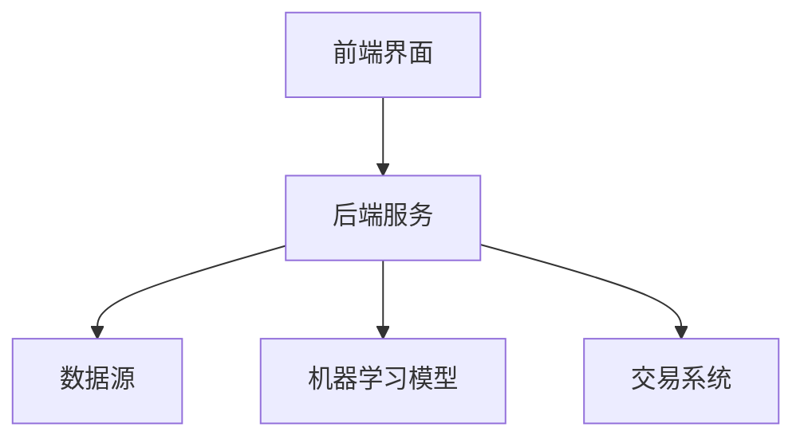
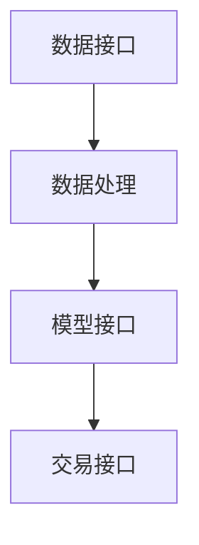
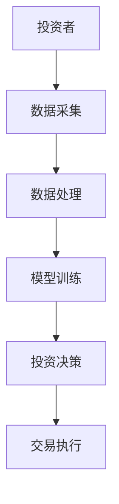

                 


# AI系统如何应用约翰·伯格的低成本投资策略

> 关键词：AI系统、低成本投资策略、约翰·伯格、量化投资、机器学习、投资优化

> 摘要：本文探讨了如何将约翰·伯格的低成本投资策略与AI技术相结合，通过机器学习算法优化投资决策，降低投资成本，提高投资效率。文章详细分析了AI在金融投资中的应用背景，约翰·伯格投资策略的核心要素，以及如何通过数据驱动的方法实现投资策略的优化。同时，文章还提供了基于AI的低成本投资策略的具体实现方法和实际案例分析，为读者提供了一套完整的解决方案。

---

# 第一部分：AI系统与低成本投资策略的背景介绍

## 第1章：约翰·伯格低成本投资策略概述

### 1.1 约翰·伯格与低成本投资策略

#### 1.1.1 约翰·伯格的生平与投资理念

约翰·伯格（John Bogle）是美国著名的投资专家，被誉为“指数基金之父”。他创立了先锋集团（Vanguard Group），并提出了低成本投资策略的核心理念。伯格认为，长期投资和低成本是实现投资收益的关键因素。他反对频繁的交易和高额的管理费用，提倡通过指数基金进行长期投资，以降低投资成本并实现稳健的收益。

#### 1.1.2 低成本投资策略的核心思想

低成本投资策略的核心思想是通过分散投资和长期持有，降低投资成本，从而获得稳定的收益。伯格认为，市场的波动性和交易成本是投资者实现超额收益的主要障碍。因此，他提倡通过投资低成本的指数基金，避免频繁交易，从而减少费用对收益的影响。

#### 1.1.3 低成本投资策略的适用场景与边界

低成本投资策略适用于长期投资，尤其是对于那些不具备专业投资知识的普通投资者。该策略特别适合在市场波动较大、交易成本较高的情况下，通过分散投资降低风险，同时降低投资费用。

---

## 第2章：AI系统在金融投资中的应用背景

### 2.1 金融投资中的数据驱动决策

随着大数据技术的发展，金融投资逐渐从传统的经验驱动转向数据驱动。通过分析大量的历史数据，投资者可以发现市场规律，优化投资决策。AI技术的引入，使得投资决策更加智能化和自动化。

### 2.2 传统投资策略的局限性

传统投资策略往往依赖于个人经验和市场直觉，具有较高的主观性和不确定性。尤其是在市场波动剧烈的情况下，传统策略难以应对复杂的变化，容易导致投资损失。此外，传统策略的高交易成本和频繁交易也增加了投资者的负担。

### 2.3 AI技术如何提升投资效率

AI技术通过机器学习算法，可以从海量数据中提取有用的信息，帮助投资者发现潜在的投资机会。AI系统可以实时监控市场变化，快速做出反应，从而提高投资效率。此外，AI技术还可以通过自动化交易和风险管理，降低投资成本，优化投资组合。

---

# 第二部分：核心概念与联系

## 第3章：约翰·伯格投资策略的核心要素

### 3.1 指数基金投资

指数基金是一种跟踪特定市场指数的基金，其投资组合与指数成分股一致。通过投资指数基金，投资者可以避免个股选择的风险，同时降低管理费用。伯格认为，指数基金是实现长期稳健投资的有效工具。

### 3.2 长期投资与复利效应

长期投资是低成本投资策略的核心要素之一。通过长期持有投资组合，投资者可以充分利用复利效应，实现财富的稳步增长。伯格强调，频繁的交易不仅会增加交易成本，还会导致投资收益的损失。

### 3.3 风险控制与分散投资

分散投资是降低投资风险的有效方法。通过将资金分配到不同的资产类别和行业中，投资者可以降低单一资产波动对整体投资组合的影响。伯格认为，分散投资是实现长期稳健收益的关键。

---

## 第4章：AI系统的核心概念与投资策略的结合

### 4.1 数据驱动的决策模型

AI系统通过分析大量的历史数据，构建数据驱动的决策模型，帮助投资者制定科学的投资策略。数据驱动的决策模型可以利用统计学和机器学习算法，发现数据中的规律，优化投资决策。

### 4.2 机器学习在投资策略中的应用

机器学习是AI系统的核心技术之一，其在投资策略中的应用主要体现在预测市场趋势、评估资产风险、优化投资组合等方面。通过机器学习算法，投资者可以更好地理解市场动态，制定更加科学的投资策略。

### 4.3 投资策略与AI算法的实体关系图

以下是投资策略与AI算法的实体关系图：



---

# 第三部分：算法原理讲解

## 第5章：基于AI的低成本投资策略算法

### 5.1 数据预处理与特征选择

#### 5.1.1 数据预处理

数据预处理是机器学习算法的基础。投资者需要对历史数据进行清洗、标准化和归一化处理，以确保数据的质量和一致性。例如，可以通过去除缺失值、处理异常值等方法，提高数据的可用性。

#### 5.1.2 特征选择

特征选择是数据预处理的重要步骤。投资者需要从大量数据中筛选出对投资决策有影响的关键特征。例如，可以通过相关性分析、逐步回归等方法，选择最具影响力的特征。

### 5.2 机器学习模型的训练与优化

#### 5.2.1 模型训练

投资者可以选择适合投资策略的机器学习模型，例如线性回归、支持向量机（SVM）、随机森林等。通过训练模型，投资者可以预测市场趋势，评估资产风险。

#### 5.2.2 模型优化

模型优化是提高投资决策准确性的关键。投资者可以通过调整模型参数、交叉验证等方法，优化模型的性能。例如，可以通过网格搜索（Grid Search）方法，找到最佳的模型参数。

### 5.3 算法流程图

以下是基于AI的低成本投资策略算法流程图：



---

## 第6章：投资策略的数学模型

### 6.1 回归分析模型

回归分析模型是一种常用的统计学模型，用于预测变量之间的关系。例如，可以通过线性回归模型，预测股票价格与市场指数之间的关系。

$$ y = \beta_0 + \beta_1 x + \epsilon $$

其中，$y$ 是预测变量，$x$ 是自变量，$\beta_0$ 和 $\beta_1$ 是回归系数，$\epsilon$ 是误差项。

### 6.2 时间序列分析模型

时间序列分析模型用于预测随时间变化的变量。例如，可以通过ARIMA模型，预测股票价格的变化趋势。

$$ ARIMA(p, d, q) $$

其中，$p$ 是自回归阶数，$d$ 是差分阶数，$q$ 是移动平均阶数。

### 6.3 风险-收益模型

风险-收益模型用于评估投资组合的风险与收益之间的关系。例如，可以通过CAPM模型，预测资产的预期收益。

$$ E(R_i) = R_f + \beta_i (R_m - R_f) $$

其中，$E(R_i)$ 是资产的预期收益，$R_f$ 是无风险利率，$\beta_i$ 是资产的贝塔系数，$R_m$ 是市场预期收益，$R_f$ 是无风险利率。

---

# 第四部分：系统分析与架构设计

## 第7章：投资系统架构设计方案

### 7.1 系统功能设计

投资系统的功能设计包括数据采集、数据处理、模型训练、投资决策和交易执行等模块。以下是系统的功能模块图：



### 7.2 系统架构设计图

以下是系统的架构设计图：



### 7.3 系统接口设计

系统接口设计包括数据接口、模型接口和交易接口。以下是系统的接口设计图：



### 7.4 系统交互流程图

以下是系统的交互流程图：



---

## 第8章：基于AI的低成本投资策略实现

### 8.1 环境安装与配置

投资者需要安装Python编程环境，并安装相关的机器学习库，例如scikit-learn、pandas、numpy等。

### 8.2 核心算法实现

以下是基于AI的低成本投资策略的核心算法实现：

```python
import numpy as np
import pandas as pd
from sklearn.linear_model import LinearRegression

# 数据预处理
data = pd.read_csv('stock_data.csv')
data = data.dropna()
X = data[['open', 'close', 'high', 'low']]
y = data['target']

# 特征选择
selector = SelectKBest(score_func=f_classif, k=2)
selector.fit(X, y)
X_selected = selector.transform(X)

# 模型训练
model = LinearRegression()
model.fit(X_selected, y)

# 模型预测
new_data = pd.read_csv('new_stock_data.csv')
new_data = new_data.dropna()
new_X = new_data[['open', 'close', 'high', 'low']]
new_X_selected = selector.transform(new_X)
predictions = model.predict(new_X_selected)
```

### 8.3 代码解读与分析

上述代码展示了基于AI的低成本投资策略的核心算法实现。通过数据预处理、特征选择和模型训练，投资者可以构建一个简单的线性回归模型，用于预测股票价格的变化趋势。

### 8.4 实际案例分析

以下是基于AI的低成本投资策略的实际案例分析：

假设我们有一个股票数据集，包含开盘价、收盘价、最高价、最低价等特征。通过数据预处理和特征选择，我们可以选择最重要的两个特征，训练一个线性回归模型，预测股票价格的变化趋势。通过模型预测，投资者可以做出投资决策，优化投资组合。

---

## 第9章：总结与最佳实践

### 9.1 本书内容回顾

本文详细介绍了如何将约翰·伯格的低成本投资策略与AI技术相结合，通过机器学习算法优化投资决策，降低投资成本，提高投资效率。

### 9.2 AI系统应用低成本投资策略的最佳实践

投资者在应用AI系统时，需要注意以下几点：

1. **数据质量**：确保数据的完整性和准确性。
2. **模型选择**：选择适合投资策略的机器学习模型。
3. **风险控制**：通过分散投资和风险评估，降低投资风险。
4. **持续优化**：定期更新模型和优化投资策略。

### 9.3 未来研究方向与挑战

未来的研究方向包括：

1. **复杂模型的应用**：研究更复杂的机器学习模型，例如深度学习模型。
2. **多因子投资策略**：研究多因子投资策略，优化投资组合。
3. **实时交易系统**：研究实时交易系统，提高投资效率。

---

## 第10章：注意事项与拓展阅读

### 10.1 投资策略中的风险提示

投资有风险，投资者需谨慎。AI技术的应用可以帮助投资者优化决策，但并不能完全消除投资风险。

### 10.2 相关领域的拓展阅读

1. **机器学习在金融中的应用**：深入研究机器学习在金融中的其他应用，例如信用评分、风险管理等。
2. **量化投资策略**：学习量化投资策略，掌握更多投资工具和方法。
3. **金融数据分析**：学习金融数据分析技术，提高数据处理能力。

### 10.3 未来技术趋势与应用前景

随着AI技术的不断发展，其在金融投资中的应用前景广阔。未来的投资策略将更加智能化和自动化，投资者可以通过AI系统实现更加精准的投资决策。

---

# 作者：AI天才研究院/AI Genius Institute & 禅与计算机程序设计艺术 /Zen And The Art of Computer Programming

---

**完**

