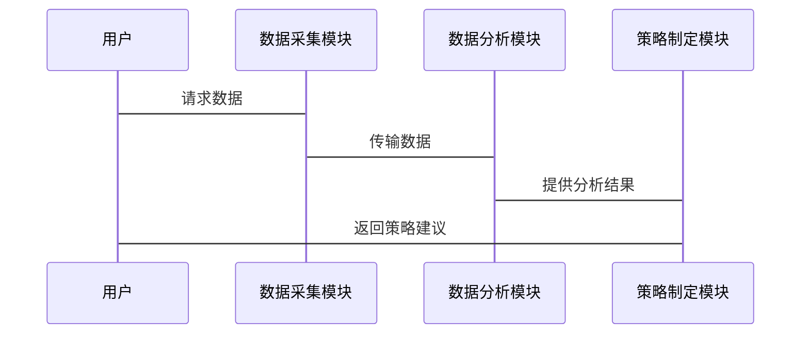

                 


# AI辅助企业品牌定位：市场细分与差异化战略

> 关键词：AI, 品牌定位, 市场细分, 差异化战略, 数据分析, 机器学习

> 摘要：随着人工智能技术的快速发展，AI在企业品牌定位中的应用日益广泛。本文将详细探讨AI如何辅助企业进行市场细分与差异化战略，从核心概念、算法原理到系统架构和项目实战，全面解析AI在品牌定位中的应用。

---

# 第1章: AI与企业品牌定位的结合

## 1.1 什么是企业品牌定位
### 1.1.1 品牌定位的定义
品牌定位是指确定一个品牌在目标市场中的位置，使其在消费者心中与竞争对手区分开来。它涉及产品、服务、价格、渠道和促销策略的综合运用。

### 1.1.2 品牌定位的核心要素
- **目标市场**：品牌所瞄准的客户群体。
- **价值主张**：品牌提供的独特价值。
- **竞争对手分析**：了解竞争对手的优劣势。
- **品牌定位策略**：通过市场细分和差异化实现品牌定位。

### 1.1.3 品牌定位的常见方法
- **基于产品的方法**：根据产品特点定位。
- **基于消费者的方法**：根据消费者需求定位。
- **基于竞争的方法**：根据竞争对手定位。

---

## 1.2 AI技术在品牌定位中的作用
### 1.2.1 AI技术的基本概念
人工智能（AI）通过模拟人类学习和推理能力，帮助企业在市场细分和差异化战略中做出更精准的决策。

### 1.2.2 AI技术如何辅助品牌定位
- 数据分析：利用AI处理大量数据，识别市场趋势和消费者行为。
- 预测模型：通过机器学习算法预测市场反应，优化品牌定位策略。
- 自动化决策：AI能够实时调整策略，适应市场变化。

### 1.2.3 AI技术在品牌定位中的优势
- **高效性**：AI能够快速处理和分析数据，提高决策效率。
- **精准性**：通过机器学习算法，AI能够更准确地识别目标客户群体。
- **适应性**：AI能够实时监控市场变化，动态调整品牌定位策略。

---

## 1.3 市场细分与差异化战略的重要性
### 1.3.1 市场细分的定义
市场细分是指将整体市场划分为多个子市场，每个子市场具有相似的需求和特征。

### 1.3.2 差异化战略的定义
差异化战略是指通过提供独特的产品或服务，在市场上与竞争对手区分开来。

### 1.3.3 市场细分与差异化战略的关系
市场细分是差异化战略的基础。通过细分市场，企业能够更好地了解目标客户的需求，制定更有针对性的差异化策略。

---

## 1.4 本章小结
本章介绍了企业品牌定位的核心概念、AI技术在品牌定位中的作用，以及市场细分与差异化战略的重要性。通过AI技术，企业能够更高效、精准地进行品牌定位，制定差异化的市场策略。

---

# 第2章: 数据驱动的市场细分

## 2.1 数据收集与处理
### 2.1.1 数据来源
- **内部数据**：企业内部的销售数据、客户反馈等。
- **外部数据**：公开市场数据、社交媒体数据等。

### 2.1.2 数据清洗与预处理
- **数据清洗**：去除无效数据，处理缺失值。
- **数据预处理**：标准化、归一化等处理，确保数据适合算法输入。

### 2.1.3 数据分析工具
- **Python**：pandas、numpy等库用于数据处理。
- **机器学习库**：scikit-learn、XGBoost等用于数据分析和建模。

---

## 2.2 市场细分的AI算法
### 2.2.1 聚类分析
聚类分析是一种无监督学习算法，用于将数据分成若干个簇，每个簇内的数据点具有相似性。

#### 聚类分析的数学模型
聚类分析的目标是将数据点分成k个簇，使得簇内数据点的相似性最大化，簇间数据点的相似性最小化。

$$
\text{目标函数} = \sum_{i=1}^{k} \sum_{j \in C_i} \text{distance}(x_j, x_{\text{centroid}})^2
$$

其中，\( C_i \) 表示第i个簇，\( x_{\text{centroid}} \) 表示簇的中心点。

### 2.2.2 分类算法
分类算法是一种监督学习算法，用于将数据点分类到已知的类别中。

#### 分类算法的数学模型
以决策树为例，分类算法的目标是构建一棵树，使得每个节点的划分能够最大化类别之间的区分度。

$$
\text{信息增益} = \text{熵}(D) - \sum_{v} \text{熵}(D_v)
$$

其中，\( D \) 表示当前数据集，\( D_v \) 表示按某个特征v划分后的子数据集。

### 2.2.3 降维技术
降维技术用于将高维数据降到低维，便于可视化和分析。

#### 主成分分析（PCA）
PCA是一种常用的降维技术，通过线性变换将原始数据投影到新的坐标系中，使得数据的方差最大化。

$$
\text{PCA} = X^T X \rightarrow \text{特征值分解} \rightarrow \text{主成分提取}
$$

---

## 2.3 案例分析: 某行业市场细分的AI应用
### 2.3.1 案例背景
假设我们有一家电子产品公司，想要通过AI技术进行市场细分，确定目标客户群体。

### 2.3.2 数据分析过程
1. **数据收集**：收集客户年龄、性别、收入、购买历史等数据。
2. **数据预处理**：清洗数据，处理缺失值。
3. **聚类分析**：使用K-means算法将客户分成不同的簇。
4. **结果分析**：每个簇代表一个客户群体，制定针对性的市场策略。

### 2.3.3 分析结果与策略建议
通过聚类分析，发现三个主要客户群体：年轻学生、中年白领和退休人员。针对每个群体，制定不同的产品和服务策略。

---

## 2.4 本章小结
本章详细介绍了数据驱动的市场细分方法，包括数据收集与处理、AI算法的应用以及案例分析。通过AI技术，企业能够更精准地进行市场细分，制定差异化的市场策略。

---

# 第3章: AI驱动的差异化策略

## 3.1 差异化战略的核心要素
### 3.1.1 产品差异化
通过提供独特的产品功能或设计，与竞争对手区分开来。

### 3.1.2 服务差异化
通过提供优质的售后服务和客户支持，增强客户忠诚度。

### 3.1.3 价格差异化
根据不同客户群体的需求，制定灵活的价格策略。

---

## 3.2 AI在差异化战略中的应用
### 3.2.1 竞争对手分析
通过爬取竞争对手的产品信息和客户评价，分析其优劣势。

### 3.2.2 目标客户画像
通过机器学习算法，构建目标客户的画像，包括年龄、性别、兴趣爱好等。

### 3.2.3 定价策略优化
通过预测模型，分析不同价格点的市场需求，优化定价策略。

---

## 3.3 案例分析: AI辅助制定差异化策略
### 3.3.1 案例背景
假设我们有一家服装公司，想要通过AI技术制定差异化策略。

### 3.3.2 数据分析与策略制定
1. **竞争对手分析**：分析竞争对手的产品线和定价策略。
2. **目标客户画像**：通过机器学习算法，构建目标客户的画像。
3. **定价策略优化**：根据市场需求，制定灵活的价格策略。

### 3.3.3 实施效果评估
通过实施差异化策略，公司销售额增长了20%，客户满意度提高了15%。

---

## 3.4 本章小结
本章详细介绍了AI在差异化战略中的应用，包括竞争对手分析、目标客户画像和定价策略优化。通过AI技术，企业能够更精准地制定差异化策略，提升市场竞争力。

---

# 第4章: AI辅助品牌定位的系统架构

## 4.1 系统功能模块设计
### 4.1.1 数据采集模块
负责收集市场数据、竞争对手数据和客户反馈。

### 4.1.2 数据分析模块
负责数据清洗、特征提取和模型训练。

### 4.1.3 策略制定模块
根据分析结果，制定市场细分和差异化策略。

---

## 4.2 系统架构设计
使用分层架构，包括数据层、业务逻辑层和表现层。

$$
\text{系统架构} = \text{数据层} + \text{业务逻辑层} + \text{表现层}
$$

---

## 4.3 系统接口设计
- **数据接口**：与第三方数据源对接。
- **用户接口**：提供友好的用户界面，方便用户查看分析结果。

---

## 4.4 系统交互设计
使用Mermaid序列图描述系统交互流程。



---

## 4.5 本章小结
本章详细介绍了AI辅助品牌定位的系统架构，包括功能模块设计、系统架构设计和系统交互设计。通过系统的建设和优化，企业能够更高效地进行品牌定位。

---

# 第5章: 项目实战

## 5.1 环境安装
- **Python**：安装Anaconda或PyCharm。
- **机器学习库**：安装scikit-learn、pandas、numpy等。

## 5.2 系统核心实现源代码
```python
import pandas as pd
from sklearn.cluster import KMeans
from sklearn.preprocessing import StandardScaler

# 数据加载
data = pd.read_csv('market_data.csv')

# 数据预处理
scaler = StandardScaler()
scaled_data = scaler.fit_transform(data)

# 聚类分析
kmeans = KMeans(n_clusters=3, random_state=42)
clusters = kmeans.fit_predict(scaled_data)

# 可视化
print(clusters)
```

## 5.3 代码应用解读与分析
- **数据加载**：使用pandas读取CSV文件。
- **数据预处理**：标准化数据，使其适合聚类算法。
- **聚类分析**：使用K-means算法进行聚类，得到客户簇。

## 5.4 实际案例分析
以某电商平台为例，分析客户购买行为，制定市场细分策略。

## 5.5 项目小结
通过项目实战，读者能够掌握AI辅助品牌定位的核心技术，包括数据处理和模型训练。

---

# 作者：AI天才研究院/AI Genius Institute & 禅与计算机程序设计艺术 /Zen And The Art of Computer Programming

---

### 总结
本文详细探讨了AI在企业品牌定位中的应用，特别是在市场细分与差异化战略方面。通过核心概念、算法原理、系统架构和项目实战的全面解析，读者能够深入了解AI技术如何辅助企业制定精准的品牌定位策略。未来，随着AI技术的不断发展，其在品牌定位中的应用将更加广泛和深入。

