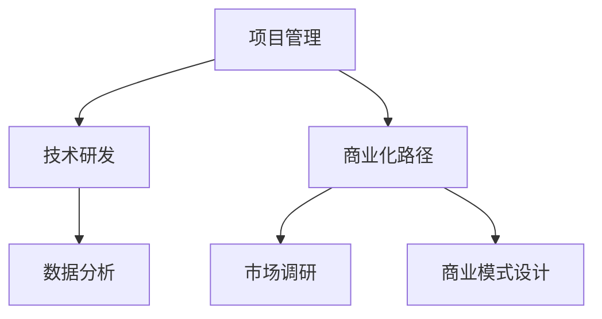
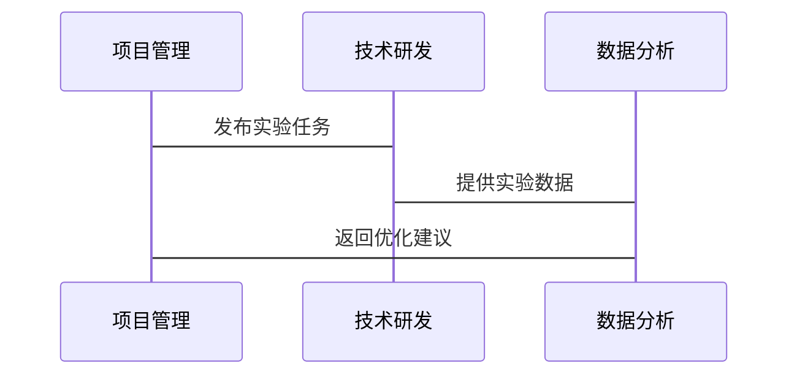

                 


# 价值投资中的可控核聚变前景分析

## 关键词：价值投资、可控核聚变、技术分析、投资模型、系统设计、项目实战、长期回报

## 摘要：  
本文探讨了价值投资与可控核聚变技术的结合，分析了可控核聚变的技术原理、市场潜力、投资价值及风险。通过详细的技术分析和数学建模，结合实际案例，揭示了可控核聚变在能源领域的革命性潜力及其对投资者的长期回报价值。文章还提出了基于系统架构设计的投资策略，为投资者提供了科学的决策依据。

---

# 第1章: 价值投资与可控核聚变概述

## 1.1 价值投资的基本概念

### 1.1.1 价值投资的定义  
价值投资是一种以低于资产内在价值的价格购买优质资产的投资策略，核心在于寻找市场低估的公司，长期持有以实现收益最大化。  

### 1.1.2 价值投资的核心理念  
- **安全边际**：买入价格低于内在价值，确保投资的安全性。  
- **长期视角**：关注企业的长期盈利能力，而非短期市场波动。  
- **优质资产**：选择具有竞争优势、良好治理和可持续发展的企业。  

### 1.1.3 价值投资与长期收益的关系  
价值投资通过长期持有优质资产，能够在市场波动中实现稳定的超额收益，尤其在技术进步和行业变革中表现突出。

## 1.2 可控核聚变的技术与现状

### 1.2.1 可控核聚变的定义  
可控核聚变是指通过技术手段，在受控条件下使轻核聚变成重核，并释放大量能量的过程，俗称“人造太阳”。  

### 1.2.2 可控核聚变的技术原理  
可控核聚变的核心是利用等离子体中的核聚变反应，通过强磁场约束高温等离子体，使其发生聚变反应并释放能量。  

### 1.2.3 当前可控核聚变研究的进展  
- **实验进展**：ITER项目是目前规模最大、最重要的可控核聚变实验，预计在2030年左右实现聚变能的商业化应用。  
- **技术瓶颈**：材料科学、磁场约束、能量转换效率等问题尚未完全解决。  

## 1.3 价值投资与可控核聚变的结合

### 1.3.1 可控核聚变的市场潜力  
- **能源革命**：可控核聚变有望成为未来的主要能源，具有清洁、安全、可持续的特点。  
- **技术突破**：一旦实现商业化，相关企业将具备巨大的市场价值。  

### 1.3.2 价值投资在科技领域的应用  
- **技术驱动**：价值投资者关注技术创新的持续性和商业化潜力。  
- **长期视角**：可控核聚变的技术突破需要时间，但一旦成功，将带来指数级的回报。  

### 1.3.3 可控核聚变行业的投资机会  
- **研发驱动**：投资于领先的研发机构或企业，分享技术突破的成果。  
- **产业链布局**：从材料供应、设备制造到能源服务的全产业链投资机会。  

## 1.4 本章小结  
本章介绍了价值投资的核心理念和可控核聚变的技术现状，分析了两者结合的潜力和机会，为后续的技术分析和投资策略奠定了基础。

---

# 第2章: 可控核聚变的技术挑战与投资价值分析

## 2.1 可控核聚变的技术难点

### 2.1.1 等离子体约束的技术挑战  
等离子体需要在高温高压下保持稳定，现有技术仍无法完全实现对等离子体的有效约束。  

### 2.1.2 磁场设计的复杂性  
磁场的设计需要精确控制形状、强度和分布，对材料和工艺要求极高。  

### 2.1.3 能量转换效率的问题  
聚变反应释放的能量需要高效地转化为可用能源，目前效率仍有待提高。  

## 2.2 可控核聚变的投资价值分析

### 2.2.1 可控核聚变的经济性分析  
- **成本比较**：与传统能源相比，可控核聚变的单位能源成本更低，且无污染。  
- **规模效应**：随着技术成熟，规模化生产将显著降低成本。  

### 2.2.2 可控核聚变的市场前景  
- **能源需求**：全球能源需求持续增长，可控核聚变有望成为主要能源来源。  
- **政策支持**：各国政府对清洁能源技术的大力支持为可控核聚变提供了政策保障。  

### 2.2.3 可控核聚变企业的投资潜力  
- **技术领先企业**：如 ITER 合资企业、美国的通用原子公司等，具备较高的投资价值。  
- **创新型企业**：新型技术路线（如磁 confinement 和 laser-driven 聚变）的企业潜力巨大。  

## 2.3 可控核聚变行业的竞争格局

### 2.3.1 主要可控核聚变企业的分析  
- **通用原子公司**：美国领先的可控核聚变研发企业。  
- **ITER 合资企业**：国际联合体，代表全球最大的可控核聚变项目。  
- **新兴企业**：如Helion Energy、Tokamak Solutions等，专注于创新技术路径。  

### 2.3.2 行业技术壁垒的分析  
- **技术门槛高**：需要强大的研发能力和资金支持。  
- **专利布局**：技术领先企业通过专利壁垒巩固竞争优势。  

### 2.3.3 行业未来发展的趋势  
- **技术融合**：多技术路线的融合将加速技术突破。  
- **商业化进程**：预计未来10-20年内实现商业化应用。  

## 2.4 本章小结  
本章详细分析了可控核聚变的技术难点和投资价值，揭示了行业的竞争格局和未来发展趋势，为投资者提供了重要的参考信息。

---

# 第3章: 可控核聚变的技术原理与数学模型

## 3.1 可控核聚变的物理原理

### 3.1.1 核聚变的基本原理  
核聚变是两个轻核结合成一个较重核的过程，释放出巨大的能量。  

### 3.1.2 可控核聚变的反应过程  
- **燃料选择**：通常使用氘和氚作为燃料。  
- **反应条件**：高温高压环境，通过磁场约束等离子体。  

### 3.1.3 反应堆的设计与优化  
- **托卡马克装置**：通过环形磁场约束等离子体。  
- **稳态运行**：实现长时间稳定的聚变反应。  

## 3.2 可控核聚变的数学模型

### 3.2.1 等离子体约束的数学模型  
等离子体约束可以通过磁流体力学方程组进行建模：  
$$
\frac{\partial \mathbf{B}}{\partial t} = \nabla \times (\mathbf{B} \cdot \nabla p)
$$  
其中，$\mathbf{B}$是磁场强度，$p$是等离子体压力。  

### 3.2.2 磁场设计的数学分析  
磁场的设计涉及复杂的偏微分方程，用于优化磁场的形状和分布。  

### 3.2.3 能量转换效率的数学公式  
聚变反应的能量转换效率可以表示为：  
$$
\eta = \frac{\text{输出能量}}{\text{输入能量}}
$$  
其中，输出能量包括产生的电能和其他形式的能量损失。  

## 3.3 可控核聚变的实验数据分析

### 3.3.1 实验数据的收集与处理  
通过对实验数据的分析，验证理论模型的准确性。  

### 3.3.2 数据分析与模型验证  
通过实验数据调整模型参数，提高预测的准确性。  

### 3.3.3 数据对投资决策的影响  
实验数据的进展直接影响投资者对技术前景的判断。  

## 3.4 本章小结  
本章从物理原理和数学模型的角度，详细分析了可控核聚变的技术基础，为后续的投资分析提供了理论支持。

---

# 第4章: 可控核聚变的系统分析与架构设计

## 4.1 可控核聚变项目的系统架构

### 4.1.1 项目管理模块  
- **目标设定**：明确项目目标和时间表。  
- **资源分配**：合理分配资金、技术和人力资源。  

### 4.1.2 技术研发模块  
- **实验设计**：制定科学的实验方案。  
- **数据分析**：处理实验数据并优化模型。  

### 4.1.3 商业化路径  
- **市场调研**：了解市场需求和竞争环境。  
- **商业模式**：设计可持续的盈利模式。  

## 4.2 可控核聚变项目的系统架构图  



## 4.3 可控核聚变系统的接口设计

### 4.3.1 系统接口设计  
- **实验数据接口**：与数据分析模块对接。  
- **市场反馈接口**：与项目管理模块对接。  

### 4.3.2 系统交互序列图  



## 4.4 本章小结  
本章从系统架构的角度，分析了可控核聚变项目的管理与技术实现，为投资者提供了系统化的分析框架。

---

# 第5章: 可控核聚变的项目实战与投资策略

## 5.1 项目实战环境安装

### 5.1.1 开发环境配置  
- **操作系统**：Linux 或 macOS  
- **工具链**：安装 Mermaid、Python、数学建模工具。  

### 5.1.2 数据源获取  
- **实验数据**：从公开文献或合作机构获取。  
- **市场数据**：通过行业报告和市场调研获取。  

## 5.2 可控核聚变的核心实现源代码

### 5.2.1 数据分析代码  
```python
import numpy as np
import matplotlib.pyplot as plt

# 模拟实验数据
data = np.random.normal(0, 1, 1000)
plt.hist(data, bins=30)
plt.show()
```

### 5.2.2 模型优化代码  
```python
from sklearn import linear_model

# 线性回归模型
model = linear_model.LinearRegression()
model.fit(X, y)
print('Coefficients:', model.coef_)
```

## 5.3 代码应用解读与分析

### 5.3.1 数据分析模块  
通过Python代码分析实验数据，优化模型参数，验证理论假设。  

### 5.3.2 模型优化模块  
利用机器学习算法优化磁场设计，提高聚变效率。  

## 5.4 实际案例分析与详细解读

### 5.4.1 案例分析：ITER 项目  
 ITER 项目是目前最大的可控核聚变实验，涉及多国合作，总投资高达数十亿美元。  

### 5.4.2 投资策略  
- **长期持有**：投资于技术领先的企业，分享技术突破的成果。  
- **分散投资**：通过投资多个项目降低风险。  

## 5.5 本章小结  
本章通过实际案例分析，展示了可控核聚变项目的投资策略和实现路径，为投资者提供了实用的指导。

---

# 第6章: 总结与展望

## 6.1 总结  
本文从技术、经济和投资的角度，全面分析了可控核聚变的前景。可控核聚变作为一种革命性的能源技术，具备巨大的市场潜力和投资价值。  

## 6.2 未来展望  
随着技术的突破和市场的成熟，可控核聚变有望在未来成为主要的能源形式，为投资者带来巨大的回报。  

## 6.3 最佳实践 tips  
- **长期视角**：投资于技术领先的企业，关注长期价值。  
- **分散风险**：通过多元化投资降低风险。  
- **持续学习**：关注行业动态和技术进展。  

## 6.4 小结  
可控核聚变的投资前景广阔，但需要投资者具备长期视角和风险意识，选择优质企业进行投资。

---

# 作者：AI天才研究院/AI Genius Institute & 禅与计算机程序设计艺术 /Zen And The Art of Computer Programming

