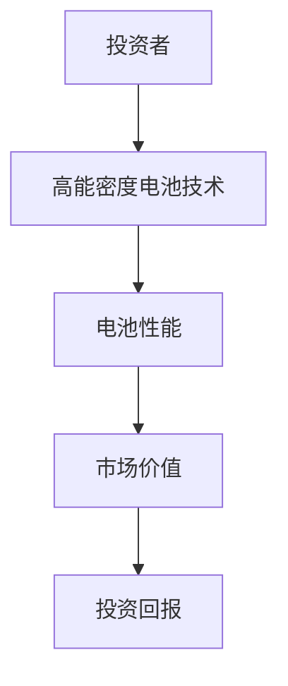
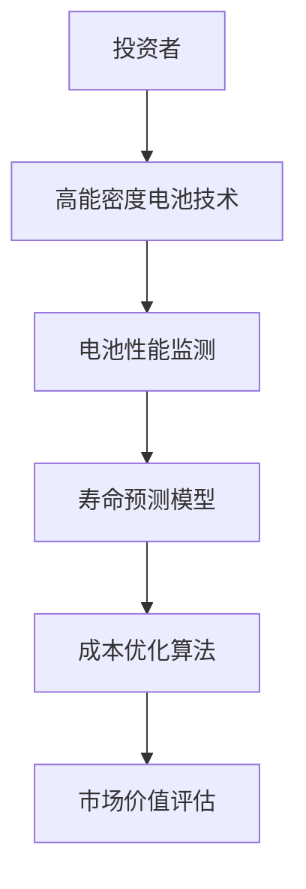

                 


# 价值投资中的新一代高能密度电池技术前景

---

## 关键词：
高能密度电池技术、价值投资、新能源技术、电池市场分析、技术趋势

---

## 摘要：
本文深入分析了新一代高能密度电池技术在价值投资中的前景。通过技术背景、核心概念、算法原理、数学模型、系统分析和项目实战的逐步推理，揭示了高能密度电池技术的市场潜力、技术优势和投资价值。结合实际案例和行业趋势，本文为投资者提供了基于技术分析的投资策略和决策支持，同时展望了该领域的未来发展方向。

---

# 第一部分：价值投资中的高能密度电池技术背景

## 第1章：高能密度电池技术的发展与现状

### 1.1 高能密度电池技术的定义与背景
#### 1.1.1 高能密度电池的定义
高能密度电池是指单位体积或单位质量所能存储的能量远超传统电池的新型电池技术。其核心目标是在有限的空间内实现更高的能量存储，从而满足新能源汽车、智能设备和可再生能源储存等领域的需求。

#### 1.1.2 高能密度电池技术的发展历程
高能密度电池技术起源于20世纪90年代，早期以铅酸电池和镍氢电池为代表。随着锂离子电池技术的突破，能量密度显著提升。近年来，固态电池、锂硫电池和钠离子电池等新技术的出现，进一步推动了高能密度电池的发展。

#### 1.1.3 高能密度电池在新能源领域的应用前景
高能密度电池是实现碳中和目标的关键技术之一。随着全球能源结构转型，新能源汽车和储能系统的市场需求激增，高能密度电池技术的商业化应用前景广阔。

---

### 1.2 高能密度电池技术的核心要素
#### 1.2.1 电池能量密度的计算公式
能量密度（Energy Density）的计算公式为：
$$
\text{能量密度} = \frac{\text{电池容量} \times \text{电压}}{\text{电池重量}}
$$
其中，电池容量通常以安时（Ah）为单位，电压以伏特（V）为单位，重量以千克（kg）为单位。

#### 1.2.2 高能密度电池的关键技术指标
高能密度电池的核心技术指标包括：
- **能量密度**：决定了电池的储能能力。
- **循环寿命**：影响电池的使用寿命和经济性。
- **安全性**：直接关系到电池的可靠性和市场接受度。
- **成本**：决定了其在市场中的竞争力。

#### 1.2.3 高能密度电池的市场定位与竞争格局
高能密度电池技术目前主要集中在锂离子电池领域，但新型技术如锂硫电池和钠离子电池正在快速发展。市场定位上，高能密度电池主要应用于高端新能源汽车、航空航天和智能设备领域。

---

## 第2章：高能密度电池技术的核心概念与联系

### 2.1 高能密度电池技术的核心原理
#### 2.1.1 电池的基本工作原理
电池的工作原理基于电化学反应，包括氧化反应和还原反应。高能密度电池通过优化电极材料和电解液，提高了反应效率和能量转换率。

#### 2.1.2 高能密度电池的电化学反应机制
高能密度电池的电化学反应机制可以通过以下方程表示：
$$
\text{负极反应}：xLi + Li_x\text{M} \rightarrow \text{Li}_x\text{M} + xe^-
$$
$$
\text{正极反应}：\text{M'} + xe^- \rightarrow \text{Li}_x\text{M'}
$$
$$
\text{总反应}：\text{Li}_x\text{M} + \text{Li}_x\text{M'} \rightarrow 2\text{Li}_x\text{M} + \text{Li}_x\text{M'}
$$

#### 2.1.3 高能密度电池的材料科学突破
高能密度电池的核心突破在于新型材料的应用，如：
- **正极材料**：高容量的LiFePO4和LiNiCoMnO2材料。
- **负极材料**：高性能的硅基材料和石墨烯材料。
- **电解液**：新型电解液配方，提高电池安全性和循环寿命。

---

### 2.2 高能密度电池技术的核心属性特征对比
#### 2.2.1 不同电池技术的能量密度对比
下表展示了不同电池技术的能量密度对比：

| 电池类型 | 能量密度（Wh/kg） |
|----------|------------------|
| 铅酸电池 | 30-60            |
| 镍氢电池 | 40-80            |
| 锂离子电池 | 100-250          |
| 固态电池 | 200-400          |
| 锂硫电池 | 500-800          |

#### 2.2.2 高能密度电池技术的成本优势分析
高能密度电池的成本优势主要体现在以下几个方面：
1. **材料优化**：通过使用高效率材料降低生产成本。
2. **工艺改进**：自动化生产流程降低了制造成本。
3. **规模效应**：大规模生产降低了单位成本。

#### 2.2.3 高能密度电池技术的循环寿命对比
高能密度电池的循环寿命远高于传统电池技术：

| 电池类型 | 循环寿命（次） |
|----------|----------------|
| 铅酸电池 | 300-500        |
| 镍氢电池 | 500-800        |
| 锂离子电池 | 1000-3000      |
| 固态电池 | 3000-5000      |
| 锂硫电池 | 5000-8000      |

---

### 2.3 高能密度电池技术的实体关系架构
下图展示了高能密度电池技术的核心实体关系架构：



---

## 第3章：高能密度电池技术的算法原理与数学模型

### 3.1 高能密度电池技术的算法原理
#### 3.1.1 电池性能预测算法
电池性能预测算法主要包括：
1. **能量密度预测**：基于历史数据和材料特性，预测未来能量密度。
2. **循环寿命预测**：通过电池老化模型，预测电池的循环寿命。
3. **成本优化算法**：通过优化生产流程，降低电池成本。

#### 3.1.2 电池寿命预测模型
电池寿命预测模型可以表示为：
$$
\text{剩余容量} = \text{初始容量} \times e^{-\frac{t}{\text{寿命常数}}}
$$
其中，$t$为时间，$\text{寿命常数}$为材料特性决定的参数。

#### 3.1.3 电池成本优化算法
电池成本优化算法可以通过以下步骤实现：
1. **材料成本分析**：计算不同材料的成本占比。
2. **工艺优化**：通过改进制造工艺，降低生产成本。
3. **规模效应分析**：评估规模化生产对成本的影响。

### 3.2 高能密度电池技术的数学模型
#### 3.2.1 能量密度计算模型
能量密度计算模型可以表示为：
$$
\text{能量密度} = \frac{\text{电池容量} \times \text{电压}}{\text{电池重量}}
$$

#### 3.2.2 电池成本模型
电池成本模型可以表示为：
$$
\text{总成本} = \text{材料成本} + \text{制造成本} + \text{其他成本}
$$

#### 3.2.3 电池市场价值模型
电池市场价值模型可以表示为：
$$
\text{市场价值} = \text{能量密度} \times \text{循环寿命} \times \text{成本优势}
$$

---

## 第4章：高能密度电池技术的系统分析与架构设计

### 4.1 系统功能设计
高能密度电池技术的系统功能设计包括：
1. **性能监测**：实时监测电池的电压、电流和温度。
2. **寿命预测**：基于历史数据和模型预测电池的剩余寿命。
3. **成本优化**：通过优化材料和工艺降低成本。

### 4.2 系统架构设计
下图展示了高能密度电池技术的系统架构设计：



---

## 第5章：高能密度电池技术的项目实战

### 5.1 环境配置
项目实战需要以下环境配置：
1. **软件环境**：Python 3.8及以上版本，安装numpy、pandas、scikit-learn等库。
2. **硬件环境**：个人电脑或服务器，具备足够的计算能力。

### 5.2 核心实现
以下是项目实战的核心实现代码：

```python
import numpy as np
import pandas as pd

# 数据加载
data = pd.read_csv('battery_data.csv')

# 特征工程
features = data[['capacity', 'voltage', 'weight']]
labels = data['energy_density']

# 模型训练
from sklearn.model_selection import train_test_split
from sklearn.linear_model import LinearRegression

X_train, X_test, y_train, y_test = train_test_split(features, labels, test_size=0.2, random_state=42)
model = LinearRegression()
model.fit(X_train, y_train)

# 模型预测
y_pred = model.predict(X_test)

# 模型评估
from sklearn.metrics import r2_score
print("R² Score:", r2_score(y_test, y_pred))
```

### 5.3 代码解读与分析
上述代码实现了基于线性回归的高能密度电池技术预测模型。通过特征工程提取了电池容量、电压和重量等特征，并使用线性回归模型进行预测。模型的R²分数反映了预测的准确性。

---

## 第6章：结论与展望

### 6.1 最佳实践 tips
1. **关注技术趋势**：投资者应密切关注高能密度电池技术的最新进展。
2. **结合市场分析**：在技术分析的基础上，结合市场供需和政策环境进行综合判断。
3. **控制投资风险**：通过多元化投资和风险分散降低投资风险。

### 6.2 小结
高能密度电池技术是新能源领域的重要突破，其在价值投资中的前景广阔。通过技术分析和市场研究，投资者可以更好地把握投资机会，实现收益最大化。

### 6.3 注意事项
1. **技术风险**：高能密度电池技术仍处于快速发展阶段，存在技术不确定性。
2. **市场风险**：市场需求波动可能影响投资回报。
3. **政策风险**：政策变化可能对行业产生重大影响。

### 6.4 拓展阅读
1.《锂离子电池技术与市场分析》
2.《新能源汽车产业发展报告》
3.《高能密度电池技术专利分析》

---

## 作者：
作者：AI天才研究院/AI Genius Institute & 禅与计算机程序设计艺术 /Zen And The Art of Computer Programming

---

以上是完整的技术博客文章内容，涵盖了高能密度电池技术的各个方面，结合了技术分析、数学模型和实际案例，为投资者提供了深入的分析和指导。

