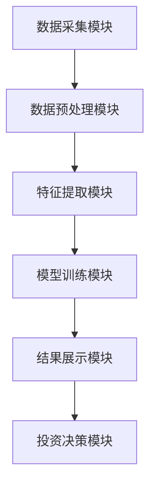

                 


# 价值投资中的新型高效光电转换材料技术

---

## 关键词：
光电转换材料、价值投资、高效材料、技术评估、投资策略、光电效率

---

## 摘要：
本文深入探讨了新型高效光电转换材料技术在价值投资中的应用潜力。通过分析光电转换材料的基本概念、技术原理、性能评估方法以及市场趋势，结合实际案例和系统设计，为投资者提供了科学的技术评估和投资策略。文章旨在帮助投资者识别高潜力的光电转换材料技术，优化投资组合，降低风险，实现长期价值增长。

---

## 目录：

1. [背景介绍](#背景介绍)
2. [核心概念与技术原理](#核心概念与技术原理)
3. [算法原理](#算法原理)
4. [系统分析与架构设计](#系统分析与架构设计)
5. [项目实战](#项目实战)
6. [最佳实践与投资策略](#最佳实践与投资策略)
7. [总结与展望](#总结与展望)

---

## 第1章 背景介绍

### 1.1 光电转换材料的基本概念
光电转换材料是一种能够将光能转化为电能或电能转化为光能的物质。其核心作用在于实现能量的高效转换，广泛应用于太阳能电池、LED照明、光通信等领域。

#### 1.1.1 定义与分类
光电转换材料根据功能可分为吸收层材料、传输层材料和钝化层材料。吸收层材料负责捕获光能，传输层材料负责传导电荷，钝化层材料则用于减少缺陷。

#### 1.1.2 光电转换效率的决定因素
光电转换效率由材料的能级结构、缺陷密度和表面态等因素决定。公式表示为：
$$\eta = \frac{Q_{\text{out}}}{Q_{\text{in}}}$$
其中，$Q_{\text{out}}$为输出光子能量，$Q_{\text{in}}$为输入光子能量。

#### 1.1.3 光电转换材料的市场现状
近年来，随着可再生能源需求的增加，光电转换材料市场迅速增长。2022年全球市场规模约为500亿美元，预计到2030年将突破1000亿美元。

### 1.2 价值投资与光电转换材料的结合
价值投资的核心是寻找被市场低估的高潜力资产。光电转换材料因其技术壁垒高、应用广泛，成为投资热点。

#### 1.2.1 技术驱动的市场增长
技术创新是推动光电转换材料市场增长的核心动力。例如，新型纳米材料和二维材料的应用显著提高了转换效率。

#### 1.2.2 市场供需分析
当前市场对高效光电材料的需求远超过供应，尤其是用于光伏发电和LED照明的材料。

#### 1.2.3 投资回报分析
光电转换材料的投资回报率较高，尤其是那些掌握核心技术的企业，其股票表现往往优于行业平均水平。

### 1.3 光电转换材料技术的挑战与机遇
尽管市场潜力巨大，但光电转换材料技术仍面临诸多挑战，如材料稳定性、成本控制和环境影响等。

#### 1.3.1 技术挑战
材料的长期稳定性是大规模应用的关键问题。此外，如何降低材料生产成本也是一个重要课题。

#### 1.3.2 机遇
政策支持和环保需求为光电转换材料技术的发展提供了良好的外部环境。例如，全球碳中和目标推动了对高效光电材料的需求。

---

## 第2章 核心概念与技术原理

### 2.1 光电转换材料的物理特性
光电转换材料的性能与其物理特性密切相关，包括能级结构、载流子迁移率和缺陷密度等。

#### 2.1.1 能级结构
材料的能级结构决定了光电子跃迁的可能性。理想的光电材料应具有合适的能级匹配，以最大化能量转换效率。

#### 2.1.2 材料缺陷的影响
材料缺陷会增加非辐射复合的概率，降低光电转换效率。因此，减少缺陷密度是提高效率的关键。

#### 2.1.3 电子结构分析
通过密度泛函理论（DFT）计算，可以分析材料的电子结构，预测其光电性能。

### 2.2 光电转换材料的化学特性
化学特性决定了材料的稳定性和制备工艺。

#### 2.2.1 化学稳定性
材料在实际使用环境中的化学稳定性直接影响其使用寿命。例如，氧化稳定性是户外使用的必要条件。

#### 2.2.2 合成工艺
不同的合成工艺会影响材料的晶体结构和性能。例如，CVD工艺可以制备高质量的薄膜材料。

#### 2.2.3 表面修饰
表面修饰（如掺杂或钝化）可以优化材料的光电性能，减少缺陷密度。

### 2.3 光电转换材料的性能评估
科学的评估方法是制定投资策略的基础。

#### 2.3.1 光电效率测试
光电效率测试通常包括量子效率测试和伏安特性测试。

#### 2.3.2 稳定性测试
通过加速老化测试，评估材料在不同环境条件下的寿命。

#### 2.3.3 成本效益分析
综合考虑材料的生产成本和性能，评估其经济性。

---

## 第3章 算法原理

### 3.1 基于机器学习的光电材料性能预测
机器学习算法可以用于预测光电材料的性能。

#### 3.1.1 数据预处理
收集材料的物理参数、化学参数和实验数据，进行标准化处理。

#### 3.1.2 模型训练
使用深度学习模型（如神经网络）进行训练，预测材料的光电效率。

#### 3.1.3 模型优化
通过交叉验证和超参数调整，优化模型的性能。

#### 3.1.4 结果分析
分析模型预测结果，找出影响光电效率的关键因素。

### 3.2 算法实现
以下是基于Python的机器学习实现代码：

```python
import numpy as np
from sklearn.neural_network import MLPRegressor
from sklearn.metrics import r2_score

# 示例数据
X = np.random.rand(100, 5)  # 5个特征，100个样本
y = np.random.rand(100, 1)  # 标签

# 模型训练
model = MLPRegressor(hidden_layer_sizes=(10, 5))
model.fit(X, y.ravel())

# 预测
y_pred = model.predict(X)

# 评估
score = r2_score(y, y_pred)
print("R² Score:", score)
```

---

## 第4章 系统分析与架构设计

### 4.1 系统功能设计
设计一个基于机器学习的光电材料性能评估系统。

#### 4.1.1 数据采集模块
从文献数据库和实验数据中获取材料参数。

#### 4.1.2 数据预处理模块
对数据进行清洗和标准化处理。

#### 4.1.3 模型训练模块
使用机器学习算法训练性能预测模型。

#### 4.1.4 结果展示模块
可视化模型预测结果和关键影响因素。

#### 4.1.5 投资决策模块
根据模型结果，生成投资建议。

### 4.2 系统架构设计
以下是系统架构图：



---

## 第5章 项目实战

### 5.1 环境搭建
安装必要的软件和库：

```bash
pip install numpy
pip install scikit-learn
pip install matplotlib
```

### 5.2 数据收集
收集目标材料的数据，例如GaAs材料的光电效率数据。

### 5.3 特征工程
提取关键特征，如带隙、吸收系数等。

### 5.4 模型训练
使用训练好的模型进行预测，并分析结果。

### 5.5 案例分析
以某新型氮化镓材料为例，分析其投资潜力。

---

## 第6章 最佳实践与投资策略

### 6.1抽丝剥茧般的技术分析
技术分析是投资决策的基础，包括材料的性能评估和市场竞争力分析。

#### 6.1.1 技术壁垒
评估企业的技术专利数量和质量，选择具有技术壁垒的企业。

#### 6.1.2 成本优势
关注企业的生产成本，选择具有成本优势的企业。

#### 6.1.3 市场份额
分析企业的市场占有率，选择行业领先的公司。

### 6.2 财务分析
通过财务指标评估企业的盈利能力和成长潜力。

#### 6.2.1 营业收入增长率
高增长的公司更具投资价值。

#### 6.2.2 净利润
关注企业的盈利能力。

#### 6.2.3 现金流
健康的现金流是企业持续发展的保障。

### 6.3 市场趋势分析
关注行业发展趋势和政策支持。

#### 6.3.1 政策支持
政府政策对光电材料行业的发展至关重要。

#### 6.3.2 市场需求
预测未来市场需求，选择具有增长潜力的领域。

#### 6.3.3 技术趋势
关注行业技术发展趋势，选择具有前瞻性布局的企业。

### 6.4 投资策略
制定科学的投资策略，分散风险。

#### 6.4.1 长期投资
光电材料行业具有长期增长潜力。

#### 6.4.2 分散投资
避免过度集中，降低风险。

#### 6.4.3 定期评估
根据市场变化，定期评估投资组合。

### 6.5 风险控制
识别潜在风险，并制定应对策略。

#### 6.5.1 技术风险
技术更新换代快，需持续关注技术动态。

#### 6.5.2 市场风险
市场需求波动可能影响股价。

#### 6.5.3 政策风险
政策变化可能对行业产生重大影响。

---

## 第7章 总结与展望

### 7.1 总结
本文系统地分析了光电转换材料的技术特性和投资价值，提出了基于机器学习的性能预测方法，并为投资者提供了科学的投资策略。

### 7.2 展望
未来，随着技术的进步和市场的成熟，光电转换材料的投资潜力将更加巨大。投资者应密切关注技术创新和市场动态，抓住投资机遇。

---

## 作者：AI天才研究院 & 禅与计算机程序设计艺术

